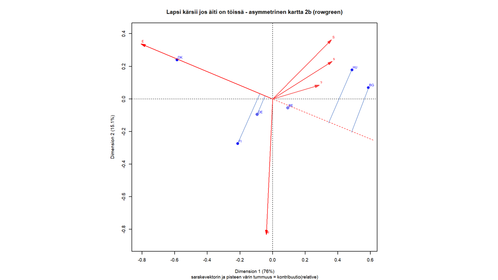

# Yksinkertainen korrespondenssianalyysi

**k1** Yksi kysymys, kuusi maata, peruskäsitteet


**k2** Luvun tärkeimmät asiat; mitä on luvassa?

## Äiti töissä -kärsiikö lapsi?

**k1**"Alle kouluikäinen lapsi todennäköisesti kärsii, jos hänen äitinsä käy työssä".
Lyhennän muotoon äiti töissä. ISSP-tutkimuksissa kaksi kysymystä, joissa sana "äiti",
MG havainnut vastausten jakaumat poikkeaviksi (**#V ?**).

**zxy** Edellisessä luvussa on esitelyt aineisto, ja kerrottu rajaukset.
```{r esim1data1, echo = FALSE, include = FALSE}
# UUSI DATA 30.1.20
#
# LUETAAN DATA G1_1_data2.Rmd - tiedostossa, luodaan faktorimuuttujat
# G1_1_data_fct1.Rmd-tiedostossa -> ISSP2012jh1d.dat (df)
# 23 muuttujaa (9 substanssimuuttujaa, 8 taustamuuttujaa, 3 maa-muuttujaa, 3 metadatamuuttujaa)
# 25 maata.
# Poistettu 146 havaintoa, joilla SEX tai AGE puuttuu
# Johdattelevassa esimerkissä kuusi maata, kaksi taustamuuttujaa ja yksi kysymys
# (V6/Q1b)


# Kuusi maata

countries_esim1 <- c(56, 100, 208, 246, 276, 348) #BE,BG,DK,FI,DE,HU
ISSP2012esim3.dat <- filter(ISSP2012jh1d.dat, V4 %in% countries_esim1)
# str(ISSP2012esim3.dat) - pitkä listaus pois (24.2.20)

#neljä maamuuttujaa, kysymys Q1b, ikä ja sukupuoli

vars_esim1 <- c("C_ALPHAN", "V3", "maa","maa3", "Q1b", "sp", "ika")
ISSP2012esim2.dat <- select(ISSP2012esim3.dat, all_of(vars_esim1))

str(ISSP2012esim2.dat) # 8542 obs. of  7 variables, ja sama 8.6.2020
# C_ALPHAN: chr, maa: Factor w/ 25

# Poistetaan havainnot, joilla Q1b - muuttujassa puuttuva tieto 'NA'
# sum(is.na(ISSP2012esim2.dat$Q1b)) = 399

ISSP2012esim1.dat <- filter(ISSP2012esim2.dat, !is.na(Q1b))

#str(ISSP2012esim1.dat) # 8143 obs. of  6 variable

# Tarkistuksia (3.2.20)
#
#fct_count(ISSP2012esim1.dat$sp)
#fct_count(ISSP2012esim1.dat$Q1b)
#fct_count(ISSP2012esim1.dat$maa)
#fct_count(ISSP2012esim1.dat$maa3)
#
#summary(ISSP2012esim1.dat$sp)
#sp: 3799 + 4344 = 8143
#summary(ISSP2012esim1.dat$Q1b)
#  S      s      ?     e      E
# 810 + 1935 + 1367 + 2125 + 1906 = 8143
#
# EDELLINEN DATA - havaintojen määrät samat kuin uudella datalla (31.1.20)
#
# 8557 obs. ennen kuin sexagemissing poistettiin, nyt 8542, 8557-8542 = 15
#
# Poistetaan havainnot joissa puuttuva tieto muuttujassa V6 (Q1b) n = 399
# 8542-399 = 8143

# Tyhjät "faktorilabelit" on poistettava

 ISSP2012esim1.dat <- ISSP2012esim1.dat %>%
     mutate(maa = fct_drop(maa),
            maa3 = fct_drop(maa3)
            )

#summary(ISSP2012esim1.dat$maa)
#summary(ISSP2012esim1.dat$maa3)
#
# str(ISSP2012esim1.dat$maa)
# attributes(ISSP2012esim1.dat$maa)
#
# str(ISSP2012esim1.dat$maa3)
# attributes(ISSP2012esim1.dat$maa3)
#
#ISSP2012esim1.dat %>% tableX(maa, Q1b, type = "count")
#fct_count(ISSP2012esim1.dat$Q1b)
# fct_count(ISSP2012esim1.dat$sp)
# fct_unique(ISSP2012esim1.dat$maa)
# fct_count(ISSP2012esim1.dat$maa)
#ISSP2012esim1.dat %>% tableX(maa, C_ALPHAN, type = "count")
#
# maa3 - siistitään "faktorilabelit" kaksikirjaimisiksi
#
# ISO 3166 Code V3 - maiden jaot
#  5601     BE-FLA-Belgium/ Flanders
#  5602     BE-WAL-Belgium/ Wallonia
#  5603     BE-BRU-Belgium/ Brussels
# 27601     DE-W-Germany-West
# 27602     DE-E-Germany-East
# Tähän pitäisi päästä
# levels = c("100","208","246","348","5601","5602","5603","27601","27602"),
# labels = c("BG","DK","FI","HU","bF","bW","bB","dW","dE"))
# levels(ISSP2012esim1.dat$maa3)

ISSP2012esim1.dat <- ISSP2012esim1.dat %>%
        mutate(maa3 =
                fct_recode(maa3,
                 "BG" = "BG-Bulgaria",
                 "DK" = "DK-Denmark",
                 "FI" = "FI-Finland",
                 "HU" = "HU-Hungary",
                 "bF" = "BE-FLA-Belgium/ Flanders",
                 "bW" = "BE-WAL-Belgium/ Wallonia",
                 "bB" = "BE-BRU-Belgium/ Brussels",
                 "dW" = "DE-W-Germany-West",
                 "dE" = "DE-E-Germany-East")
               )
# tarkistuksia
#levels(ISSP2012esim1.dat$maa3)
# str(ISSP2012esim1.dat$maa3) # 9 levels
#summary(ISSP2012esim1.dat$maa3)
#
# TÄSSÄ TOISTOA! (4.2.20)
# Muutetaan muuttujien "maa" ja "maa3" arvojen (levels) järjestys samaksi kuin
# alkuperäisen muuttujan C_ALPHAN. Helpomi verrata aikaisempiin tuloksiin.

# "alkuperäinen" maa talteen
ISSP2012esim1.dat$maa2 <- ISSP2012esim1.dat$maa

ISSP2012esim1.dat <- ISSP2012esim1.dat %>%
        mutate(maa =
                fct_relevel(maa,
                            "BE",
                            "BG",
                            "DE",
                            "DK",
                            "FI",
                            "HU"))
ISSP2012esim1.dat <- ISSP2012esim1.dat %>%
        mutate(maa3 =
                fct_relevel(maa3,
                        "bF",
                        "bW",
                        "bB",
                        "BG",
                        "dW",
                        "dE",
                        "DK",
                        "FI",
                        "HU"))

# Tarkistus
#ISSP2012esim1.dat %>% tableX(maa2,maa, type = "count")
# "alkuperäinen" maa talteenISSP2012esim1.dat %>% tableX(maa,C_ALPHAN, type = "count")
# "alkuperäinen" maa talteenstr(ISSP2012esim1.dat)

```

Tarkistetaan uudet muuttujat (koodilohkon tulostus pois tarvittaessa).

```{r r esim1data2, echo = FALSE, include = FALSE, message=TRUE, warning=TRUE}
# Taulukoita (31.1.2020) ja tarkistuksia
#
# toinen maa-muuttuja, jossa Saksan ja Belgian jako
#  V3
#  5601     BE-FLA-Belgium/ Flanders
#  5602     BE-WAL-Belgium/ Wallonia
#  5603     BE-BRU-Belgium/ Brussels
# 27601     DE-W-Germany-West
# 27602     DE-E-Germany-East

# Tarkastuksia

# assert_that ehkä tarpeeton - expect_equivalet testaa levelien
# järjestyksen ja määrän (20.2.20)

validate_that(length(levels(ISSP2012esim1.dat$sp)) == 2)
validate_that(are_equal(levels(ISSP2012esim1.dat$sp),
                c("m", "f")))

validate_that(length(levels(ISSP2012esim1.dat$maa)) == 6)

validate_that(are_equal(levels(ISSP2012esim1.dat$maa),
                  c("BE", "BG", "DE", "DK", "FI", "HU")))

validate_that(length(levels(ISSP2012esim1.dat$maa3)) == 9)

validate_that(are_equal(levels(ISSP2012esim1.dat$maa3),
                 c("bF","bW","bB", "BG","dW","dE","DK", "FI", "HU")))

validate_that(length(levels(ISSP2012esim1.dat$Q1b)) == 5)
validate_that(are_equal(levels(ISSP2012esim1.dat$Q1b),
               c("S", "s", "?", "e", "E")))

# testthat - paketti - pois käytöstä 16.9.20
# expect_ ei anna ok-ilmoitusta, ainoastaan virheilmoituksen? (11.4.20)
# expect_equivalent(levels(ISSP2012esim1.dat$maa),
#                  c("BE", "BG", "DE", "DK", "FI", "HU"))
# expect_equivalent(levels(ISSP2012esim1.dat$maa3),
#                  c("bF","bW","bB", "BG","dW","dE","DK", "FI", "HU"))
# expect_equivalent(levels(ISSP2012esim1.dat$sp), c("m", "f"))
# expect_equivalent(levels(ISSP2012esim1.dat$Q1b),
#                  c("S", "s", "?", "e", "E"))
#
# ISSP2012esim1.dat %>% tableX(maa,ika,type = "row_perc")
#
# Riviprofiilit
#
# ISSP2012esim1.dat %>% tableX(maa,ika,type = "row_perc")
# ISSP2012esim1.dat %>% tableX(maa,sp ,type = "row_perc")
#
#
# Kysymyksen Q1b vastaukset
#
#ISSP2012esim1.dat %>% tableX(maa,Q1b,type = "row_perc")
#
#ISSP2012esim1.dat %>% tableX(maa3,Q1b,type = "row_perc")
#
# str(ISSP2012esim1.dat) # 8143 obs. of  7 variable,
# sama kuin vanhassa Galku-koodissa.
#
# str(ISSP2012esim1.dat) # 8143 obs. of  7 variable,
# sama kuin vanhassa Galku-koodissa.

```


## Kahden muuttujan frekvenssitaulukon analyysi

**k** Kolme taulukkoa: frekvenssitaulukko, riviprosentit ja sarakeprosentit


```{r simpeCA-frekTa1, echo = FALSE}
taulu2 <- ISSP2012esim1.dat %>% tableX(maa, Q1b, type = "cell_perc")
knitr::kable(taulu2,digits = 2, booktabs = TRUE,
             caption = "Kysymyksen Q1b vastaukset maittain, suhteelliset frekvenssit")
```


```{r simpeCA-rprosTa1, echo = FALSE}
taulu3 <- ISSP2012esim1.dat %>% tableX(maa,Q1b,type = "row_perc")

knitr::kable(taulu3,digits = 2, booktabs = TRUE,
             caption = "Kysymyksen Q1b vastaukset, riviprosentit")
```


```{r  simpeCA-cprosTa1, echo = FALSE}
taulu4 <- ISSP2012esim1.dat %>% tableX(maa,Q1b,type = "col_perc")

knitr::kable(taulu4,digits = 2, booktabs = TRUE,
             caption = "Kysymyksen Q1b vastaukset, sarakeprosentit")

```

**k** **Taulkoista**

Frekvenssitaulukossa havaintojen lukumäärät on jaettu kokonaislukumäärällä
(8143).

Frekvenssitaulukko \@ref(tab:simpeCA-frekTa1) kertoo vastausten jakauman maiden 
ja vastausvaihtoehtojen mukaan luokiteltuina.

Muuttujien luonne on usein erilainen. Tähän aineistoon sopii riviprosenttientaulukko,
vertaillaan vastausten jakaumia maiden välillä.Taulukon sarakkeet ovat muuttujia
ja rivit havaintoja. Sarakeprosentit antavat toisen näkökulmaan samaan dataan.

**k** Rivit on saatu alkuperäisestä aineistosta osajoukkojen summina. MG:n
terminologialla "samples".

```{r  EkaCA, echo = FALSE, include = FALSE}
# CA tässä, jotta saadaan rivi- ja sarakeprofiilikuvat
# Lasketaan samalla CA-ratkaisu riviprofiilitaulkolle (maille samat painot)

simpleCA1 <- ca(~maa + Q1b,ISSP2012esim1.dat)

# Maiden järjestys kääntää kuvan (1.2.20) - esimerkki on
# vähän kuriositeetti. Kartta voi tietysti "flipata" koordintaattien suhteen ainakin
# neljällä tavalla (? 180 astetta molempien akseleiden ympäri molempiin suuntiin?)
# (18.2.20). Tämän maa2-muuttujaa käyttävän kuvan voi jättää pois (8.4.20)

# simpleCA2 <- ca(~maa2 + Q1b,ISSP2012esim1.dat)

# Oikeastaan maiden vertailussa pitäisi niiden massat skaalata yhtä suuriksi, tässä
# pikainen kokeilu (20.2.20)
# Riviprosentit taulukoksi, nimet sarakkeille ja riveille (ei kovin robustia...)


johdesim1_rowproc.tab <- simpleCA1$N / rowSums(simpleCA1$N)
colnames(johdesim1_rowproc.tab) <- c("S" ,"s" ,"?","e", "E")
rownames(johdesim1_rowproc.tab) <- c("BE", "BG", "DE", "DK", "FI", "HU")

# Miten tibblenä? Ei toimi, ei maa-muuttujaa ollenkaan
# johdesim1_rowproc.tbl <- as_tibble(johdesim1_rowproc.tab)
# str(johdesim1_rowproc.tbl)

# TARKISTUKSIA (20.2.20)
# johdesim1_rowproc.tab
# rowSums(johdesim1_rowproc.tab)
# str(johdesim1_rowproc.tab)


simpleCA3 <- ca(johdesim1_rowproc.tab)


# Kartta piirretään koodilohkossa simpleCAmap1, r. 773 noin.

# Riviprosentit tarkistusta varten
#        S	s	?	e	E
#BE	9.49	22.40	21.76	27.42	18.93
#BG	12.81	42.89	22.26	20.63	1.41
#DE	9.63	21.88	11.55	31.39	25.55
#DK	5.04	17.15	10.95	16.71	50.14
#FI	4.23	16.94	13.42	38.11	27.30
#HU	21.97	28.89	22.57	19.06	7.52
#
# Ja datan saa leikepöydän kautta, jos on tarve pikatarkistuksiin
# read <- read.table("clipboard")

```

**Kuvat**

```{r g1-2kuva1, fig.cap = "Q1b:Sarakeprofiilit ja keskiarvoprofiili", echo = FALSE, include = TRUE}
#mutkikas kuvan piirto - sarakeprofiilit vertailussa
#ggplot vaatii df-rakenteen ja 'long data' - muotoon
##https://stackoverflow.com/questions/9563368/create-stacked-barplot
# -where-each-stack-is-scaled-to-sum-to
# Pitkä https-linkki kahdella rivillä
#
# käytetään ca - tuloksia
apu1 <- (simpleCA1$N)
colnames(apu1) <- c("S", "s", "?", "e", "E")
rownames(apu1) <- c("BE", "BG", "DE", "DK", "FI", "HU")
apu1_df <- as.data.frame(apu1)
#lasketan rivien reunajakauma
apu1_df$ka_sarake <- rowSums(apu1_df)
#muokataan 'long data' - muotoon
apu1b_df <- melt(cbind(apu1_df, ind = rownames(apu1_df)), id.vars = c('ind'))

p <- ggplot(apu1b_df, aes(x = variable, y = value, fill = ind)) +
         geom_bar(position = "fill", stat = "identity") +
         scale_y_continuous(name = " ",labels = percent_format())
p <- p + labs(fill = "maa")
p + scale_x_discrete(name = "Q1b - vastauskategoriat")
# apu1_df
# apu1b_df
```

```{r g1-2kuva2, fig.cap = "Q1b: riviprofiilit ja keskiarvorivi", echo = FALSE, include = TRUE}

# riviprofiilit ja keskiarvorivi -  18.9.2018
apu2_df <- as.data.frame(apu1)
apu2_df <- rbind(apu2_df, ka_rivi = colSums(apu2_df))

#apu2_df
#str(apu2_df)
## typeof(apu2_df) # what is it?
## class(apu2_df) # what is it? (sorry)
## storage.mode(apu2_df) # what is it? (very sorry)
## length(apu2_df) # how long is it? What about two dimensional
## objects?
# attributes(apu2_df)

# temp1 <- cbind(apu2_df, ind = rownames(apu2_df))
# temp1
##muokataan 'long data' - muotoon
apu2b_df <- melt(cbind(apu2_df, ind = rownames(apu2_df)), id.vars = c('ind'))
# str(apu2b_df)
# glimpse(apu2b_df)

#
#ggplot(apu2b_df, aes(x = value, y = ind, fill = variable)) +
#       geom_bar(position = "fill", stat ="identity") +
#       #coord_flip() +
#        scale_x_continuous(labels = percent_format())

#versio2 toimii (18.9.2018)

p <- ggplot(apu2b_df, aes(x = ind, y = value, fill = variable)) +
       geom_bar(position = "fill", stat = "identity") +
       coord_flip() +
        scale_y_continuous(name = " ",labels = percent_format())
p <- p + labs(fill = "Q1b")
p + scale_x_discrete(name = " ")


```


Mikä on rivien ja sarakkeiden suhde?

Tähän klassiseen kysymykseen korrespondenssianalyysi tarjoaa oman ratkaisunsa.
Siinä rivit ja sarakkeet esitetään samassa kuvassa, ja riippuutta tutkitaan tulkitsemalla tämä kuva tai "kartta".

Kahden luokittelumuuttujan riippuvuutta voidaan testata  $\chi^{2}$ - testillä.
Testisuure saadaan laskemalla yhten jokaisen solun havaittujen ja odotetettujen
(riippumattomuushypoteesi) frekvenssien erotukset muodossa

\begin{equation}
  \chi^{2} = \frac{(havaittu - odotettu)^2} {odotettu}
    (\#eq:khii21)
\end{equation}

Tämä voidaan esittää ca:han sopivammalla tavalla parilla muunnoksella, jolloin
saamme riveittäin vastaavat termit rivisummalla painotettuna:

\begin{equation}
  rivisumma \times \frac{(havaittu \: riviprofiili - odotettu \: riviprofiili)^2} {odotettu \: riviprofiili}
    (\#eq:khii22)
\end{equation}

Kun jaamme nämä tekijät havaintojen kokonaismäärällä $n$, rivisumma muuntuu
rivin massaksi, ja niiden summa muotoon $\frac{\chi^{2}}{n}$.

\begin{equation}
 \frac{\chi^{2}}{n} = \phi^{2}
  (\#eq:inert1)
 \end{equation}

Huomaa jakajassa n, ei n-1. Tässä ei tn-päättelyä!


Tunnusluku $\phi^{2}$ on korrespondenssianalyysissä kokonaisinertia (total
inertia). Se kuvaa, kuinka paljon varianssia taulukossa on ja on riippumaton
havaintojen lukumäärästä. Tilastotieteessä tunnusluvulla on useita vaihtoehtoisia
nimiä (esim. mean square contingency coefficient), ja sen neliöjuurta kutsutaan
$\phi$ - kertoimeksi.

Tässä siirrytään kahden luokittelumuuttujan taulukosta suhteellisten frekvenssien
taulukkoon. Kaavojen \@ref(eq:khii21) ja \@ref(eq:khii22) yhteyden pitäisi olla
selkeä.

Frekvenssitaulukossa (jossa kaikki taulukon luvut on jaettu havaintojen
lukumäärällä N riviprofiilien 1 ja 3  (euklidinen) etäisyys on

 \begin{equation}
 \sqrt{(p_{11} - p_{31})^2 + (p_{12} - p_{32})^2 + (p_{13} - _{33})^2+ (p_{14} - _{34})^2+ (p_{15} - _{35})^2}
 (\#eq:euclid1)
 \end{equation}


Rivien $\chi^{2}$ - etäisyys on painotettu euklidinen etäisyys, jossa painoina
ovat riviprofiilin odotetut arvot. Ne ovat riippumattomuushypoteesin mukaisesti
riviprofiilien keskiarvoprofiilin vastaavat alkioit $r_{i}$ .

\begin{equation}
 \sqrt{\frac{(p_{11} - p_{31})^2} { r_{1}} + \dots + \frac{(p_{15} - p_{35})^2} {r_{5}}}
 (\#eq:euclid2)
\end{equation}

Inertia voidaa esittää rivien ja keskiarvorivin (sentroidin) $\chi^{2}$ -etäisyyksien
neliöiden painotettuna summana, jossa painoina ovat rivien massat $m_{i}$ ja
summa lasketaan yli rivien ${i}$.

\begin{equation}
 \phi^{2} = \sum_{i} (massa \: m_{i}) \times (profiilin \: i \: \chi^{2} - etaisyys \: sentroidista)^{2}
 (\#eq:inert2)
\end{equation}

Tässä esitystavassa viite on CAiP, teorialiitteessä tarkemmin. Tarkoitus on esittää
yksinkertaisesti taulukon datan analyysin käsitteet ja CA:n peruskäsitteet profiili,
massa ja $\chi^{2}$ - etäisyys


## CA - esimerkki

```{r simpleCA1map1, echo=FALSE, fig.cap= "Q1b: lapsi kärsii jos äiti on töissä",fig.asp = 1, out.width = "90%",fig.align = "center"}

# simpleCA1 luotu aikaisemmin profiilikuvia varten koodilohkossa EkaCA
# HUOM! xlab ja ylab, prosenttiosuudet ensin katsottu ja sitten kirjoitettu
# tässä. Vertaa scree-plot - tietoon!


par(cex = 1)
plot(simpleCA1, map = "symmetric", mass = c(TRUE,TRUE),
     xlab = "Dimensio 1: moderni/liberaali - perinteinen/konservatiivinen (76%)",
     ylab = "Dimensio 2: maltillinen/epävarma - radikaali/jyrkkä/varma (15.1%)",
     main = "symmetrinen kartta 1",
     sub = "Maiden massat eri suuruisia (otoskoko), pisteiden koko suhteessa massaan")
```

**edit1** jatkossa plot - main on kuvan tyyppi (symmetrinen, kontribuutio jne),
koodilohkon fig.cap "ylimmän tason" otsikko.

**edit2** Akseleiden tekstit (Dimensio 1....jne) asetettu käsin, ikävä kyllä myös
selitetyn inertian osuus. Ainakin tästä ensimmäisestä kuvasta ne kannattaa jättää
pois, spoileri!

**edit3** par(cex = 1) ennen plot-komenota muuttaa valitettavasti "kaiken" kokoa.
Antaa olla, kun on graafista data-analyysiä. Selkeys tärkeämpää kuin ulkoasu.


**k** Kartan tulkinta

**k** Prosentit - kuinka paljon kokonaisinertiasta saadaan kuvattua ("selitettyä").

**k** Dimenisoiden tulkinta sarakepisteiden avulla: mitä on oikealla ja vasemmalla?
Kaukana on kaukana, mutta lähellä voi olla täydessä sarake- tai riviavaruudessa
kaukana. Siksi tulkinta kontrastien avulla - mikä piste on suhteellisesti kauimpana?

**k** Rivipisteiden tulkinta kartalla - järjestys vasemmalta oikealle ja alhaalta
ylös. Pisteiden etäisyydet toisistaan.

**k** Origo on aineiston keskipiste, "riippumattomuushypoteesi" (kts. teorialiite).

**k** Sarakepisteiden erot ja rivipisteiden erot ovat suhteellisia, approksimoivat 
khii2-etäisyyksiä.

**k** Rivi- ja sarakepisteiden etäisyyksillä ei suoraan mitään tulkintaa!

**k** Lista: mitä muuta, johon palataan seuraavassa luvussa?

- kuinka hyvin pisteet on esitetty tasossa?
- esim. x-akseli kuvaa ("nappaa") 76% kokonaisinertiasta. Pisteiden
inertiakontribuutiot


## Korrespondenssianalyysin peruskäsitteet

**ks** Mitä käsitteitä tässä esitellään? Viittaukset teorialiitteeseen, ja
tulkinnan hankaluudet (MG "loose ends" - paperi) käsitellään siellä.

**edit** Sulava kuvaus tulkinnasta, painotus kuvien tulkinnassa. CA:n numeeriset
tulokset vasta seuraavassa luvussa. Tässä "mitä kuvasta näkee", ei muuta (paitsi
varoitukset - mitä ei näe). Idea koko ajan taulukon sarakkeiden ja riveien yhteyksien
visualisointi.

**edit** Tärkeää selkeä kuvaus pääkoordinaattien ja standardikoordinaattien 
suhteesta. Tarkemmin teorialiitteessä, tässä heuristisesti jotta kuvia osaa tulkita.

### Asymmetrinen kartta ja ideaalipisteet

```{r G1-3asymm2,echo = FALSE, fig.cap= "Q1b: lapsi kärsii jos äiti on töissä",fig.asp = 1, out.width = "90%",fig.align = "center"}
# asymmetrinen kartta - rivit pc ja sarakkeet sc
# sarakkeet vektorikuvina

par(cex = 0.7)
plot(simpleCA1, map = "rowprincipal", 
     arrows = c(FALSE,TRUE), 
     main = "asymmetrinen kartta 1"
    )
```


**Barysentrinen periaate**

**edit** kuva ei ehkä tarpeen? Tehdään vähän pienempi (out.width = 70%, muuten 90%).
```{r G1-3asymm3,echo = FALSE,fig.cap= "Q1b: lapsi kärsii jos äiti on töissä",fig.asp = 1, out.width = "70%",fig.align = "center"}

# Piirretään Suomen riviprofiilista janat sarakepisteisiin - barysentinen keskiarvo
# Rivipisteet pääkoordinaatteina (principal coordinates)

simpleCA1.rpc <- simpleCA1$rowcoord %*% diag(simpleCA1$sv)

# X11()
par(cex = 1)
plot(simpleCA1, map = "rowprincipal", 
     arrows = c(FALSE,FALSE),
     # main = "barysentrinen periaate - asymmetrinen kartta 2",
     sub = "Suomen profiili sarakkeiden barysentrisenä keskiarvona")
     segments(simpleCA1.rpc[5,1],simpleCA1.rpc[5,2],simpleCA1$colcoord[, 1],
         simpleCA1$colcoord[, 2], col = "pink")

```

**edit** Perustelu kuvalle: barysentrinen periaate on kuvien tulkinnassa ydinasioita.

**Akseleiden tulkinta** tai tulkinnan varmistaminen akseli kerrallaan. Ortogonaaliset
projektion piirretty käsin, havainnollistetaan periaatetta.

```{r G1_3_asymmtulk2, echo = FALSE, out.width='90%', fig.align='center'}

```


## Kontribuutiot kartalla

Kaksi kuvaa, joissa pisteiden massat on kuvattu pisteiden koolla (ei juuri eroa
huomaa) ja rivi- ja sarekepisteiden kontribuutiot värisävyllä. Mitä tummempi sitä
suurempi kontribuutio. Absoluuttiset ja suhteelliset kontribuutiot.

**edit** Pitäisikö kuvissa olla aina toinen absolute, toinen relative? Selvitetään
teorialiittessä?

Toinen kuva riittää, tässä esitellään kartta jossa on eniten informaatiota.

**Absoluuttiset kontribuutiot** Oletuspistekoko ok, mutta html- ja pdf-tulostus
on erilainen!

```{r G1-3asymmContrib1,echo = FALSE,fig.cap= "Q1b: lapsi kärsii jos äiti on töissä",fig.asp = 1, out.width = "90%",fig.align = "center"}
#par(cex = 0.6)
plot(simpleCA1, map = "rowgreen",
     contrib = c("absolute", "absolute"),
     mass = c(TRUE,TRUE),
     arrows = c(FALSE, TRUE),
     main = "kontribuutiokartta 1",
     sub = "sarakevektorin ja rivipisteiden värin tummuus = absoluuttinen kontribuutio")

```


**Suhteelliset kontribuutiot**  Oletuspistekoko ok.

```{r G1-3asymmContrib2,echo = FALSE,fig.cap= "Q1b: lapsi kärsii jos äiti on töissä",fig.asp = 1, out.width = "90%",fig.align = "center"}

#par(cex = 0.7)
plot(simpleCA1, map = "rowgreen",
     contrib = c("relative", "relative"),
     mass = c(TRUE,TRUE),
     arrows = c(FALSE, TRUE),
     main = "kontribuutiokartta 2",
     sub = "sarakevektorin ja pisteen värin tummuus = suhteellinen kontribuutio")

```


## Massat

**edit3** Onko vakioitujen massojen kartta liian aikaisin? Tämä ei ole pääasia, vaan selvennys.
Miksi tässä? Perusteltava, miksi en vakioi massoja maille, sukupuolille jne. (a)
perusteltua kun tarkempi tutkimusongelma, esim. erottelut maiden ja sukupuolten
välillä. Varianssianalyysin tapaan varianssin hajoittaminen ryhmisen sisäiseen ja
ryhmien väliseen. Kts. teorialiitteestä esim. ABBA. (b) CA "perusmuodossa", massa
on yksi kolmesta tärkeimmästä käsitteestä. (c) on aika työlästä!

**edit4** Galkussa verrattu molempien painotusten khii2-etäisyyksiä, jos tarpeen
niin teoria-liitteeseen.


```{r simpleCA3map1, echo=FALSE, fig.cap= "Q1b: lapsi kärsii jos äiti on töissä",fig.asp = 1, out.width = "90%",fig.align = "center"}

# Sama kartta - maiden massat vakiotu - simpleCA3 luotu koodilohkossa EkaCA
# CA:n lähtötietona riviprofiilit

par(cex = 0.6)
plot(simpleCA3, map = "symmetric", mass = c(TRUE,TRUE),
main = "symmetrinen kartta 2 ",
sub = "Maidet massat vakioitu (riviprofiilidata)")

```

Ei kovin isoja eroja, tässä datassa.