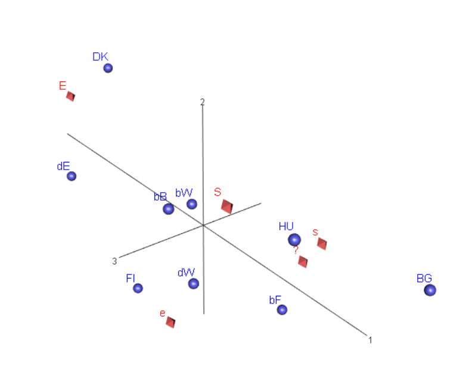

# Yksinkertaisen korrespondenssianalyysin laajennuksia 1 - täydentävät pisteet

**edit** Edellisssä luvussa selitetty barysentrinen keskiarvopiste;
 teorialiitteessä hieman laveammin.

 **edit** CA:n joustava käyttö vaatii matriisioperaatioita, ja muuta datan rakenteen
 muokkausta (rivien lisääminen input-dataan jne.).
 

## Täydentävät pisteet (supplementary points)

Tekstistä oma dokkari, eri käyttötapaukset lyhyesti. Edellisen luvun asymmetrisen
kartan avulla perustellaan, miten pisteitä voidaaan lisätä.

## Saksan ja Belgian alueet

**Data ja taulukko aluejaosta**

```{r BeDeAluedat1, eval=T, include=F}
# TÄSSÄ EHKÄ VIRHE (26.10.20)?

# Belgian ja Saksan aluejako maa3-muuttujassa
# str(ISSP2012esim1.dat$maa3)
# attributes(ISSP2012esim1.dat$maa3)

suppoint1_df1 <- select(ISSP2012esim1.dat, maa3,Q1b)

# Taulukoksi jotta saadaan lisättyä Saksan ja Belgian maa-profiilit täydentäviksi
# pisteiksi.

suppoint1_tab1 <- table(suppoint1_df1$maa3, suppoint1_df1$Q1b)

# Maaprofiilit
suppoint2_df <- filter(ISSP2012esim1.dat, (maa == "BE" | maa == "DE"))
suppoint2_df <- select(suppoint2_df, maa, Q1b)

#glimpse(suppoint2_df)
suppoint2_tab1 <- table(suppoint2_df$maa, suppoint2_df$Q1b)
suppoint2_tab1 # tarkistus 1
# Huom! tämä komento vain kerran - tai koko Rmd-tiedosto uudestaan (17.10.20)
suppoint2_tab1 <- suppoint2_tab1[-c(2,4:6) ,]
#suppoint2_tab1 # tarkistus 2

# lisätään rivit maa3-muuttujan taulukkoon
suppoint1_tab1 <- rbind(suppoint1_tab1, suppoint2_tab1)
suppoint1_tab1 # tarkistus 3
# Testailua pdf-ongelman ratkaisemiseksi - tallennetaa taulukko tiedostoksi
# Ei ratkaisevasti auttanut (26.10.2020)
# write_rds(suppoint1_tab1,"suppoint1tab1.rds")
```

Taulukko, Saksan ja Belgian alueet ja maaprofiilit.
```{r BeDealueTable1, echo=F, eval=TRUE}
# riviprofiilitaulukko aiheuttaa virheen PDF-tulostuksessa 
# 
# Kts. edellinen koodilohko - testailua pdf-ongelman ratkaisemiseksi
# tallennetaan data tiedostoon, koodilohko BeDeAluedat1 passiviseksi
# suppoint1_tab1 <- read_rds("suppoint1tab1.rds")
# suppoint1_tab1 # tarkistus ok

BeDealueTable <- ISSP2012esim1.dat %>% tableX(maa3, Q1b, type = "row_perc")

knitr::kable(BeDealueTable , digits = 2, booktabs = TRUE,
            caption = "Q1b vastaukset, Saksan ja Belgian alueet")

# Q1b vastaukset, Saksan ja Belgian alueet
# S	s	?	e	E	Total
# bF	5.04	23.81	25.89	30.83	14.43	100.00
# bW	10.82	21.02	18.57	24.08	25.51	100.00
# bB	17.03	20.94	16.63	23.87	21.53	100.00
# BG	12.81	42.89	22.26	20.63	1.41	100.00
# dW	11.40	26.82	11.83	32.13	17.82	100.00
# dE	5.85	11.33	10.97	29.80	42.05	100.00
# DK	5.04	17.15	10.95	16.71	50.14	100.00
# FI	4.23	16.94	13.42	38.11	27.30	100.00
# HU	21.97	28.89	22.57	19.06	7.52	100.00
# All	9.95	23.76	16.79	26.10	23.41	100.00

```

**edit** Riviprofiilitaulukko, kuvataan alueiden eroja. CA-analyysi kuitenkin koko
aineiston frekfvenssitaululla, jossa rivien massat eivät ole samat.
```{r BeDealueetCA2, echo=FALSE}
suppointCA2 <- ca(suppoint1_tab1[,1:5], suprow = 10:11)

```


### Symmetrinen kartta

```{r suppointCA2map1, echo=FALSE, fig.cap= "Q1b: Saksan ja  Belgian aluejako ",fig.asp = 1, out.width = "90%",fig.align = "center"}
# par(cex = 0.6)
plot(suppointCA2, main = "Symmetrinen kartta 1 ",
     # mass = c(TRUE, TRUE),
     # contrib = c(TRUE, TRUE),
     sub = "Täydentävät pisteet DE ja BE" )
```

**k** Maaåpisteet alueiden barysentrinen keskiarvo. Tulkinta.


```{r suppointCA2map2, echo=FALSE, fig.cap= "Q1b: Saksan ja  Belgian aluejako ",fig.asp = 1, out.width = "90%",fig.align = "center"}

plot(suppointCA2, main = "kontribuutiokartta ",
        map = "rowgreen",
        arrows = c(FALSE, TRUE),
        mass = c(TRUE, FALSE),
        contrib = c("absolute","absolute"),
        sub = "Täydentävät pisteet DE ja BE" )

```


**k** Kontribuutiokartta, kontribuutio värisävyinä ja massat pisteiden kokona.
Yleiskuvaan riittävä, ei kovin selkeä yksityiskohdissa. Motivaatio seuraavalle
jaksolle.Skaalataan asymmetrisen kuvan sarakevektoreita (jotka standardikoordinaateissa)
hieman lähemmäs origoa.

**k** Kaukana on kaukana, mutta lähellä voi olla myös kaukana.

## CA:n numeeriset tulokset

**edit** Teorialiitteessä selitetään tarkemmin numeeristen tulosten tausta, tässä
apuneuvo (a) kuvan tulkinnan varmistamiseen ja (b) approksimaation laadun
tarkistamiseen.

```{r suppointCA2numres1,echo=TRUE}

suppointCA2
```

**k** Lyhyt selostus - nämä aika selkeitä

```{r suppointCA2numres2,echo=TRUE}

summary(suppointCA2)

```

**k** Tulosteen käsitteiden esittely - tavoite kuvan laadun varmistus, akselien
tulkinnan tarkistus. Tarkemmin teorialiitteessä. Tästä pitäisi nähdä, miksi seuraavat
kartat ovat sellaisia kuin ovat.
 

## Esimerkki 3d- kartasta - Saksan ja Belgian dimensiot

 **k** Ei kovin hyviä kuvia, mutta periaate on tärkeä. Kartta on approksimaatio,
 pitää päättää milloin se on tarpeeksi hyvä. Tai mille pisteille hyvä, mille huonompi.
 
```{r BeDealueetCA3d, echo=TRUE}
suppointCA3 <- ca(~maa3 + Q1b,ISSP2012esim1.dat, nd = 3)

# summary(suppointCA3)
# Error in rsc %*% diag(sv) : non-conformable arguments
```
 
 **Kolme karttaa**
```{r suppointCA3map1, echo=FALSE, fig.cap= "Q1b: Saksan ja  Belgian aluejako ",fig.asp = 1, out.width = "90%",fig.align = "center"}
plot(suppointCA3, dim = c(1,2),
                main = "Kolmen dimension ratkaisu",
                sub = "symmetrinen kartta - 1. ja 2. dimensio")


```
 
```{r suppointCA3map2, echo=FALSE, fig.cap= "Q1b: Saksan ja  Belgian aluejako ",fig.asp = 1, out.width = "90%",fig.align = "center"}
plot(suppointCA3, dim = c(1,3),
                main = "Kolmen dimension ratkaisu",
                sub = "symmetrinen kartta - 1. ja 3. dimensio")


```


```{r suppointCA3map3, echo=FALSE, fig.cap= "Q1b: Saksan ja  Belgian aluejako ",fig.asp = 1, out.width = "90%",fig.align = "center"}
plot(suppointCA3, dim = c(2,3),
                main = "Kolmen dimension ratkaisu",
                sub = "symmetrinen kartta - 2. ja 3. dimensio")

```

**k** Tulkinta.

**k** kokeilu 3d-grafiikalla - toinen riittää

```{r 3dklippi1, echo=FALSE}

knitr::include_graphics('img/3dSymMap_2.PNG')
```

