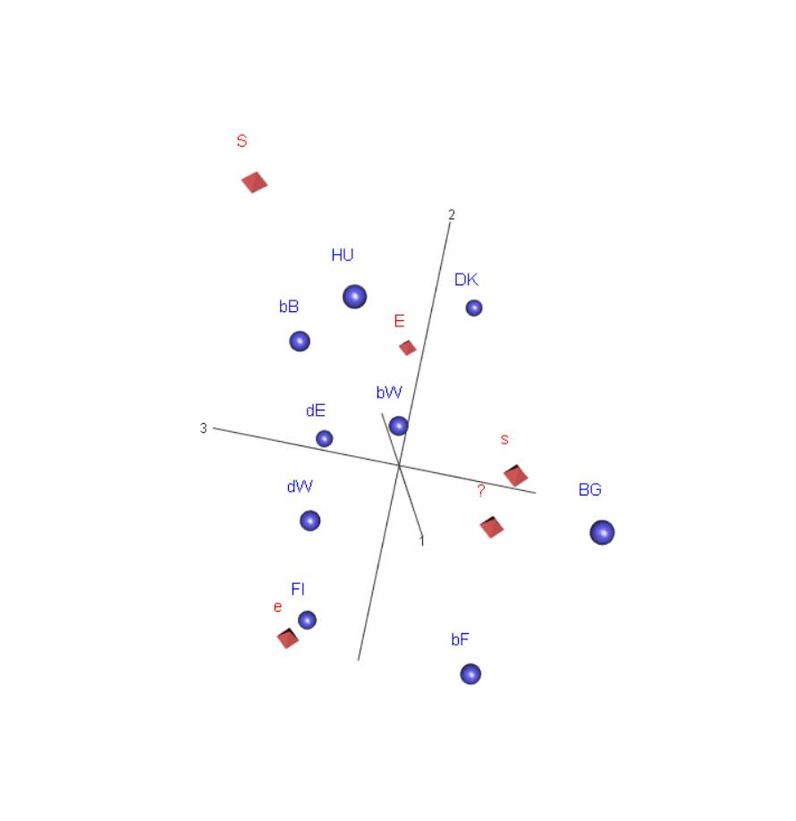

# Täydentävät pisteet

Kartat ovat analyysin väline, ja usein on hyödyllistä esittää kuvassa
lisäinformaatiota tulkinnan avuksi. Täydentävät pisteet (supplementary points,
CAiP s. 89-) ovat rivejä tai sarakkeita jotka lisätään karttaan. Mikä tahansa 
rivi tai sarake voidaan voidaan lisätä kuvaan, jos se on järkevästi vertailukelpoinen
kartan määrittäneiden profiilien kanssa.

Tällainen piste on kartan laskennassa _passiivinen_, sillä on sijainti kartalla
mutta ei massaa eikä vaikutusta inertiaan. Passiivisilla pisteillä ei ole vaikutusta
(kontribuutiota) kartan pääakseleihin.

Täydentävillä pisteillä on kolme yleistä käyttötarkoitusta. Kartalle voidaan lisätä
profiili, joka on jollain lailla sisällöllisesti erilainen kuin muut. Esimerkkiaineistossa
kartalle voisi lisätä joitain Euroopan ulkopuolisia maita. Vaikka nämä riviprofiilit
eivät vaikuta kartan akseleiden määräytymiseen, ne voidaan esittää kuuden maan
määrittämässä "avaruudessa". Projektion laatu (suhteelliset kontribuutiot) voidaan myös
esittää.

Toinen käyttötapaus on pienen massan profiili. Tällaisella pisteellä voi olla iso
vaikutus ratkaisuun, mutta passiivisena pisteenä se sijoitetaan muiden pisteiden 
määrittämälle kartalle. Jo sisällöllisistä syistä pienen massan pisteiden esitystä
kannattaa harkita, ne sijaitsevat kaukana origosta ja huonontavat kuvan laatua.

Kolmas mahdollisuus on jakaa pistejoukkoja osajoukkoihin ja esittää niiden
summaprofiili täydentävänä pisteenä. Summaprofiili on osiensa painotettu
(barysentrinen) keskiarvo. Kun se esiteteään passiivisena pisteenä, havaintoja ei
oteta ratkaisuun kahta kertaa. Profiilien yhdistämiseen liittyy
korrespondenssianalyysin tärkein ominaisuus, jakaumaekvivalenssi (_distributional
equivalence_). Se on ollut menetelmän kehittämisen tärkein tavoiteltu ominaisuus,
Profiileiltaan samanlaiset rivit voidaan yhdistää, analyysin tulokset
eivät muutu. Khii2-etäisyysmitta on ainoa etäisyysmitta joka toteuttaa tämän
periaatteen.

@RefWorks:doc:5a857a43e4b0ed2d44664d75 esittelevät
menetelmän matemaattiset perusteet ja jakaumaekvivalenssin perusteellisesti.
Havainnolinen esitys löytyy Greenacren oppikirjasta(CAiP).

Täydentävien profiilien lisääminen vaatii jo yksinkertaisia matriisioperaatioita.
Korrespondenssianalyysi on käytännössä matriisien muokkausta tutkimusongelman
tarpeisiin.


## Saksan ja Belgian alueet

Saksan ja Belgian aineistossa on mukana aluejako: entiset itä- ja länsi-Saksa
(dE,dW), Flanders (bF), Wallonia (bW) ja Bryssel (bB).


```{r BeDealueTable1, echo=F, eval=T}
# riviprofiilitaulukko aiheuttaa virheen PDF-tulostuksessa, JH_capaper.Rmd
# tiedoston voi kuitenkin renderöidä knit-napilla RStudiossa pdf-tiedostoksi.


BeDealueTable <- ISSP2012esim1.dat %>% tableX(maa3, Q1b, type = "row_perc")

knitr::kable(BeDealueTable , digits = 2, booktabs = TRUE,
           caption = "Q1b vastaukset, Saksan ja Belgian alueet")

```


```{r BeDeAluedat1, eval=T, include=F}

# Belgian ja Saksan aluejako maa3-muuttujassa
# str(ISSP2012esim1.dat$maa3)
# attributes(ISSP2012esim1.dat$maa3)

suppoint1_df1 <- select(ISSP2012esim1.dat, maa3,Q1b)

# Taulukoksi jotta saadaan lisättyä Saksan ja Belgian maa-profiilit täydentäviksi
# pisteiksi.

suppoint1_tab1 <- table(suppoint1_df1$maa3, suppoint1_df1$Q1b)

# tarkistus 1
# suppoint1_tab1

# Maaprofiilit lisäpisteiksi
suppoint2_df <- filter(ISSP2012esim1.dat, (maa == "BE" | maa == "DE"))
suppoint2_df <- select(suppoint2_df, maa, Q1b)
# Poistetaan maa-faktroin tyhjät luokat (14.11.2020)
suppoint2_df <- suppoint2_df %>%
    mutate(maa = fct_drop(maa)
    )


#glimpse(suppoint2_df)
suppoint2_tab1 <- table(suppoint2_df$maa, suppoint2_df$Q1b)

# tarkistus 1
# suppoint2_tab1

# lisätään rivit maa3-muuttujan taulukkoon

suppoint1_tab1 <- rbind(suppoint1_tab1, suppoint2_tab1)

# suppoint1_tab1 

```

Aineistoon lisätään passiviisina riveinä Saksan ja Belgian maaprofiilit (DE, BE).
Maiden massoja ei skaalta yhtä suuriksi, otoskoot vaikuttavat ratkaisuun.

```{r BeDealueetCA2, echo=FALSE}
# suppoint1_tab2 <- read_rds("suppoint1tab1.rds") - testaus joka siirsi virheen 07-rmd-tiedostoon. Sama virheilmoitustyyppi.

suppointCA2 <- ca(suppoint1_tab1[,1:5], suprow = 10:11)

# Sama kartta ilman täydentäviä pisteitä

suppointCA2b <- ca(suppoint1_tab1[1:9,1:5])

```


```{r suppointCA2map1, echo=FALSE, fig.cap= "Q1b: Saksan ja  Belgian aluejako ",fig.asp = 1, out.width = "90%",fig.align = "center"}
# par(cex = 0.6)
plot(suppointCA2, main = "Symmetrinen kartta 1 ",
     # mass = c(TRUE, TRUE),
     # contrib = c(TRUE, FALSE),
     sub = "Täydentävät pisteet DE ja BE" )


```

Saksan ja Belgian täydentävät pisteet ovat osiensa barysentrisiä keskiarvoja,
etäisyys on sitä pienempi mitä suurempi on osuus. Saksan piste sijaitsee siksi
lähempänä länsi-Saksan pistettä. Jos karttaa vertaa kuvaan \@ref(fig:simpleCA1map1)
ei eroja juuri ole. Saksan ja Belgian osien sijoittuminen on kiinnostava.
Itäinen Saksa on selvästi liberaalilla puolella, ensimmäisellä dimensiolla lähinnä Tanskaa.
Läntinen Saksa on ensimmäisellä dimensiolla konservatiivisella puolella Belgian maapisteen
tasolla. Belgian alueista Wallonia (bW) on liberaalilla puolella mutta kaikkein eniten oikealla.
Bryssel ja Flander ovat konservatiivisella puolella, toinen länsi-Saksaa
liberaalimpi ja toinen konservatiivisempi. Belgian osat hajoavat toiseen suuntaan kuin Saksan,
liberaalein Flanders on myös kaikkein maltillisin ja Bryssel vastaavasti
tiukempien mielipiteiden puolella. Sarakepisteiden suhteelliset sijainnit
toisiinsa nähden eivät oleellisesti muutu.

Bryssel ja Wallonia näyttävä olevan hyvin lievästi U-muotoisen maapisteiden 
parven sisällä. Tämä kaariefekti tai _Guttman-efekti_ on kartoissa yleinen.
Se on tavallaan ratkaisun geometriasta. Rivipisteiden pilvi on
sarakkeiden ideaalipisteiden virittämän verteksin sisällä, ja ainoa reitti
verteksin kulmasta toiseen kulkee tasolla kaarveasti (CAiP, s. 127).
Voi myös sanoa, että kaariefektin taustalla on järjestysasteikon muuttujan
korrelaatio ([@RefWorks:doc:5a857a43e4b0ed2d44664d75], s. 220). Kaaren sisäpisteet
ovat usein polarisoituneita ensimmäisen dimension "ääripää-vastausten" välillä.
Tässä vaikutus on heikko, taulukossa \@ref(tab:BeDealueTable1) ei mitää selvää
polarisaatiota näy.


```{r suppointCA2map2, echo=FALSE, fig.cap= "Q1b: Saksan ja  Belgian aluejako ",fig.asp = 1, out.width = "90%",fig.align = "center"}

plot(suppointCA2b, main = "kontribuutiokartta 1 - absoluuttiset kontribuutiot",
        map = "rowgreen",
        arrows = c(FALSE, TRUE),
        mass = c(TRUE, TRUE),
        contrib = c("absolute","absolute"),
        sub = "Massat: pisteiden ja symbolien koko " )

```


Kontribuutiokartasta täydentävät pisteet on jätetty pois, ne eivät vaikuta ratkaisuun.
Saksan ja Belgian osien massat ovat tietenkin pienemepiä.

Sarakkeiden kontribuutiot ovat samantapaiset kuin alkuperäisessä kartassa
\@ref(fig:G1-3asymmContrib1). Rivipisteiden kontribuutioista
osa on selvästi pienempiä, erityisesti länsi-Saksa kaksi Belgian aluetta (bB, bF).
Kuvan perusteella ei voi sanoa johtuuko tämä pelkästään massojen pienentymisestä.

Unkarin ja Bulgarian kontribuutiot muuttuvat eri suuntiin, Unkarin pienenee ja
Bulgarian kasvaa.


## Korrespondenssianalyysin numeeriset tulokset


Korrespondenssianalyysin numeeriset tulokset ovat tärkeitä tulkinnan varmistamiselle
ja antavat tarkemman kuvan ratkaisusta. Nämä tulokset ovat erilaisia kokonaisinertian
dekomponointeja. Kokonaisinertia (total inertia) profiilien ja keskiarvoprofiilin
khii2-etäisyyksien massoilla painotettu summa \@ref(eq:inert2). Se kuvaa
profiilipisteiden hajontaa ideaalipisteiden verteksin sisällä. Maksimi-inertia
saavutetaan kun profiilit ovat verteksien kärkipisteissä, jokaisessa profiilissa
on vain yksi luokittelumuuttujan arvo. Inertia on sama kuin ratkaisun dimensio,
tässä esimerkissä 4(sarakkeiden lukumäärä - 1). Numeeristen tulosten esittelyn tärkein 
lähde on (CAiP, luku 11 ja liitte B).

R-paketti "ca" listaa numeeriset tulokset suppeasti (print) ja laajemmin
(summary). Alla on laajempi tulostus.

```{r suppointCA2numres1,echo=FALSE, eval=FALSE}

print(suppointCA2)

```

Ensimmäisenä on listattu kokonaisinertia pääakseleittain. Tässä suhteelliset luvut
on esitetty prosentteina. Muut luvut on luettavuuden vuoksi skaalattu, joko kerrottu
tuhannella tai esitetty "permills" (summa on 1000).


```{r suppointCA2numres2,echo=FALSE}

summary(suppointCA2)

```
Rivi- ja sarakeprofiileista esitetään samat tiedot. Ensimmäisessä kolmen
sarakkeen joukossa kerrotaan pisteen massa, laatu (qlt) ja inertiakontribuutio.

Inertiakontribuutio (inr) on suhteellinen osuus kokonaisinertiasta. Aktiivisia rivejä on 9,
joten tasaisesti jaettu inetia olisi noin 110. Tanska, Bulgaria ja Unkari "selittävät"
suurimman osan inertiasta. Belgian ja Saksan alueiden kontribuutiot ovat pieniä.
Nämä inertiaosuudet ovat osuuksia kokonaisinertiasta alkuperäisessä neljässä
ulottuvuudessa.

Laatu kertoo miten hyvin piste on esitetty kartalla, miten suuri osa sen
inertiasta on esitetty kartalla. Kaksiulotteinen kartta kuten tässä on yleisin 
valinta, laatu kerrotaan valitulle dimensioiden määrälle. Laatu ei riipu massasta,
vaan pisteen ja kartan akseleiden välisistä kulmista (kts. teorialiite). Saksan 
osien ero laadussa on iso,itä-Saksalla se on erittäin hyvä ja länsi-Saksalla huono.
Belgian alueista Wallonia on kehtoiten esitetty, ja vain Flandersin laatu on
kohtuullisen hyvä. Kovin hyvä ei ole täydentävien maapisteidenkään laatu.

Kaksi seuraavaa kolmen sarakkeen ryhmää kertovat tulokset valituille dimenisoille
eli ratkaisulle. Molempien dimensioiden ("k=1", "k=2" ) pääkoordinaattattien
(x 1000) lisäksi raportoidaan dimension _suhteellinen kontribuutio_ pisteen
inertiaan ("cor"). Nämä tunnusluvut summautuvat laaduksi (qlt),
ja ne voidaan tulkita korrelaation neliöiksi (kts. teorialiite).

Erityisesti Belgian alueiden projektion laatu on huonompi ensimmäisellä dimensiolla.
Itä-Saksa ja Bulgaria taas ovat hyvin esittyjä vain ensimmäisellä dimensiolla
eivätkä juuri ollenkaan korreloi toisen dimension kanssa.

Pisteen _absoluuttinen kontribuutio_ kertoo sen osuuden dimension inertiasta
(summa 1000). E-sarake "selittää" ensimmäisen dimension inertiasta noin 66
prosenttia, ja dimensio saman verran kokonaisinertiasta. Absoluuttinen kontribuutio
riippuu massasta ja siitä paljonko piste poikkeaa koko aineiston keskiarvopisteestä.

Numeerisista tuloksista voidaan varmistaa akseleiden tulkinta sarakkeiden avulla.
Sarakkeet ovat hyvin esitettyjä tasossa, ainoastaan neutraali vaihtoehto on
heikommin kuvattu mutta sillä ei ollut roolia tulkinnassa.

E-sarakkeen vaikutuksen suunta ensimmäisella dimensiolla  näkyy pääkoordinaatin
etumerkistä (k1 = -663), ja sen kontrastina ovat S- ja s- sarakkeet positiiviseen
suuntaan. Toinen dimensio on kontrasti S- ja e-sarakkeiden välillä ja ne selittävät
akselin inertian. Kaikki tämä voitiin päätellä kuvasta, ja numeeriset tulokset
vahvistavat tulkinnan. Sarake S on ainoa jonka kontribuutio on merkittävä
molemmille dimensioille.

Jos pisteen kontribuutio akselille on iso, akselin suhteellinen kontribuutio (cor)
pisteen inertiaan on suuri. Kääntäen tämä ei päde, piste voi olla akselilla hyvin
esitetty mutta kontribuutio on silti pieni.


## Esimerkki kolmiulotteisesta kartasta

```{r BeDealueetCA3d, echo = FALSE}
suppointCA3 <- ca(~maa3 + Q1b,ISSP2012esim1.dat, nd = 3)

# summary(suppointCA3)
# Error in rsc %*% diag(sv) : non-conformable arguments
# outo juttu, ei toimi! - TÄMÄ POISTETAAN

```


Belgian ja länsi-Saksan pisteet on esitetty huonosti kaksiulotteisella kartalla.
Kolmiulotteinen ratkaisu näyttää miten ne sijoittuvat kolmannnen akselin suunnassa.
Tässä tarkastelu on vain diagnostiikkaa. Toisenlainen esimerkki on tutkimus Ranskan
poliitiikan dimensiosta ("French political space") 1990-luvun lopulla
[@RefWorks:doc:5a857a43e4b0ed2d44664d75, s.365]. Siinä Ranskan poliittiset
puolueet sijoitetaan kolmelle sisällöllisesti perustellulle dimensiolle.

Kolmannen dimension hajonnan voi esittää kahten karttana.

 
```{r suppointCA3map1, echo=FALSE, eval=FALSE, fig.cap= "Q1b: Saksan ja  Belgian aluejako ",fig.asp = 1, out.width = "90%",fig.align = "center"}
plot(suppointCA3, dim = c(1,2),
                main = "Kolmen dimension ratkaisu",
                sub = "symmetrinen kartta - 1. ja 2. dimensio")

```


Ensimmäisen ja kolmannen dimesion kuvassa näkyy pisteparven hajonta tärkeimmän
dimension ympärillä. Sarakepisteiden järjestys säilyy samana, samoin maapisteiden
oikealta vasemmalle. Kaikki pisteet paitsi Wallonia hajoavat kolmannen akselin
suuntaan. Belgian kahden pisteen (bB ja bF) eron havaitsee helposti, samoin Unkarin
ja Bulgarian. 
 
```{r suppointCA3map2, echo=FALSE, fig.cap= "Q1b: Saksan ja  Belgian aluejako ",fig.asp = 1, out.width = "90%",fig.align = "center"}
plot(suppointCA3, dim = c(1,3),
                main = "Kolmen dimension ratkaisu 1",
                sub = "symmetrinen kartta - 1. ja 3. dimensio")

```


```{r suppointCA3map3, echo=FALSE, fig.cap= "Q1b: Saksan ja  Belgian aluejako ",fig.asp = 1, out.width = "90%",fig.align = "center"}
plot(suppointCA3, dim = c(2,3),
                main = "Kolmen dimension ratkaisu 2",
                sub = "symmetrinen kartta - 2. ja 3. dimensio")

```


Toisen ja kolmannen dimension kartalla on esitetty noin viidesosa kokonaisinertiasta.
Tässäkin kuvassa Brysselin (bB) ja Unkarin pisteet ovat kontrastina Flanderisin, 
Bulgarian ja Tanskan pisteille.

Diagnostisisessa tarkastelussa on helpompaa käyttää dynaamisia kolmiulotteisia
kuvia. R-ympäristössä saa grafiikkaikkunaan tulostettua kolmiulotteisen kuvan, 
jota voi käännellä ja katsoa eri kulmista. Näin saa paljon helpommin käsityksen
kolmannen dimenison hajonnasta.

Tässä on tyydyttävä kahteen kuvakaappaukseen.


```{r 3dklippi1, echo=FALSE, fig.cap="Saksan ja  Belgian aluejako - 3d-kuva1", out.width = "90%",fig.align = "center"}

knitr::include_graphics('img/3dSymMap_1.PNG')

```


```{r 3dklippi2, echo=FALSE, fig.cap="Saksan ja  Belgian aluejako - 3d-kuva2", out.width = "90%",fig.align = "center"}



```

Miten kaksiulotteisessa kartassa huonosti esitettyjen pisteiden analyysiä voisi
jatkaa? Siihen nämä kartat eivät suoraan anna mitään vastausta. Vaihtoehtoisia
tapoja esitellään seuraavissa luvuissa.
