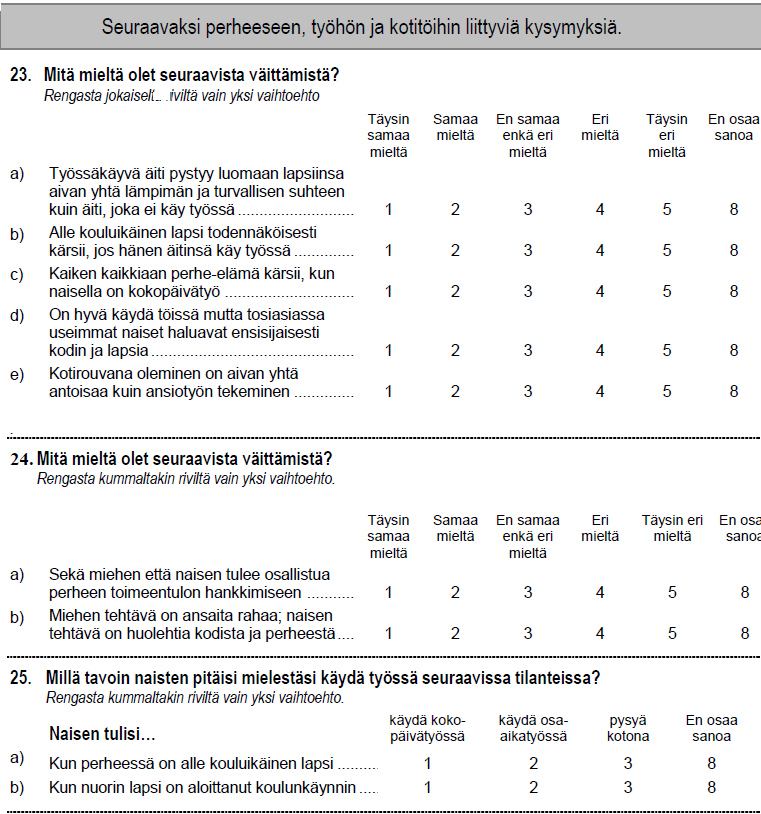

# Liitteet {-}


## Liite 1: Korrespondenssianalyysin teoriaa {-}

### Korrespondenssianalyysin perusyhtälöt ja kaavat


Tässä lähteenä Greenacren kirja[@RefWorks:doc:5a857a43e4b0ed2d44664d78] (ca in practice) ja sen liite
"Theory of CA".

**edit**  Muistiinpanoja löytyy, joissa viitataan myös Biplots in practice - kirjaan.
Kevään 2017 kurssin luentokalvoja on myös käytetty. Lisäillään vielä käsitteitä
LeRouxin ja Rouanetin kirjasta, jos on tarvis.

Datamatriisilla $\boldsymbol{N}$ on $I$ riviä ja $J$ sarakketta ($I x J$ ).
Alkiot ovat ei-negatiivisia (eli nollat sallittuja) ja samassa mitta-asteikossa.
Jos mitta-asteikko on intervalli- tai suhdeasteikko, mittayksiköiden on oltava
samoja (esim. euroja, metrejä). Taulukon alkioiden summa on
$\sum_{i} \sum_{j}n_{ij} = n$, missä $i = 1, \dots , I$ ja $j = 1, \dots , J$.
GDA-kirjassa on tarkennettu tätä vaatimusta ei-negatiivisuudesta.

Korrespondenssimatriisi  $\boldsymbol{P}$ saadaan jakamalla matriisin
$\boldsymbol{N}$  alkiot niiden summalla $n$ .

Merkitään matriisin  $\boldsymbol{P}$  rivisummien vektoria
$\boldsymbol{r}$ (= $(r_{1}, \dots, r_{I})$) ja sarakesummien vektoria
$\boldsymbol{c}$ (= $(c_{1}, \dots, c_{J})$).
Niitä vastaavat diagonaalimatriisit ovat $\boldsymbol{D_r}$ ja
$\boldsymbol{D_c}$.

Korrespondenssianalyysin ratkaistaan singluaariarvohajoitelman avulla. Hyvin
yleinen tulos, jostain syystä tilastotieteessä tullu tunnetuksi melko myöhään
(Mustonen 1985).

Singulaariarvohajoitelma (singular value decomposition) tuottaa ratkaisun kun
sitä sovelletaan standardoituun residuaalimatriisiin $\boldsymbol{S}$.

\begin{equation}
\boldsymbol{S} = \boldsymbol{D_r}^{-1/2}(\boldsymbol{P} - \boldsymbol{r}\boldsymbol{c}^T)\boldsymbol{D_c}^{-1/2} \label{A}
(\#eq:svd1)
\end{equation}

Residuaalimatriisi voidaan esittää myös ns. kontingenssi-suhdelukujen
(contingency ratio) avulla kahdella tavalla.

\begin{equation}
\boldsymbol{D_r}^{-1} \boldsymbol{P} \boldsymbol{D_c}^{-1} = \left( \frac{p_{ij}} {r_{i} c{j}} \right)
(\#eq:contrat1)
\end{equation}

\begin{equation}
\boldsymbol{S} = \boldsymbol{D_r}^{1/2} (\boldsymbol{D_r}^{-1} \boldsymbol{P} \boldsymbol{D_c}^{-1} - \boldsymbol{1}\boldsymbol{1}^{T} ) \boldsymbol{D_c}^{-1/2}  \;\;\; .
(\#eq:contrat2)
\end{equation}

Toinen esitystapa on hyödyllinen, kun tarkastellaan CA:n yhteyksiä muihin
läheisiin menetelmiin (log ratio analysis of compositional data, moniulotteinen
skaalaus (?), lineaarinen diskriminanttianalyysi, kanoninen korrelaatioanalyysi,
pääkomponettianalyysi, kaksoiskuvat, yleensä SVD-hajoitelmaan perustuvat
dimensioden vähentämisen menetelmät).

Samat kaavat alkiomuodossa.


\begin{equation}
s_{ij} = \frac{p_{ij}-r_{i}c_{j}} { \sqrt{r_{i}c_{j} } }
(\#eq:contrat11)
\end{equation}

ja toinen
\begin{equation}
s_{ij} = \sqrt{r_{i}} \left( \frac{p_{ij}}{r_{i}c_{j}} \right) \sqrt{c_{j}} \;\;\; .
(\#eq:contrat21)
\end{equation}

Mitäköhän tuosta pitäisi nähdä? Selitykset löytyvät em. teorialiitteestä.

Singulaariarvohajoitelma (singular value decomposition, SVD) matriisille $\boldsymbol{S}$ on

\begin{equation}
\boldsymbol{S} = \boldsymbol{U} \boldsymbol{D_{\alpha}} \boldsymbol{V}^{T}
(\#eq:svd2)
\end{equation}

missä $\boldsymbol{D_{\alpha}}$ on diagonaalimatriisi, jonka alkiot ovat
singulaariarvot suuruusjärjestyksessä $\alpha_{1}\geq \alpha_{1} \geq \cdots$.


Matriisit $\boldsymbol{U}$ ja $\boldsymbol{V}$ ovat ortogonaalisia
singulaarivektoreiden matriiseja. Singulaariarvohajoitelman merkitys dimensioiden
vähentämiselle perustuu Eckart - Young - teoreemaan. Teoreema kertoo
että saamme pienimmän neliösumman $m$ - ulotteisen approksimaation matriisille
$\boldsymbol{S}$ (CAinP, ss. 244) matriisien $\boldsymbol{U}$ ja $\boldsymbol{V}$
ensimmäisten sarakkeiden ja ensimmäisten singulaariarvojen avulla.

\begin{equation}
\boldsymbol{S}_{(m)} = \boldsymbol{U}_{(m)} \boldsymbol{D}_{\alpha(m)} \boldsymbol{V}_{(m)}^{T}
(\#eq:svd3)
\end{equation}

Korrrespondenssianalyysin ratkaisualgoritmissa tätä tulosta on muokattava niin,
että rivien ja sarakkeiden massat huomioidaan pienimmän neliösumman
approksimaatiossa painoina. 

Näin saadaan standardikoordinaatit ja principal-koordinaatit riveille ja
sarakkeille.

Rivien standardikoordinaatit

\begin{equation}
\boldsymbol{\Phi} = \boldsymbol{D_r}^{-\frac{1}{2}} \boldsymbol{U} \label{B}
(\#eq:rivistd1)
\end{equation}

Sarakkeiden standardikoordinaatit

\begin{equation}
 \boldsymbol{\Gamma} = \boldsymbol{D_c}^{-\frac{1}{2}} \boldsymbol{V} \label{C}
 (\#eq:sarakestd1)
\end{equation}

Rivien pääkoordinaatit

\begin{equation}
 \boldsymbol{F} =   \boldsymbol{D_r}^{-\frac{1}{2}} \boldsymbol{U}  \boldsymbol{D_{\alpha}} = \boldsymbol{\Phi} \boldsymbol{D_{\alpha}} \label{D}
(\#eq:riviprinc1)
\end{equation}

Sarakkeiden pääkoordinaatit
\begin{equation}
 \boldsymbol{G}  = \boldsymbol{D_c}^{-\frac{1}{2}} \boldsymbol{V} \boldsymbol{D_{\alpha}} = \boldsymbol{\Gamma}  \boldsymbol{D_{\alpha}} \label{E}
 (\#eq:sarakeprinc1)
\end{equation}

Pääakseleiden inertiat (principal inertias) $\lambda_{k}$

\begin{equation}
\lambda_{k} = \alpha_{k}^2, k = 1,\dots,K,
K = min \{ I-1, J-1 \}
\end{equation}

**edit 1** CA:ssa ratkaisun akseleiden inertiaa kutsutaan usein ominaisarvoksi,
mutta periaatteessa SVD-ratkaisulla saadaan singulaariarvot, ja niiden neliöt ovat
akseleiden inertioita. Ominaisarvojen ja sigulaariarvojen yhteys on läheinen ja
riippuu diagonalisoitavan matriisin ominaisuuksista.

**edit 1** ratkaisun dimenisio, maksimi-inertia.

Bilineaarinen korresepondenssimalli

Korrespondenssimatriisi $\boldsymbol{P}$ voidaan esittää matriisi- ja
alkiomuodossa ns. palautuskaavana (reconstitution formula).

\begin{equation}
\boldsymbol{P} = \boldsymbol{D}_{r} \left( \boldsymbol{1}\boldsymbol{1}^{T} + \boldsymbol{\Phi}\boldsymbol{D}_{\lambda}^{\frac {1}{2}}\boldsymbol{\Gamma}^{T}\right)\boldsymbol{D}_{c}
(\#eq:reconstform1)
\end{equation}

\begin{equation}
p_ {ij}= r_{i}c_{j} \left(1 + \sum_{k=1}^{K} \sqrt{\lambda_{k}} \phi_{ik} \gamma_{jk} \right)
(\#eq:reconstform2)
\end{equation}

Tässä viitataan s. 101 (13.4), 109 (14.9), ja 109-110 (14.10 ja 14.11).
Palautuskavoilla on monta esitystapaa bilineaarisessa mallissa.

Rivien ja sarakkeiden riippuvuus ja transitioyhtälöt. ss. 244, 108-109 skalaariversiot.

Pääkoordinaatit standardikoordinaattien funktiona
(ns. barysentrinen ominaisuus - barycentric relationships)

\begin{equation}
\boldsymbol{F} = \boldsymbol{D}_{r}^{-1} \boldsymbol{P}\boldsymbol{\Gamma}
(\#eq:barysentr1)
\end{equation}

\begin{equation}
\boldsymbol{G} = \boldsymbol{D}_{c}^{-1} \boldsymbol{P}^{T}\boldsymbol{\Phi}
(\#eq:barysentr2)
\end{equation}

Pääkoordinaatit pääkoordinaattien funktiointa:

\begin{equation}
\boldsymbol{F} = \boldsymbol{D}_{r}^{-1} \boldsymbol{P}\boldsymbol{G}\boldsymbol{D}_{\lambda}^{-\frac{1}{2}}
(\#eq:barysentr3)
\end{equation}

\begin{equation}
\boldsymbol{G} = \boldsymbol{D}_{c}^{-1} \boldsymbol{P}^{T}\boldsymbol{F}\boldsymbol{D}_{\lambda}^{-\frac{1}{2}}
(\#eq:barysentr4)
\end{equation}

Yhtälöt \@ref(eq:barysentr1) ja \@ref(eq:barysentr1) esittävät profiilipisteet ideaalipisteiden (vertex points)
painotettuina keskiarvoina, painoina profiilin elementit. Asymmetriset kartat
(rivien tai sarakkeiden suhteen) perustuvat näihin yhtälöihin. Yhtälöiden \@ref(eq:barysentr3)
ja \@ref(eq:barysentr4) kahdet pääkoordinaatit ovat perusta symmetrisille kartoille. Myös niitä
yhdistää barisentrinen painotetun keskiarvon riippuvuus, mutta mukana ovat skaalaustekijät
 $\frac{1}{\sqrt{\lambda_{i}}}$. Skaalaustekijä on jokaisessa dimensiossa sen inertia, suurimmasta pienimpään.

Kokeillaan vielä kaavaviitteitä: kaavojen \@ref(eq:khii21) ja \@ref(eq:khii22)
yhteyden pitäisi olla selkeä.

**Pisteet ja projektio aliavaruuteen**

Kuva MG:n kurssimateriaaleista[@RefWorks:doc:5b6ef091e4b0984fd9b8c0ca].

```{r projectionimg1, out.width='70%', fig.align='center',fig.cap='Pisteen projektio aliavaruuteen'}
knitr::include_graphics('img/CAquality.png')


```
Kuvassa on esitetty korrespondenssianalyysin ratkaisun minimointiongelma. Pisteen projektio on sitä parempi mitä pienempi kulma on sentroidista pisteeseen piirtetyn janan ja pisteen projektion välillä. COR - tunnusluku ca-funktion
numeerisissa tuloksissa. Kuvasta voi myös hahmottaa sen periaatteen, että projektiossa kaukana olevat pisteet ovat kaukana myös alkuperäisessä avaruudessa. Projektiossa lähekkäin olevat pisteet voivat olla kaukana toisistaan, mutta jos niiden projektion laatu on huono ne voivat olla alkuperäisessä avaruudessa etäällä toisistaan.


### Matriisit ja niiden havainnollistaminen {-}
**edit** Nämä tässä varalla, jos matriisikaavoja tarvitaan lisää. Ehkä ei?


\begin{equation}
A = \begin{bmatrix}
    a_{11} & a_{12} & \dots & a_{1k}\\
    \vdots & \ddots & \\
    \\
    \vdots \\
    a_{n1} & \dots  & \dots & a_{nk}
    \end{bmatrix}
\end{equation}

Ehkäpä ABBA onnistuu paremmin tällä notaatiolla?

\begin{equation}
A = \begin{bmatrix}
    A_{11} & B_{12}  \\
    B_{21} & A_{22}
    \end{bmatrix}
\end{equation}

Pinottujen ja konkatenoitujen matriisien havainnollistaminen?

\begin{equation}
A = \begin{bmatrix}
    A_{maa, Q1a} & A_{maa, Q1b}  \\
    B_{gage, Q1a} & B_{gage, Q1b}
    \end{bmatrix}
\end{equation}


Yksinkertainen korrespondenssianalyysi on kahden luokittelumuuttujan määrittelmän
frekvenssitaulukon analyysiä. Taulukon rivit ovat havaintoyksiköiden (individuals,
havaintoyksikkö) aggregoituja summia, sarakkeet muuttujia.

Analyysissä osa riveistä tai sarakkeista voidaan jättää pois ratkaisun
laskennasta ns. passiviisiksi, ja esittää kartalla täydentävinä pisteinä
(supplementary points). Ne eivät vaikuta ratkaisuun, eli teknisesti niiden massa
on nolla, mutta pisteiden esityksen (projektion) tarkkuus voidaan arvioida.
Täydentävien profiilien on kuintenkin oltava yhteismitallisia taulukon datan
kanssa. Mikä tahansa ei käy (kts. CAinP, vast.luku).

Pinotut tai yhdistetyt matriisit (``stacked matrices'').
Yksinkertainen korrespondenssianalyysi on kahden luokittelumuuttujan määrittämän
taulukon analyysiä, mutta sitä voi soveltaa myös usean muuttujan analyysiin.
Menetelmän matemaattinen perusta ja ratkaisualgoritmi (SVD) toimivat, tulkinta
vain muuttuu.

Yksinkertaisin laajennus on lisätä alkuperäisen taulukon alle toinen taulukko.
Rivit ovat esimerkissä maittan summattuja vastauksia, ja niiden alle voidaan
lisätä joku toinen luokittelumuuttuja. Havaintojen määrä yhditetyssä ("pinotussa")
taulussa kaksinkertaistuu. Miksi tämä ei ei vaikuta tuloksiin vääristävästi??

Merkitään edellisten analyysien kuuden maan ja viiden vastausvaihtoehdon
taulukkoa matriisilla $\boldsymbol{ A}_{I  J}$, missä $I$ on rivien ja $J$
sarakkeiden lukumäärä. Taulukoidaan ikäluokan (1 - 6) ja sukupuolen ($f$ = nainen,
$m$ = mies) vuorovaikutusmuuttuja ($f1,\dots , f6$ ja $m1,\dots , m6$) samojen
vastausvaihtoehtojen kanssa. Jos tätä taulukkoa merkitään matriisilla
$\boldsymbol{ B}_{I^{`}  J}$, voimme muodostaa yhdistetyn matriisin

Rivien lukumäärä on molemmissa matriiseissa sama, koska luokkia sattuu olemaan
kuusi sekä maa- että ikä- ja sukupuoli - luokittelumuuttujissa. Kun matriisit
ovat dimensioiltaan ja myös muuttujien sisällön kannalta samankaltaiset, niitä
kutsutaan yhteensopiviksi (``matched matrix''). Tällöin yksinkertaista
korrespondenssianalyyisä voi soveltaa tutkimusongelmaan, jossa halutaan erotella
jonkun ryhmän sisäinen vaihtelu ryhmien välisiestä vaihtelusta.
(Greenacren ehdottama ABBA - analyysi).


ABBA on erityistapaus yleisemmästä moniulotteisen taulukon (multiway table) analyysistä,
jossa useita kahden muuttujan taulukoita ``pinotaan'' päällekkäin ja rinnakkain.
Voimme ottaa yhden kysymyksen vastausten lisäksi analyysiin mukaan useamman
kysymyksen vastaukset laajentamalla kahden päällekkäisen matriisin taulukkoa oikealle.


## Liite 2: Suomenkielinen lomake (esimerkki) {-}

Tämä kuva on myös tekstissä, kätevä tapa esittää siististi kysymysten pitkät
versiot.

```{r L1suomlom1, out.width='60%', fig.align='center',fig.cap='Esimerkki suomenkielisestä lomakkeesta', echo=T, eval=F}

```


## Liite 3: Tekninen ympäristö ja Bookdown-paketti {-}

Muokataan tiiviimpi pätkä esimerkkireposta bookdown-testi1. Tämä kuva kertoo vain
julkaisutekniikan ympäristön.

```{r L3bdprocess1, out.width = '70%', fig.align='center',fig.cap='Tulostiedoston prosessointi'}
knitr::include_graphics('img/BookdownProc.png')

# pois out.width='50%',

```


## Liite 4: R - koodi {-}


```{r ref.label=knitr::all_labels(), echo = T, eval=F}
#Testataan koodilohkojen listausta, näyttää toimivan mutta vaatii vielä säätämistä.
#Ohje löytyi [Yihui Xienin blogista](https://yihui.name/en/2018/09/code-appendix/)
#(luettu 26.10.2018).
```

