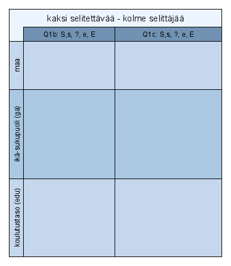

# Alkutoimia {-}

```{r texerr1, eval=TRUE, include=TRUE}
# testaukseen 7.11.2020 virheilmoituksia varten arvo TRUE
options(tinytex.verbose = TRUE)

```

Versiointi: 0.0n aloittelua, 0.n jäsentely koko paperille, 1.n.n valmiimpaa tekstiä.

**Tämä luku poistetaan kun tutkielma on valmis**

**Raportti yhtenä html-tiedostona** (https://hirjus.github.io/capaper/JH_capaper.html), ja kaikki toimii.
Tässä liitteet, lähdeviitteet ja koodilistaus.

**PDF-tulostus oikuttelee ja kaatuu, mutta pdf-syntyy**. MikTeX vaihdettu TinyTeX-engineen
ja pdflatex -> xelatex (15.11.20). PDF-tulostus kaatuu **luultavasti** koodilistaukseen.
Pandoc ei osaa rivittää koodia oikein tms. Koodilistauksen poistaminen ei auta, syystä tai toisesta.

**Suunnitelma: PDF html-raportista -> pdfExchange-ohjelmalla sivunumerot ja kansilehdet**

**22.11.2020 luonnos kansilehdeksi, sisällysluetteloksi ja tiivistelmän aihio**

(https://hirjus.github.io/capaper/GraduKansilehti1.pdf)
(https://hirjus.github.io/capaper/wordTOC.pdf)
(https://hirjus.github.io/capaper/GtiivisTesti1.pdf)

Tiivistelmästä löytyy uudempi pohja, jota käytetään.


RefWorksistä tuotu jhca2020.bib-tiedosto tarkistettu ja korjailtu virheet. Ei enään ladata uutta (21.11.2020),
packages.bib (r-pakettien viitekanta) tarkistettu ja korjattu erikoismerkit. Ei päivitetä enään (24.11.20)

Data-analyysi: (https://hirjus.github.io/Galku).


```{r jhpaketit, include=FALSE}
# 18.10.2020
library(rgl)
library(ca)
library(haven)
library(dplyr)
library(knitr)
library(tidyverse)
library(lubridate)
library(rmarkdown)
library(ggplot2)
library(furniture)
library(scales) # G_1_2 - kuva
library(reshape2)  # G_1_2 - kuva
library(printr) #19.5.18 taulukoiden ja matriisien tulostukseen
library(bookdown)
library(tinytex)
library(assertthat)

```


 

```{r include=FALSE, echo = FALSE, eval = FALSE}
# eval = FALSE 24.11.2020
# automatically create a bib database for R packages
knitr::write_bib(c(
  .packages(), 'bookdown', 'knitr', 'rmarkdown'
), 'packages.bib')

```

<!--chapter:end:index.Rmd-->

# Johdanto

**edit** Kirjoitetaan disposition pohjalta, keräillään kaikki yleiset
ca-luonnehdinnat yhteen paikkaan eli johdantoon. Kirjoitetaan viimeiseksi, samoin
yhteenvetoluku. Mahdollisimman lyhyt.


**johdannon ydinsisältö**

**1**. CA:n periaatteet voi esitellä yksinkertaisen kahden luokittelumuuttujan
taulukon analyysin avulla. Kun taulukko on pieni, on helppo vertailla CA:n
karttoja dataan. Yksinkertainen kahden luokittelumuuttujan
korrespondenssianalyysi antaa graafisen analyysin "...perussäännöt
tulkinnalle. Kaikki muut korrespondenssianalyysin muodot ovat saman algoritmin
soveltamista toisen tyyppiisiin datamatriiseihin, ja tulkintaa sovelletaan vastaavasti
".([@RefWorks:doc:5a857a44e4b0ed2d44664d84] s. 437). Tämä Greenacren ja Hastien artikkelissaan
esittämä periaate helpottaa huomattavasti juuri graafisen data-analyysin
eli korrespondenssianalyysin karttojen tulkinnan perussääntöjen oivaltamista. Juuri kartat,
samassa kuvassa esitettävät havainnot ja muuttujat ovat CA:n tärkein menetelmä, mutta ei
aivan helppo.

**2**. CA on kuitenkin vahvimmillaan isojen ja monimutkaisten aineistojen analyysissä.
Siksi ns. monimuuttujakorrespondenssianalyysin lyhyessä esittelyssä aineistoa
laajennetaan, sillä "on erittäin vaikeaa osoittaa kotiakvaarioissa, että verkko on
tehokas"([@RefWorks:doc:5a857a43e4b0ed2d44664d75], s.15).

**loppuosa johdannosta vielä vanhoja tekstipätkiä (16.11.2020)**


## Tutkielman tavoite

**k** Tässä kerrotaan, miksi tämä työ on kirjoitettu. Esitellään menetelmä
käyttämällä oikeaa dataa. Täsmällisempi esitys sirotellaan esimerkkiaineiston
analyysin tulosten esittelyn lomaan. Pitäisikö tässä tuoda esille ns. "ranskalaisen
koulukunnan" matemaattisen perusteiden korostus, ja data-analyysin filosofia?
Ehkä ei, koska sen pohdinta ei ole pääasia. Se tietysti mainitaan, ja asiaa pohditaan.


**ks** Esitellään korrespondenssianalyysin käsitteet ja graafisen analyysin
periaatteet.

**k** -mitä ca on?
- dimensioiden vähentäminen ja visualisointi

- mihin dataan se soveltuu: kahden luokittemuuttujan taulukon lukumäärädata (count data)
tai suhdeasteikon muuttujia samassa mittayksikössä (esim. euroissa).

- määrittele graafinen, deskriptiivinen, eksploratiivinen data-analyysi
- yksinkertainen ca, useamman muuttujan ca


**zxy** Miksi eksporatiivinen (määrittele!) ja deskriptiivinen (määrittele!)
menetelmä on esitettävä "in vivo", toiminnassa? Oppikirjoissa (viitteitä)
erityisesti MG on havainnolistanut CA:n matemaattista ja geometristä taustaa
synteettisillä aineistoilla. Turha kopioida tähän. Menetelmän ydin on
yksinkertaisen graafisen esityksen -- kartan -- avulla tulkita monimutkaisen
empiirisen aineiston muuttujien riippuvuuksia. Yhteyksiä ei tiivistetä
todennäköisyyspäättelyn kriteereillä tilastolliseen malliin, vaan deskripriivisen
analyysin hengessä esitellään koko aineisto. Mallin sijaan vähennetään ulottuvuuksia,
ja siinä menetetään informaatiota. Tavoitteena on säilyttää yleensä kaksiulotteisessa
kuvassa mahdollisimman suuri osa alkuperäisen datan vaihtelusta. Eksploratiivinen
data-analyysi on vuoropuhelua aineiston kanssa. Analyysiä tarkennetaan, rajataan
ja muokataan, kun aineisto paljastaa jotain kiinnostavaa tai yllättävää. Tästä
saa jonkinlaisen aasinsillan matriisiyhtälöiden puolustukseksi.
Saksan ja Belgian datan jakaminen on hyvä esimerkki, on "osattava tarttua"
menetelmän tulosmatriiseihin.


**k** esitystavan perustelu

- kenelle kirjoitettu? Menetelmästä kiinnostuneelle tilastotieteen ja data-analyysin
perusteet tuntevalle. R-ohjelmisto ei ole rajoitus, SPSS ja SAS sopivat
(SPSS - MG:llä kriittinen huomio "loose ends - paperissa" tai CAip-teorialiitteessä).

## Tärkeimmät lähteet ja ohjelmistot


Michael Greenacre luennoi lyhyen kurssin korrespondenssianalyysistä Helsingin
yliopistossa keväällä 2017[@RefWorks:doc:5b6ef091e4b0984fd9b8c0ca]. Luennot ja
laskuharjoitukset perehdyttivät minut ensimmäistä kertaa tähän menetelmään, ja
kurssin materiaaleihin olen usein palannut.
Michael Greenacren kärsivällisesti kirjoitettu "Correrspondence Analysis in
Practice" (jatkossa "CAiP") [@RefWorks:doc:5a857a43e4b0ed2d44664d78] ja sen
aikasemmat versiot ovat tehneet menetelmää laajasti tunnetuksi."Biplots in Practice"
(jatkossa "Biplots") [@RefWorks:doc:5a857a43e4b0ed2d44664d7c] esittää menetelman
osana yleisempää kaksoiskuvien ideaa. 


Ranskalaisen lähestymistan perusoppikirja[@RefWorks:doc:5a857a43e4b0ed2d44664d75] (GDA-kirja?)
esittelee menetelmän matemaattiset perusteet.
Lyhyt historiallinen katsaus ja menetelmä soveltamisen perusajatusten esittely
valaisevat ranskaa taitamattomalle data-analyysin koulukunnan ideoita.
Kirjoittajat esittelevät perusteellisesti joitain empiirisiä tutkimuksia, ja
lyhyt mutta naseva matriisilaskennan kritiikki on hyvä panna merkille.


**edit** Hyvin lyhyesti, lause tai pari. On oma liite tekneisestä ympäristöstä.

**zxy** R, ca-paketti. löytyy myös muita paketteja.
Rmarkdown[@RefWorks:doc:5b6b346fe4b0c619b11b8a3e], ja
bookdown ([@RefWorks:doc:5b6b36dde4b09b7ec442bf8b] ja toinen viite [@R-bookdown]).
Mikäs tuo jälkimmäinen on? PDF-lähdeluettelossa ei ole url-osoitteita.

**k** Helposti toistettavan tutkimukset periaatteet

1. Datastan perusmuunnokset ja muuttujatyypit tehdään kun data luetaan
R-ohjelmistoon.
2. Koodi selkeää ja dokumentoitua. Tärkeä lähde [@RefWorks:doc:5c3759c2e4b0085b307c82b5]
3. R, LaTeX, pandoc - versiot dokumentoidaan

Tarkemmin liittessä.

## Korrespondenssianalyysin historiaa

**k1** Tiivis esitys lähteineen. Historian voi aloittaa jo pari vuosikymmentä
vallineesta tilanteesta. CA on yksi deskriptiivinen (ei-tn-teoriaan perustuvaa
päättelyä) menetelmä muiden joukossa, eristyneisyys murtui hitaasti 80-luvun aikana.

**k2** Historialla on vain historiallista merkitystä. Kiinnostava juttu, mutta
aika laaja ja lavea.

**k3** Peruskäsitys monessa lähteessä (vihreä kirja, GDA-kirja jne.): synty ja
kukoistus Ranskassa, loistava eristys (splendid isolation), pikku hiljaa hyväksyntä.

Syiksi esitetään kaksoismuuria: abstrakti matemaattinen ("bourbakilainen") perusta
ja esitystapa ja kieli.

**k4** Mitä historiasta on hyvä tietää.
1. Matemaattinen perusta on "tosi", mutta onko menetelmän soveltaminen riippuvainen
siitä? Ei ole ollut.

2. Ristiriita data-analyyttisen/kuvailevan jne. lähestymistavan ja tilastollisen
mallintamisen välillä - on läsnä edelleen mutta turha korostaa. Myös tilastollisen
mallintamisen ja päättelyn sisällä on kiistoja, erilaisia näkemysiä ja kuiluja.

3. "Esoteerinen tieteenfilosofia"? Kiinnostava aihe, ehkä. Murgtag-sitaatti.


<!--chapter:end:01-johdanto.Rmd-->

# Data

```{r datasel-country1,  echo = FALSE, include = FALSE}
# include FALSE: ei koodia eikä tulostusta dokumenttiin - poistettava turhia
# välitulostuksia (18.10.2020)
# Aineiston rajaamisen kolme vaihetta (10.2018)
# 
# TIEDOSTOJEN NIMEÄMINEN
#
# R-datatiedostot .data - tarkenteella ovat osajoukkoja koko ISSP-datasta ISSP2012.data
# R-datatiedostot .dat - tarkenteella: mukana alkuperäisten muuttujien muunnoksia 
# (yleensä as_factor), alkuperäisissä muuttujissa mukana SPSS-tiedoston metadata.
#
# Luokittelumuuttujan tyyppi on datan lukemisen jälkeen yleensä merkkijono (char) 
# ja haven_labelled. 
#
# Muutetaan R-datassa ordinaali- tai  nominaaliasteikon muuttujat haven-paketin 
# as_factor - funktiolla faktoreiksi. R:n faktorityypin muuttujille voidaan tarvittaessa 
# määritellä järjestys, toistaiseksi niin ei tehdä (25.9.2018). 
#
# Muunnetun muuttujan rinnalla säilytetään SPSS-tiedostosta luettu muuttja, metatiedot säilyvät 
# alkuperäisessä.
#       
# R-datatiedostot joiden nimen loppuosa on muotoa *esim1.dat: käytetään analyyseissä
#
# 1. VALITAAN MAAT (25) -> ISSP2012jh1a.data. Muuttujat koodilohkossa datasel_vars1
#
# kolme maa-muuttujaa datassa. V3 erottelee joidenkin maiden alueita, V4 on koko 
# maan koodi ja C_ALPHAN on maan kaksimerkkinen tunnus.
#
# V3 - Country/ Sample ISO 3166 Code (see V4 for codes for whole nation states)
# V3 erot valituissa maissa
# 5601 BE-FLA-Belgium/ Flanders
# 5602 BE-WAL-Belgium/ Wallonia
# 5603 BE-BRU-Belgium/ Brussels
# 27601 DE-W-Germany-West
# 27602 DE-E-Germany-East
# 62001 PT-Portugal 2012: first fieldwork round (main sample)
# 62002 PT-Portugal 2012: second fieldwork round (complementary sample)
# Myös tämä on erikoinen, näyttää olevan vakio kun V4 = 826:
# 82601 GB-GBN-Great Britain
# Portugalissa ainestoa täydennettiin, koska siinä oli puutteita. Jako ei siis ole oleellinen,
# mutta muuut ovat. Tähdellä merkityt maat valitaan johdattelevaan esimerkkiin.
#
# Maat (25)
#
# 36 AU-Australia
# 40 AT-Austria
# 56 BE-Belgium*
# 100 BG-Bulgaria*
# 124 CA-Canada
# 191 HR-Croatia
# 203 CZ-Czech Republic
# 208 DK-Denmark*
# 246 FI-Finland*
# 250 FR-France
# 276 DE-Germany*
# 348 HU-Hungary*
# 352 IS-Iceland
# 372 IE-Ireland
# 428 LV-Latvia
# 440 LT-Lithuania
# 528 NL-Netherlands
# 578 NO-Norway
# 616 PL-Poland
# 620 PT-Portugal
# 643 RU-Russia
# 703 SK-Slovakia
# 705 SI-Slovenia
# 752 SE-Sweden
# 756 CH-Switzerland
# 826 GB-Great Britain and/or United Kingdom - jätetään pois jotta saadaan TOPBOT 
#                          -muuttuja mukaan (top-bottom self-placement) .(9.10.18)
# 840 US-United States - jätetään pois, jotta saadaan TOPBOT-muuttuja mukaan.(10.10.18)
#
# Belgian ja Saksan alueet:
#  V3
#  5601     BE-FLA-Belgium/ Flanders
#  5602     BE-WAL-Belgium/ Wallonia
#  5603     BE-BRU-Belgium/ Brussels
# 27601     DE-W-Germany-West
# 27602     DE-E-Germany-East
#
# Unkari (348) toistaiseksi mukana, mutta joissain kysymyksissä myös Unkarilla on 
# poikkeavia vastausvaihtoehtoja(HU_V18, HU_V19,HU_V20). Jos näitä muuttujia käytetään, 
# Unkari on parempi jättää pois. 
# 
#
# (25.4.2018) user_na  
# haven-paketin read_spss - funktiolla voi r-tiedostoon lukea myös SPSS:n sallimat kolme 
# (yleensä 7, 8, 9) tarkempaa koodia puuttuvalle tiedolle.
# "If TRUE variables with user defined missing will be read into labelled_spss objects. 
# If FALSE, the default, user-defined missings will be converted to NA"
# https://www.rdocumentation.org/packages/haven/versions/1.1.0/topics/read_spss
#
 
ISSP2012jh.data <- read_spss("data/ZA5900_v4-0-0.sav") #luetaan alkuperäinen data R- dataksi (df).

#str(ISSP2012jh.data)

incl_countries25 <- c(36, 40, 56,100, 124, 191, 203, 208, 246, 250, 276, 348, 352, 
                      372, 428, 440, 528, 578, 616, 620, 643, 703, 705, 752, 756)

#str(ISSP2012jh.data)
#str(ISSP2012jh.data) #61754 obs. of  420 variables - kaikki

ISSP2012jh1a.data <- filter(ISSP2012jh.data, V4 %in% incl_countries25)

#head(ISSP2012jh1a.data)
#str(ISSP2012jh1a.data) #34271 obs. of  420 variables, Espanja ja Iso-Britannia
#                       pois (9.10.2018)
# str(ISSP2012jh1a.data) # 32969 obs. of  420 variable, Espanja Iso-Britannia, 
#                        USA pois (10.10.2018)
#
# names() # muuttujen nimet
# Maakohtaiset muuttujat (kun on poikettu ISSP2012 - vastausvaihtoehdoista tms.) 
# on aineistossa eroteltu maatunnus-etuliitteellä (esimerkiksi ES_V7).
# Demografisissa ja muissa taustamuuttujissa suuri osa tiedoista on kerätty maa-
# kohtaisilla lomakkeilla. Vertailukelpoiset muuttujat on konstruoitu niistä.
# Muuttujia on 420, vain osa yhteisiä kaikille maille.

```


```{r datasel-vars1, echo = FALSE,include = FALSE}
# include FALSE: ei koodia eikä tulostusta dokumenttiin - poistettava turhia
# välitulostuksia (18.10.2020)
# 2. VALITAAN MUUTTUJAT  -> ISSP2012jh1b.data. Maat valittu koodilohkossa datasel_country1
#
#
# Muuttujat on luokiteltu dokumentissa ZA5900_overview.pdf
# https://zacat.gesis.org/webview/index.jsp?object=http://zacat.gesis.org/obj/fStudy/ZA5900
# Study Description -> Other Study Description -> Related Materials
# 
#

# METADATA

metavars1 <- c("V1", "V2", "DOI")

#MAA - maakoodit ja maan kahden merkin tunnus

countryvars1 <- c("V3","V4","C_ALPHAN")

# SUBSTANSSIMUUTTUJAT - Attitudes towards family and gender roles (9)
#
# Yhdeksän kysymystä (lyhennetyt versiot, englanniksi), vastausvaihtoehdot Q1-Q2
#
# 1 = täysin samaa mieltä, 2 = samaa mieltä, 3 = ei samaa eikä eri mieltä, 
# 4 = eri mieltä, 5 = täysin eri mieltä
# 
# Q1a Working mother can have warm relation with child
# Q1b Pre-school child suffers through working mother
# Q1c Family life suffers through working mother
# Q1d Women’s preference: home and children
# Q1e Being housewife is satisfying
#
# Q2a Both should contribute to household income
# Q2b Men’s job is earn money, women’s job household
#
# Q3a Should women work: Child under school age 
# Q3b Should women work: Youngest kid at school
# 1= kokopäivätyö, 2 = osa-aikatyö, 3 = pysyä kotona, 8 = en osaa sanoa
# (can't choose), 9 = no answer
#
# Kysymysten Q3a ja Q3b eos-vastaus ei ole sama kuin "en samaa enkä eri  mieltä"
# (ns. neutraali # vaihtoehto), mutta kieltäytymisiä jne. (koodi 9) on aika
# vähän. Kolmessa # maassa ne on yhdistety: 
# (8 Can't choose, CA:can't choose+no answer, KR:don't know+refused, NL:don't know).
# Kun SPSS-tiedostosta ei ole tuotu puuttuvan tiedon tarkempaa luokittelua,
# erottelua ei voi tehdä.
#

substvars1 <- c("V5","V6","V7","V8","V9","V10","V11","V12","V13") # 9 muuttujaa

# Nämä yhteiset muuttujat pois (maaspesifien muuttujien lisäksi) :
#
# "V14","V15","V16",  "V17","V18","HU_V18","V19","HU_V19","V20","HU_V20","V21",
# "V28","V29","V30","V31","V32","V33",# "V34", "V35", "V36", "V37", "V38", "V39",
# "V40", "V41", "V42", "V43", "V44", "V45", "V46", "V47", "V48", "V49", "V50", 
# "V51", "V52", "V53", "V54", "V55", "V56", "V57", "V58", "V59", "V60", "V61", 
# "V62", "V63", "V64", "V65", "V65a","V66", "V67"
#
#
# DEMOGRAFISET JA MUUT TAUSTAMUUTTUJAT (8)
#
# AGE, SEX
#
# DEGREE - Highest completed degree of education: Categories for international
# comparison. Slightly re-arranged subset of ISCED-97
#
# 0 No formal education
# 1 Primary school (elementary school)
# 2 Lower secondary (secondary completed does not allow entry to university:
#  obligatory school)
# 3 Upper secondary (programs that allow entry to university or programs that
#  allow to entry other ISCED level 3 programs - designed to prepare students for
#  direct entry into the labour market)
# 4 Post secondary, non-tertiary (other upper secondary programs toward labour
#  market or technical formation)
# 5 Lower level tertiary, first stage (also technical schools at a tertiary level)
# 6 Upper level tertiary (Master, Dr.)
# 9 No answer, CH: don't know
# HUOM! R-factor - muunnoksessa koodaus on 1-7
#
# MAINSTAT - main status: Which of the following best describes your current situation?
#
# 1 In paid work
# 2 Unemployed and looking for a job, HR: incl never had a job
# 3 In education
# 4 Apprentice or trainee
# 5 Permanently sick or disabled
# 6 Retired
# 7 Domestic work
# 8 In compulsory military service or community service
# 9 Other
# 99 No answer
# Armeijassa tai yhdyskuntapalvelussa muutamia, muutamissa maissa.Kategoriassa 9 
# on hieman väkeä. Yhdistetään 8 ja 9. Huom! Esim Puolassa ei yhtään eläkeläistä
# eikä kategoriaa 9, Saksassa ei ketään kategoriassa 9.
#
# TOPBOT - Top-Bottom self-placement (10 pt scale)
#
# "In our society, there are groups which tend to be towards the top and groups 
# which tend to be towards the bottom. Below is a scale that runs
# from the top to the bottom. Where would you put yourself on this scale?"
# Eri maissa hieman erilaisia kysymyksiä. 
#
# HHCHILDR - How many children in household: children between [school age] and
# 17 years of age
#
# 0 No children
# 1 One child
# 2 2 children
# 21 21 children
# 96 NAP (Code 0 in HOMPOP)
# 97 Refused
# 99 No answer
#
# Voisi koodata dummymuuttujaksi lapsia (1) - ei lapsia (0).
# Ranskan datassa on erittäin iso osa puuttuvia tietoja (yli 20 %), Sama tilanne
# myös  muissa perheen kokoon liittyvissä kysymyksissä.  Myös Austarlialla aika
# paljon puuttuvia vastauksia.
#
# MARITAL - Legal partnership status 
#
# What is your current legal marital status?
# The aim of this variable is to measure the current 'legal' marital status '. 
# PARTLIV - muuttujassa on 'de facto' - tilanteen tieto parisuhteesta
#
# 1 Married
# 2 Civil partnership
# 3 Separated from spouse/ civil partner (still legally married/ still legally 
#   in a civil partnership)
# 4 Divorced from spouse/ legally separated from civil partner
# 5 Widowed/ civil partner died
# 6 Never married/ never in a civil partnership, single
# 7 Refused
# 8 Don't know
# 9 No answer
#
# URBRURAL - Place of living: urban - rural
#
# 1 A big city
# 2 The suburbs or outskirts of a big city
# 3 A town or a small city
# 4 A country village
# 5 A farm or home in the country
# 7 Other answer
# 9 No answer
# 1 ja 2 vaihtelevat aika paljon maittain, parempi laskea yhteen. Unkarista puuttuu 
# jostain syystä kokonaan vaihtoehto 5.  Vaihotehdon 7 on valinnut vain 4
# vastaajaa Ranskasta.
#

bgvars1 <- c( "SEX","AGE","DEGREE", "MAINSTAT", "TOPBOT",
              "HHCHILDR", "MARITAL", "URBRURAL")

#Valitaan muuttujat

jhvars1 <- c(metavars1,countryvars1, substvars1,bgvars1)

#jhvars1
ISSP2012jh1b.data <- select(ISSP2012jh1a.data, all_of(jhvars1)) 

# laaja aineisto - mukana havainnot joissa puuttuvia tietoja
# str(ISSP2012jh1b.data) #32969 obs. of  23 variables 
# 
# SUBSTANSSIMUUTTUJAT
#
# $ V5      : 'haven_labelled' num  5 1 2 2 1 NA 2 4 2 2 ...
#  ..- attr(*, "label")= chr "Q1a Working mom: warm relationship with children
#       as a not working mom"
#  ..- attr(*, "labels")= Named num  0 1 2 3 4 5 8 9
#
# ISSP2012jh1b.data$V5 näyttää tarkemmin rakenteen
#
# glimpse(ISSP2012jh1b.data)

# Poistetaan havainnot, joissa ikä (AGE) tai sukupuolitieto puuttuu (5.7.2019)

ISSP2012jh1c.data <- filter(ISSP2012jh1b.data, (!is.na(SEX) & !is.na(AGE)))

# str(ISSP2012jh1c.data) # 32823 obs. of  23 variables, 32969-32823 = 146
# TARKISTUS 8.6.20 dplyr 1.0.0-päivitys: havaintojen ja muuttujien määrä ok.

```


```{r fct-vaihe1, echo = FALSE,include = FALSE}
# VAIHE 1 - muuttujat joissa ei ole puuttuvia tietoja

# vaihe 1.1 haven_labelled ja chr -> as_factor

ISSP2012jh1d.dat <- ISSP2012jh1c.data %>%
    mutate(maa = as_factor(C_ALPHAN), # ei puuttuvia, ei tyhjiä leveleitä
           maa3 = as_factor(V3),  # maakoodi, jossa aluejako joillan mailla
           sp1 = as_factor(SEX), # ei puuttuvia, tyhjä level "no answer" 999
         )


# C_ALPHAN - maa - maa3 tarkistuksia

# V3
# "Pulma" on järjestys. C_ALPHAN ("chr") on aakkosjärjestyksessä, kun luodaan
# maa = as_factor(C_ALPHAN) järjestys muuttuu (esiintymisjärjestys datassa?)
# maa3 muunnetaan maakoodista (haven_labelled' num), jonka

# str(ISSP2012jh1d.dat$maa) #Country Prefix ISO 3166 Code - alphanumeric
# attributes(ISSP2012jh1d.dat$maa) # ei tyhiä levels-arvoja, 25 levels
# ISSP2012jh1d.dat$maa %>% fct_unique()
# ISSP2012jh1d.dat$maa %>% fct_count() # summary kertoo samat tiedot (20.2.20)
# sum(is.na(ISSP2012jh1d.dat$maa)) # ei puuttuvia tietoja
# ISSP2012jh1d.dat$maa %>% summary() # mukana vain valitut 25 maata

# str(ISSP2012jh1d.dat$maa3)  #"Country/ Sample ISO 3166 Code
                            #(see V4 for codes for whole nation states)"
                            # 29 levels
# str(ISSP2012jh1d.dat$V3)

# attributes(ISSP2012jh1d.dat$maa3) # ei tyhiä levels-arvoja, 29 levels
# sum(is.na(ISSP2012jh1d.dat$maa3)) # nolla ei ole puuttuva tieto! (3.2.20)
# ISSP2012jh1d.dat$maa3 %>% fct_unique()
# ISSP2012jh1d.dat$maa3 %>% fct_count()
# Vain näissä on jaettu maan havainnot (3.2.20)
#
# [38] BE-FLA-Belgium/ Flanders
# [39] BE-WAL-Belgium/ Wallonia
# [40] BE-BRU-Belgium/ Brussels
# [41] DE-W-Germany-West
# [42] DE-E-Germany-East
# [43] PT-Portugal 2012: first fieldwork round (main sample)
# [44] PT-Portugal 2012: second fieldwork round (complementary sample)

# ISSP2012jh1d.dat$maa3 %>% fct_count() #miksi ei tulosta mitään? (3.2.2020)

# ISSP2012jh1d.dat$maa3 %>% summary()
# ISSP2012jh1d.dat$maa3 %>% fct_unique()
# maa3: 25 maata, havaintojen määrä. Poisjätetyissä havaintoja 0.
# glimpse(ISSP2012jh1d.dat$maa3)
# head(ISSP2012jh1d.dat$maa3)
# length(levels(ISSP2012jh1d.dat$maa3))

# C_ALPHAN alkuperäinen järjestys, maa aakkosjärjestyssä  (2.2.20)
#
# Huom1: Myös merkkijonomuuttujaa C_ALPHAN tarvitaan jatkossa.
#
# Huom2: kun dataa rajataan, on tarkistettava ja tarvittaessa poistettava
# "tyhjät" R-factor - muuttujan "maa" luokat (3.2.2020)


# vaihe 1.2 tyhjät luokat (levels) pois faktoreista

ISSP2012jh1d.dat <- ISSP2012jh1d.dat %>%
    mutate(sp = fct_drop(sp1),
           maa3 = fct_drop(maa3)
           )

#  maa3 - tarkistuksia

# str(ISSP2012jh1d.dat$maa3)  # 29 levels
# attributes(ISSP2012jh1d.dat$maa3)
#sum(is.na(ISSP2012jh1d.dat$maa3)) # nolla ei ole puuttuva tieto! (3.2.20)
# ISSP2012jh1d.dat$maa3 %>% summary()
# ISSP2012jh1d.dat$maa3 %>% fct_unique()
# ISSP2012jh1d.dat$maa3 %>% fct_count()
#
# str(ISSP2012jh1d.dat$C_ALPHAN)
# attributes(ISSP2012jh1d.dat$C_ALPHAN)

# TESTAUKSIA
# 
# ISSP2012jh1d.dat %>% tableX(C_ALPHAN, maa)
# ISSP2012jh1d.dat %>% tableX(C_ALPHAN, maa3)
# ISSP2012jh1d.dat %>% tableX(maa, maa3)
# ISSP2012jh1d.dat %>% tableX(V3, maa3)

# sp, sp1, SEX - tarkistuksia
# 
# ISSP2012jh1d.dat$sp %>% fct_count()
# ISSP2012jh1d.dat$sp %>% fct_count()
# ISSP2012jh1d.dat %>% tableX(SEX,sp1)
# ISSP2012jh1d.dat %>% tableX(SEX,sp)
# ISSP2012jh1d.dat %>% tableX(sp1,sp)

# vaihe 1.3 uudet "faktorilabelit"
ISSP2012jh1d.dat <- ISSP2012jh1d.dat %>%
    mutate(sp =
          fct_recode(sp,
            "m" = "Male",
            "f" = "Female")
            )

# Tarkistuksia

# ISSP2012jh1d.dat$sp %>% fct_unique()
# ISSP2012jh1d.dat$sp %>% fct_count()
# ISSP2012jh1d.dat$sp %>% summary()

# AGE -> ika
ISSP2012jh1d.dat$ika <- ISSP2012jh1d.dat$AGE

# Tarkistuksia
attributes(ISSP2012jh1d.dat$ika) # tyhjä level "No answer"
# str(ISSP2012jh1d.dat$ika)
ISSP2012jh1d.dat$ika %>% summary()

ISSP2012jh1d.dat %>%
tableC(AGE, ika,cor_type = "pearson", na.rm = FALSE, rounding = 5,
       output = "text", booktabs = TRUE, caption = NULL, align = NULL,
       float = "htb") %>% kable()

# Ikäjakauma - ei tarvita (18.10.2020)
#
# ISSP2012jh1d.dat$ika %>% hist(main = "ISSP 2012: vastaajan ikä")

```


```{r fct-vaihe21, echo = FALSE, include = FALSE}
# Substanssi- ja taustamuuttujat R-faktoreiksi
ISSP2012jh1d.dat <- ISSP2012jh1d.dat %>%
    mutate(Q1a1 = as_factor(V5), #labels
            Q1b1 = as_factor(V6),
            Q1c1 = as_factor(V7),
            Q1d1 = as_factor(V8),
            Q1e1 = as_factor(V9),
            Q2a1 = as_factor(V10),
            Q2b1 = as_factor(V11),
            Q3a1 = as_factor(V12), #labels = vastQ3_labels (W,w,H)
            Q3b1 = as_factor(V13), #labels = vastQ3_labels
            edu1 = as_factor(DEGREE),
            msta1 = as_factor(MAINSTAT),
            sosta1 = as_factor(TOPBOT),
            nchild1 = as_factor(HHCHILDR),
            lifsta1 = as_factor(MARITAL),
            urbru1 = as_factor(URBRURAL)
           )

# Muuttujat Q1a1...urbru1 ovat apumuuttujia, joissa on periaatteessa kaikki SPSS-
# tiedostosta siirtyvä metatieto. Poikkeus on SPSS:n kolme tarkentavaa koodia
# puuttuvalle tiedolle, ne saisi mukaan read_spss - parametrin avulla (user_na=TRUE)
#

# Tarkistusksia
# ISSP2012jh1d.dat %>% summary()

# ISSP2012jh1d.dat %>%
#    select(Q1a1, Q1b1, Q1c1,Q1d1,Q1e1, Q2a1, Q2b1, Q3a1,Q3b1) %>%
#    summary()
#
# ISSP2012jh1d.dat %>%
#    select(edu1,msta1, sosta1, nchild1, lifsta1, urbru1) %>%
#    summary()


# Substanssimuuttujat - ristiintaulukoinnit riittävät (6.2.20)

# ISSP2012jh1d.dat$Q1a1 %>% fct_count()
# ISSP2012jh1d.dat$Q1b1 %>% fct_count()
# ISSP2012jh1d.dat$Q1c1 %>% fct_count()
# ISSP2012jh1d.dat$Q1d1 %>% fct_count()
# ISSP2012jh1d.dat$Q1e1 %>% fct_count()
# ISSP2012jh1d.dat$Q2a1 %>% fct_count()
# ISSP2012jh1d.dat$Q2b1 %>% fct_count()
# ISSP2012jh1d.dat$Q3a1 %>% fct_count()
#ISSP2012jh1d.dat$Q3b1 %>% fct_count()

# Taustamuuttujat - ristiintaulukoinnit riittävät (6.2.20)

# ISSP2012jh1d.dat$edu1 %>% fct_count()
# ISSP2012jh1d.dat$msta1 %>% fct_count()
# ISSP2012jh1d.dat$sosta1 %>% fct_count()
# ISSP2012jh1d.dat$nchild1 %>% fct_count()
# ISSP2012jh1d.dat$lifsta1 %>% fct_count()
# ISSP2012jh1d.dat$urbru1 %>% fct_count()

```


```{r fct-vaihe22, echo = FALSE, include = FALSE}
# Poistetaan tyhjät luokat muuttujista

ISSP2012jh1d.dat <- ISSP2012jh1d.dat %>%
    mutate(Q1a = fct_drop(Q1a1),
           Q1b = fct_drop(Q1b1),
           Q1c = fct_drop(Q1c1),
           Q1d = fct_drop(Q1d1),
           Q1e = fct_drop(Q1e1),
           Q2a = fct_drop(Q2a1),
           Q2b = fct_drop(Q2b1),
           Q3a = fct_drop(Q3a1),
           Q3b = fct_drop(Q3b1),
           edu = fct_drop(edu1),
           msta = fct_drop(msta1),
           sosta = fct_drop(sosta1),
           nchild = fct_drop(nchild1),
           lifsta = fct_drop(lifsta1),
           urbru = fct_drop(urbru1)

    )
# Tarkistuksia 1

# ISSP2012jh1d.dat %>% summary()
# ISSP2012jh1d.dat %>%
#    select(Q1a, Q1b, Q1c, Q1d, Q1e,Q2a,Q2b,Q3a, Q3b) %>%
#    str()
#ISSP2012jh1d.dat %>%
#    select(Q1a1, Q1b1, Q1c1, Q1d1, Q1e1,Q2a1,Q2b1,Q3a1, Q3b1) %>%
#    str()
#ISSP2012jh1d.dat %>%
#    select(edu, msta, sosta, nchild,lifsta, urbru) %>%
#    str()
#ISSP2012jh1d.dat %>%
#    select(edu1, msta1, sosta1, nchild1,lifsta1, urbru1) %>%
#    str()

# Tarkistuksia 2 - ristiintaulukointeja
# Substanssimuuttujat

# ISSP2012jh1d.dat %>% tableX(Q1a,Q1a1)
# ISSP2012jh1d.dat %>% tableX(Q1b,Q1b1)
# ISSP2012jh1d.dat %>% tableX(Q1c,Q1c1)
# ISSP2012jh1d.dat %>% tableX(Q1d,Q1d1)
# ISSP2012jh1d.dat %>% tableX(Q1e,Q1e1)
# ISSP2012jh1d.dat %>% tableX(Q2a,Q2a1)
# ISSP2012jh1d.dat %>% tableX(Q2b,Q2b1)
# ISSP2012jh1d.dat %>% tableX(Q3a,Q3a1)
# ISSP2012jh1d.dat %>% tableX(Q3b,Q3b1)

# Taustamuuttujat

# ISSP2012jh1d.dat %>% tableX(edu,edu1)
# ISSP2012jh1d.dat %>% tableX(msta,msta1)
# ISSP2012jh1d.dat %>% tableX(sosta,sosta1)
# ISSP2012jh1d.dat %>% tableX(nchild,nchild1)
# ISSP2012jh1d.dat %>% tableX(lifsta,lifsta1)
# ISSP2012jh1d.dat %>% tableX(urbru,urbru1)

```


```{r fct-vaihe23, echo = FALSE, include = FALSE}
# Uusi muuttuja, jossa NA-arvot ovat mukana muuttujan uutena luokkana. Muuttujat
# nimetään Q1a -> Q1am.

ISSP2012jh1d.dat <- ISSP2012jh1d.dat %>%
    mutate(Q1am = fct_explicit_na(Q1a, na_level = "missing"),
           Q1bm = fct_explicit_na(Q1b, na_level = "missing"),
           Q1cm = fct_explicit_na(Q1c, na_level = "missing"),
           Q1dm = fct_explicit_na(Q1d, na_level = "missing"),
           Q1em = fct_explicit_na(Q1e, na_level = "missing"),
           Q2am = fct_explicit_na(Q2a, na_level = "missing"),
           Q2bm = fct_explicit_na(Q2b, na_level = "missing"),
           Q3am = fct_explicit_na(Q3a, na_level = "missing"),
           Q3bm = fct_explicit_na(Q3b, na_level = "missing"),
           edum = fct_explicit_na(edu, na_level = "missing"),
           mstam = fct_explicit_na(msta, na_level = "missing"),
           sostam = fct_explicit_na(sosta, na_level = "missing"),
           nchildm = fct_explicit_na(nchild, na_level = "missing"),
           lifstam = fct_explicit_na(lifsta, na_level = "missing"),
           urbrum = fct_explicit_na(urbru, na_level = "missing"),
           )
# Tarkistuksia 3

# ISSP2012jh1d.dat %>%
#    select(Q1am, Q1bm, Q1cm, Q1dm, Q1em, Q2am, Q2bm, Q3am, Q3bm) %>%
#    summary()
#
#ISSP2012jh1d.dat %>%
#    select(edum,mstam, sostam,nchildm,lifstam, urbrum) %>%
#    summary()
#
#ISSP2012jh1d.dat %>%
#    select(Q1am, Q1bm, Q1cm, Q1dm, Q1em, Q2am, Q2bm, Q3am, Q3bm) %>%
#    str()
#
#ISSP2012jh1d.dat %>%
#    select(edum,mstam, sostam,nchildm,lifstam, urbrum) %>%
#    str()

# Taustamuuttuja, puuttuva tieto mukana - ristiintaulkointeja

# ISSP2012jh1d.dat$edum %>% fct_count()
# ISSP2012jh1d.dat$mstam %>% fct_count()
# ISSP2012jh1d.dat$sostam %>% fct_count()
# ISSP2012jh1d.dat$nchildm %>% fct_count()
# ISSP2012jh1d.dat$lifstam %>% fct_count()
# ISSP2012jh1d.dat$urbrum %>% fct_count()

# Substanssimuuttujat, puuttuva tieto mukana  - ristiintaulkointeja

# ISSP2012jh1d.dat$Q1am %>% fct_count()
# ISSP2012jh1d.dat$Q1bm %>% fct_count()
# ISSP2012jh1d.dat$Q1cm %>% fct_count()
# ISSP2012jh1d.dat$Q1dm %>% fct_count()
# ISSP2012jh1d.dat$Q1em %>% fct_count()
# ISSP2012jh1d.dat$Q2am %>% fct_count()
# ISSP2012jh1d.dat$Q2bm %>% fct_count()
# ISSP2012jh1d.dat$Q3am %>% fct_count()
# ISSP2012jh1d.dat$Q3bm %>% fct_count()

```


```{r fct-vaihe24, echo = FALSE, include = FALSE}
# Vaihe 2.4.1

# Q1a - Q1e,Q2a, Q2b  Viisi vastausvaihtoehtoa - ei eksplisiittistä NA-tietoa("missing")
# Q3a - Q3b  kolme vastausvaihtoehtoa

ISSP2012jh1d.dat <- ISSP2012jh1d.dat %>%
    mutate(Q1a = fct_recode(Q1a,
                        "S" = "Strongly agree",
                        "s" = "Agree",
                        "?" = "Neither agree nor disagree",
                        "e" = "Disagree",
                        "E"= "Strongly disagree"),
            Q1b = fct_recode(Q1b,
                      "S" = "Strongly agree",
                      "s" = "Agree",
                      "?" = "Neither agree nor disagree",
                      "e" = "Disagree",
                      "E" = "Strongly disagree"),
           Q1c = fct_recode(Q1c,
                           "S" = "Strongly agree",
                           "s" = "Agree",
                           "?" = "Neither agree nor disagree",
                           "e" = "Disagree",
                           "E" = "Strongly disagree"),
           Q1d = fct_recode(Q1d,
                           "S" = "Strongly agree",
                           "s" = "Agree",
                           "?" = "Neither agree nor disagree",
                           "e" = "Disagree",
                           "E" = "Strongly disagree"),
           Q1e = fct_recode(Q1e,
                           "S" = "Strongly agree",
                           "s" = "Agree",
                           "?" = "Neither agree nor disagree",
                           "e" = "Disagree",
                           "E" = "Strongly disagree"),
          Q2a = fct_recode(Q2a,
                           "S" = "Strongly agree",
                           "s" = "Agree",
                           "?" = "Neither agree nor disagree",
                           "e" = "Disagree",
                           "E" = "Strongly disagree" ),
          Q2b = fct_recode(Q2b,
                           "S" = "Strongly agree",
                           "s" = "Agree",
                           "?" = "Neither agree nor disagree",
                           "e" = "Disagree",
                           "E" = "Strongly disagree"),
          Q3a = fct_recode(Q3a,
                          "W" = "Work full-time",
                          "w" = "Work part-time",
                          "H" = "Stay at home" ),
          Q3b = fct_recode(Q3b,
                           "W" = "Work full-time",
                           "w" = "Work part-time",
                           "H" = "Stay at home" )
                        )


# Tarkistuksia 1
# ISSP2012jh1d.dat %>%
#    select(Q1a, Q1b, Q1c, Q1d, Q1e, Q2a, Q2b, Q3a, Q3b) %>%
#    summary()


# Vaihe 2.4.2 - muuttujassa eksplisiittinen NA-tieto
ISSP2012jh1d.dat <- ISSP2012jh1d.dat %>%
    mutate(Q1am = fct_recode(Q1am,
                            "S" = "Strongly agree",
                            "s" = "Agree",
                            "?" = "Neither agree nor disagree",
                            "e" = "Disagree",
                            "E" = "Strongly disagree",
                            "P" = "missing"),
           Q1bm = fct_recode(Q1bm,
                           "S" = "Strongly agree",
                           "s" = "Agree",
                           "?" = "Neither agree nor disagree",
                           "e" = "Disagree",
                           "E" = "Strongly disagree",
                           "P" = "missing"),
           Q1cm = fct_recode(Q1cm,
                           "S" = "Strongly agree",
                           "s" = "Agree",
                           "?" = "Neither agree nor disagree",
                           "e" = "Disagree",
                           "E" = "Strongly disagree",
                           "P" = "missing"),
           Q1dm = fct_recode(Q1dm,
                           "S" = "Strongly agree",
                           "s" = "Agree",
                           "?" = "Neither agree nor disagree",
                           "e" = "Disagree",
                           "E" = "Strongly disagree",
                           "P" = "missing"),
           Q1em = fct_recode(Q1em,
                           "S" = "Strongly agree",
                           "s" = "Agree",
                           "?" = "Neither agree nor disagree",
                           "e" = "Disagree",
                           "E" = "Strongly disagree",
                           "P" = "missing"),
           Q2am = fct_recode(Q2am,
                            "S" = "Strongly agree",
                            "s" = "Agree",
                            "?" = "Neither agree nor disagree",
                            "e" = "Disagree",
                            "E" = "Strongly disagree",
                            "P" = "missing"),
           Q2bm = fct_recode(Q2bm,
                            "S" = "Strongly agree",
                            "s" = "Agree",
                            "?" = "Neither agree nor disagree",
                            "e" = "Disagree",
                            "E" = "Strongly disagree",
                            "P" = "missing"),
           Q3am = fct_recode(Q3am,
                            "W" = "Work full-time",
                            "w" = "Work part-time",
                            "H" = "Stay at home",
                            "P" = "missing"),
           Q3bm = fct_recode(Q3bm,
                            "W" = "Work full-time",
                            "w" = "Work part-time",
                            "H" = "Stay at home",
                            "P" = "missing")
               )

# Tarkistuksia 4

# ISSP2012jh1d.dat %>%
#    select(Q1am, Q1bm, Q1cm, Q1dm, Q1em, Q2am, Q2bm, Q3am, Q3bm) %>%
#    summary()

# Tarkistuksia 5

# Substanssimuuttuja

# ISSP2012jh1d.dat %>%
#    tableX(Q1a,Q1am)
#
# ISSP2012jh1d.dat %>%
#    tableX(Q1b,Q1bm)
#
# ISSP2012jh1d.dat %>%
#    tableX(Q1c,Q1cm)
#
# ISSP2012jh1d.dat %>%
#    tableX(Q1d,Q1dm)
#
# ISSP2012jh1d.dat %>%
#    tableX(Q1e,Q1em)
#
# ISSP2012jh1d.dat %>%
#    tableX(Q2a,Q2am)
#
# ISSP2012jh1d.dat %>%
#    tableX(Q2b,Q2bm)
#
# ISSP2012jh1d.dat %>%
#    tableX(Q3a,Q3am)
#
# ISSP2012jh1d.dat %>%
#    tableX(Q3b,Q3bm)
#
# ISSP2012jh1d.dat %>% 
#    tableX(Q3am,Q3a)
#
# ISSP2012jh1d.dat$Q3a %>% levels()
# ISSP2012jh1d.dat$Q3am %>% levels()

# Taustamuuttujat - ristiintaulukointeja

# ISSP2012jh1d.dat %>%
#    tableX(edu, edum)
# ISSP2012jh1d.dat %>%
#    tableX(msta, mstam)
# ISSP2012jh1d.dat %>%
#    tableX(sosta, sostam)
# ISSP2012jh1d.dat %>%
#    tableX(nchild,nchildm)
# ISSP2012jh1d.dat %>%
#    tableX(lifsta, lifstam)
# ISSP2012jh1d.dat %>%
#    tableX(urbru, urbrum)

```


```{r fct-testaus1, warning=TRUE,echo=TRUE ,include=FALSE}
# (16.9.2020) Testaus uusille muuttujille
# Koodilohkoissa on jo testattu taulukoimalla muuttujia. Tässä varmistetaan, että
# muuttujat pysyvät sellaisina millaisiksi ne on luotu.

# ika - onpas hankala testata !
# Min. 1st Qu.  Median    Mean 3rd Qu.    Max.
# 15.00   36.00   50.00   49.52   63.00  102.00
# ikatest <- ISSP2012jh1d.dat$ika %>% summary()
#   ikatest <- ikatest[2,]
#validate_that(are_equal(ikatest, c(15, 36, 50, 49.5, 63, 102)))
#str(ISSP2012jh1d.dat)
#ISSP2012jh1d.dat %>% 

# substanssimuuttujat 1
# Q1a, Q1b, Q1c, Q1d, Q1e, Q2a, Q2b, Q3a, Q3b (r. 423->)

validate_that(length(levels(ISSP2012jh1d.dat$Q1a)) == 5)
validate_that(are_equal(levels(ISSP2012jh1d.dat$Q1a),
               c("S", "s", "?", "e", "E")))
validate_that(length(levels(ISSP2012jh1d.dat$Q1b)) == 5)
validate_that(are_equal(levels(ISSP2012jh1d.dat$Q1b),
               c("S", "s", "?", "e", "E")))
validate_that(length(levels(ISSP2012jh1d.dat$Q1c)) == 5)
validate_that(are_equal(levels(ISSP2012jh1d.dat$Q1c),
               c("S", "s", "?", "e", "E")))
validate_that(length(levels(ISSP2012jh1d.dat$Q1d)) == 5)
validate_that(are_equal(levels(ISSP2012jh1d.dat$Q1d),
               c("S", "s", "?", "e", "E")))
validate_that(length(levels(ISSP2012jh1d.dat$Q1e)) == 5)
validate_that(are_equal(levels(ISSP2012jh1d.dat$Q1e),
               c("S", "s", "?", "e", "E")))
validate_that(length(levels(ISSP2012jh1d.dat$Q2a)) == 5)
validate_that(are_equal(levels(ISSP2012jh1d.dat$Q2a),
               c("S", "s", "?", "e", "E")))
validate_that(length(levels(ISSP2012jh1d.dat$Q2b)) == 5)
validate_that(are_equal(levels(ISSP2012jh1d.dat$Q2b),
               c("S", "s", "?", "e", "E")))

# substanssimuuttujat 2

validate_that(length(levels(ISSP2012jh1d.dat$Q3a)) == 3)
validate_that(are_equal(levels(ISSP2012jh1d.dat$Q3a),
               c("W", "w", "H")))
validate_that(length(levels(ISSP2012jh1d.dat$Q3b)) == 3)
validate_that(are_equal(levels(ISSP2012jh1d.dat$Q3b),
               c("W", "w", "H")))


# substanssimuuttujat, puuttuva tieto muuttujan arvona
# Q1am, Q1bm, Q1cm, Q1dm, Q1em, Q2am, Q2bm, Q3am, Q3bm

validate_that(length(levels(ISSP2012jh1d.dat$Q1am)) == 6)
validate_that(are_equal(levels(ISSP2012jh1d.dat$Q1am),
               c("S", "s", "?", "e", "E", "P")))
validate_that(length(levels(ISSP2012jh1d.dat$Q1bm)) == 6)
validate_that(are_equal(levels(ISSP2012jh1d.dat$Q1bm),
               c("S", "s", "?", "e", "E", "P")))
validate_that(length(levels(ISSP2012jh1d.dat$Q1cm)) == 6)
validate_that(are_equal(levels(ISSP2012jh1d.dat$Q1cm),
               c("S", "s", "?", "e", "E", "P")))
validate_that(length(levels(ISSP2012jh1d.dat$Q1dm)) == 6)
validate_that(are_equal(levels(ISSP2012jh1d.dat$Q1dm),
               c("S", "s", "?", "e", "E", "P")))
validate_that(length(levels(ISSP2012jh1d.dat$Q1em)) == 6)
validate_that(are_equal(levels(ISSP2012jh1d.dat$Q1em),
               c("S", "s", "?", "e", "E", "P")))
validate_that(length(levels(ISSP2012jh1d.dat$Q2am)) == 6)
validate_that(are_equal(levels(ISSP2012jh1d.dat$Q2am),
               c("S", "s", "?", "e", "E", "P")))
validate_that(length(levels(ISSP2012jh1d.dat$Q2bm)) == 6)
validate_that(are_equal(levels(ISSP2012jh1d.dat$Q2bm),
               c("S", "s", "?", "e", "E", "P")))

validate_that(length(levels(ISSP2012jh1d.dat$Q3am)) == 4)
validate_that(are_equal(levels(ISSP2012jh1d.dat$Q3am),
               c("W", "w", "H", "P")))
validate_that(length(levels(ISSP2012jh1d.dat$Q3bm)) == 4)
validate_that(are_equal(levels(ISSP2012jh1d.dat$Q3bm),
               c("W", "w", "H", "P")))

# taustamuuttujat puuttuvilla tiedoilla ja ilman
# testataan vain tasojen määrä, ei labeleita jotka ovat 
# alkuperäisestä datasta.

# edu, edum Huom! Koulutustasoluokitus alkuperäisessä
# datassa 0-6 (ei muodollista koulusta - korkeampi kolmas aste (maisteri, tohtori)
# R-faktorissa 1-7

validate_that(length(levels(ISSP2012jh1d.dat$edu)) == 7)
validate_that(length(levels(ISSP2012jh1d.dat$edum)) == 8)

# msta, mstam
validate_that(length(levels(ISSP2012jh1d.dat$msta)) == 9)
validate_that(length(levels(ISSP2012jh1d.dat$mstam)) == 10)

# sosta, sostam
validate_that(length(levels(ISSP2012jh1d.dat$sosta)) == 10)
validate_that(length(levels(ISSP2012jh1d.dat$sostam)) == 11)

# nchild, ncildm
validate_that(length(levels(ISSP2012jh1d.dat$nchild)) == 11)
validate_that(length(levels(ISSP2012jh1d.dat$nchildm)) == 12)

# lifsta, lifstam
validate_that(length(levels(ISSP2012jh1d.dat$lifsta)) == 6)
validate_that(length(levels(ISSP2012jh1d.dat$lifstam)) == 7)

# urbru, urbrum
validate_that(length(levels(ISSP2012jh1d.dat$urbru)) == 5)
validate_that(length(levels(ISSP2012jh1d.dat$urbrum)) == 6)

```


Käytän tutkielmassa International Social Survey - projektin (ISSP) vuoden 2012
kyselytutkimusta “Perhe , työ ja sukupuoliroolit”(International Social Survey
Programme: Family and Changing Gender Roles IV). Tutkimuksen aikasempien
toteutusten dataa on käytetty tutkielman tärkeimmissä lähteteissä esimerkkidatana.


Länsi-Saksan ja USA:n tutkimuslaitosten yhteistyö vakiintui ISSP-organisaatioksi
1984 (http://www.issp.org). Vuonna 2015 neljän perustajajäsenen joukko oli kasvanut 49 maahan.
Vertailevan tutkimuksen aineistoja on kerätty monista teemoista, perhearvoista
ja naisten työmarkkina-asemasta neljä kertaa (1988, 1994,2002,2012).
USA:n edustajana mukana ollut Tom W. Smith näkee aineistojen arvon juuri
kansainvälisessä vertailevassa tutkimuksessa. Järjestön julkaisuluettelossa oli
2012 yli 5200 julkaisua. Viime vuosina luetteloon on lisätty noin 400 julkaisua
vuodessa [@RefWorks:doc:5c0543a5e4b077eba1dc3cd8].


Data ja dokumetaatio on vapaasti saatavilla saksalaisen GESIS-tutkimuslaitoksen
ylläpitämästä data-arkistosta
(https://www.gesis.org/en/issp/home). Suomessa tutkimuksen data ja dokumentaatio
löytyvät [Tampereen yliopiston Aila-tietoarkistosta]
(https://services.fsd.uta.fi/catalogue/FSD2820?tab=summary&study_language=fi).

GESIS-instituutin ”datakatalogista”(https://zacat.gesis.org) 
löytää kätevästi kaiken dokumentaation[@RefWorks:doc:5b6c7f6ce4b0e4e15164ab1a],
mutta edes saksalaiset eivät voi estää www-sivustojen innokaita uudistajia.
Monet linkit lähdeluettelossa vievät GESIS-arkistosivulle,
josta löytyy pitkä lista pdf-dokumentteja [@RefWorks:doc:5b6c7b0de4b0fd36f5bb4c2a]. 

Taulukkoon \@ref(tab:ISSPdocsTable) on koottu neljän tärkeimmän dokumentin
tiedostonimet ja lyhyt kuvaus.


```{r ISSPdocsTable, echo = FALSE, include = TRUE}
issp_docname <- c("Variable Report", "Study Monitoring Report","Basic Questionnaire",
                  "Contents of ISSP 2012 module", "Questionnaire Development")
issp_docdesc <- c("Perusdokumentti, muuttujien kuvaukset ja taulukot",
                  "tiedokeruun toteutus eri maissa",
                  "Maittain sovellettava kyselylomake", "substanssikysymykset taulukkona",
                  "kyselylomakkeen laatiminen")
issp_docfile <- c("ZA5900_cdb.pdf", "ZA5900_mr.pdf", "ZA5900_bq.pdf","ZA5900_overview.pdf",
                  "ssoar-2014-scholz_et_al-ISSP_2012_Family_and_Changing.pdf")


col_isspdocs <- c("dokumentti","sisältö","tiedosto")

ISSPdocsT.tbl <- tibble(issp_docname, issp_docdesc, issp_docfile)
colnames(ISSPdocsT.tbl) <- col_isspdocs

knitr::kable(ISSPdocsT.tbl, booktab = TRUE,
             caption = ' ISSP 2012: tärkeimmät dokumentit')


```


Tätä kirjoittaessa (10.11.2020) ISSP 2012 - aineisto löytyy osoitteesta
[https://zacat.gesis.org/webview/index.jsp?object=http://zacat.gesis.org/obj/fStudy/ZA5900].


Koodikirjan ("Variable report") [@RefWorks:doc:5bb9041be4b06677e5e61f83] selostaa
tarkasti tietosisällön. Tutkimuksen seurantaraportti ("Study Monitoring Report")
[@RefWorks:doc:5c053d69e4b0191a580d6451] kertoo miten tutkimus käytännössä
toteutettiin. Kyselylomake [@RefWorks:doc:5bb9044fe4b0dfeb95352229] ja
suomenkielinen versio [@RefWorks:doc:5bb90a0ae4b018435936a488] ja myös kaikki muut
kieliversiot voivat olla hyödyllisiä. Tiedonkeruun tarkoitus ja kyselyn
suunnitelun ideat kerrotaan omassa raportissa [@RefWorks:doc:5f9439fde4b04741789a2187].

## Aineiston rajaaminen maat ja muuttujat

Olen valinnut laajasta aineistosta 25 maata ja joukon muuttujia. Maat on valittu
niin, että ne ovat suhteellisen samankaltaisia ja valitut muuttujat ovat niissä
samanlaisia. Kysymyksissä on jonkin verran pieniä eroja, mutta joissain
tapauksissa ero on merkittävä. Esimerkiksi Espanja on jostain syystä jättänyt
tässä käytetyistä muuttujista ns. neutraalin (”en samaa enkä eri mieltä”)
vastausvaihtoehdon pois, joten Espanja jää pois.

Substanssimuuttujat ovat yksi ”kysymyspatteri”, jolla luodataan asenteita
naisten roolista työmarkkinoilla. Aiheen pysyvää ajankohtaisuutta kuvaa hyvin
The Economist - lehden artikkeli Saksojen jälleenyhdistymisen 30-vuotispäivänä
(3.10.2020, "A report...reveals the interplay between policy and attitudes that
influences the decision to work.").
Artikkeli on maksumuurin takana mutta tutkimus on vapaasti luettavissa 
[(DIW Weekly Report 38 / 2020, S. 403-410)](https://www.diw.de/de/diw_01.c.799302.de/publikationen/weekly_reports/2020_38_1/mothers_in_eastern_and_western_germany__employment_rates_and_attitudes_are_converging__full-time_employment_is_not.html)

Taulukon \@ref(tab:vartable1) kysymysten lyhyet versiot ovat datassa mukana.
Sarakkeessa "muuttuja" on alkuperäisen aineiston muuttujanimi,
kysymyksen tunnus on valittuun dataan luotu muuttujanimi.


```{r vartable1, echo=FALSE, include=TRUE}
# Muuttuja taulukkona - karkea tapa
# HUOM! Taulkot ovat hankalia, kun tulostus halutaan pdf- ja html- formaattiin
# Kysymyste pitkät versiot on siksi esitetty suomenkielisen lomakkeen kuvana.

tabVarnames <- c(substvars1,bgvars1) # muuttujanimet muuttujille

# Kysymysten lyhyet versiot englanniksi
tabVarDesc <- c("Q1a Working mother can have warm relation with child ",
                "Q1b Pre-school child suffers through working mother",
                "Q1c Family life suffers through working mother",
                "Q1d Women’s preference: home and children",
                "Q1e Being housewife is satisfying",
                "Q2a Both should contribute to household income",
                "Q2b Men’s job is earn money, women’s job household",
                "Q3a Should women work: Child under school age",
                "Q3b Should women work: Youngest kid at school",
                "Respondents age ",
                "Respondents gender",
                "Highest completed degree of education: Categories for international comparison",
                "Main status: work, unemployed, in education...",
                "Top-Bottom self-placement (10 pt scale)",
                "How many children in household: children between [school age] and 17 years of age",
                "Legal partnership status: married, civil partership...",
                "Place of living: urban - rural"
              )
#tabVarDesc

# Taulukko

# luodaan df - varoitus: data_frame() is deprecated, use tibble” (4.2.20),
# vaihdetaan tibbleen (21.2.20)

# jhVarTable1.df <- data_frame(tabVarnames,tabVarDesc) OLD
jhVarTable1.tbl <- tibble(tabVarnames,tabVarDesc)
cols_jhVarTable1 <- c("muuttuja","kysymyksen tunnus, lyhennetty kysymys")
colnames(jhVarTable1.tbl) <- cols_jhVarTable1
#str(jhVarTable1.tbl)
# Lyhyet kysymykset englanniksi

knitr::kable(jhVarTable1.tbl, booktab = TRUE,
               caption = "ISSP2012:Työelämä ja perhearvot - kysymykset")


```

Kyselylomakkeilla kysymykset olivat hieman pidempiä. Kuva \@ref(fig:suom-kys)
on osa suomenkielistä lomaketta.


```{r suom-kys,echo=F, out.width='50%', fig.align='center',fig.cap='Suomenkielinen lomake'}
knitr::include_graphics('img/substvar_fi_Q1Q2.png')

```


Valituista taustamuuttujista monet on kerätty haastattelulla. 
Tiedonkeruu, otantamenetelmät ja yksikkövastauskadon (unit non-response, otokseen
valitulta ei saada mitään tietoja) huomioiminen on tehty joka
maassa omalla tavallaan. Aineistoissa on mukana painot joilla tulokset voidaan
korottaa perusjoukon tasolle, mutta kansainvälisiä vertailupainoja ei syystä tai
toisesta ole. Taustamuuttujat kuten koulutustaso on harmonisoitu
vertailukelpoisiksi.

Tutkimuksen kohdeperusjoukko on 18-vuotiaat tai sitä vanhemmat,
poikkeuksina Suomi (15 - 74 vuotiaat), Islanti, Japani, Etelä-Afrikka ja Venezuela.

Jos ohitetaan pienet erot kysymyksissä ja vastausvaihtoehdoissa jäljelle jää
erävastauskato, kyselytutkimusten ominaisuus. Jostain syystä joihinkin kysymyksiin
ei vastata. Esimerkiksi Ranskassa yli 20 prosenttia kieltäytyi vastaamasta lasten
(HHCHILDR) lukumäärää kysyttäessä, ja aika moni myös muissa perherakenteeseen
liittyvissä kysymyksissä. Tässä tutkielmassa monimuuttujakorrespondenssianalyysiä
käytetään tämän ongelman tai datan ominaisuuden analyysiin.

Poistin aineistosta havainnot, joissa tieto iästä tai sukupuolesta puuttuu
(32969-32823 = 146 havaintoa).

Aineiston luokittelu- ja järjestysasteikon muuttujat muunnetaan R-ohjelmiston
factor-tietotyypiksi. Teen muunnokset useammassa vaiheessa heti kun data on
luettu SPSS-tiedosta. Käsittelyssä koitan noudattaa helposti toistettavan
tutkimuksen periaatteita [@RefWorks:doc:5c3759c2e4b0085b307c82b5].
koodi ei saisi olla kovin virhealtista (”haurasta”) ja tarkistuksia tehdään
paljon. Data-analyysin ja ehkä erityisesti korrespondenssianalyysin idea on
kuitenkin operoida matriiseilla, lisätä ja poistaa rivejä ja sarakkeita ja
rakennella mutkikkaampia matriiseja yksinkertaisemmista.
Analyysivaiheessa koodi muuttuu hauraammaksi.


**Aineisto ja korrespondenssianalyysi**


Michael Greenacre on käyttänyt aineistoa eri vuosilta luentomateriaaleissa kuten
Helsingissä 2017[@RefWorks:doc:5b6ef091e4b0984fd9b8c0ca] ja ainakin kahdessa
oppikirjassaan([@RefWorks:doc:5a857a43e4b0ed2d44664d7c],
[@RefWorks:doc:5a857a43e4b0ed2d44664d78]).
ISSP - aineisto vuodelta 1989 on käytetty myös neljän "singuaariarvohajoitelmaan
perustuvan menetelmän" vertailuun[@RefWorks:doc:5b6f159ce4b0bc0f31734b76]. Blasius
ja Thiessen ([@RefWorks:doc:5b15542ee4b0e2616bc42dca]) arvioivat aineiston laatua
ja ja maiden vertailtavuutta vuoden 1994 aineistolla.

Sukupuoliroolien (gender roles) ja niihin liittyvien asenteiden vertailevaa
kansainvälistä (cross-cultural) tutkimusta on tehty paljon. Tutkimusongelman
sisällöllisten ja teoreettisen kysymysten nykytilaa kuvaa tuore artikkeli
[@RefWorks:doc:5bd08fb6e4b05c5447c9a9f9]. 

@RefWorks:doc:5bd0a663e4b0c91dcf7c4be9 tutkivat ensin 18
OECD-maan perhepolitiikan muutoksia kolmen viime vuosikymmenen ajalta. Näkökulma on
työllisyyspolitiikka ja menetelmänä monimuuttuja-korrespondenssianalyysi (MCA).
Havaituille kehityssuunnille etsitään toisessa vaiheessa selityksiä. Aineistona
on viisi kansainväliseen vertailuun soveltuvaa aineistoa, yhtenä niistä ISSP:n
data kolmelta kierrokselta (1988,1994,2002).


<!--chapter:end:02-data.Rmd-->

# Yksinkertainen korrespondenssianalyysi

Korrespondenssianalyysin peruskäsitteet ja muuttujien yhteyden graafisen analyysin
periaatteet voi esittää kahden luokitelumuuttujan ristiintaulukoinnin eli
kontigenssitaulun analyysin avulla. Kyse ei ole pelkästään helposta esimerkistä,
vaan peruskäsitteet ja geometrisiin perusteisiin nojaava graafinen analyysi ovat
oleellisilta osin samat myös monimutkaisemmissa menetelmän sovelluksissa. [@RefWorks:doc:5a857a44e4b0ed2d44664d84].

Greenacren oppikirjat ovat hyvä esimerkki
perusteellisesta yksinkertaisen taulukon analyysin esitystavasta.
@RefWorks:doc:5a857a43e4b0ed2d44664d75 esittelvät menetelmän 
ranskalaisen perinteen mukaisesti korostaen matemaattista teoriaperustaa,
mutta myös siinä menetelmä peruskäsitteet ja tulkinnat esitellään yksinkertaisella
esimerkillä. @RefWorks:doc:5a857a44e4b0ed2d44664d95 käyttää samaa Fisherin
Cairness-aineistoa korrespondenssianalyysin esittelyyn

Esitän tässä jaksossa korrespondenssianalyysin peruskäsitteet intuitiivisesti,
matemaattiset yksityiskohdat löytyvät liittestä 1. Esitystavan etu on taulukon 
pieni koko, johtopäätökset voi helposti tarkastaa datasta. Datan analyysin tärkein
väline on kuva, yleensä kaksiulotteinen kartta. Tulkinta ja erityisesti väärien
johtopäätösten välttäminen vaati kartan tulkinnan varmistamista ratkaisun
numeerista tuloksista. Kun analysoitava taulukko, sen rivien ja sarakkeiden
riippuvuuksia kuvaava kartta ja kartan perustana olevat numeeriset tulokset
esitetään yhdessä on helpompi ymmärtää tulkinnan perussäännöt.

Greenacren oppikirjojen ja @RefWorks:doc:5a857a43e4b0ed2d44664d75 esitystavassa
on pieni ero. Molemmille juuri graafinen analyysi on oleellista, mutta ranskalaiset 
tutkijat korostavat numeeristen tulosten ensisijaisuuta. Analyysi pitää aloittaa
tutkimalla numeerisen ratkaisun ominaisuuksia. Greenacren mielestä numeerisia tuloksia
tarvitaan johtopäätösten varmistamiseen, ensin katsotaan karttaa. Eroa ei kannata
liioitella, molempia tarvitaan. Eksploratiivisessa data-analyysissä näkökulmaa
muutetaan kun datan ominaisuudet tai omituisuudet havaitaan. Kun kartat ovat aina
approksimaatiota, numeerisia tuloksia tarvitaan.

## Äiti töissä - kärsiikö lapsi?

Aineisto on kuuden maan vastaukset kysymykseen Q1b: ”Alle kouluikäinen lapsi
todennäköisesti kärsii, jos hänen äitinsä käy työssä”. Kysymys on voimakkaasti
muotoiltu. Eräs lastensuojelun ammattilainen piti vastaamista mahdottomana; pitää
tietää missä lapsi on , mitä hän tekee. Kysymykset on kuitenkin suunniteltu
kokonaisuudeksi, ja niitä analysoidaan yhdessä luvussa 7. Yhden taulukon analyysi
esittelee menetelmän, oikeassa tutkimuksessa pitää käyttää vähintään koko
kysymyssarjaa.

Havainnot joissa tieto vastauksesta puuttuu on poistettu aineistosta.
Taustamuuttujia ovat vastaajan sukupuoli ja ikä. Taulukoissa vastausvaihtoehtojen
tunnuksina käytetään samoja symboleja kuin kuvissa (E = täysin eri mielä,
e = eri mieltä ? = ei samaa eikä eri mieltä, s = samaa mieltä, S = täysin samaa
mieltä).


```{r esim1data1, echo = FALSE, include = FALSE}
# UUSI DATA 30.1.20
#
# LUETAAN DATA G1_1_data2.Rmd - tiedostossa, luodaan faktorimuuttujat
# G1_1_data_fct1.Rmd-tiedostossa -> ISSP2012jh1d.dat (df)
# 23 muuttujaa (9 substanssimuuttujaa, 8 taustamuuttujaa, 3 maa-muuttujaa, 3 metadatamuuttujaa)
# 25 maata.
# Poistettu 146 havaintoa, joilla SEX tai AGE puuttuu
# Johdattelevassa esimerkissä kuusi maata, kaksi taustamuuttujaa ja yksi kysymys
# (V6/Q1b)


# Kuusi maata

countries_esim1 <- c(56, 100, 208, 246, 276, 348) #BE,BG,DK,FI,DE,HU
ISSP2012esim3.dat <- filter(ISSP2012jh1d.dat, V4 %in% countries_esim1)
# str(ISSP2012esim3.dat) - pitkä listaus pois (24.2.20)

#neljä maamuuttujaa, kysymys Q1b, ikä ja sukupuoli

vars_esim1 <- c("C_ALPHAN", "V3", "maa","maa3", "Q1b", "sp", "ika")
ISSP2012esim2.dat <- select(ISSP2012esim3.dat, all_of(vars_esim1))

str(ISSP2012esim2.dat) # 8542 obs. of  7 variables, ja sama 8.6.2020
# C_ALPHAN: chr, maa: Factor w/ 25

# Poistetaan havainnot, joilla Q1b - muuttujassa puuttuva tieto 'NA'
# sum(is.na(ISSP2012esim2.dat$Q1b)) = 399

ISSP2012esim1.dat <- filter(ISSP2012esim2.dat, !is.na(Q1b))

#str(ISSP2012esim1.dat) # 8143 obs. of  6 variable

# Tarkistuksia (3.2.20)
#
#fct_count(ISSP2012esim1.dat$sp)
#fct_count(ISSP2012esim1.dat$Q1b)
#fct_count(ISSP2012esim1.dat$maa)
#fct_count(ISSP2012esim1.dat$maa3)
#
#summary(ISSP2012esim1.dat$sp)
#sp: 3799 + 4344 = 8143
#summary(ISSP2012esim1.dat$Q1b)
#  S      s      ?     e      E
# 810 + 1935 + 1367 + 2125 + 1906 = 8143
#
# EDELLINEN DATA - havaintojen määrät samat kuin uudella datalla (31.1.20)
#
# 8557 obs. ennen kuin sexagemissing poistettiin, nyt 8542, 8557-8542 = 15
#
# Poistetaan havainnot joissa puuttuva tieto muuttujassa V6 (Q1b) n = 399
# 8542-399 = 8143

# Tyhjät "faktorilabelit" on poistettava

 ISSP2012esim1.dat <- ISSP2012esim1.dat %>%
     mutate(maa = fct_drop(maa),
            maa3 = fct_drop(maa3)
            )

#summary(ISSP2012esim1.dat$maa)
#summary(ISSP2012esim1.dat$maa3)
#
# str(ISSP2012esim1.dat$maa)
# attributes(ISSP2012esim1.dat$maa)
#
# str(ISSP2012esim1.dat$maa3)
# attributes(ISSP2012esim1.dat$maa3)
#
#ISSP2012esim1.dat %>% tableX(maa, Q1b, type = "count")
#fct_count(ISSP2012esim1.dat$Q1b)
# fct_count(ISSP2012esim1.dat$sp)
# fct_unique(ISSP2012esim1.dat$maa)
# fct_count(ISSP2012esim1.dat$maa)
#ISSP2012esim1.dat %>% tableX(maa, C_ALPHAN, type = "count")
#
# maa3 - siistitään "faktorilabelit" kaksikirjaimisiksi
#
# ISO 3166 Code V3 - maiden jaot
#  5601     BE-FLA-Belgium/ Flanders
#  5602     BE-WAL-Belgium/ Wallonia
#  5603     BE-BRU-Belgium/ Brussels
# 27601     DE-W-Germany-West
# 27602     DE-E-Germany-East
# Tähän pitäisi päästä
# levels = c("100","208","246","348","5601","5602","5603","27601","27602"),
# labels = c("BG","DK","FI","HU","bF","bW","bB","dW","dE"))
# levels(ISSP2012esim1.dat$maa3)

ISSP2012esim1.dat <- ISSP2012esim1.dat %>%
        mutate(maa3 =
                fct_recode(maa3,
                 "BG" = "BG-Bulgaria",
                 "DK" = "DK-Denmark",
                 "FI" = "FI-Finland",
                 "HU" = "HU-Hungary",
                 "bF" = "BE-FLA-Belgium/ Flanders",
                 "bW" = "BE-WAL-Belgium/ Wallonia",
                 "bB" = "BE-BRU-Belgium/ Brussels",
                 "dW" = "DE-W-Germany-West",
                 "dE" = "DE-E-Germany-East")
               )
# tarkistuksia
#levels(ISSP2012esim1.dat$maa3)
# str(ISSP2012esim1.dat$maa3) # 9 levels
#summary(ISSP2012esim1.dat$maa3)
#
# TÄSSÄ TOISTOA! (4.2.20)
# Muutetaan muuttujien "maa" ja "maa3" arvojen (levels) järjestys samaksi kuin
# alkuperäisen muuttujan C_ALPHAN. Helpomi verrata aikaisempiin tuloksiin.

# "alkuperäinen" maa talteen
ISSP2012esim1.dat$maa2 <- ISSP2012esim1.dat$maa

ISSP2012esim1.dat <- ISSP2012esim1.dat %>%
        mutate(maa =
                fct_relevel(maa,
                            "BE",
                            "BG",
                            "DE",
                            "DK",
                            "FI",
                            "HU"))
ISSP2012esim1.dat <- ISSP2012esim1.dat %>%
        mutate(maa3 =
                fct_relevel(maa3,
                        "bF",
                        "bW",
                        "bB",
                        "BG",
                        "dW",
                        "dE",
                        "DK",
                        "FI",
                        "HU"))

# Tarkistus
#ISSP2012esim1.dat %>% tableX(maa2,maa, type = "count")
# "alkuperäinen" maa talteenISSP2012esim1.dat %>% tableX(maa,C_ALPHAN, type = "count")
# "alkuperäinen" maa talteenstr(ISSP2012esim1.dat)

```


```{r r esim1data2, echo = FALSE, include = FALSE, message=TRUE, warning=TRUE}
# Taulukoita (31.1.2020) ja tarkistuksia
#
# toinen maa-muuttuja, jossa Saksan ja Belgian jako
#  V3
#  5601     BE-FLA-Belgium/ Flanders
#  5602     BE-WAL-Belgium/ Wallonia
#  5603     BE-BRU-Belgium/ Brussels
# 27601     DE-W-Germany-West
# 27602     DE-E-Germany-East

# Tarkastuksia

# assert_that ehkä tarpeeton - expect_equivalet testaa levelien
# järjestyksen ja määrän (20.2.20)

validate_that(length(levels(ISSP2012esim1.dat$sp)) == 2)
validate_that(are_equal(levels(ISSP2012esim1.dat$sp),
                c("m", "f")))

validate_that(length(levels(ISSP2012esim1.dat$maa)) == 6)

validate_that(are_equal(levels(ISSP2012esim1.dat$maa),
                  c("BE", "BG", "DE", "DK", "FI", "HU")))

validate_that(length(levels(ISSP2012esim1.dat$maa3)) == 9)

validate_that(are_equal(levels(ISSP2012esim1.dat$maa3),
                 c("bF","bW","bB", "BG","dW","dE","DK", "FI", "HU")))

validate_that(length(levels(ISSP2012esim1.dat$Q1b)) == 5)
validate_that(are_equal(levels(ISSP2012esim1.dat$Q1b),
               c("S", "s", "?", "e", "E")))

# testthat - paketti - pois käytöstä 16.9.20
# expect_ ei anna ok-ilmoitusta, ainoastaan virheilmoituksen? (11.4.20)
# expect_equivalent(levels(ISSP2012esim1.dat$maa),
#                  c("BE", "BG", "DE", "DK", "FI", "HU"))
# expect_equivalent(levels(ISSP2012esim1.dat$maa3),
#                  c("bF","bW","bB", "BG","dW","dE","DK", "FI", "HU"))
# expect_equivalent(levels(ISSP2012esim1.dat$sp), c("m", "f"))
# expect_equivalent(levels(ISSP2012esim1.dat$Q1b),
#                  c("S", "s", "?", "e", "E"))
#
# ISSP2012esim1.dat %>% tableX(maa,ika,type = "row_perc")
#
# Riviprofiilit
#
# ISSP2012esim1.dat %>% tableX(maa,ika,type = "row_perc")
# ISSP2012esim1.dat %>% tableX(maa,sp ,type = "row_perc")
#
#
# Kysymyksen Q1b vastaukset
#
#ISSP2012esim1.dat %>% tableX(maa,Q1b,type = "row_perc")
#
#ISSP2012esim1.dat %>% tableX(maa3,Q1b,type = "row_perc")
#
# str(ISSP2012esim1.dat) # 8143 obs. of  7 variable,
# sama kuin vanhassa Galku-koodissa.
#
# str(ISSP2012esim1.dat) # 8143 obs. of  7 variable,
# sama kuin vanhassa Galku-koodissa.

```

Frekvenssitaulukossa \@ref(tab:simpeCA-frekTa1) on esitetty vastausten suhteellinen jakauma,
lukumäärät on jaettu havaintojen lukumäärällä (8143). Korrespondenssianalyysissä
kaikki on suhteellista, ja analyysi perustuu tähän taulukkoon. Taulukon
reunajakaumat kertovat jokaisen maan ja jokaisen vastausvaihtoehdon suhteellisen
osuuden. Näitä suhteellisia osuuksia kutsustaan korrespondenssianalyysissä
_rivi- ja sarakemassoiksi_.


```{r simpeCA-frekTa1, echo = FALSE}
taulu2 <- ISSP2012esim1.dat %>% tableX(maa, Q1b, type = "cell_perc")
knitr::kable(taulu2,digits = 2, booktabs = TRUE,
             caption = "Kysymyksen Q1b vastaukset maittain, suhteelliset frekvenssit")

```

Muuttujien luonne on usein erilainen. Tähän aineistoon sopii
riviprosenttientaulukko, vertaillaan vastausten jakaumia maiden välillä. Taulukon
sarakkeet ovat muuttujia ja rivit havaintoja. Rivit on saatu summaamalla
(aggregoimalla) vastaukset maittain. Greenacre käyttää näistä yksittäisten
vastausten (havaintojen) summariveistä termiä "sample".


```{r simpeCA-rprosTa1, echo = FALSE}
taulu3 <- ISSP2012esim1.dat %>% tableX(maa,Q1b,type = "row_perc")

knitr::kable(taulu3,digits = 2, booktabs = TRUE,
             caption = "Kysymyksen Q1b vastaukset, riviprosentit")

```

Sarakeprosentit antavat toisen näkökulmaan samaan dataan.

```{r  simpeCA-cprosTa1, echo = FALSE}
taulu4 <- ISSP2012esim1.dat %>% tableX(maa,Q1b,type = "col_perc")

knitr::kable(taulu4,digits = 2, booktabs = TRUE,
             caption = "Kysymyksen Q1b vastaukset, sarakeprosentit")

```

Tavoitteena on korrespondenssianalyysin kartta, jossa rivi- ja sarakepisteet on
esitetty samassa kuvassa. Sarakeprosenttien taulukossa on esitetty sarakkeiden
suhteelliset jakaumat. Näitä suhteellisia rivejä ja sarakkeita kutsutaan
korrespondenssianalyysissä _rivi- ja sarakeprofiileiksi_.


```{r  EkaCA, echo = FALSE, include = FALSE}
# CA tässä, jotta saadaan rivi- ja sarakeprofiilikuvat
# Lasketaan samalla CA-ratkaisu riviprofiilitaulkolle (maille samat painot)

simpleCA1 <- ca(~maa + Q1b,ISSP2012esim1.dat)

# Maiden järjestys kääntää kuvan (1.2.20) - esimerkki on
# vähän kuriositeetti. Kartta voi tietysti "flipata" koordintaattien suhteen ainakin
# neljällä tavalla (? 180 astetta molempien akseleiden ympäri molempiin suuntiin?)
# (18.2.20). Tämän maa2-muuttujaa käyttävän kuvan voi jättää pois (8.4.20)

# simpleCA2 <- ca(~maa2 + Q1b,ISSP2012esim1.dat)

# Oikeastaan maiden vertailussa pitäisi niiden massat skaalata yhtä suuriksi, tässä
# pikainen kokeilu (20.2.20)
# Riviprosentit taulukoksi, nimet sarakkeille ja riveille (ei kovin robustia...)


johdesim1_rowproc.tab <- simpleCA1$N / rowSums(simpleCA1$N)
colnames(johdesim1_rowproc.tab) <- c("S" ,"s" ,"?","e", "E")
rownames(johdesim1_rowproc.tab) <- c("BE", "BG", "DE", "DK", "FI", "HU")

# Miten tibblenä? Ei toimi, ei maa-muuttujaa ollenkaan
# johdesim1_rowproc.tbl <- as_tibble(johdesim1_rowproc.tab)
# str(johdesim1_rowproc.tbl)

# TARKISTUKSIA (20.2.20)
# johdesim1_rowproc.tab
# rowSums(johdesim1_rowproc.tab)
# str(johdesim1_rowproc.tab)


simpleCA3 <- ca(johdesim1_rowproc.tab)


# Kartta piirretään koodilohkossa simpleCAmap1, r. 773 noin.

# Riviprosentit tarkistusta varten
#        S	s	?	e	E
#BE	9.49	22.40	21.76	27.42	18.93
#BG	12.81	42.89	22.26	20.63	1.41
#DE	9.63	21.88	11.55	31.39	25.55
#DK	5.04	17.15	10.95	16.71	50.14
#FI	4.23	16.94	13.42	38.11	27.30
#HU	21.97	28.89	22.57	19.06	7.52
#
# Ja datan saa leikepöydän kautta, jos on tarve pikatarkistuksiin
# read <- read.table("clipboard")

```


**k** Rivit on saatu alkuperäisestä aineistosta osajoukkojen summina. MG:n
terminologialla "samples".


Korrespondenssianalyysin perusidea on analysoida rivien ja sarakkeiden yhteyttä
(korrespondenssia) rivi- tai sarakeprofiilien hajonnan avulla. Hajontaa mitataan
poikkeamilla keskiarvorivistä tai sarakkeesta, ja massat otetaan huomioon,
kun hajonnat lasketaan yhteen.


```{r g1-2kuva1, fig.cap = "Q1b:Sarakeprofiilit ja keskiarvoprofiili", echo = FALSE, include = TRUE}
#mutkikas kuvan piirto - sarakeprofiilit vertailussa
#ggplot vaatii df-rakenteen ja 'long data' - muotoon
##https://stackoverflow.com/questions/9563368/create-stacked-barplot
# -where-each-stack-is-scaled-to-sum-to
# Pitkä https-linkki kahdella rivillä
#
# käytetään ca - tuloksia
apu1 <- (simpleCA1$N)
colnames(apu1) <- c("S", "s", "?", "e", "E")
rownames(apu1) <- c("BE", "BG", "DE", "DK", "FI", "HU")
apu1_df <- as.data.frame(apu1)
#lasketan rivien reunajakauma
apu1_df$ka_sarake <- rowSums(apu1_df)
#muokataan 'long data' - muotoon
apu1b_df <- melt(cbind(apu1_df, ind = rownames(apu1_df)), id.vars = c('ind'))

p <- ggplot(apu1b_df, aes(x = variable, y = value, fill = ind)) +
         geom_bar(position = "fill", stat = "identity") +
         scale_y_continuous(name = " ",labels = percent_format())
p <- p + labs(fill = "maa")
p + scale_x_discrete(name = "Q1b - vastauskategoriat")
# apu1_df
# apu1b_df

```

```{r g1-2kuva2, fig.cap = "Q1b: riviprofiilit ja keskiarvorivi", echo = FALSE, include = TRUE}

# riviprofiilit ja keskiarvorivi -  18.9.2018
apu2_df <- as.data.frame(apu1)
apu2_df <- rbind(apu2_df, ka_rivi = colSums(apu2_df))

#apu2_df
#str(apu2_df)
## typeof(apu2_df) # what is it?
## class(apu2_df) # what is it? (sorry)
## storage.mode(apu2_df) # what is it? (very sorry)
## length(apu2_df) # how long is it? What about two dimensional
## objects?
# attributes(apu2_df)

# temp1 <- cbind(apu2_df, ind = rownames(apu2_df))
# temp1
##muokataan 'long data' - muotoon
apu2b_df <- melt(cbind(apu2_df, ind = rownames(apu2_df)), id.vars = c('ind'))
# str(apu2b_df)
# glimpse(apu2b_df)

#
#ggplot(apu2b_df, aes(x = value, y = ind, fill = variable)) +
#       geom_bar(position = "fill", stat ="identity") +
#       #coord_flip() +
#        scale_x_continuous(labels = percent_format())

#versio2 toimii (18.9.2018)

p <- ggplot(apu2b_df, aes(x = ind, y = value, fill = variable)) +
       geom_bar(position = "fill", stat = "identity") +
       coord_flip() +
        scale_y_continuous(name = " ",labels = percent_format())
p <- p + labs(fill = "Q1b")
p + scale_x_discrete(name = " ")


```

Kuvasta 3.2 \@ref(fig:g1-2kuva2) esimerkiksi näkee, että Tanska (DK) näyttäisi
poikkeava keskiarvorivistä paljon, samoin Bulgaria.
Bulgarian massa on kuitenkin aineiston pienin (11,31 %), Tanskan taas
kohtalainen (17 %). 
Sarakeprofiilikuvassa \@ref(fig:g1-2kuva1) täysin eri mieltä - vastaus (E) on
selvästi erilainen ja sen massa on suuri (23%). Kaikki luvut ovat suhteellisia,
havaintojen lukumäärä ei vaikuta tulkintaan periaatteessa mitenkään.


Mikä on rivien ja sarakkeiden yhteys?

Kahden luokittelumuuttujan riippuvuutta voidaan testata  $\chi^{2}$ - testillä.
Riippumattomuushypoteesin mukainen odotettu solufrekvenssi on taulukon
\@ref(tab:simpeCA-frekTa1) reunajakaumien alkioiden tulo.

Testisuure saadaan laskemalla yhten jokaisen solun havaittujen ja odotetettujen
frekvenssien erotukset muodossa

\begin{equation}
  \chi^{2} = \frac{(havaittu - odotettu)^2} {odotettu}
    (\#eq:khii21)
\end{equation}

Tämä voidaan esittää korrespondenssianalyysin esittelyyn sopivammalla tavalla
parilla muunnoksella, jolloin saamme riveittäin vastaavat termit rivisummalla
painotettuna.

\begin{equation}
  rivisumma \times \frac{(havaittu \: riviprofiili - odotettu \: riviprofiili)^2} {odotettu \: riviprofiili}
    (\#eq:khii22)
\end{equation}

Kun jaamme nämä tekijät havaintojen kokonaismäärällä $n$, rivisumma muuntuu
rivin massaksi, ja niiden summa muotoon $\frac{\chi^{2}}{n}$.

\begin{equation}
 \frac{\chi^{2}}{n} = \phi^{2}
  (\#eq:inert1)
 \end{equation}

Jakajassa ei ole vapausastekorjausta (n-1), korrespondenssianalyysi on 
deskriptiivistä data-analyysiä.


Tunnusluku $\phi^{2}$ on korrespondenssianalyysissä _kokonaisinertia_ (total
inertia). Se kuvaa, kuinka paljon varianssia taulukossa on ja on riippumaton
havaintojen lukumäärästä. Tilastotieteessä tunnusluvulla on useita vaihtoehtoisia
nimiä (esim. mean square contingency coefficient) ja sen neliöjuurta kutsutaan
$\phi$ - kertoimeksi.

Korrespondenssianalyysin ratkaisussa käytetään suhteellisten frekvenssien
taulukkoa.

Frekvenssitaulukossa (jossa kaikki taulukon luvut on jaettu havaintojen
lukumäärällä N riviprofiilien 1 ja 3  (euklidinen) etäisyys on

 \begin{equation}
 \sqrt{(p_{11} - p_{31})^2 + (p_{12} - p_{32})^2 + (p_{13} - _{33})^2+ (p_{14} - _{34})^2+ (p_{15} - _{35})^2}
 (\#eq:euclid1)
 \end{equation}


Rivien $\chi^{2}$ - etäisyys  on painotettu euklidinen etäisyys, jossa painoina
ovat riviprofiilin odotetut arvot. Ne ovat riippumattomuushypoteesin mukaisesti
riviprofiilien keskiarvoprofiilin vastaavat alkioit $r_{i}$ .

\begin{equation}
 \sqrt{\frac{(p_{11} - p_{31})^2} { r_{1}} + \dots + \frac{(p_{15} - p_{35})^2} {r_{5}}}
 (\#eq:euclid2)
\end{equation}


Inertia voidaa esittää rivien ja keskiarvorivin (sentroidin) $\chi^{2}$ -etäisyyksien
neliöiden painotettuna summana, jossa painoina ovat rivien massat $m_{i}$ ja
summa lasketaan yli rivien ${i}$.

\begin{equation}
 \phi^{2} = \sum_{i} (massa \: m_{i}) \times (profiilin \: i \: \chi^{2} - etäisyys \: sentroidista)^{2}
 (\#eq:inert2)
\end{equation}

Korrespondenssianalyysin kolmen peruskäsitteen "tripletti" -- _profiili_,
_massa_ ja _$\chi^{2}$ - etäisyys_ -- on esitely tarkemmin liitteessä 1.

Rivi- ja sarakeprofiilien taulukoista näkee helposti, että keskiarvoprofiilien
alkiot ovat massoja. Rivien keskiarvoprofiilin alkiot ovat sarakemassoja, ja sama
pätee sarakkeille. Tämä rivi- ja sarakeongelmien duaalisuus on yksinkertaisen
korrespondenssianalyysin keskeinen idea (CAiP, s. 57). Rivi- tai sarakeongelman
ratkaisu tuottaa saman tuloksen.

Ratkaisun dimensio on sarakkeiden tai rivien lukumäärä vähennettynä yhdellä,
pienempi kahdesta vaihtoehdosta. Se on myös kokonaisinertian teoreettinen maksimi.

Korrespondenssianalyysi on läheistä sukua pääkomponenttianalyysille.Etäisyysmitta on
khii2-etäisyys (käytän tekstissä tätä kirjoitusasua) ja mukana ovat massat painoina.
Ratkaisussa etsitään haluttu yleensä kaksiulotteinen ratkaisu (taso), joka minimoi pisteiden
khii2-etäisyyksien poikkeamien summan eli on mahdollisimman lähellä pisteitä.
Alkuperäisen täyden dimension (full space) data projisoidaan tälle tasolle.


## Symmetrinen kartta


```{r simpleCA1map1, echo=FALSE, fig.cap= "Q1b: lapsi kärsii jos äiti on töissä",fig.asp = 1, out.width = "90%",fig.align = "center"}

# simpleCA1 luotu aikaisemmin profiilikuvia varten koodilohkossa EkaCA
# HUOM! xlab ja ylab, prosenttiosuudet ensin katsottu ja sitten kirjoitettu
# tässä. Vertaa scree-plot - tietoon!


#par(cex = 1)
plot(simpleCA1, map = "symmetric", mass = c(TRUE,TRUE),
     xlab = "Dimensio 1: moderni/liberaali - perinteinen/konservatiivinen (76%)",
     ylab = "Dimensio 2: maltillinen/epävarma - radikaali/jyrkkä/varma (15.1%)",
     main = "symmetrinen kartta 1",
     sub = "Maiden massat eri suuruisia (otoskoko), pisteiden koko suhteessa massaan")

# jatkossa plot - main on kuvan tyyppi (symmetrinen, kontribuutio jne),
# koodilohkon fig.cap "ylimmän tason" otsikko.

# Akseleiden tekstit (Dimensio 1....jne) asetettu käsin, ikävä kyllä myös
# selitetyn inertian osuus. CA-kartoissa tämä on niin oleellinen asia,
# että akselien nimet voi muutttaa vasta esitysgrafiikassa, ei data-analyysissä.
# Dim1 ja Dim2  kuuluvat kuviin.

# par(cex = 1) - asetus ennen plot-komenota muuttaa valitettavasti "kaiken" kokoa.
# Antaa olla, kun on graafista data-analyysiä. Selkeys tärkeämpää kuin ulkoasu.


```


Kartassa on jo nimetty molemmat akselit, mutta tulkinnan voi aloittaa
akseleille merkityistä prosenteista. Ne kertovat, kuinka paljon aineiston
inertiasta eli hajonnasta on kaksiulotteisesssa projektiossa saatu kuvattua
akseleille.

Akselit ovat sisäkkäisiä (nested) Ensimmäinen akseli saa aina suurimman osan
inertiasta, tässä 76 prosenttia. Kun toinen akseli kuvaa 15 prosenttia koko inertiasta,
on kartalla esitetty 91 prosenttia aineiston hajonnasta. Loput 9 prosenttia jää
3. ja 4. dimensiolle. Nämä ”selitysosuudet” ovat samantapainen laskelma kuin
perinteisen regressiomallin ”selitetty” vaihtelu ja ”jäännösvaihtelu”.

_Kontrastit_ määrittävät akselien tulkinnan . Benzacrin ohjeen mukaan (1992,
teoksessa [@RefWorks:doc:5a857a43e4b0ed2d44664d75], s. 49) katsotaan mitä on
oikealla ja mitä vasemmalla. Akselien tulkinta perustuu siihen, mitä mitä yhteistä
on kaikilla elementeillä jotka ovat origon vasemmalla puolella ja vastaavasti
origon oikealla puolella. Samalla tavalla tulkitaan toinen akseli, mitä on
ylhäällä ja alhaalla. Tulkinta tehdään akseleiden suuntaan.

Kun taulukon rivit ovat havaintoja ja sarakkeet muuttujia, akselien tulkinta
tehdään muuttujien avulla. Vasemmalla on E ja oikealla puolella samanmieliset
vastaukset s ja S. Neutraali ”?” on s-vastausten vasemmalla puolella.
Kaikki erot ovat suhteellisia, kuvan perusteella voi sanoa kuinka paljon.

Sarakkeet  ovat oikeassa järjestyksessä, mutta niiden koordinaatit
x-akselilla eivät olen tasavälisiä. Jos muuttuja jostain syystä halutaaan
esittää välimatka- tai suhdeasteikon muuttujana koordinaatti ensimmäisellä
dimensiolla on hyvä vaihtoehto.

Ensimmäisen dimenosion tulkinta on aika selkeä. Toinen akseli on kontrasti
lievemmän tai maltillisemman erimielisyyden ja muiden vastausten kanssa.
Se on 1. dimension suuntaan kaikkein lähimpänä origoa. Hieman varoivaisemmin
akselin voi tulkita maltillisen ja jyrkemmän tai varmemman mielipiteen kontrastiksi.

Maiden vertailu tehdään näiden akselien suuntaan. Sekä sarekepisteiden että
rivipisteiden keskinäiset välimatkat approksimoivat optimaalisesti niiden 
(khii2)etäisyyksiä. Sarake- ja rivipisteiden välisillä etäisyyksillä ei ole
mitään suoraa tulkintaa. Pisteiden etäisyydet samassa pistepilvessä ovat
suhteellisia, Saksa on konsevatiivisempi kuin Suomi mutta emme tiedä kuinka paljon.
Maiden järjestys oikealta vasemmalle on selkeä, Tanska on vasemmalla
liberaalina ”ääripäänä”, oikealla taas Unkari ja Bulgaria. Pystyakselin suuntaan
nähdään, että kaikkein ”maltillisin” mutta kuitenkin liberaali on Suomi,
jyrkimmät mielipiteet löytyvät Unkarista ja Tanskasta.

Näitä tulkintoja voi vertailla edellä esitettyihin kahteen kuvaan rivi- ja
sarakeprofiileista. Kartta kertoo aika paljon enemmän.
Kartta on approksimaatio neliulotteisen pistepilven hajonnalle. Vain origo on
siinä tarkasti esitetty, se on koko aineiston keskiarvopiste, ja pisteiden
hajonta sen ympärillä kuvaa poikkeamaa riippumattomuushypoteesista.

Tärkeä geometrinen periaate on se, että kaukana on kaukana myös alkuperäisessä
pistepilvessä, mutta kartalla lähellä olevat pisteet eivät välttämättä ole lähellä.
Projektio kutistaa pisteiden etäisyyksiä.

Approksimaation laatu selviää korrespondenssianalyysin numeerisista tuloksista,
samoin se miten rivi- ja sarakepisteen määrittävät akselit.

Kartoissa tärkein tekninen yksityiskohta on kuva- tai muotosuhde (aspect ratio).
Akseleiden mittayksikön pitää olla sama eli muotosuhteen yksi. Jos kuvia
tulostetaan useassa formaatissa kannattaa olla tarkkana. Kuvien on jo
analyysivaiheessa oltava lukukelpoisia, ja symbolien kokoa joutuu isoissa
aineistoissa säätämään. Tulosten esittäminen lopullisessa muodossa vaatii jo
paljon vaivannäköä, tässä tutkielmassa esitetään vain datan analysoinnin
valikoituja kuvia. Graafinen data-analyysi on vaivatonta vasta sitten kun se tehty.
En jatkossa esitä kuvailevia akseleiden nimiä kuvissa,
akseleiden nimeäminen on kuvan tulkinnan toinen askel.


**k** Kuva tai kartta - käytän termejä synonyymeinä - on se taso, joka parhaiten
”selittää” neliulotteisen pisteparven hajontaa suhteessa koko aineiston
keskiarvopisteeseen eli sentroidiin. Matemaattisesti ratkaisu saadaan
soveltamalla singulaariarvohajoitelmaa, ja tulokseksi saadaa taso joka on
lähimpänä pistepilviä. Etäisyyttä mitataan massoilla painotetulla
khii2-etäisyysmitalla.

**k** Intuitiivisesti idea on aivan sama kuin pääkomponenttianalyysissä
(PCA, principal component analysis). Ratkaisu löydetään akseli kerrallaan.
Ensi pistepilvestä etsitää akseli, jolle ortogonaalisesti projisoitujen
pisteiden hajonta on suurin. Sitten etsitään sille kohtisuora toinen akseli
samalla säännöllä, ja näin jatketaan kunnes koko pilven hajota on jaettu näille
uusille akseleille. tavoitteena on muutaman dimension approksimaatio
moniulotteiselle datalle, yleensä kaksiulottoinen kartta.

**k** CA on paintotettu PCA

## Korrespondenssianalyysin peruskäsitteet

**edit** Sulava kuvaus tulkinnasta, painotus kuvien tulkinnassa. CA:n numeeriset
tulokset vasta seuraavassa luvussa. Tässä "mitä kuvasta näkee", ei muuta (paitsi
varoitukset - mitä ei näe). Idea koko ajan taulukon sarakkeiden ja riveien yhteyksien
visualisointi.

**edit** Tärkeää selkeä kuvaus pääkoordinaattien ja standardikoordinaattien 
suhteesta. Tarkemmin teorialiitteessä, tässä heuristisesti jotta kuvia osaa tulkita.

Korrespondenssianalyysille on vakiintunut oma käsitteistö, joista tärkeimmät on
jo mainittu. Kun tulkinta perustuu ”ääripäihin”, puhutaan kontrasteista ja
distinktiosta. Luokittelumuuttujan arvot taas ovat modaliteetteja.
Tärkein periaate on se, että kaikki on suhteellista.

Ydinkäsitteitä ovat
_korrespondenssianalyysin ”tripletti”:khii2-etäisyys, massat ja profiilit_.

Kolmikkoa täydentää  ”kvartetti”, neljä siitä johdettua käsitettä: _inertia_ eli
(painotettu) varianssi, _sentroidi_ (painotettu keskiarvo, barysentrinen periaate),
_aliavaruus_  ja _projektio_. (CAiP, s. 49).

*k* rivi- ja sarakeratkaisun duaalisuus: viite CAiP, jossa käydään läpi
perusteellisesti. Rivi- ja sarakeratkaisut liittyvät tiivisti toisiinsa, kts.
teorialiite.

*k* khii2-etäisyys on profiilien painotettu euklidinen etäisyys (ja toki
neliöjuuri!) jossa painoina ovat keskiarvoprofiilin elementtien käänteisluvut
eli elementtien etäisyyden neliö jaetaan keskiarvoprofiilin alkiolla.

**edit**: khii2-etäisyydestä ehkä teorialiitteeseen?

*k*  khii2-testin oletukset eivät välttämättä ole voimassa kaikissa aineistoissa,
mutta etäisyysmittaa käytetään silti, sen perustelu on paljon yleisempi.

*k* khii2-etäisyys on ainoa etäisyysmitta, joka toteuttaa distributional
equivalence - periaatteen, CA:n ”tärkein juttu” (Benzecri), avain kaikkiin CA:n
ominaisuuksiin. (Viite:CAip epilogi)

*k* normalisointi, samaan tapaan kuin PCA:ssa. Jos lukumäärätaulukko,
Poisson-jakauman hajonta on sama kuin odotusarvo eli jaetaan poikkeama
keskiarvosta hajonnalla. Poisson-jakaumassa odostusarvo ja hajonta ovat sama
parametri. Tämä tulkinta khii2-etäisyydelle ei kuitenkaan saisi hämärtää massojen
kaksoisroolia: ne ovat profiilien painoja ja samalla standardoivat khii2-etäisyyden.


*k* CAiP epilogi: khii2 on yhteys Mahlanobis-etäisyyteen ja multinomijakaumaan,
jonka realisaatioiksi profiilit voidaan tulkita. (s. 301).

**Millaista dataa?**

Korrespondenssianalyysin sovelletaan yleisimmin frekvenssitaulujen analyysiin,
lukumäärädataan (count data). Periaatteessa mikä tahansa data sopii, kunhan se
voidaan järkevästi esittää suhteelisina lukumäärinä (relative amounts), siis
suhdeasteikon (ratio scale) muuttujana. Tässä oleellista on tulkittavuus
tutkimusongelman näkökulmasta. Välttämätön ehto on sama mittayksikkö: lukumäärä,
rahayksikkö, pituusmitta kelpaavat. (CAiP s. 15).
Toinen ehto on ei-negatiivisuus(nolla sallittu) ja tietyin ehdoin myös
negatiiviset luvut [@RefWorks:doc:5a857a43e4b0ed2d44664d75 s. 60]. Rajat ovat melko
joustavat, kun mukaan otetaan erilaiset uudelleenskaalaukset ja transformaatiot.
Tämä oli menetelmän perusidea jo Benzecrillä(CAiP ch 26, s. 201).

Menetelmää sovelletaan profiileihin jotka painotetaan massoilla, ja
profiilien etäisyyksiä mitataan khii2-etäisyysmitalla. Jos datan voi esittää
tässä muodossa, menetelmää voi käyttää.


### Asymmetrinen kartta ja ideaalipisteet

Symmetrinen kartta \@ref(fig:simpleCA1map1) on peruskuva ja esimerkiksi tässä
käytetyn R-paketin "ca" oletus. Siinä molemmat pisteparvet on esitetty
pääkoordinaateissa (prinipal coordinates) ikäänkuin päällekkäin, samassa kuvassa.

Toinen vaihtoehto on asymmetrinen kartta. Sarakkeet ovat aineistossa muuttujia,
joten ne voi esittää ns. standardikoordinaateissa ja rivipisteet pääkoordinaateissa.

Sarakepisteitä kutsutaan ideaalipisteiksi, ne edustavat kuviteellisia maita joissa
kaikki vastaukset ovat samoja. Matemaattisesti kartalle projisoidut ideaalipisteet
ovat (tässä esimerkissä) neliulotteisen avaruuden verteksin (monikulmion)
kärkipisteitä. Rivipisteet ovat tämän verteksin sisällä.


```{r G1-3asymm2,echo = FALSE, fig.cap= "Q1b: lapsi kärsii jos äiti on töissä",fig.asp = 1, out.width = "90%",fig.align = "center"}
# asymmetrinen kartta - rivit pc ja sarakkeet sc
# sarakkeet vektorikuvina

# par(cex = 0.7)
plot(simpleCA1, map = "rowprincipal", 
     arrows = c(FALSE,TRUE), 
     main = "asymmetrinen kartta 1"
    )

```

Sarakepisteet kuvaavat maksimi-inertiaa, ja rivipisteiden paljon pienempi hajonta
kuvaa niiden poikkeamaa tästä hypoteettisesta tilanteesta. Sarakepisteet
skaalautuvat origosta ulospäin, Asymmetrisessä kartassa rivi- ja sarakepisteiden
etäisyydellä on tulkinta, samoin rivipisteiden välisellä etäisyydellä.
Sarakepisteiden välisillä etäisyyksillä ei ole tulkintaa. Sarakepisteet on
skaalattu ja mittakaavan ero symmetriseen karttaan näkyy selvästi.


### Barysentrinen periaate

Rivipisteet ja sarakepisteet yhdistää _barysentrinen periaate_ . Jokainen rivipiste
on ideaalipisteiden painotettu keskiarvo, painoina sarakkeiden käänteinen osuus
riviprofiilissa.

**edit** kuva ei ehkä tarpeen? Tehdään vähän pienempi (out.width = 60%, muuten 90%).
```{r G1-3asymm3,echo = FALSE,fig.cap= "Q1b: lapsi kärsii jos äiti on töissä",fig.asp = 1, out.width = "70%",fig.align = "center"}

# Piirretään Suomen riviprofiilista janat sarakepisteisiin - barysentinen keskiarvo
# Rivipisteet pääkoordinaatteina (principal coordinates)

simpleCA1.rpc <- simpleCA1$rowcoord %*% diag(simpleCA1$sv)

# X11()
par(cex = 1)
plot(simpleCA1, map = "rowprincipal", 
     arrows = c(FALSE,FALSE),
     # main = "barysentrinen periaate - asymmetrinen kartta 2",
     sub = "Suomen profiili sarakkeiden barysentrisenä keskiarvona")
     segments(simpleCA1.rpc[5,1],simpleCA1.rpc[5,2],simpleCA1$colcoord[, 1],
         simpleCA1$colcoord[, 2], col = "pink")

```

Suomen profiili on kaukana S-sarakkeesta ja lähellä ? - saraketta, S-vastausten
osuus on siis pieni ja ? - vastausten suuri.

Ideaalipisteiden tulkinnan voi varmistaa sarake kerrallaan, projisjoimalla rivipisteet
origon kautta piirretylle janalle. Kuvassa \@ref(fig:G1_3_asymmtulk2) nähdään mikä
on maiden järjestys E-vastausvaihtoehdossa.

```{r G1_3_asymmtulk2, echo = FALSE, out.width='90%', fig.align='center'}
knitr::include_graphics('img/simpleCAasymmTulk2.png')

```

Asymmetrinen kartta antaa kaksi uutta näkökulmaa rivien ja sarakkeiden suhteeseen.
Sen huono puoli on ideaalipisteiden karkaaminen kauas origosta ja rivipisteiden 
pakkautuminen pieneksi parveksi. Jos rivipisteiden hajonta on suuri,
kuva on käytännöllinen. Kyselytutkimusaineistoissa näin ei yleensä ole.

### Kontribuutiot kartalla

Analyyseissä käytetty r-paketti "ca" esittää kartoilla myös pisteiden massat pisteen
symbolin kokona, mutta tässä aineistossa eroja on vaikea nähdä. Tärkeämpi on pisteiden
_kontribuutioiden_ esittämien värisävynä.

Kun kartalla pistejoukon inertia kuvataan akseleille, on jokaisella pisteellä oma
osuutensa akseleiden kuvaamasta inertiasta. Absoluuttinen kontribuutio kertoo rivin
tai  sarakkeen osuuden akselin inertiasta. Vaikutuksessa on mukana pisteen massa.

Suhteellinen kontribuutio taas kertoo akselin osuuden pisteen inertiasta.
Tämä tunnusluku kuvaa pisteen projektion laatua, kuinka hyvin se on kartalla esitetty.

Kontribuutiokartta on asymmetrinen kartta, jossa sarakevektorit on skaalattu
(kerrottu) massojen neliöillä. Näin sarakevektorit "kutistuvat" kohti origoa mutta
vektorin pituus kertoo edelleen sen suhteellisen massan. Kartta sopii niin pienen
kuin suuren inertian tilanteisiin(kts. esim. [@RefWorks:doc:5c768b09e4b02df9431e950a])

**Absoluuttiset kontribuutiot**

Absoluuttisten kontribuutioiden jakautumista akseleille voi varovaisesti päätellä
sarakevektorin ja akseleiden välisistä kulmista. Mitä lähempänä sarakevektori on akselia,
sitä suurempi on sen osuus akselin inertiasta. Samanlaisia päätelmiä voi tehdä myös
rivipisteistä hahmottamalla janan niistä origoon.

Käsitteisiin palataan tarkemmin seuraavissa luvuissa ja teorialiitteessä, ja liian
tarkkaan karttaa ei kannata tutkia. Numeeriset tulokset ovat yksityiskohdissa selkeämpiä.


**edit** käytän termiä "vektori" vain kuvaan piirretyn "nuolen" nimityksenä.

```{r G1-3asymmContrib1,echo = FALSE,fig.cap= "Q1b: lapsi kärsii jos äiti on töissä",fig.asp = 1, out.width = "90%",fig.align = "center"}
#par(cex = 0.6)
plot(simpleCA1, map = "rowgreen",
     contrib = c("absolute", "absolute"),
     mass = c(TRUE,TRUE),
     arrows = c(FALSE, TRUE),
     main = "kontribuutiokartta 1 - pisteen koko suhteessa massaan",
     sub = "sarakevektorin ja rivipisteiden värin tummuus = absoluuttinen kontribuutio")

```

Sarakkeista ratkaisuun vaikuttaa selvästi eniten E, ja juuri ensimmäiseen
dimensioon. Toista dimennsiota määrittää vahviten e, mutta myös kaikki muut
sarakkeet x-akselin yläpuolella. Samaa mieltä olevien (S ja s) vaikutus näyttäisi
jakautuvan selvimmin molemmille dimensioille.

Vaikka massojen suhteellisia eroja ei kovin helposti pistekoosta erota, se näkyy
epäsuorasti Saksan melko vahvimpana kontribuutiona. Bulgarian vähäisin kontribuutio 
näyttäisi olevan ensimmäiselle dimensiolle.

**Suhteelliset kontribuutiot**

```{r G1-3asymmContrib2,echo = FALSE,fig.cap= "Q1b: lapsi kärsii jos äiti on töissä",fig.asp = 1, out.width = "90%",fig.align = "center"}

#par(cex = 0.7)
plot(simpleCA1, map = "rowgreen",
     contrib = c("relative", "relative"),
     mass = c(TRUE,TRUE),
     arrows = c(FALSE, TRUE),
     main = "kontribuutiokartta 2 - pisteen koko suhteessa massaan",
     sub = "sarakevektorin ja pisteen värin tummuus = suhteellinen kontribuutio")

```

Kaikki edellä esitetyt pääättelyt perustuvat tietysti kaksiulotteideen projektioon.
Jos pisteet on esitetty hyvin eli niiden inertiasta (poikkeamasta keskiarvosta)
suuri osa on kuvattu kartalle, rivipiste on sitä lähempänä ideaalipistettä mitä
suurempi ideaalipisteen osuus on sen profiilissa.

Sarakkeiden laatu näyttäisi olevan hyvä, mutta rivipisteistä Saksa ja erityisesti
Belgia erottuvat hieman heikommin esitettyinä.


### Massat


Massat ovat korrespondenssianalyysin keskeinen käsite, ja niiden kaksoisrooli on
menetelmän ytimessä. Massat ovat normalisoiva muunnos khii2-etäisyysmitalle ja
profiilien painoja. Tässä jälkimmäisessä roolissa massat liittyvät tutkimusongelmaan,
mitä halutaan vertailla? Kun vertaillaan eri maita, ei ole kovin perusteltua käyttää
massoina eri maiden otoskokoja. Jos taas halutaan vertailla vaikkapa miesten ja
naisten vastauksia on luonnollista normalisoida miesten ja naisten massat yhtä
suuriksi. Rivi- ja sarakemassat ovat verrannollisia taulukon rivi- ja sarakesummiin, 
frekvenssitaulukon reunajakaumiin. Ne voidaan tutkimusongelmaan sopivalla tavalla
skaalata uudelleen. CAiP(s. 23) esimerkissä viiden koulutustaso-ryhmän massat skaalataan
verrannollisiksi niiden väestötason osuuksiin, ei otoksen osuuksiin. Tällainen datan
esikäsittely on normaali osa korrespondenssianalyysin soveltamista.

Jos massat halutaan vakioida yhtä suuriksi osajoukoissa, ratkaisu on yksinkertainen.
Korrespondenssianalyysin taulukoksi otetaan riviprofiilitaulukko, jossa rivien summat
ovat yksi.

Kuvassa \@ref(fig:simpleCA3map1) on tehty näin, ja kartta eroaa hämmästyttävän
vähän maiden otoskokoja massoina käyttävästä kartasta.


```{r simpleCA3map1, echo=FALSE, fig.cap= "Q1b: lapsi kärsii jos äiti on töissä",fig.asp = 1, out.width = "90%",fig.align = "center"}

# Sama kartta - maiden massat vakiotu - simpleCA3 luotu koodilohkossa EkaCA
# CA:n lähtötietona riviprofiilit

#par(cex = 0.8)
plot(simpleCA3, map = "symmetric", mass = c(TRUE,TRUE),
main = "symmetrinen kartta 2 ",
sub = "Maidet massat vakioitu (riviprofiilidata)")

```

Pienimpien otosten maat (Bulgaria, Unkari) liikahtavat hieman origoa kohti,
Bulgaria hieman enemmän kohti maltillista puolta x-akselia.

Kontribuutiokarttakaan ei eroa edellä esitetystä kartasta.
**edit** Tämä kuva on ehkä tarpeeton?

```{r simpleCA3map2, echo=FALSE, fig.cap= "Q1b: lapsi kärsii jos äiti on töissä",fig.asp = 1, out.width = "90%",fig.align = "center"}

plot(simpleCA3, map = "rowgreen",
     contrib = c("absolute", "absolute"),
     mass = c(TRUE,TRUE),
     arrows = c(FALSE, TRUE),
     main = "kontribuutiokartta 3",
     sub = "sarakevektorin ja rivipisteiden värin tummuus = absoluuttinen kontribuutio, riviprofiilidata")

```

En ole vakioinut vertailtavien ryhmien (tässä maat) suhteellisia osuuksia. Syy on 
yksinkertainen: esittelen menetelmää sen perusmuodossa ilman kovin täsmällisiä
tutkimusongelmia. Oikeiden tutkimuskymysten vastausia pitää tietysti etsiä järkevillä 
massojen skaalauksella. Korrespondenssianalyysi on inertian eli kokonaishajonnan
dekomponointia, jakamista osiin.


### Karttojen erot

Yksinkertaisen korrespondenssianalyysin peruskuva on symmetrinen kartta. Ehkä
yllättäen sen "...tulkinta on edelleen menetelmän kaikkein kiistanalaisin aspekti.”
(CAiP s.295, @RefWorks:doc:5c768b09e4b02df9431e950a.)


Sarake- ja rivisteet esitetään siinä ikään kuin päällekkäin, samassa koordinaatistossa.
Niiden pääkoordinaatit ovat kuitenkin eri pistejoukoista tai avaruuksista. Asymmetrisessä
kartassa pisteet ovat samassa avaruudessa, ja ero on Greenacren mukaan vain skaalaus.
Asymmetrisessä kartassa standardikoordinaateissa esitetyt ideaalipisteet skaalataan
pääakselien suunnassa vastaavilla pääakselien inertioiden neliöjuurilla. Siten pisteiden
suuntavektorit niin pääkoordinaateissa kuin standardikoordinaateissa ovat lähes samat
kun akselien inertioiden (principal inertias) neliöjuuret eivät ole liian erisuuruisia.

Jos pääinertioiden neliöjuuret ovat hyvin eri suuruisia, tulkintaongelmia voi tulla, mutta
niillä ei käytännössä ole merkitystä. Siksi hän pitää skaalausdebattia akateemisena
kiistana, käytännön sovelluksissa sillä ei ole merkitystä. Kiista on ollut aika
sitkeä (esimerkiksi 1989 Greenacren kommentoi skaalausta perusteellisesti
[@RefWorks:doc:5c754c6de4b0947789165cde]), mutta lienee laantunut.

Symmetinen kartta hyvä vaihtoehto, sillä asymmetrisessä skaalaus vie
ideaalipisteet usein kauas pääkoordinaateissa esitetyt pisteet pakkautuvat kuvan
keskelle. Toisaalta jos dataa tulkitaan ”asymmetrisesti” kontribuutiokartta on
hyvä vaihtoehto. Silloin rivipisteiden etäisyydet esitetään optimaalisesti,
sarakkeiden suuntavektoreille projisoiduilla pistellä on kaksoiskuva-tulkinta
(biplot) ja niiden pituudetkin kertovat jotain.

Greenacren mukaan kartoilla voi tavoitella kolmea eri asiaa, joista vain kaksi
voi totetua yhtä aikaa. Kuvassa voi esittää rivipisteiden etäisyydet,
sarakepisteiden etäisyydet tai rivi- ja sarakepisteiden etäisyydet. Jäkimmäinen on
kaksoiskuvien (biplot) ns. skalaaritulo-ominaisuus. Rivi- ja sarakepisteen
skalaaritulo "palauttaa" alkuperäisen datan, tässä tapauksessa taulukon solun.

Näistä vain kaksi voidaan optimaalisesti esittää yhtä aikaa.

_Symmetrisessä kartassa_ khii2-etäisyydet rivipisteiden välillä ja sarakepisteiden 
välillä esitetään optimaalisesti. Rivi- ja sarakepisteiden välisiä etäisyyksiä ei
esitetä optimaalisesti, mutta ne voidaan tulkita kohtalaisen hyvin jos pääakselien
inertioiden neliöjuuret eivät ole liian erisuuruisia.

_Asymmetrisessä kartassa_ pääkoordinaateissa esitetyn pistejoukon etäisyydet
kuvataan optimaalisesti, standardikoordinaateissa esitetyt pisteet ovat "ääriprofiileja", 
verteksin kulmapisteitä. Rivi- ja sarakepisteiden etäisyydet esitetään optimaalisesti,
mutta sarakepisteiden etäisyyksillä ei ole suoraa tulkintaa,

_Kontribuutiokartta_ on muunnelma asymmetrisestä kartasta. "Ääriprofiilit" vedetään
kohti origoa kertomalla ne massojen neliöjuurilla. Näin kuva selkenee, ja "kutistetun"
pisteen etäisyys origosta ("vektori") kertoo sen kontribuution pääakseleille. Näiden pisteiden
välisillä etäisyyksillä ei ole suoraa tulkintaa.

Jako standardi- ja pääkoordinaatteihin on suora seuraus korrespondenssianalyysin
matemaattisesta ratkaisusta. Greenacre esittelee kaksoiskuvia käsittelevässä
kirjassaan [@RefWorks:doc:5a857a43e4b0ed2d44664d7c] selkeästi koordinaattien
yhteyden ratkaisualgoritmiin, singulaariarvohajoitelmaan.
 

Koordinaattien yhteys voidaan esittää kahtena yksinkertaistettuna kaavana
( @RefWorks:doc:5b8175eee4b08da192f99a35, s.174 ):

\begin{equation}
  pääkoordinaatit = standardikoordinatit \times \sqrt{pääakselien \: inertiat}
    (\#eq:pcfromstd1)
\end{equation}

\begin{equation}
  kontribuutiokoordinaatit = \sqrt{massat} \times  standardikoordinatit 
    (\#eq:kontribfromstd1)
\end{equation}


<!--chapter:end:03-simpleCA.Rmd-->

# Täydentävät pisteet

Kartat ovat analyysin väline, ja usein on hyödyllistä esittää kuvassa
lisäinformaatiota tulkinnan avuksi. Täydentävät pisteet (supplementary points,
CAiP s. 89-) ovat rivejä tai sarakkeita jotka lisätään karttaan. Mikä tahansa 
rivi tai sarake voidaan voidaan lisätä kuvaan, jos se on järkevästi vertailukelpoinen
kartan määtittäneiden profiilien kanssa.

Tällainen piste on kartan laskennassa _passiivinen_, sillä on sijainti kartalla
mutta ei massaa eikä vaikutusta inertiaan. Passiivisilla pisteillä ei ole vaikutusta
(kontribuutiota) kartan pääakseleihin.

Täydentävillä pisteillä on kolme yleistä käyttötarkoitusta. Kartalle voidaan lisätä
profiili, joka on jollain lailla sisällöllisesti erilainen kuin muut. Esimerkkiaineistossa
kartalle voisi lisätä joitain Euroopan ulkopuolisia maita. Vaikka nämä riviprofiilit
eivät vaikuta kartan akseleiden määräytymiseen, ne voidaan esittää kuuden maan
määrittämässä "avaruudessa". Projektion laatu (suhteelliset kontribuutiot) voidaan myös
esittää.

Toinen käyttötapaus on pienen massan profiili. Tällaisella pisteellä voi olla iso
vaikutus ratkaisuun, mutta passiivisena pisteenä se sijoitetaan muiden pisteiden 
määrittämälle kartalle. Jo sisällöllisistä syistä pienen massan pisteiden esitystä
kannattaa harkita, ne sijaitsevat kaukana origosta ja huonontavat kuvan laatua.

Kolmas mahdollisuus on jakaa pistejoukkoja osajoukkoihin ja esittää niiden
summaprofiili täydentävänä pisteenä. Summaprofiili on osiensa painotettu
(barysentrinen) keskiarvo. Kun se esiteteään passiivisena pisteenä, havaintoja ei
oteta ratkaisuun kahta kertaa. Profiilien yhdistämiseen liittyy
korrespondenssianalyysin tärkein periaate, jakaumaekvivalenssi (_distributional
equivalence_). Profiileiltaan samanlaiset rivit voidaan yhdistää, analyysin tulokset
eivät muutu. Khii2-etäisyysmitta on ainoa etäisyysmitta joka toutettaa tämän
periaatteen. En esittele tätä ydinkäsitettä tämän enempää, se on ollut menetelmän
kehittämisessä tärkein tavoite. @RefWorks:doc:5a857a43e4b0ed2d44664d75 esittelevät
menetelmän matemaattiset perusteet laajemmin. 

Täydentävien profiilien lisääminen vaatii jo yksinkertaisia matriisioperaatioita.
Korrespondenssianalyysi on käytännössä matriisien muokkausta tutkimusongelman
tarpeisiin.


## Saksan ja Belgian alueet

Saksan ja Belgian aineistossa on mukana aluejako: entiset itä- ja länsi-Saksa
(dE,dW), Flanders (bF), Wallonia (bW) ja Bryssel (bB).


```{r BeDealueTable1, echo=F, eval=T}
# riviprofiilitaulukko aiheuttaa virheen PDF-tulostuksessa, JH_capaper.Rmd
# tiedoston voi kuitenkin renderöidä knit-napilla RStudiossa pdf-tiedostoksi.


BeDealueTable <- ISSP2012esim1.dat %>% tableX(maa3, Q1b, type = "row_perc")

knitr::kable(BeDealueTable , digits = 2, booktabs = TRUE,
           caption = "Q1b vastaukset, Saksan ja Belgian alueet")

```


```{r BeDeAluedat1, eval=T, include=F}

# Belgian ja Saksan aluejako maa3-muuttujassa
# str(ISSP2012esim1.dat$maa3)
# attributes(ISSP2012esim1.dat$maa3)

suppoint1_df1 <- select(ISSP2012esim1.dat, maa3,Q1b)

# Taulukoksi jotta saadaan lisättyä Saksan ja Belgian maa-profiilit täydentäviksi
# pisteiksi.

suppoint1_tab1 <- table(suppoint1_df1$maa3, suppoint1_df1$Q1b)

# tarkistus 1
# suppoint1_tab1

# Maaprofiilit lisäpisteiksi
suppoint2_df <- filter(ISSP2012esim1.dat, (maa == "BE" | maa == "DE"))
suppoint2_df <- select(suppoint2_df, maa, Q1b)
# Poistetaan maa-faktroin tyhjät luokat (14.11.2020)
suppoint2_df <- suppoint2_df %>%
    mutate(maa = fct_drop(maa)
    )


#glimpse(suppoint2_df)
suppoint2_tab1 <- table(suppoint2_df$maa, suppoint2_df$Q1b)

# tarkistus 1
# suppoint2_tab1

# lisätään rivit maa3-muuttujan taulukkoon

suppoint1_tab1 <- rbind(suppoint1_tab1, suppoint2_tab1)

# suppoint1_tab1 

```

Aineistoon lisätään passiviisina riveinä Saksan ja Belgian maaprofiilit (DE, BE).
Maiden massoja ei skaalta yhtä suuriksi, otoskoot vaikuttavat ratkaisuun.

```{r BeDealueetCA2, echo=FALSE}
# suppoint1_tab2 <- read_rds("suppoint1tab1.rds") - testaus joka siirsi virheen 07-rmd-tiedostoon. Sama virheilmoitustyyppi.

suppointCA2 <- ca(suppoint1_tab1[,1:5], suprow = 10:11)

# Sama kartta ilman täydentäviä pisteitä

suppointCA2b <- ca(suppoint1_tab1[1:9,1:5])

```


```{r suppointCA2map1, echo=FALSE, fig.cap= "Q1b: Saksan ja  Belgian aluejako ",fig.asp = 1, out.width = "90%",fig.align = "center"}
# par(cex = 0.6)
plot(suppointCA2, main = "Symmetrinen kartta 1 ",
     # mass = c(TRUE, TRUE),
     # contrib = c(TRUE, FALSE),
     sub = "Täydentävät pisteet DE ja BE" )


```

Saksan ja Belgian täydentävät pisteet ovat osiensa barysentrisiä keskiarvoja,
etäisyys on sitä pienempi mitä suurempi on osuus. Saksan piste sijaitsee siksi
lähempänä länsi-Saksan pistettä. Jos karttaa vertaa kuvaan \ref(fig:simpleCA1map1)
ei eroja juuri ole. Saksan ja Belgian osien sijoittuminen on kiinnostava.
Itäinen Saksa on selvästi liberaalilla puolella, ensimmäisellä dimensiolla lähinnä Tanskaa.
Läntinen Saksa on ensimmäisellä dimensiolla konservatiivisella puolella Belgian maapisteen
tasolla. Belgian alueista Wallonia (bW) on liberaalilla puolella mutta kaikkein eniten oikealla.
Bryssel ja Flander ovat konservatiivisella puolella, toinen länsi-Saksaa
liberaalimpi ja toinen konservatiivisempi. Belgian osat hajoavat toiseen suuntaan kuin Saksan,
liberaalein Flanders on myös kaikkein maltillisin ja Bryssel vastaavasti
tiukempien mielipiteiden puolella. Sarakepisteiden suhteelliset sijainnit
toisiinsa nähden eivät oleellisesti muutu.

Bryssel ja Wallonia näyttävä olevan hyvin lievästi U-muotoisen maapisteiden 
parven sisällä. Tämä kaariefekti tai _Guttman-efekti_ on kartoissa yleinen.
Se on tavallaan seuraus ratkaisun geometriasta. Rivipisteiden pilvi on
sarakkeiden ideaalipisteiden virittämän verteksin sisällä, ja ainoa reitti
verteksin kulmasta toiseen kulkee tasolla kaarveasti (CAiP, s. 127).
Voi myös sanoa, että kaariefektin taustalla on järjestysasteikon muuttujan
korrelaatio (viite: LeRoux). Kaaren sisäpisteet ovat usein polarisoituneita
ensimmäisen dimension "ääripää-vastausten" välillä. Tässä vaikutus on heikko,
taulukossa \@ref(tab:BeDealueTable1) ei mitää selvää polariaatiota näy.


```{r suppointCA2map2, echo=FALSE, fig.cap= "Q1b: Saksan ja  Belgian aluejako ",fig.asp = 1, out.width = "90%",fig.align = "center"}

plot(suppointCA2b, main = "kontribuutiokartta 1 - absoluuttiset kontribuutiot",
        map = "rowgreen",
        arrows = c(FALSE, TRUE),
        mass = c(TRUE, TRUE),
        contrib = c("absolute","absolute"),
        sub = "Massat: pisteiden ja symbolien koko " )

```


Kontribuutiokartasta täydentävät pisteet on jätetty pois, ne eivät vaikuta ratkaisuun.
Pisteiden koko auttaa hahmottamaan niiden massojen eroja, sarakkeiden massoja ei
juuri tässä kuvassa erota. Sarakkeiden kontribuutiot ovat samantapaiset kuin
alkuperäisessä kartassa \@ref(fig:G1-3asymmContrib1). Rivipisteiden kontribuutioista
osa on selvästi pienempiä, erityisesti länsi-Saksa kaksi Belgian aluetta (bB, bF).
Unkarin ja Bulgarian kontribuutiot muuttuvat eri suuntiin, Unkarin pienenee ja
Bulgarian kasvaa.


## Korrespondenssianalyysin numeeriset tulokset

Korrespondenssianalyysin numeeriset tulokset ovat tärkeitä tulkinnan varmistamiselle
ja antavat tarkemman kuvan ratkaisusta. Nämä tulokset ovat erilaisia kokonaisinertian
dekomponointeja. Kokonaisinertia (total inertia) profiilien ja keskiarvoprofiilin
khii2-etäisyyksien massoilla painotettu summa (\@ref(eq:inert2). Se kuvaa
profiilipisteiden hajontaa ideaalipisteiden verteksin sisällä. Maksimi-inertia
saavutetaan kun profiilit ovat verteksien kärkipisteissä, jokaisessa profiilissa
on vain yksi luokittelumuuttujan arvo. Inertia on sama kuin ratkaisun dimensio,
tässä esimerkissä 4(sarakkeiden lukumäärä - 1). Tärkein lähde on CAiP:n luku 11
ja liitte B.

R-paketti "ca" (versio 0.71.1) listaa numeeriset tulokset suppeasti (print) ja laajemmin
(summary), laajempi tulostus on alla.


```{r suppointCA2numres1,echo=FALSE, eval=FALSE}

print(suppointCA2)

```


Ensimmäisenä on listattu kokonaisinertia pääakseleittain. Tässä suhteelliset luvut
on esitetty prosentteina. Muut luvut on luettavuuden vuoksi skaalattu, joko kerrottu
tuhannella tai esitetty "permills" (summa on 1000).


```{r suppointCA2numres2,echo=FALSE}

summary(suppointCA2)

```
Rivi- ja sarakeprofiileista esitetään samat tiedot. Ensimmäisessä kolmen
sarakkeen joukossa kerrotaan pisteen massa, laatu (qlt) ja inertiakontribuutio.

Inertiakontribuutio on suhteellinen osuus kokonaisinertiasta. Aktiivisia rivejä on 9,
joten tasaisesti jaettu inetia olisi noin 110. Tanska, Bulgaria ja Unkari "selittävät"
suurimman osan inertiasta. Belgian ja Saksan alueiden kontribuutiot ovat pieniä.
Nämä inertiaosuudet liittyvät kokonaisinertiaan alkuperäisessä neljässä ulottuvuudessa.

Laatu kertoo miten hyvin piste on esitetty kartalla, miten suuri osa sen
inertiasta on esitetty kartalla. Kaksiulotteinen kartta kuten tässä on yleisin 
valinta, laatu kerrotaan valitulle dimensioiden määrälle. Laatu ei riipu massasta,
vaan pisteen ja kartan akseleiden välisistä kulmista (kts. teorialiite). Saksan 
osien ero laadussa on iso,itä-Saksalla erittäin hyvä ja länsi-Saksalla huono.
Belgian alueista Wallonia on kehtoiten esitetty, ja vain Flandersin laatu on
kohtuullisen hyvä. Kovin hyvä ei ole täydentävien maapisteidenkään laatu.

Kaksi seuraavaa lohkoa kertovat tulokset valituille dimenisoille eli ratkaisulle.
Molempien dimensioiden ("k=1", "k=2" ) pääkoordinaattattien (x 1000) lisäksi
raportoidaan dimension _suhteellinen kontribuutio_ pisteen inertiaan ("cor").
Nämä tunnusluvut summautuvat laaduksi (qlt), ja ne voidaan tulkita korrelaation
neliöiksi (kts. teorialiite).Erityisesti Belgian alueiden projektion laatu on
huonompi ensimmäisellä dimensiolla. Itä-Saksa ja Bulgaria taas ovat hyvin esittyjä
vain ensimmäisellä dimensiolla eivätkä juuri ollenkaan korreloi toisen dimension
kanssa.

Pisteen _absoluuttinen kontribuutio_ kertoo sen osuuden dimension inertiasta
(summa 1000). Jos katsotaan sarakkeita, nähdään E-sarake "selittää" ensimmäisen
dimension inertiasta lähes 70 prosenttia, ja dimensio saman verran
kokonaisinertiasta.


**k** Tulosteen käsitteiden esittely - tavoite kuvan laadun varmistus, akselien
tulkinnan tarkistus. Tarkemmin teorialiitteessä. Tästä pitäisi nähdä, miksi seuraavat
kartat ovat sellaisia kuin ovat. Nämä kolnme sitaattia tekstin tarkistuksen tueksi,
eivät tule lopulliseen versioon (18.11.20)

**k1** Contributions. The contribution of point to axis is a statistic that depends
both on the distance from the point to the origin point along the axis and on
the weight of the point. The contributions of points to axes are the main aid to
interpretation.

The contribution of a point to an axis is equal to the relative weight
multiplied by the squared coordinate and divided by the eigenvalue.

Note on relative contributions. 
Both the contribution of a point to an axis (Ctr) and the quality of
representation (cos2) are relative contributions, since both are obtained by
dividing the amount of variance of axis due to the point, by the variance of
axis (Ctr) and by the amount of the overall variance due to the point (cos^2),
respectively. Tästä kuva teorialiitteessä.

**k2** Varmuuden vuoksi: CAiP-laskentaliitteestä (s.263):

mass: masses (1000) of the respective row and column points;

qlt: quality of representation (out of 1000) of the point in the solution of
chosen dimensionality, in this case two-dimensional

inr: part of total inertia (out of 1000) of the point in the full space of the
rows or columns 

k=1 and k=2: principal coordinates on first two dimensions, multiplied by 1000 

cor: relative contributions (out of 1000) of each dimension to the inertia of
individual points. These are also interpreted as squared correlations (_1000)

ctr: contributions (out of 1000) of each point to the principal inertia of a dimension 

**k3** Kontribuutiot: yleisesti high contribution of a the point to the inertia of the
axis -> high relative contribution of the axis to the intertia of the point.
Ei päde kääntäen. ”Point ’secretaries’ on the first axis is extremely
well represented, but its contribution to the axis is minimal. 

 

## Esimerkki 3d- kartasta - Saksan ja Belgian dimensiot

**k** Ei kovin hyviä kuvia, mutta periaate on tärkeä. Kartta on approksimaatio,
pitää päättää milloin se on tarpeeksi hyvä. Tai mille pisteille hyvä, mille huonompi.
 
**edit 26.10.2020** summary-funktio ei toimi, kun dimensioita CA-ratkaisussa kolme.
Numeeriset tulokset voisi laskea "käsityönä". Kehno kvalitetti 2d-ratkaisussa saa
kuvissa selityksen.

**Kaksi karttaa** - **edit** 2d-ratkaisu esitetty, nyt 3d.  ca-ratkaisun akselit ovat "nested"/sisäkkäisiä.
**edit** "Kolmisormisääntö" auttaa tulkitsemaan kaksiulotteisia "oikean käden"
kuvia. Ensimmäinen dimensio on oikean käden peukalo, toinen etusormi ja kolmas
keskisormi.

Esimerkki kolmiulotteisen ratkaisun tarkasta tulkinnasta ( @RefWorks:doc:5a857a43e4b0ed2d44664d75 , s.365),
Ranskan poliitiikan dimensiot ("French political space") 1990-luvun lopulla.

 
```{r BeDealueetCA3d, echo = FALSE}
suppointCA3 <- ca(~maa3 + Q1b,ISSP2012esim1.dat, nd = 3)

# summary(suppointCA3)
# Error in rsc %*% diag(sv) : non-conformable arguments
# outo juttu, ei toimi! - TÄMÄ POISTETAAN

```
 

 
```{r suppointCA3map1, echo=FALSE, eval=FALSE, fig.cap= "Q1b: Saksan ja  Belgian aluejako ",fig.asp = 1, out.width = "90%",fig.align = "center"}
plot(suppointCA3, dim = c(1,2),
                main = "Kolmen dimension ratkaisu",
                sub = "symmetrinen kartta - 1. ja 2. dimensio")

```
 


Ensimmäisen ja kolmannen dimesion kuvassa näkyy pisteparven hajonta tärkeimmän
dimension ympärillä. Sarakepisteiden järjestys säilyy samana, samoin maapisteiden
oikealta vasemmalle.
 
```{r suppointCA3map2, echo=FALSE, fig.cap= "Q1b: Saksan ja  Belgian aluejako ",fig.asp = 1, out.width = "90%",fig.align = "center"}
plot(suppointCA3, dim = c(1,3),
                main = "Kolmen dimension ratkaisu 1",
                sub = "symmetrinen kartta - 1. ja 3. dimensio")

```


```{r suppointCA3map3, echo=FALSE, fig.cap= "Q1b: Saksan ja  Belgian aluejako ",fig.asp = 1, out.width = "90%",fig.align = "center"}
plot(suppointCA3, dim = c(2,3),
                main = "Kolmen dimension ratkaisu 2",
                sub = "symmetrinen kartta - 2. ja 3. dimensio")

```


Toisen ja kolmannen dimension kartalla on esitetty noin viidesosa kokonaisinertiasta.
Tässä Belgian pisteet ovat kuvan diagonaalilla.

**k** Tulkinta on aika hankalaa, ehkä riittää että toteaa selvän
kolmiulotteisen rakenteen jossa Belgian alueiden ero näkyy.

Kahdesta projektiosta näkee kolmannen dimension suuntaiset suurimmat poikkeamat,
niitä voi vertailla rivi- ja sarakepisteiden laatuun kaksiulotteisella kartalla.

**k** Kolmiulotteisen kuvan tulkinta pitäisi aloittaa alusta, rivi- ja sarakepisteet
hajaantuvat ulos tasosta. Ratkaisu on kuitenkin "sisäkkäinen" / "nested", kaksiuloteisen kartan
pisteet vain siirtyvät kolmannen hieman ulos tasosta. Kolmannen dimension osuus kokonaisinertiasta
on noin seitsemän prosenttia. Belgian alueiden ero näkyy erityisesti kartassa \@ref(fig:suppointCA3map3)
ja \@ref(fig:3dklippi2), samoin E-sarakkeen kohtalainen muutos.

**edit** - toinen ehkä riittää?

**k** Kuvakaappaukset ca-paketin kolmiulotteisista kuvista eivät kovin hyvin näitä eroja. Dynaamisella kuvalla pistepilvien
rakenteen hahmottaisi helpommin, tämä onnistuu useissa R-ympäristöissä.


```{r 3dklippi1, echo=FALSE, fig.cap="Saksan ja  Belgian aluejako - 3d-kuva1", out.width = "90%",fig.align = "center"}

knitr::include_graphics('img/3dSymMap_1.PNG')

```


```{r 3dklippi2, echo=FALSE, fig.cap="Saksan ja  Belgian aluejako - 3d-kuva2", out.width = "90%",fig.align = "center"}

knitr::include_graphics('img/3dSymMap_2.PNG')

```


<!--chapter:end:04-simpleCAlaaj1.Rmd-->

#  Yhteisvaikutusmuuttujat

Yksinkertaisin tapa tutkia taustamuuttujien yhteisvaikuksia on yhdistää kaksi
muuttujaa uudeksi luokitelumuuttujaksi (“interactive coding”). Miehet ja naiset
on luokiteltu kuuteen ikäluokkaan (1=15-25, 2 =26-35, 3=36-45, 4=46-55, 5=56-65,
6= 66 tai vanhempi). 

Poikkileikkausaineistossa vastaajan ikä kertoo myös ikäluokan (kohortin).
Vastaajat ovat kokeneet  kaksi suurta mullistusten vuotta elämänsä eri vaiheissa.
Kaksin nuorinta ikäluokka on ollut 1990 alle 14-vuotiaita ja vanhin ikäluokka
yli 44-vuotiaita. Finannsikriisin vuonna 2008 toiseksi nuorin ikäluokka on ollut
22-31 vuotiaita, ja kaksi vanhinta yli 51-vuotiaita. Pelkän ikävaikutuksen
analyysi edellyttäisi vähintään kahden aineiston yhdistämistä.

Jatkan esimerkkiä kolmen muuttujan yhteisvaikutusmuuttajalla, mukaan
myös maa. Käytännössä kolmen luokittelumuuttujan yhdistäminen tekee taulukosta
jo hieman huteron, joissain soluissa havaintojen määrä pienenee. Tässä kaikissa
soluissa on sentää viisi havaintoa tai enemmän. Pienten massojen ja harvinaisten
luokkien vaikutukset on kuitenkin arvioitava, ne voivat joskus mutta onneksi
harvoin määrittää sitä liikaa.

## Ikä ja sukupuoli

```{r CAlaaj2-4agecat, echo=FALSE}
# Iän ja sukupuolen vuorovaikutusmuuttujia
#
# Uusi R-data: ISSP2012esim1b.dat2esim1b)
#
# Ikäluokat age_cat
# AGE 1=15-25, 2 =26-35, 3=36-45, 4=46-55, 5=56-65, 6= 66 and older
#
# summary(ISSP2012esim1.dat$AGE)
# hist(ISSP2012esim1.dat$ika)

ISSP2012esim1b.dat <- mutate(ISSP2012esim1.dat,
                      age_cat = ifelse(ika %in% 15:25, "1",
                        ifelse(ika %in% 26:35, "2",
                        ifelse(ika %in% 36:45, "3",
                        ifelse(ika %in% 46:55, "4",
                        ifelse(ika %in% 56:65, "5", "6"))))))


ISSP2012esim1b.dat <- ISSP2012esim1b.dat %>%  
        mutate(age_cat = as_factor(age_cat)) # järjestys omituinen!(4.2.20)

# Tarkistuksia
# str(ISSP2012esim2.dat$age_cat)
# levels(ISSP2012esim2.dat$age_cat)
# ISSP2012esim2.dat$age_cat %>% summary()

# Järjestetään ikäluokat uudelleen

ISSP2012esim1b.dat <- ISSP2012esim1b.dat %>%
        mutate(age_cat =
                fct_relevel(age_cat,
                            "1",
                            "2",
                            "3",
                            "4",
                            "5",
                            "6")
               )

# Tarkistuksia

# Iso taulukko, voi tarkistaa että muunnos ok.
# test6 %>% tableX(AGE, age_cat, type = "count")
# taulu42 <- ISSP2012esim2.dat %>% tableX(maa,age_cat,type = "count")
# kable(taulu42,digits = 2, caption = "Ikäluokka age_cat")
#

# Taulukoita (4.2.20)

#ISSP2012esim1b.dat %>%
#    tableX(maa,age_cat,type = "count") %>%
#    kable(digits = 2, caption = "Ikäluokka age_cat")
#
#ISSP2012esim1b.dat %>%
#    tableX(maa,age_cat,type = "row_perc") %>%
#    kable(digits = 2, caption = "age_cat: suhteelliset frekvenssit")

```

Ikäjäkauma painottuu kaikissa maissa jonkinverran vanhempiin ikäluokkiin.
Nuorempien ikäluokkien osuus on (alle 26-vuotiaat ja alle 26-35 - vuotiaat)
varsinkin Bulgariassa (BG) ja Unkarissa (HU) pieni.

Ikäluokilla on luonnolinen järjestys, niiden pisteet voi yhdistää nuorimmasta
vanhimpaan.

```{r CAlaaj2-ga, echo=FALSE}
# ga - ikäluokka ja sukupuoli

ISSP2012esim1b.dat <- mutate(ISSP2012esim1b.dat,
                        ga = case_when((age_cat == "1")&(sp == "m") ~ "m1",
                                       (age_cat == "2")&(sp == "m") ~ "m2",
                                       (age_cat == "3")&(sp == "m") ~ "m3",
                                       (age_cat == "4")&(sp == "m") ~ "m4",
                                       (age_cat == "5")&(sp == "m") ~ "m5",
                                       (age_cat == "6")&(sp == "m") ~ "m6",
                                       (age_cat == "1")&(sp == "f") ~ "f1",
                                       (age_cat == "2")&(sp == "f") ~ "f2",
                                       (age_cat == "3")&(sp == "f") ~ "f3",
                                       (age_cat == "4")&(sp == "f") ~ "f4",
                                       (age_cat == "4")&(sp == "f") ~ "f4",
                                       (age_cat == "5")&(sp == "f") ~ "f5",
                                       (age_cat == "6")&(sp == "f") ~ "f6",
                                       TRUE ~ "missing"
                                  ))

#ISSP2012esim1.dat %>% tableX(ga,ga2) # tarkistus
# muuttujien tarkistuksia 19.9.2018
# str(ISSP2012esim1b.dat$ga) # chr-muuttuja, mutta toimii (4.2.20)

#Tulostetaan taulukkoina ga - muuttuja

#ISSP2012esim1b.dat %>% tableX(maa,ga,type = "count") %>%
#kable(digits = 2, caption = "Ikäluokka ja sukupuoli ga")

#ISSP2012esim1b.dat %>% tableX(maa,ga,type = "row_perc") %>%
#kable(digits = 2, caption = "ga: suhteelliset frekvenssit")

```


```{r gaCA1, echo=FALSE}

gaTestCA1 <- ca(~ga + Q1b,ISSP2012esim1b.dat)

```

```{r gaCA1map,echo=FALSE  ,fig.cap = "Q1b: ikäluokka ja sukupuoli",fig.asp = 1, out.width = "90%",fig.align = "center"}

# Maapisteiden pääkoordinaatit janojen piirtämiseen

gaTestCA1.rpc <- gaTestCA1$rowcoord %*% diag(gaTestCA1$sv)

# par(cex = 0.6)
plot(gaTestCA1, main = "symmetrinen kartta, m = mies, f = nainen",
     sub = "1=15-25, 2 =26-35, 3=36-45, 4=46-55, 5=56-65, 6= 66 tai vanhempi ")
# naiset
lines(gaTestCA1.rpc[1:6,1],gaTestCA1.rpc[1:6,2])
#miehet
lines(gaTestCA1.rpc[7:12,1],gaTestCA1.rpc[7:12,2], col = "red")


```

Ratkaisu on melko yksiulotteinen, ensimmäinen dimensio kuvaa 87 prosenttia
kokonaisinertiasta. Dimenioiden tulkinta on suurinpiirtein sama kuin kuin
edellisissä kartoissa, mutta S-sarake on kiusallisesti s-sarakkeen vasemmalla
puolella. Numeerisista tuloksista näkee, että sarakkeiden s ja E osuus
kokonaisinertiasta (sarake inr) on 768. Niiden kontribuutio x-akselille on
yhteensä vielä suurempi (849). Muut sarakkeet taas kontribuoivat y-akselin
inertiaan, mutta sen osuus kokonaisinertiasta on vain 9 prosenttia. Kun sarakkeet
kuitenkin ovat aika hyvin esitettyjä (qlt), voidaan x- akseli tulkinta hieman
karkeammin samaa mieltä - eri mieltä - tasolla samaksi liberaalien ja
konservatiivisten asenteiden ulottuvuudeksi. Toinen dimensio kuvaa tiukempaa
samanmielisyyttä (S), kontrastina neutraali (?) ja maltillinen erimielisyys (s).

```{r ikaspnumres1, echo=FALSE}

summary(gaTestCA1)

```

Rivien massat ovat melko saman kokoisia, mutta kolmen ryhmän (f2, f6 ja m6)
osuus kokonaisinertiasta on 616 ja niiden kontribuutio ensimmäiselle dimensiolle
on 567. Vain 36-45-vuotiaiden miesten (m3) piste on huonosti esitetty (qlt = 457).
Tulkinta on hankalaa miesten ja naisten nuorimman ryhmän osalta, vaikka efekti
kartalla on iso. Molempien osuus kokonaisinertiasta on pieni (inr). Nuoret naiset
(f1) on kuvattu kartalla erittäin hyvin.  Nuorten miesten (m1) esityksen laatu
on heikompi, ja kaikista suurin kontribuutio on vain y-akselille. Kun muut
ikäryhmät (paitsi f3) ovat ikäjärjestyksessä vasemmalta oikealle, voi nuorimpien
ja vanhimpien ikäryhmien sijainnin tulkita osittain toisen dimension (varma
mielipide - epävarma mielipide) avulla.

Selvästi kaikissa ikäluokissa miehet ovat konservatiimisempia kuin naiset.
Nuorin ikäluokka on hieman vähemmän varma mielipiteistään kuin vanhin.
Yksi mahdollinen selitys kartan tulkinnan ongelmille on se, että maiden väliset
erot mielipiteissä ovat paljon suurempia kuin sukupuolten väliset maiden sisällä
(ISSP 1994 aineisto, CAiP, s.126).


## Ikä, sukupuoli ja maa


```{r maaga1, echo=FALSE}
ISSP2012esim1b.dat <- mutate(ISSP2012esim1b.dat,
                             maaga = paste(maa, ga, sep = ""))

# tarkistus, muunnos ok
# ISSP2012esim1b.dat %>% tableX(maa, maaga)
# head(ISSP2012esim2.dat)
# str(ISSP2012esim2.dat)

```


```{r maagaCAeka, echo=FALSE}

maagaCA1 <- ca(~maaga + Q1b,ISSP2012esim1b.dat)

```

```{r maagaCA1map1,echo=FALSE, fig.cap = "Q1b: ikäluokka ja sukupuoli maittain",fig.asp = 1, out.width = "90%",fig.align = "center"}

par(cex = 0.5)
plot(maagaCA1, main = "symmetrinen kartta 1",
                sub = "cex=0.5")

```

Kuvasta saa jotenkin selvää, kun sen suurentaa mutta pisteitä on selvästi liikaa.
Joitain muuttujien nimiä voisi lyhentää, kuva-alaa voisi rajata joihinkin osiin
mutta osajoukon korrespondenssianalyysi tarjoaa pätevimmän vaihtoehdon.


Sarakkeiden järjestys vasemmalta oikealle ja ylhäältä alas on sama kuin edellisissä
kartoissa. Dimenisoiden tulkinta on sama, osuus inertiasta pienenee x-akselilla
noin 6 prosenttiyksikköä. Pisteiden järjestys liberaalista konservatiiviseen
alkaa Tanskan ja Suomen pisteistä, sitten tulee Saksan ja Belgian pisteitä ja
konservatiisimpia ovat oikeassa laidassa Unkarin ja Bulgarian osajoukot. Toisella
akselilla maltillisia ja neutraaleja ovat hyvin karkeasti Suomen pisteet ja lähes
kaikki Saksan ja Belgian pisteet. Eri maiden osajoukkojen suhteita on hankalampi
hahmottaa, erityisesti kartan oikealla laidalla.

Numeeristen tulosten taulukko on pitkä, mutta kartan informaatio pitää tarkistaa.
Numeeriset tulokset eivät ole pelkkää diagnostiikkaa ja kartatan esittämien
riippuvuuksien varmistamista. Niistä näkee myös tarkemmin mahdolliset kiinnostavat
piirteet datassa. Regeressiomallien tulosten raporteissa diagnostiikka on enintään
liitteenä, mutta eksploratiivisessa data-analyysissä se ohjaa analyysiä myös eteenpäin.

Tässä voi nähdä myös todennäköisyysteoriaan perustuvan tilastollisen mallintamisen vahvan
puolen, aineiston rakenne ja muuttujien yhteydet saadaan parhaassa tapauksesa esitettyä
paljon tiiviimmin.


```{r maagaCA1num, eval = TRUE, echo = FALSE}

# Vilkaistaan numeerisia tuloksia, kopioidaan tekstiin jos on tarpeellista

# print(maagaCA1)

summary(maagaCA1)

```

Sarakkeet on kohtailaisen hyvin esitetty, heikoimmin neutraali vaihtoehto (535).
Kun sen suhteellinen kontribuutio (cor) on vain 1 toisella dimensiolla jää
loppuosa x-akselille. Maltillisuuden dimensiota määrittää e-sarakke (ctr = 646),
ja vain sitä. Ensimmäistä dimensiota määrittää vahvimmin E-sarake (ctr = 645)
liberaaliin ja samaa mieltä olevien sarakkeet (s, S) konsertatiiviseen suuntaan.


Kun aineistossa on 72 riviä on inertian suhteellisen kontribuution keskiarvo
noin 14. Tämän ylittäviä kontribuutiota on Bulgaria naisilla (BGf2, BGf3, BGf5
ja BGf6) kaikilla konservatiiviseen suuntaan. Sama pätee Unkarin naisille, muuten 
naisten ikäluokat kontribuoivat yleensä liberaaliin suuntaan. Suomen pisteiden
absoluuttiset kontribuutiot lähes pelkästään toiselle dimenisolle maltilliseen
suuntaan. Tanska taas kontribui vahvahsti jyrkempien mielipiteiden suuntaan.

Kaikissa taulukon soluissa on vähintään viisi havaintoa, muutama pienen massan
havainto kontribuoi kohtuullisen paljon. Kuvan laadun takia ryhmiä pitäisi
yhdistellä.

## Stabiilisuus

Tarkastelen tässä vain ratkaisustabiiliutta (solution stability). Siinä data on
annettu, ja ratkaisun numeerisista tuloksista nähdään miten pisteet määritättävät
akselit. Ulkoinen stabiilius on laajempi käsite, mikä on datan suhde esimerkiksi
johonkin perusjoukkoon (CAiP, s. 225). Ratkaisu on stabiili niiden pisteiden
suhteen jotka eivät vaikuta siihen.

Korrespondenssianalyysiä ja erityisesti khii2- etäisyysmittaa on arvosteltu siitä,
että se on liian herkkä harvinaisille luokittelumuuttujan arvoille.
Yhteenvetoartikkelissan @RefWorks:doc:5c768b09e4b02df9431e950a tarttuu ”vaikuttavien
poikkeavien havaintojen myyttiin”, ja pitää sitä lähes aina perusteettomana.

Harvinaiset kategoriat ovat usein kartalla kaukana origosta, mutta jokaisella
pisteellä on massa ja näillä ”outlayereilla” se on pieni. Niinpä niiden
vaikutuskin on vaatimaton.

Harvinaisten kategorioiden vaikututus voi olla suuri, joten numeerisista
tuloksita on tarkistettava onko hyvin pienen massan pisteillä suuri kontribuutio
ratkaisuun. Käytännössä näin voi käydä esimerkiksi silloin, kun jonkun
harvinaisen luokittelumuuttujan arvon havainnot ovat keskittyneet muutamaan
profiiliin joissa niiden osuus on suuri (CAiP, s 298). Luvussa 7 nähdään, miten
melko vähäinen määrä puuttuvia vastuaksia kasaantuu samaan vastaajien osajoukkoon
ja mitä seurauksia sillä on.

Stabiiliutta voi helposti kokeilla määrittelemällä joitain pisteitä täydentäviksi
pisteiksi.

Kartan \@ref(fig:maagaCA1map1) numeerisista tuloksista ei löydy pienen massan pisteitä joilla
on merkittävä kontribuutio akseleihin.

<!--chapter:end:05-simpleCAlaaj2.Rmd-->

# Osajoukon korrespondenssianalyysi

Graafisessa data-analyysissä kuvien on oltava selkeitä, mutta
korrespondenssianalyysin ja monimuutujakorrespondenssianalyysin kartat ovat usein
liian täynnä pisteitä. Ongelmaa voi lievenätää jättämällä pois ratkaisuun vain
vähän vaikutttavia pisteitä, keksimällä mahdollisimman lyhyitä symboleja
muuttujille tai rajaamalla kuvaa. Ongelma on kuitenkin syvempi, usein kartta
kertoo aika yllätyksettömän ja ilmeisen tarinan. Kiinnostavammat yhteydet
pysyvät piilossa ylemmissä dimensioissa.  MCA-kartan perusongelma on se, että
siinä yritetään esittää monia erityyppisiä yhteyksiä simultaanisesti ja nämä
yhteydet eivät ole “isolated to particular dimensions”
( @RefWorks:doc:5a857a44e4b0ed2d44664d87 , 198).


Osajoukon korrespondenssianalyysi (subset CA, subset MCA) on yksi vastaus tähän
pulmaan. Teoreettiset perusteet on esitetty Greenacren ja Pardon artikkelissa
[@RefWorks:doc:5a857a44e4b0ed2d44664d87] ja sen laajennetussa versiossa (emt.),
esimerkkiaineistona ISSP:n 1994 data. Selkeä oppikirjaesitys on CAiP (ss. 161-). 


Eräs selkeä sovelluskohde yhteiskuntatieteellisissä kyselyaineistoissa on
puuttuvien vastausten analyysi, johon palataan seuraavassa luvussa.

Osajoukon korrespondenssianlyysin idea on säilyttää koko aineiston massat ja
khii2-etäisyyksien painot mutta analysoida vain osaa aineistosta. Koko aineiston
sentroidi säilyy kartan keksipisteenä. Osajoukkojen inertioiden summa on koko
aineiston inertia.

Osajoukon voi valita havaintojen tai muuttujien suhteen. Täydentäviä pisteitä
voi helposti lisätä kartalle , jos ne eivät kuulu siihen joukkoon josta
osajoukko on valittu.  Osajoukon profiilit muuttuvat, niiden summa ei enään ole
yksi ja barysentristä periaatetta ei voi suoraan käyttää täydentävän pisteen
koordinaattien laskemiseen. Tässä esimerkissä emme voi suoraan ca-paketin avulla
sijoittaa esimerkiksi maapisteitä kartoille.

Kartan \@ref(fig:maagaCA1map1) avulla on helppo jakaa aineisto aluksi vain kahteen ryhmään.
Suomi, Tanska ja Saksa ovat pääakselin oikealla puolella.
Bulgaria ja Unkari yhdessä Belgian kanssa ovat toinen ryhmä.


```{r maagaSubDKDEFI, echo=F}

# Osajoukon CA: Tanska, Saksa ja Suomi
maagaCA2sub2 <- ca(~maaga + Q1b,ISSP2012esim1b.dat,subsetrow = 25:60)

```


```{r maagaCA2sub2map1, echo=F, eval = T, fig.cap= "Ikä, sukupuoli ja maa:Tanska-Saksa-Suomi", fig.asp = 1, out.width = "90%",fig.align = "center"}

par(cex = 0.8)
plot(maagaCA2sub2, main = "Q1b: Lapsi kärsii jos äiti käy töissä",
     sub = "symmetrinen kartta - osajoukko Tanska, Saksa ja Suomi)"
   )

```


```{r maagaCA2sub2map3,echo=F, fig.cap= "Ikä, sukupuoli ja maa:Tanska-Saksa-Suomi", fig.asp = 1, out.width = "90%",fig.align = "center"}

par(cex = 0.6)
plot(maagaCA2sub2, map = "rowgreen",
     mass = c(TRUE, TRUE),
     contrib =c("relative", "absolute"),
     arrows = c(FALSE, TRUE),
     main = "Kontribuutiokartta: sarakkeiden(abs.) ja rivien(rel.) värisävy",
     sub = "massat pisteiden kokoina, cex=0.06"
      )

```

Karttoja \@ref(fig:maagaCA2sub2map1) ja \@ref(fig:maagaCA2sub2map3) joutuu katsomaan
aika tarkkaan ennenkuin uskoo, että akseleiden skaalaus on akateeminen pulma
vailla käytännön merkitystä (kts.luku 3.3.4). Dataa analysoidaan graafisesti, ja kuvat
_näyttävät_ erilaisilta. Pääakselien inertioiden neliöjuuret ovat
`r round(sqrt(0.10709),3)` ja `r round(sqrt(0.02498),3)`,
sarakkeiden etäisyyksiä voisi tulkita myös kontribuutiokuvista.


```{r maagaCA2sub2map2,echo=F, fig.cap= "Ikä, sukupuoli ja maa:Tanska-Saksa-Suomi", fig.asp = 1, out.width = "90%",fig.align = "center"}
# ca-tulosobjekti maagaCA2sub2, DK DE FI

maagaLinesDKDEFI <- cacoord(maagaCA2sub2, type = "symmetric")
maagaLinesDKDEFI <- maagaLinesDKDEFI$rows[ , 1:2]
# maagaLinesDKDEFI # tarkistus
par(cex = 0.6)
plot(maagaCA2sub2,
     sub = "symmetrinen kartta - Tanska, Saksa ja Suomi (subset ca)")
lines(maagaLinesDKDEFI[1:6,1],maagaLinesDKDEFI[1:6,2], col="blue") #DEf
lines(maagaLinesDKDEFI[7:12,1],maagaLinesDKDEFI[7:12,2], col="red")  #DEm
lines(maagaLinesDKDEFI[13:18,1],maagaLinesDKDEFI[13:18,2], col="blue") #DKf
lines(maagaLinesDKDEFI[19:24,1],maagaLinesDKDEFI[19:24,2], col="red")  #DKm
lines(maagaLinesDKDEFI[25:30,1],maagaLinesDKDEFI[25:30,2], col="blue") #FIf
lines(maagaLinesDKDEFI[31:36,1],maagaLinesDKDEFI[31:36,2], col="red")  #FIm

```

**k** Rivipisteiden tulkinta


```{r maagaCA2sub2num1, echo=F}

# Tarkastetaan numeeriset tulokset
summary(maagaCA2sub2)

# Jos suhteeelinen inertia kaikilla rivelillä sama
# 1000/36 = 28

```

**Tulkintaa**

Kolmen maan osajoukon ratkaisussa 2. dimensiolla (maltillinen liberaali - tiukka konservatiivi) on
inertiasta 17 prosenttia, edellä ollut paljon yksiulotteisempia ratkaisuja. Huono kvaliteetti (qlt) 
on ryhmillä DEf1 (467) ja DEf6 (48), DEm4 (285). Tanskan havainnoista vanhimmat miehet
(DKm6,291) ovat kaikkein huonoimmin esitettyjä ratkaisussa, ja hieman nuoremmatkin
(DKm5, 682). Suomen aineistossa vain nuoret miehet (FIm1, 624) on esitetty kartalla
huonosti. Kaksi dimensiot selittävät osajoukon kokonaishajonnasta 92%, mutta muutaman
ryhmän hajonta on muissa dimensioissa. Saksan naisten iäkkäin ikäluokka (DEf6)
ja keski-ikäisen miehet (DEm4) vain näyttävät olevan lähekkäin origon tuntumassa,
samoin muutama muu huonosti tasoon sijoitettu piste.

Huonosti kuvatuista pisteistäkuva ei oikeastaan mitään muuta.

Sarakkeet on esitetty kohtalaisen hyvin, ja symmetrisessä kartassa tärkeimmälle
dimensioille projisodut sarakepisteet ovat odotetussa järjestyksessä.

Kontribuutiokartasta nähdään, että tärkein kontrasti on tiukan erimielisyyden (E)
ja kaikkien muiden vastausvaihtoehtojen välillä. Epävarmojen tai maltillisten (e)
kontrasti hallitsee toista dimensiota, erityisesti S- ja s- kategorioiden kanssa.
Samalla kuvasta näkee (ja numeerisist tuloksista voi vahvistaa), että S-piste on
on lähempänä (kulma on pienempi) pystyakselia. Kontribuutio on suurempi (147 vs.
71 x-akselille). Toisaalta x-akseli selittää selvästi suurimman osan kaikkien muiden
sarakepisteiden inertiasta, ja y-akseli taas lähes täysin e-pisteen inertian.

```{r maagaBEBGHU, echo=F}

# Belgia, Bulgaria ja Unkari analysoidaan tiiviisti
# Belgia on vähän välitapaus Bulgarian ja Unkarin ja kolmen ensimmäisen maan
# kanssa. Kokeiluja voi tehdä neljällä maaryhmällä, kuvan lukukelpoisuus
# ratkaisee.

#BGHUsubset <- c(13:24,61:72)
#BEDEDKFIsubset <- c(1:12, 25:36, 37:48, 49:60)
#DEDKFIsubset <- c(25:36, 37:48, 49:60)

BEBGHUsubset <- c(1:12,13:24,61:72)
maagaCA2sub3 <- ca(~maaga + Q1b,ISSP2012esim1b.dat,subsetrow = BEBGHUsubset)

```


```{r  maagaCA2sub3map1,echo=F, fig.cap= "Ikä, sukupuoli ja maa: Belgia-Bulgaria - Unkari 1", fig.asp = 1, out.width = "90%",fig.align = "center"}

par(cex = 0.6)
plot(maagaCA2sub3, 
     mass = c(TRUE, TRUE),
     contrib =c("relative", "absolute"),
     arrows = c(FALSE, FALSE),
     main = "symmetrinen kartta: sarakkeiden ja rivien suhteelliset kontribuutiot värisävynä ",
     sub = "massat pisteiden kokoina, cex=0.06"
      )

```

Ensimmäisen dimension tulkinta pysyy samana, mutta nyt molemmat erimieliset
(E, e) vastauskategoriat ovat selvästi oikealla. Ne ovat lähes x-akselin päällä,
kun ensimmäisen osajoukon kartalla e-sarake oli oikealla ja alhaalla kontrastina
S- ja s- vastauksille ja myös neutraalille vaihtoehdolle. Kartan toinen dimenisio
erottelee nyt tiukasti ja lievemmin samaa mieltä olevat, neutraali vaihtoehto
jää väliin. 

Belgian nuoremmat ikäluokat ovat liberaalilla puolella, ja kiinnostavasti
kaksi vanhinta miesten ryhmää on pystysuunnassa kaikkein maltillisimpia.
Bulgarian ja Unkarin pisteen ovat x-akselilla tiukasti konservatiivisa.
Vaihtelua on maltillisemman ja jyrkemmän konservatiivisuuden välillä
pystysuuntaan. Toisen dimension kontrasti on myös hieman yllättäen 
Bulgarian nuorimpien naisten (BGf1) Unkarin vanhimpiten naisten (HUf6)
välillä.

Kuvan \@ref(fig:maagaCA2sub2map2) tapaan ei Bulgarian ja Unkarin
ikäluokkia kannata yhdistää. Järjestys toki löytyy, mutta ei ollenkaan
niin selkeä. Saksan naisten ikäluokkakuva alkaa erkaantua hieman Suomen ja Taskan
hyvin samanalaisista kuvioista. Saksan miehillä on jo eroja paljon toisen
dimension suuntaan, Unkarin ja Bulgarian osajoukkojen erot ovat lähes
pelkästään pystysuoria.

Suhteellinen kontribuutio eli pisteen laatu (numeerisissa
tuloksissa "cor") on esitetty värisävynä. Sarakkeista e ja "?" on
esitetty huonosti, riveistä Belgian nuorimmat miehet ja naiset.


```{r  maagaCA2sub3map2,echo=F, fig.cap= "Ikä, sukupuoli ja maa: Belgia-Bulgaria - Unkari 2", fig.asp = 1, out.width = "90%",fig.align = "center"}

par(cex = 0.6)
plot(maagaCA2sub3, map = "rowgreen",
     mass = c(TRUE, TRUE),
     contrib =c("relative", "absolute"),
     arrows = c(FALSE, TRUE),
     main = "Kontribuutiokartta: sarakkeiden(abs.) ja rivien(abs.) värisävy",
     sub = "massat pisteiden kokoina, cex=0.06"
      )

```

Kontribuutiokartta \ref(fig:maagaCA2sub3map2) eroaa kartasta \ref(fig:maagaCA2sub2map3)
kolmen akselin (E, S ja s) tasapainosemmalla vaikutuksella ratkaisuun. Konservatiiviset
sarakepisteet ovat vaikuttavampia kuin E, maltillinen liberaali (s) ja neutraali vaihtoehto
vaikuttavat vähemmän.

**k** Yksityiskohdat ovat kiinnostavia, mutta graafisen analyysin
päätavoite on yleiskuva. Tässä ekspolratiivinen data-analyysi
kuitenkin kulkee hieman eri polkuja kuin tavaniomainen tilastollisten
mallien analyysi. Seuratataan minne data kuljettaa, etstiään uusia
näkökulmia. Iän ja sukupuolen yhteys vastauksiin on rakenteeltaan erilainen,
se ei ole ongelma vaan datan ominaisuus.

```{r maagaCA2sub3num1, echo = F}

# Vilkaistaa numeerisia tuloksia, kopioidaan tekstiin jos on tarpeen
# maagaCA2sub3
 summary(maagaCA2sub3)

# kahden osaratkaisun kokonaisinertia

# 0.143551 + 0.119602 = 0.263153
# koko datalla 0.263154

```
 **edit: tässä toistoa** 

Kahden osajoukon inertioiden  summa on sama kuin koko aineiston
( `r round(0.143551,3)` + `r round(0.119602,3)` =  `r round((0.143551 + 0.119602),3)`),  Selitysasteet
nousevat hieman, ja aineiston riippuvuuden rakenteesta saadaaan esiin selviä eroja.
Osajoukkojen analyysi täydentää ja tarkentaa yleiskuvaa (\@ref:fig:maagaCA1map1)

Belgian pisteistä osalla on  huono kvaliteetti (BEf1, BEf5,BEm1, BEm2). Bulgaria ja
Unkari hyvin esitetty. Belgia on pulmallinen tapaus, ehkä taas omissa dimensioissaan.
Belgian poikkeavuus (annetulla aluejaolla) on kiinnostava havainto, korrespondenssianalyysin
tavoite ei ole pelkästään kohtuullisen luotettava yleiskuva taulukon riippuvuuksista. Poikkeavat
havainnot eivät ole ongelma, vaan datan ominaisuus.


<!--chapter:end:06-simpleCAlaaj3.Rmd-->

# Monimuuttuja-korrespondenssianalyysi (MCA)

**k** MG:n jäsentely CA:n  tutkimusasetelmista (within - between), kokoaan myös 
edeltävät analyysit "saman katon alle".

**k** Idea: taulukoiden yhdistely "supertaulukoksi" tai matriisiksi, analysoidaan kahden muuttujan
ristiintaulukoinnin laajennuksena useita kahden muuttujan ristiintaulukointeja.

**k** MCA stacked&concat - analyysin erikoistapauksena.

**k** CA SVD:tä soveltavana ratkaisualgoritmina, jolle "syötetään" sopiva matriisi. Benzecri: löydettettävä vain
matriisi joka dekomponoidaan.

**k1** kahden muuttujuajoukon väliset yhteydet

**k2** yhden muuttujajoukon muuttujien väliset yhteydet

**k3** wrt samples ja wrt variables

**k4** Yksinkertaisesta monimutkaisempaan
0. Täydentävät pisteet tulkinnan apuna, yleistyökaluna ("jack of all trades but
master of none") esitelty ensimmäisenä. Tärkeä lisä kaikissa analyyseissä.

1. yhteisvaikutusmuuttujat **K4-1**
-max kolmen muuttujan yhtesivaikutusmuuttuja - taulukko harsoontuu


2. Yksi "selitettävä" muuttuja, useampi "selittävä" **K4-2"**
- pinotut taulukot (käytännössä matriisit, helpompi pinota R:ssä, Burtin taulun käyttö)

3. Taulukoiden yhdistäminen yleisemmin  **K4-3**

- monta "selittäjää" ja "selitettävää": taulukoita päällekkäin ja rinnakkain, lohkomatriisi
- ABBA: voidaan esim. jakaa taulukko (viite) osatauluiksi
- tästä hieman tarkemmin teorialiitteessä;symmetriset taulut (esim. vastaukset
eri vuosina, isän ja pojan ammatti), matched matrices

4. MCA **K4-4**

**K-n**

**tulkinnan tärkeimmät periaatteet**

- kaikki erot suhteellisia eroja
- ca-ratkaisu approksimaatio; voi olla hyvä, mutta myös huono
-CA on hajonnan (intertian) dekomponoinnin menetelmä. 
- Toiset (esim. MG,"ranskalaiset") painottavat graafista menetelmää ja kuvien oikeaa tulkintaa),
voi ymmärtää myös moniulotteisenä skaalauksena (MDS: etsi skaalaus, joka maksimoi
korrelaation) tai moniulotteisena varianssianalyysinä (ANOVA)
- tulkinnan tarkennus molemmissa alaluvuissa

**edit* Tässä jaksossa korostuu data-analyyin eksplotatiivinen luonne, datan kaivelu
ja näkökulmien muuntelu. Missä dimensiossa yhteydet ja riippuvuudet piileksivät?
Kartta on tässä mielessä kartta(vaikka hieman outo), osoittaa yhdessä numeeristen
tulosten kanssa suuntaa.


## Pinotut ja yhdistetyt taulukot (stacked and concatenated tables)

Pinotut taulut: perusidea
```{r stackedimg1, out.width='50%', fig.align='center',fig.cap='Pinotut ja yhdistetyt taulut - periaate'}



```

Pierre Bourdieun tunnettu tutkimus La Distiction (1979) soveltaa tätä menetelmää.
Ranskan väestö luokitellaan ammattiryhmiin ja taulukoidaan useiden elämäntapaa
kuvaavien muuttujien kanssa. Taulukot yhdistetään pinoamalla ne
päällekkäin ( @RefWorks:doc:5ab76b43e4b003f4468d1f07 , s.21).

```{r concatDat1, echo=F}

# Data
ISSP2012Concat1jh.dat <- select(ISSP2012esim1b.dat, Q1b, maa,sp, age_cat)

# mjca-funktiota ->  Burt-matriisi
Concat1jh.Burt <- mjca(ISSP2012Concat1jh.dat, ps="")$Burt

# Burt-matriisi symmetrinen
#dim(Concat1jh.Burt)
# 19 x 19
#rownames(Concat1jh.Burt)
#[1] "Q1bS"     "Q1bs"     "Q1b?"     "Q1be"     "Q1bE"     "maaBE"    "maaBG"    "maaDE"    "maaDK"
#[10] "maaFI"    "maaHU"    "spm"      "spf"      "age_cat1" "age_cat2" "age_cat3" "age_cat4" "age_cat5"
#[19] "age_cat6"

# maat - vastaukset
ISSP2012Concat2jh.dat <- Concat1jh.Burt[6:11, 1:5]
# ISSP2012Concat2jh.dat
# sukupuoli ja vastaukset
ISSP2012Concat2jh.dat <- rbind(ISSP2012Concat2jh.dat, Concat1jh.Burt[12:13 ,1:5])
# ISSP2012Concat2jh.dat
# ikäluokka ja vastaukset
ISSP2012Concat2jh.dat <- rbind(ISSP2012Concat2jh.dat, Concat1jh.Burt[14:19 ,1:5])
# ISSP2012Concat2jh.dat

Concat1jh.CA1 <- ca(ISSP2012Concat2jh.dat)

```
Kun yhdistty taulu rakennetaan matriiseista, karttojen muuttujanimiä joudutaan
siistimään. Kuvat voivat myös herkästi kääntyä akselien ympäri, ne kannataa
kääntää vertailun helpottamiseksi samanlaisiksi kuin muut.

```{r concatSiisti1, echo=F}

# Käännetään kuva x-akselin ympäri
Concat1jh.CA1$rowcoord[, 2] <- -Concat1jh.CA1$rowcoord[, 2]
Concat1jh.CA1$colcoord[, 2] <- -Concat1jh.CA1$colcoord[, 2]

# Siistitään muuttujien nimet
Concat1jh.CA1$colnames <- c("S", "s", "?", "e", "E")
Concat1jh.CA1$rownames <- c("BE", "BG", "DE", "DK", "FI", "HU", "m", "f",
                            "a1", "a2", "a3", "a4", "a5", "a6")

```
```{r concat1map1,echo=F, fig.cap= "Q1b: Lapsi kärsii jos äiti käy työssä", fig.asp = 1, out.width = "90%",fig.align = "center"}

# pisteiden kasautumien haittaa haittaa tulkintaa
par(cex = 0.6) 
plot(Concat1jh.CA1,
     main = "Pinottu taulukko - symmetrinen kuva1",
     sub = "a1-a6 ikäluokat, m = miehet, f = naiset, Q1b (cex=0.6)"
     )

```

**Kartan tulkinta; miten eroaa yhteisvaikutusmuuttujan analyysistä?**

Perustulkinta akseleille ei muutu, eikä maapisteiden sijoittuminenkaan.

Mikä on maapisteiden ja kahden selittävän (eksogeenisen) muuttujan pisteiden yhteys sarakepisteisiin?

Koko aineiston kartassa ikäluokkapisteet ja sukupuolipisteet ovat pakkautuneet maapisteitä tiiviimmin origon ympärille. Ikäluokkapisteiden (koko aineiston keskiarvot) selvä kontrasti on vanhimman (a6)ja toiseksi nuorimman välillä 1. dimenision suuntaan.

Ikäluokkapisteet ovat koko aineiston keskiarvopisteitä, niiden sijantia voi tulkita pistejoukko kerrallaan kuten maapisteidenkin. Mitään yhteisvaikutuksia ei analysoida eksplisiittisesti. Karttaa voi verrata sukupuoli-ikäluokka yhteisvaikutusmuuttujan analyysin aiemmin. Naispiste on tiukassa nipussa ikäluokkien a3 ja a4 kanssa aivan origon vasemmalla puolella. Miesten keskiarvopiste on hieman origosta oikealle, yhdessä ikäluokan a5 kanssa.

Taustamuuttujat: numeeristen tulosten tarkastelua

Lisäpisteet on hyvin esitetty, niiden etäisyyksiä voi luotettavasti arvioida kuvasta. Poikkeus on nuorin ikäluokka (a1, qlt = 501). Inertian osuudet (inr) ovat yhtä vaatimattomia kuin Belgian (28) ja Saksan (29), (m =20, f = 17, a2 = 40, a6 = 83), samoin kontribuutiot akseleiden inertiaan. 1. dimension kontribuutio (ctr) on suuri (>800) kaikilla paitsi nuorimmalla ikäryhmällä (a1) jolla 2. dimension selittää lähes puolet sen inertiasta (470).


Vilkaistaan taas numeerisa tuloksia, varmistetaan tulkinta. Tämän voi poistaa
lopullisesta versiosta.

```{r concatCA1num}

summary(Concat1jh.CA1)

# 14 riviä, inertiakontribuution keskiarvo
# 1000/14 = 71 

```

**edit** Galkussa myös subsetCA-kartta, josta Unkari ja Bulgaria on jätetty pois.
Ei mitään oleellista lisätietoa, joten ei esitetä tässä. Ensimmäisen dimension
osuus interitasta laskee ja toisen kasvaa. Kartan selkeys ei parane.

```{r concat1map2,echo=F, fig.cap= "Q1b: Lapsi kärsii jos äiti käy työssä", fig.asp = 1, out.width = "90%",fig.align = "center"}

par(cex = 0.6)
plot(Concat1jh.CA1, map = "rowgreen",
     mass = c(TRUE, TRUE),
     contrib =c("relative", "absolute"),
     arrows = c(FALSE, TRUE),
     main = "Pinottu taulukko, kontribuuutiokartta (suhteellinen, absoluuttinen)",
     sub = "a1-a6 ikäluokat, m = miehet, f = naiset, massat pisteiden koko"
     )

```

Sarekkeista E-sarake (täysin eri mieltä) määrittää akseleita vahvasti, kontrastina
kaksi konservatiivista vastausta (S ja s) ja myös neutraali vaihtoehto (e).
Numeerista tuloksista nähdään, että ikäluokat vaikuttavat juuri ensimmäiseen tärkeimpään dimensioon.

Belgian ja Saksan pisteet on esitetty kartassa huonosti, samoin nuorin ikäluokka.
Muiden pisteiden sijaintia voidaan arvioida myös sarakkeiden ja rivipisteiden
välillä. Ikäluokkien kontrasti on selvä toiseksi nuorimman (a2) ja vanhimman (a6)
välillä.

**edit** Ikäluokkapisteet asymmetrisessä kontribuutiokartassa sarakkeiden keskiarvona,
samoin maapisteet. Esimerkiksi vanhimmassa ikäluokassa on suhteellisesti paljon
vastauksia samaa mieltä olevia ja neutraaleja ja vähän erimielisiä.


Hyvin yksinkertainen esimerkki.

**edit** Mutta tässä esimerkkiaineisto, jossa ei puuttuvia tietoja. Ne olisivatkin
aika pulmallisia, varianssin dekomponointi ei onnistu jos reunajakaumat ovat
alitauluissa erilaisia.

**Matched matrices** **edit** Ei omaa lukua, vaan pari kappaletta matriisien pinoamisesta
ja yhdistelystä.

**k** lyhyesti matriisien yhdistelystä hyvin yleisenä analyysin menetelmänä.
Voidaan tarkastella luonteeltaan erilaisten muuttujaryhmien tai muuttujien
yhteyksiä kuten edellisessä esimerkissä. 

**k**Idea: matriisien yhdistämisellä
saadaan ote monenlaiseen tutkimusongelmaan. Benzecri: data-analyysissä on vain
löydettävä oikea matriisi joka diagonalisoidaan.


Ref:CAip ss. 177 [@RefWorks:doc:5a857a43e4b0ed2d44664d78], HY2017_MCA, Greenacre JAS 2013
(sovellus ISSP 1989,4 kysymystä 'pitäisikö äidin olla kotona', 8 maata), tässä
artikkelissa "SVD-based methods",joista yksi CA (muut biplots, PCA, compositional data/log ratios).
[@RefWorks:doc:5b6f159ce4b0bc0f31734b76]

Ryhmien välisen ja ryhmien sisäinen inertian erottaminen, **ABBA**
on yksi ratkaisu (ABBA matrix, teknisesti block circular matrix).

Edellisen menetelmän variantti, jossa ryhmien väliset ja sisäiset erot saadaan
esiin. Inertian jakaminen.

Samanlaisten rivien ja sarakkeiden kaksi samankokoista taulua, esimerkiksi
sukupuolivaikutusten arviointi. Alkuperäinen taulukko jaetaan kahdeksi tauluksi
sukupuolen mukaan. Matriisien yhdistäminen (concatenation) riveittäin tai
sarakkeittain ei näytä optimaalisesti mm - matriisien eroja.


Luokittelu voi olla myös kahden indikaattorimuuttujan avulla jako neljään
taulukkoon (esim. miehet vs. naiset länsieuroopassa verratuna samaan asetelmaan
itä-Euroopassa). Samaa ideaa laajennetaan.

Esimerkkinä "Attitudes to women working in 2012".

**ABBA**"We consider the joint analysis of two matched matrices which have common
rows and columns, for example multivariate data observed at two time points or split
according to a dichotomous variable. Methods of interest include principal components
analysis for interval-scaled data, correspondence analysis for frequency data, log-ratio
analysis of compositional data and linear biplots in general, all of which depend on the
singular value decomposition. A simple result in matrix algebra shows that by setting up
two matched matrices in a particular block format, matrix sum and difference components
can be analysed using a single application of the singular value decomposition algorithm.
The methodology is applied to data from the International Social Survey Program
comparing male and female attitudes on working wives across eight countries. The resulting
biplots optimally display the overall cross-cultural differences as well as the male–female
differences. The case of more than two matched matrices is also discussed."


## MCA - monimuuttujakorrespondenssianalyysi

**k** Terminologiasta: monta muuttujaa on jo ollut käytössä. MCA on monimuuttujamenetelmä
samassa mielessä kuin faktorianalyysi. Analysoidaan usean statukseltaan samanlaisen
muuttujan välisiä suhteita, ja myös niiden yhteyksiä tutkimusongelman kannalta
"eksogeenisiin" taustamuuttujiin tai "selittäjiin". Surveytutkimuksen kyselylomakkeen
kysymyspatterit luotaavat tietoa joistain taustalla olevista asenteista.

**edit** yksi kappale, jossa tutkimusasetelmaa verrataan tilastollisten mallien
asetelmaan? Jako "selittäjiin" ja selitettävään, moniyhtälömallit?
Faktorianalyysi tässä selkein vertailukohde

**k** Matemaattisesti kaikki muuttuu paljon mutkikkaammaksi, ja yksinkertaisen
perustapauksen selkeät tulkinnat eivät toimi. Tärkeä asia: CA:n skaalausominaisuudet ja
visuaalinen tulkinta pätevät edelleen.

**edit** Teorialiitteessä tästä enemmän, ranskalaiset hieman eri mieltä
**Viitteitä**

MG ja MG&Prado ovat tutkineet ISSP-datalla tätä ongelmaa.
Biplots In practice - kirja [@RefWorks:doc:5a857a43e4b0ed2d44664d7c], ss.142-
"dimensions of middleness". Mg ja Prado artikkelissaan 
[@RefWorks:doc:5a857a44e4b0ed2d44664d87] ja samasta teemasta laajentaen
kokoomateoksessa [@RefWorks:doc:5ab76b43e4b003f4468d1f07], ss. 197-217.
Aineistona jälkimmäisessä tutkimuksessa on sama kysymyssarja kuin tässä 1994
datasta. Kysymyksissä on jonkin verran eroja. Ensimmäisessä artikkelissa he kommentoivat vertaisarvioitsijoiden ehdotuksia. Kuvia voisi selkiyttää esittämällä vain osan
pisteistä sarjassa karttoja, mutta ratkaisu perustuisi siinäkin koko dataan ja
sitä nimenomaan ei haluta. Toinen ehdotus on yhdistää ne vastausvaihtoehdot jotka
eivät ole tutkimuksen kohteena yhdeksi yhdistetyksi kategoriaksi. Tällöin osajoukon
korrespondenssianalyysin kätevä inertia dekomponointi osajoukille ei toimisi. Ratkaisu 
ei toimi ollenkaan yleisimmissä osajoukoissa.

**k** Data

```{r 07mcaIsodat1, echo=F, include=F, error= TRUE}

# str(ISSP2012jh1d.dat) - luotu skripteissä G1_1_data2.Rmd ja G1_1_data_fct1.Rmd
# Tarkistukset näkyvät Galkussa - tässä ei tulosteta
# Kommentoidaan pois tarkistuksia (14.11.2020)
#Valitaan muuttujat joissa puuttuva tieto on koodattu muuttujan arvoksi

MCAvars1 <-  c("Q1am","Q1bm", "Q1cm", "Q1dm","Q1em","Q2am","Q2bm","edum",
                 "sostam", "urbrum", "maa", "ika", "sp" )

MCAdata1jh.dat <- ISSP2012jh1d.dat %>% select(all_of(MCAvars1))

#dim(MCAdata1jh.dat)
# names(MCAdata1jh.dat)

# luodaan ikaluokka-muuttuja ja ikäluokka-sukupuoli - muuttuja
#age_cat
#ikä 1=15-25, 2 =26-35, 3=36-45, 4=46-55, 5=56-65, 6= 66 and older

MCAdata1jh.dat <- mutate(MCAdata1jh.dat, age_cat = ifelse(ika %in% 15:25, "1",
                                ifelse(ika %in% 26:35, "2",
                                ifelse(ika %in% 36:45, "3",
                                ifelse(ika %in% 46:55, "4",
                                ifelse(ika %in% 56:65, "5", "6"))))))

# str(MCAdata1jh.dat$age_cat)

MCAdata1jh.dat <- MCAdata1jh.dat %>%
        mutate(age_cat = as_factor(age_cat))
#tarkastuksia - outo järjestys
#levels(MCAdata1jh.dat$age_cat)
# str(MCAdata1jh.dat$age_cat)

MCAdata1jh.dat<- MCAdata1jh.dat %>%
        mutate(age_cat = fct_relevel(age_cat,
                                   "1",
                                   "2",
                                   "3",
                                   "4",
                                   "5",
                                   "6"))

# Tarkistuksia(16.10.20)

#MCAdata1jh.dat %>%
#        tableX(maa,age_cat,type = "count") #%>%
#        #kable(digits = 2, caption = "Ikäluokka age_cat")

#MCAdata1jh.dat %>%
#        tableX(maa,age_cat,type = "row_perc") #%>%
#        #kable(digits = 2, caption = "age_cat: suhteelliset frekvenssit")


# Ikäluokka-sukupuoli - muuttuja
MCAdata1jh.dat <- mutate(MCAdata1jh.dat,
                             ga = case_when((age_cat == "1")&(sp == "m") ~ "m1",
                                (age_cat == "2")&(sp == "m") ~ "m2",
                                (age_cat == "3")&(sp == "m") ~ "m3",
                                (age_cat == "4")&(sp == "m") ~ "m4",
                                (age_cat == "5")&(sp == "m") ~ "m5",
                                (age_cat == "6")&(sp == "m") ~ "m6",
                                (age_cat == "1")&(sp == "f") ~ "f1",
                                (age_cat == "2")&(sp == "f") ~ "f2",
                                (age_cat == "3")&(sp == "f") ~ "f3",
                                (age_cat == "4")&(sp == "f") ~ "f4",
                                (age_cat == "4")&(sp == "f") ~ "f4",
                                (age_cat == "5")&(sp == "f") ~ "f5",
                                (age_cat == "6")&(sp == "f") ~ "f6",
                                TRUE ~ "missing"
                                ))


#Sosiaalinen status: oma arvio "Top-Bottom self-placement"
#str(ISSP2012jh1d.dat$sosta)
#str(ISSP2012jh1d.dat$urbru)
#str(ISSP2012jh1d.dat$edu)
#Koulutustaso
#str(ISSP2012jh1d.dat$edu)

#Asuipaikka
#str(ISSP2012jh1d.dat$urbru)

# Muunnetaan faktorimuuttujia, mahdollisimman lyhyet tunnisteet kategorioille
MCAdata1jh.dat <- MCAdata1jh.dat %>%
mutate(E = fct_recode(edum,
        "1" = "No formal education",
        "2" = "Primary school (elementary school)",
        "3" = "Lower secondary (secondary completed does not allow entry to university: obligatory school)",
        "4" = "Upper secondary (programs that allows entry to university",
        "5" = "Post secondary, non-tertiary (other upper secondary programs toward labour market or technical formation)",
        "6" = "Lower level tertiary, first stage (also technical schools at a tertiary level)",
        "7" = "Upper level tertiary (Master, Dr.)",
        "P" = "missing"),
       S = fct_recode(sostam,
         "1" = "Lowest, Bottom, 01",
         "2" = "02",
         "3" = "03",
         "4" = "04",
         "5" = "05",
         "6" = "06",
         "7" = "07",
         "8" = "08",
         "9" = "09",
         "10"= "Highest, Top, 10",
         "P" = "missing"),
       U = fct_recode(urbrum,
        "1" = "A big city",
        "2" = "The suburbs or outskirts of a big city",
        "3" = "A town or a small city",
        "4" = "A country village",
        "5" = "A farm or home in the country",
        "P" = "missing")
        )

#names(MCAdata1jh.dat)
#dim(MCAdata1jh.dat)
#MCAdata1jh.dat$E %>% levels()
#MCAdata1jh.dat$S %>% levels()
#MCAdata1jh.dat$U %>% levels()
#MCAdata1jh.dat$age_cat %>% levels()
#str(MCAdata1jh.dat$ga) # toimiikohan - chr-muuttuja? (16.10.20)

MCAdata1jh.dat <- MCAdata1jh.dat %>%
mutate(gaf = as_factor(ga))

#str(MCAdata1jh.dat$gaf)
#levels(MCAdata1jh.dat$gaf) # järjestyksellä ei liene väliä? (16.10.20)

# gaf ja ga: sama järjestys

MCAdata1jh.dat <- MCAdata1jh.dat %>%
       mutate(gaf = fct_relevel(gaf,
                                 "f1",
                                 "f2",
                                 "f3",
                                 "f4",
                                 "f5",
                                 "f6",
                                 "m1",
                                 "m2",
                                 "m3",
                                 "m4",
                                 "m5",
                                 "m6"))

# Lopuksi substanssimuuttutien nimet lyhyiksi

MCAdata1jh.dat <- MCAdata1jh.dat %>% mutate(a1 = Q1am,
                                            b1 = Q1bm,
                                            c1 = Q1cm,
                                            d1 = Q1dm,
                                            e1 = Q1em,
                                            a2 = Q2am,
                                            b2 = Q2bm)


```

```{r 07MCAdataTarkistus,echo=FALSE, error= TRUE, include=FALSE}

# Tarkistustuksia datalle

# MCAdata1jh.dat %>% tableX (a1, Q1am)
# MCAdata1jh.dat %>% tableX (b1, Q1bm)
# MCAdata1jh.dat %>% tableX (c1, Q1cm)
# MCAdata1jh.dat %>% tableX (d1, Q1dm)
# MCAdata1jh.dat %>% tableX (e1, Q1em)
# MCAdata1jh.dat %>% tableX (a2, Q2am)
# MCAdata1jh.dat %>% tableX (b2, Q2bm)
# MCAdata1jh.dat %>% tableX(gaf, ga)

# Perustietoja - TÄSSÄ UUSI PDF-VIRHEILMOITUS 7.11.2020
# Ei tulosteta - kommentoidaan pois

#MCAdata1jh.dat %>% tableX (maa,a1, type = "row_perc")
#MCAdata1jh.dat %>% tableX (maa,b1, type = "row_perc")
#MCAdata1jh.dat %>% tableX (maa,c1, type = "row_perc")
#MCAdata1jh.dat %>% tableX (maa,d1, type = "row_perc")
#MCAdata1jh.dat %>% tableX (maa,e1, type = "row_perc")
#MCAdata1jh.dat %>% tableX (maa,a2,type = "row_perc")
#MCAdata1jh.dat %>% tableX (maa,b2,type = "row_perc")

#MCAdata1jh.dat %>% tableX(gaf, ga,type = "row_perc")
#MCAdata1jh.dat %>% tableX(maa, age_cat,type = "row_perc")
#MCAdata1jh.dat %>% tableX(maa, gaf,type = "row_perc")
#MCAdata1jh.dat %>% tableX(maa, S, type = "row_perc")
#MCAdata1jh.dat %>% tableX(maa, U, type = "row_perc")
#MCAdata1jh.dat %>% tableX(maa, E, type = "row_perc")

```


**k** Taustamuuttujien taulukoissa on yllättävän isoja eroja, jotkut taulukoiden luokat
ovat nollia tai hyvin vähän havaintoja. Luokkia pitäisi yhdistellä,jo pelkästään
"kuvaroskan" takia. Ei tehdä.


**k** Puuttuvat havainnot, muutama numero vain mitä "listwise delete" saa aikaan.

```{r MCAmissing,  eval = FALSE, include = TRUE, echo = TRUE}

#Puuttuvien tietojen yleiskuva

# Puuttuvat tiedot aineistossa - viite datan dokumentointiin jossa taulukot.
# Vaihtelee maittain ja muuttujittain, paljon.

# Koko data (G1_1_data2.Rmd - skriptissä valitut muuttujat ja 25 maata)
#
#sum(!complete.cases(ISSP2012jh1d.dat)) = 9455
#dim(ISSP2012jh1d.dat) = 32823
#9455/32823 = 0.2880602

# Puuttuvat tiedot valitussa MCA-aineistossa

#missingMCAvars1 <-  c("Q1a","Q1b", "Q1c", "Q1d","Q1e","Q2a","Q2b","edu",
#                 "sosta", "urbru", "maa", "ika", "sp" )
#missingTestMCA1.dat <- ISSP2012jh1d.dat %>% select(all_of(missingMCAvars1))

#sum(!complete.cases(missingTestMCA1.dat)) = 6101
#dim(missingTestMCA1.dat) = 32823
#6101/32823 = 0.1858758 Puuttellisten havaintojen osuus.

```

Koko tähän tutkimukseen valitussa aineistossa (25 maata ja muuttujat, poistettu
havainnot joissa ikä tai sukupuoli puuttuu) 71% havainnoista on kaikki tiedot.

MCA-analyyseihin valitun 7 + 3 = 10 muuttujan aineiston havainnoista 81% on
vailla puuttuvia tietoja. Jos puuttuvat tiedot poistetaan (ns. "listwise delete",
poistetaan jos yksi tai useampi tieto puuttuu) viidesosa datasta jää pois.

**k** lyhyt kappale - puuttuvien tietojen käsittely on laaja aihe. Otantamenetelmissä ja survey-aineistojen (kyselytutkimusten) oppaissa käsitelty monipuolisesti.

**k** Miten liittyy tähän? CA on koko aineiston kuvailevaa analyysiä, ei päättelyä
otoksesta perusjoukon tasolle. Miten puuttuvia vastauksia voisi kuvailla? Toisaalta
edellisen jakson menetelmien soveltaminen on mahdotonta, jos jotain ei tehdä
(reunajakaumat oltava samoja).

MCA1 - seitsemän kysymystä (jokaisessa viisi vaihtoehtoa)

```{r MCA1, echo=F}

# Valitaan data

mcaDat11jh.dat <- MCAdata1jh.dat %>% select(a1,b1,c1, d1, e1,a2,b2)
# dim(mcaDat11jh.dat)

#glimpse(mcaDat11jh.dat)

Qmuuttujat1.mca <- mjca(mcaDat11jh.dat, ps="")

# ps="" muuttujan ja sen kategorian eroitinmerkki

```

Aineistossa on 32 823 havaintoa ja seitsemän muuttujaa.


```{r MCA1map1,echo=F, fig.cap= "MCA: Seitsemän kysymystä - 25 maata, kartta 1", fig.asp = 1, out.width = "90%",fig.align = "center"}

par(cex = 0.6)
plot.mjca(Qmuuttujat1.mca, labels = c(1,2),
          main = "Kysymykset Q1a, Q1b, Q1c, Q1d, Q1e, Q2a, Q2b",
          sub = "vastaukset S-s-?-e-E-P "
          )


```
**k** Perustulkinta: Inertian selitysosuudet ovat paljon pienempiä, ja ratkaisu
on selvästi kaksiulotteinen. Puuttuvat vastaukset erottuvat omana ryhmänä, ja
varsinaiset vastaukset ovat pakkautuneet y-akselin oikealle puolelle. Niiden erot
näkyvät vain toisessa dimensiossa. Ensimmäinen dimensio kuvaa vastaamattomuutta (syystä tai toisesta) vs. kaikkia vastauksia.

Pystyakselin suuntaan kontrasti näyttäisi olevan konservatiiviset ylhäällä,
modernit ja liberaalimmat alhaalla. Pisteitä on vaikea erottaa toisistaan.

Karttaa voi parantaa lisäämällä siihen vastaajien (n= 32 823) pisteet (viite MG - ekologiakirja, jossa vanhempi ISSP-data).

```{r  MCA1map2,echo=F, fig.cap= "MCA: Seitsemän kysymystä - 25 maata, kartta 2", fig.asp = 1, out.width = "90%",fig.align = "center"}

par(cex=0.6)
plot.mjca(Qmuuttujat1.mca, what = c("all","all"),labels = c(0,2),
          col = c("lightblue", "red"),
           main = "Kysymykset Q1a, Q1b, Q1c, Q1d, Q1e, Q2a, Q2b",
          sub = "vastaukset S-s-?-e-E-P, havainnot (n = 32 823) "
          )


```

Jokainen havainto on sarakevektoreiden keskiarvopiste. Sarakevektoreita ei voi
tulkita yhtä selkeästi kuin yksinkertaisessa korrespondenssianalyysissä. Ne eivät
edusta kysymystä vaan kysymyksen yhtä vastauskategoriaa, pitkä jono nollia ja ykkösiä.
Rivipiste on vastauksiaan vastaavien sarakepisteiden keskiarvopiste. Jos vastaaja on valinnut
vaihtoehdot (a1S, a2s,..., b2?) se on näiden pisteiden keskiarvopiste.

Oleellista MCA-kartan tulkinnassa on kuitenkin yleiskuvan muodostaminen, geometrinen 
tulkinta on hieman hankala. Skaalausominaisuudet MCA kuitenkin säilyttää (**Viite**, 
teorialiitteessä hieman tarkemmin).

Myös riviprofiilit ovat samanlaisia, jokaisella rivilla on kuudessa kategoriassa (vastaukset
ja puuttuva tieto) nollia ja yksi ykkönen. Rivien välistä etäisyyttä määrittelevä ainoastaa 
"erimielisyydet", ja GDA-kirjan (**viite**) ohjeen mukaan MCA-karttojen tulkinta pitäisi aloittaa
yksilöiden pilven ääripäistä. 

Pistepilven muoto kertoo , kuinka pienenevä joukko vastaajia lähestyy kiilana
puuttivien tietojen pisteitä. Kaikkiin kysymyksiin vastanneet ovat massana kuvan oikeassa laidassa. Pistepilvet
oikealta vasemmalle kuvaavat kuinka moneen kysymykseen on jätetty vastaamatta.

(MG-vastaava kuva [@RefWorks:doc:5a857a43e4b0ed2d44664d7c], luku 14. "dimenisions of middleness".)
Pieni joukko määrää koko kartan koordinaatiston.

**Osajoukon MCA**

**k** Osajoukon MCA ratkaisee ongelman tyylikkäästi.


```{r subsetMCA1, echo=F}

#subsetcat viittaa muuttujan luokkien indeksiin

eiPvastaukset <- (1:42)[-c(6,12,18,24,30,36,42)]
# eiPvastaukset
#  puuttuva tieto on kuudes kategoria kaikilla kysymyksillä
# 1  2  3  4  5  7  8  9 10 11 13 14 15 16 17 19 20 21 22 23 25 26 27 28 29 31
# 32 33 34 35 37 38 39 40 41

#mcaDat11jh.dat[1:5,]

Qmuuttujat2.mca <- mjca(mcaDat11jh.dat, ps="", subsetcat=eiPvastaukset)


```

```{r subsetMCA1map1,echo=F, fig.cap= "MCA: Seitsemän kysymystä - 25 maata, kartta 3", fig.asp = 1, out.width = "90%",fig.align = "center"}

# subsetcat viittaa muuttujan luokkien indeksiin

eiPvastaukset <- (1:42)[-c(6,12,18,24,30,36,42)]

# eiPvastaukset
#  puuttuva tieto on kuudes kategora kaikilla kysymyksillä
# 1  2  3  4  5  7  8  9 10 11 13 14 15 16 17 19 20 21 22 23 25 26 27 28 29 31
# 32 33 34 35 37 38 39 40 41

# mcaDat11jh.dat[1:5,]

Qmuuttujat2.mca <- mjca(mcaDat11jh.dat, ps="", subsetcat=eiPvastaukset)

plot.mjca(Qmuuttujat2.mca,
          main="Seitsemän kysymystä, viisi vastausvaihtoehtoa",
          sub = "subset: ei puuttuvien vastausten kategorioita(*P)")


```
**k** Tulkinta: kontrasti "ääripäiden" välillä, vahvat mielipiteet (S ja E) hallitsevat vasenta alakulmaa ja oikeaa laitaa x-akselin tuntumassa. Maltilliset
vastaukset ja neutraali vaihtoehto ovat ylhäällä vasemmalla. 

**k** Johtopäätös: seitsemän kysymystä erottelee hyvin vastaajat
liberaali - konservatiivi - aksellilla. Maltilliset ja neutraalit vastaukset sijaitsevat ääripäiden välissä. Karttaan voi hahmotella diagonaalin suuntaisen 
akselin vahvojen mielipiteiden ryppäiden välille. Muut vastaukset ovat 
ns. kaariefektin mukaisesti näiden välisellä U-muotoisella linjalla. Tämä kuuluisa Guttan efekti kertoo järjestysasteikon muuttujien korrelaatiosta, hyvä asia kun 
kysymyksillä luodataan asenteita naisten työssäkäyntiin. Kaariefekti on myös "geometrinen välttämättömyys", tarkemmin teorialiitteessä.

```{r subsetMCA1map2,echo=F, fig.cap= "MCA: Seitsemän kysymystä - 25 maata, kartta 4", fig.asp = 1, out.width = "90%",fig.align = "center"}

plot.mjca(Qmuuttujat2.mca,
          what = c("all","all"),labels = c(0,2),
          col = c("lightblue", "red"),
          main="Seitsemän kysymystä, viisi vastausvaihtoehtoa",
          sub = "subset: ei puuttuvien vastausten kategoriaa (*P)")


```

Kun kartalle lisätään havainnot, nähdään selvästi kuinka suuri hajonta on havaintojen
pilvessä verrattuna vastauskategorioiden pilveen.


```{r subsetMCA1map3,echo=F, fig.cap= "MCA: Seitsemän kysymystä - 25 maata, kartta 5", fig.asp = 1, out.width = "90%",fig.align = "center"}

plot.mjca(Qmuuttujat2.mca, map = "rowprincipal",
          what = c("all","all"),labels = c(0,2),
          col = c("lightblue", "red"),
          main="Seitsemän kysymystä, viisi vastausvaihtoehtoa - asymmetrinen kartta",
          sub = "subset: ei puuttuvien vastausten kategoriaa (*P)")


```


**k1** inertian "adjusted", kts. liite1.

Vilkaistaan 3d-ratkaisua - onko kolmella keskimmäisellä vaihtoehdolla "dimenison
of middleness"? 

Dimension of middelness, on viitteitä mutta ei ihan selvä.

Neutraalin vaihtoehdon (?) sarakkeet ovat huonosti esitettyjä, mutta vain kolme selvästi (e1? 475 c1? 571 ja b1? 573).

**TÄHÄN VOISI LOPETTAA - EI KAHTA PITÄÄ TULOSTETTA KUN NIITÄ EI TARKEMMIN ANALYSOIDA** 


**edit2 - harkitaan näitä**
**MCA - numeeriset tulokset**

```{r MCAnumres}

summary(Qmuuttujat2.mca)


```


**edit** tämä poistetaan lopullisesta versiosta.

```{r MCA3d}

Qmuuttujat2d3  <- mjca(mcaDat11jh.dat, ps="", nd = 3,subsetcat=eiPvastaukset)
summary(Qmuuttujat2d3)

```


<!--chapter:end:07-monimuuttujaCA.Rmd-->

# Yhteenveto

Jäsennysdokumentissa on muutama ajatus, ja viite. Kirjoitetaan tämä viimeiseksi.

**k** Onko maiden vertailu järkevää?
Blasius ja Thiessen
"This paper provides empirically-based criteria for selecting Items and countries
to develop measures of an underlying construct of interest that are comparable in
cross-national research. Using data from the 1994 International Social Survey
Program and applying multiple correspondence analysis to a set of common items
in each of the 24 participating countries, we show that both the quality of the
data, as well as its underlying structure - and therefore meaning - vary
considerably between countries. The approach we use for screening countries and
items is especially useful in situations where the psychometric properties of
the items have not been well established in previous research."
[@RefWorks:doc:5b15542ee4b0e2616bc42dca]

**k** voiko järjestysasteikon muuttujilla tehdä vertailuja maiden välillä?

"Surullinen totuus onnellisuustutkimuksesta" @RefWorks:doc:5c223412e4b0508a6674dec0 
(ilman sulkuja) ja suluilla [@RefWorks:doc:5c223412e4b0508a6674dec0]

**k** Eksploratiivinen data-analyysi ja todennäköisyysteoreettinen päättely

Gifi-nimimerkillä kirjoittavat Jan De Leeuw jatkavat verkkokirjassaan 
[@RefWorks:doc:5faaf996e4b05416e98ff547] keskustelua konfirmatorisen ja
data-analyyttisen eksploratiivisen lähestymistavan eroista. He ovat tiukasti
eksploratiivisen linjan kannattajia, ja korostavat konfliktin pitkää historiaa.
Nyt historia on heidän mielestään loppunut: "We shall not pay much attention any
more to these turf and culture wars, because basically they are over. Data
analysis, in its multitude of disguises and appearances, is the winner.
Classical statistics departments are gone, or on their way out. They may not
have changed their name, but their curricula and hiring practices are very
different from what they were 20 or even 10 years ago."

**k** Miksi ei molempia? 

**k1** Visualisointi on tehokasta tapa tutkia aineiston rakenetta, yhteyksiä
muuttujien välillä ja eri havaintojoukkojen eroja. Ei automaattisesti helppoa, 
mutta kahden luokitelumuuttujan taulukko on ehkä yleisin tapa esittää mitä
tahansa dataa. CA on aika pätevä väline taulukon riippuvuuksien hahmottamiseen
yhdellä kartalla.

**k2** Jo oppikirjoista näkee, että tarvitaan monta menetelmää ja näkökulmaa.
"jack of all trades but master of none", sellainen on data-analyytikko.

**k21*' MCA-esimerkki, eikö ole mainio lähtökohta faktorianalyysille?

**k** Tulevaisuus?

"The applicability of a dimension-reduction technique on very large categorical
data sets or on categorical data streams is limited due to the required singular
value decomposition (SVD) of properly transformed data. The application of SVD
to large and high-dimensional data is unfeasible because of the very large
computational time and because it requires the whole data to be stored in memory
(no data flows can be analysed). The aim of the present paper is to integrate an
incremental SVD procedure in a multiple correspondence analysis (MCA)-like
procedure in order to obtain a dimensionality reduction technique feasible for
the application on very large categorical data or even on categorical
data streams"[@RefWorks:doc:5f01c74be4b0d3d8328c72ca].

<!--chapter:end:08-loppu.Rmd-->

# Lähteet {-}

<div id="refs"></div>


# (APPENDIX) Liitteet {-}

# Liite 1: Korrespondenssianalyysin teoriaa {-}

## Korrespondenssianalyysin perusyhtälöt ja kaavat {-}


Tässä lähteenä Greenacren kirja[@RefWorks:doc:5a857a43e4b0ed2d44664d78] (ca in practice) ja sen liite
"Theory of CA".

**edit**  Muistiinpanoja löytyy, joissa viitataan myös Biplots in practice - kirjaan.
Kevään 2017 kurssin luentokalvoja on myös käytetty. Lisäillään vielä käsitteitä
LeRouxin ja Rouanetin kirjasta, jos on tarvis.

Datamatriisilla $\boldsymbol{N}$ on $I$ riviä ja $J$ sarakketta ($I x J$ ).
Alkiot ovat ei-negatiivisia (eli nollat sallittuja) ja samassa mitta-asteikossa.
Jos mitta-asteikko on intervalli- tai suhdeasteikko, mittayksiköiden on oltava
samoja (esim. euroja, metrejä). Taulukon alkioiden summa on
$\sum_{i} \sum_{j}n_{ij} = n$, missä $i = 1, \dots , I$ ja $j = 1, \dots , J$.
GDA-kirjassa on tarkennettu tätä vaatimusta ei-negatiivisuudesta.

Korrespondenssimatriisi  $\boldsymbol{P}$ saadaan jakamalla matriisin
$\boldsymbol{N}$  alkiot niiden summalla $n$ .

Merkitään matriisin  $\boldsymbol{P}$  rivisummien vektoria
$\boldsymbol{r}$ (= $(r_{1}, \dots, r_{I})$) ja sarakesummien vektoria
$\boldsymbol{c}$ (= $(c_{1}, \dots, c_{J})$).
Niitä vastaavat diagonaalimatriisit ovat $\boldsymbol{D_r}$ ja
$\boldsymbol{D_c}$.

Korrespondenssianalyysin ratkaistaan singluaariarvohajoitelman avulla. Hyvin
yleinen tulos, jostain syystä tilastotieteessä tullu tunnetuksi melko myöhään
(Mustonen 1985).

Singulaariarvohajoitelma (singular value decomposition) tuottaa ratkaisun kun
sitä sovelletaan standardoituun residuaalimatriisiin $\boldsymbol{S}$.

\begin{equation}
\boldsymbol{S} = \boldsymbol{D_r}^{-1/2}(\boldsymbol{P} - \boldsymbol{r}\boldsymbol{c}^T)\boldsymbol{D_c}^{-1/2}
(\#eq:svd1)
\end{equation}

Residuaalimatriisi voidaan esittää myös ns. kontingenssi-suhdelukujen
(contingency ratio) avulla kahdella tavalla.

\begin{equation}
\boldsymbol{D_r}^{-1} \boldsymbol{P} \boldsymbol{D_c}^{-1} = \left( \frac{p_{ij}} {r_{i} c{j}} \right)
(\#eq:contrat1)
\end{equation}

\begin{equation}
\boldsymbol{S} = \boldsymbol{D_r}^{1/2} (\boldsymbol{D_r}^{-1} \boldsymbol{P} \boldsymbol{D_c}^{-1} - \boldsymbol{1}\boldsymbol{1}^{T} ) \boldsymbol{D_c}^{-1/2}  \;\;\; .
(\#eq:contrat2)
\end{equation}

Toinen esitystapa on hyödyllinen, kun tarkastellaan CA:n yhteyksiä muihin
läheisiin menetelmiin. Näitä menetelmiä kuten myös korrespondenssianalyysiä kutsutaan monilla
nimillä:"suhteellisten osuuksien datan" analyysi (log ratio analysis of compositiona data),
moniulotteinen skaalaus, lineaarinen diskriminanttianalyysi, kanoninen korrelaatioanalyysi,
pääkomponettianalyysi, kaksoiskuvat ja muutä SVD-hajoitelmaan perustuvat dimensioden
vähentämisen menetelmät.

Samat kaavat voi esittää myös alkiomuodossa:


\begin{equation}
s_{ij} = \frac{p_{ij}-r_{i}c_{j}} { \sqrt{r_{i}c_{j} } }
(\#eq:contrat11)
\end{equation}

ja toinen
\begin{equation}
s_{ij} = \sqrt{r_{i}} \left( \frac{p_{ij}}{r_{i}c_{j}} \right) \sqrt{c_{j}} \;\;\; .
(\#eq:contrat21)
\end{equation}

Alkimuodosasa esitetyistä  kaavoista näkee intuitivisesti rivi- ja sarakeratkaisujen sidoksen.
Ratkaisujen duaalisuus on teoreettinen tulos, jonka voi perustella täsmällisesti
algebrallisen geometrian avulla. Käytännössä rivi- ja sarekeongelman duaalisuus tarkoittaa sitä,
että vain toinen ongelma on ratkaistava.

Singulaariarvohajoitelma (singular value decomposition, SVD) matriisille $\boldsymbol{S}$ on

\begin{equation}
\boldsymbol{S} = \boldsymbol{U} \boldsymbol{D_{\alpha}} \boldsymbol{V}^{T}
(\#eq:svd2)
\end{equation}

missä $\boldsymbol{D_{\alpha}}$ on diagonaalimatriisi, jonka alkiot ovat
singulaariarvot suuruusjärjestyksessä $\alpha_{1}\geq \alpha_{1} \geq \cdots$.


Matriisit $\boldsymbol{U}$ ja $\boldsymbol{V}$ ovat ortogonaalisia
singulaarivektoreiden matriiseja. Singulaariarvohajoitelman merkitys dimensioiden
vähentämiselle perustuu Eckart - Young - teoreemaan. Teoreema kertoo
että saamme pienimmän neliösumman $m$ - ulotteisen approksimaation matriisille
$\boldsymbol{S}$ (CAinP, ss. 244) matriisien $\boldsymbol{U}$ ja $\boldsymbol{V}$
ensimmäisten sarakkeiden ja ensimmäisten singulaariarvojen avulla.

\begin{equation}
\boldsymbol{S}_{(m)} = \boldsymbol{U}_{(m)} \boldsymbol{D}_{\alpha(m)} \boldsymbol{V}_{(m)}^{T}
(\#eq:svd3)
\end{equation}

Korrrespondenssianalyysin ratkaisualgoritmissa tätä tulosta on muokattava niin,
että rivien ja sarakkeiden massat huomioidaan pienimmän neliösumman
approksimaatiossa painoina.

Näin saadaan standardikoordinaatit ja principal-koordinaatit riveille ja
sarakkeille.

Rivien standardikoordinaatit

\begin{equation}
\boldsymbol{\Phi} = \boldsymbol{D_r}^{-\frac{1}{2}} \boldsymbol{U}
(\#eq:rivistd1)
\end{equation}

Sarakkeiden standardikoordinaatit

\begin{equation}
 \boldsymbol{\Gamma} = \boldsymbol{D_c}^{-\frac{1}{2}} \boldsymbol{V}
 (\#eq:sarakestd1)
\end{equation}

Rivien pääkoordinaatit

\begin{equation}
 \boldsymbol{F} =   \boldsymbol{D_r}^{-\frac{1}{2}} \boldsymbol{U}  \boldsymbol{D_{\alpha}} = \boldsymbol{\Phi} \boldsymbol{D_{\alpha}}
(\#eq:riviprinc1)
\end{equation}

Sarakkeiden pääkoordinaatit
\begin{equation}
 \boldsymbol{G}  = \boldsymbol{D_c}^{-\frac{1}{2}} \boldsymbol{V} \boldsymbol{D_{\alpha}} = \boldsymbol{\Gamma}  \boldsymbol{D_{\alpha}}
 (\#eq:sarakeprinc1)
\end{equation}

Pääakseleiden inertiat (principal inertias) $\lambda_{k}$

\begin{equation}
\lambda_{k} = \alpha_{k}^2, \: k = 1,\dots,K,
K = min \{ I-1, J-1 \}
\end{equation}

Ratkaisun dimenisio on myös maksimi-inertia. Tässä aineistossa ja vastaavissa
kyselytutkimusdatoissa inertia on yleensä paljon maksimia pienempi. Asymmetrisissä
kartoissa ideaalipisteet ovat kaukana origon lähelle pakkauteesta havaintojen
pilvestä.

Korespondenssianalyysi ratkaisun akseleiden inertiaa kutsutaan usein ominaisarvoksi,
mutta periaatteessa SVD-ratkaisulla saadaan singulaariarvot, ja niiden neliöt ovat
akseleiden inertioita. Ominaisarvojen ja sigulaariarvojen yhteys on läheinen ja
riippuu diagonalisoitavan matriisin ominaisuuksista.


Korrespondenssimatriisi $\boldsymbol{P}$ voidaan esittää matriisi- ja
alkiomuodossa ns. palautuskaavana (reconstitution formula).

\begin{equation}
\boldsymbol{P} = \boldsymbol{D}_{r} \left( \boldsymbol{1}\boldsymbol{1}^{T} + \boldsymbol{\Phi}\boldsymbol{D}_{\lambda}^{\frac {1}{2}}\boldsymbol{\Gamma}^{T}\right)\boldsymbol{D}_{c}
(\#eq:reconstform1)
\end{equation}

\begin{equation}
p_ {ij}= r_{i}c_{j} \left(1 + \sum_{k=1}^{K} \sqrt{\lambda_{k}} \phi_{ik} \gamma_{jk} \right)
(\#eq:reconstform2)
\end{equation}

Tässä viitataan s. 101 (13.4), 109 (14.9), ja 109-110 (14.10 ja 14.11).
Palautuskavoilla on monta esitystapaa bilineaarisessa mallissa.

Rivien ja sarakkeiden riippuvuus ja transitioyhtälöt. ss. 244, 108-109 skalaariversiot.

Pääkoordinaatit standardikoordinaattien funktiona
(ns. barysentrinen ominaisuus - barycentric relationships)

\begin{equation}
\boldsymbol{F} = \boldsymbol{D}_{r}^{-1} \boldsymbol{P}\boldsymbol{\Gamma}
(\#eq:barysentr1)
\end{equation}

\begin{equation}
\boldsymbol{G} = \boldsymbol{D}_{c}^{-1} \boldsymbol{P}^{T}\boldsymbol{\Phi}
(\#eq:barysentr2)
\end{equation}

Pääkoordinaatit pääkoordinaattien funktiointa:

\begin{equation}
\boldsymbol{F} = \boldsymbol{D}_{r}^{-1} \boldsymbol{P}\boldsymbol{G}\boldsymbol{D}_{\lambda}^{-\frac{1}{2}}
(\#eq:barysentr3)
\end{equation}

\begin{equation}
\boldsymbol{G} = \boldsymbol{D}_{c}^{-1} \boldsymbol{P}^{T}\boldsymbol{F}\boldsymbol{D}_{\lambda}^{-\frac{1}{2}}
(\#eq:barysentr4)
\end{equation}

Yhtälöt \@ref(eq:barysentr1) ja \@ref(eq:barysentr1) esittävät profiilipisteet ideaalipisteiden (vertex points)
painotettuina keskiarvoina, painoina profiilin elementit. Asymmetriset kartat
(rivien tai sarakkeiden suhteen) perustuvat näihin yhtälöihin. Yhtälöiden \@ref(eq:barysentr3)
ja \@ref(eq:barysentr4) kahdet pääkoordinaatit ovat perusta symmetrisille kartoille. Myös niitä
yhdistää barisentrinen painotetun keskiarvon riippuvuus, mutta mukana ovat skaalaustekijät
 $\frac{1}{\sqrt{\lambda_{i}}}$. Skaalaustekijä on jokaisessa dimensiossa sen inertia, suurimmasta pienimpään.


**Pisteet ja projektio aliavaruuteen**

Kuva on kurssimateriaaleista[@RefWorks:doc:5b6ef091e4b0984fd9b8c0ca].

```{r projectionimg1, out.width='70%', echo = F, fig.align='center',fig.cap='Pisteen projektio aliavaruuteen'}

knitr::include_graphics('img/CAquality.png')

```
Kuvassa on esitetty korrespondenssianalyysin ratkaisun minimointiongelma. Pisteen
projektio on sitä parempi mitä pienempi kulma on sentroidista pisteeseen
piirtetyn janan ja pisteen projektion välillä. COR - tunnusluku ca-funktion
numeerisissa tuloksissa tämän kulman kosinin neliö. Pisteen kuvauksen laatu (qlt)
ca-tuloksissa on valitun approsimaation akseleiden kvaliteettien (COR) summa.

Kuvasta voi myös hahmottaa sen periaatteen, että projektiossa kaukana olevat
pisteet ovat kaukana myös alkuperäisessä avaruudessa. Projektiossa lähekkäin
olevat pisteet voivat olla alkuperäisessä avaruudessa kaukana toisistaan,
jos niiden projektion laatu on huono.


## Matriisit ja niiden havainnollistaminen {-}

**edit: kaavaesimerkkejä - poistetaan lopullisesta versiosta**

Korrespondenssianalyysin sovelluksissa tutkimusongelman ratkaisu on usein sopivan
matriisin rakentaminen.


\begin{equation}
A = \begin{bmatrix}
    a_{11} & a_{12} & \dots & a_{1k}\\
    \vdots & \ddots & \\
    \\
    \vdots \\
    a_{n1} & \dots  & \dots & a_{nk}
    \end{bmatrix}
\end{equation}

Ehkäpä ABBA onnistuu paremmin tällä notaatiolla?

\begin{equation}
A = \begin{bmatrix}
    A_{11} & B_{12}  \\
    B_{21} & A_{22}
    \end{bmatrix}
\end{equation}


\begin{equation}
A = \begin{bmatrix}
    A_{maa, Q1a} & A_{maa, Q1b}  \\
    B_{gage, Q1a} & B_{gage, Q1b}
    \end{bmatrix}
\end{equation}


**Pinotut tai yhdistetyt matriisit ("stacked and concatenated matrices")**

Yksinkertainen korrespondenssianalyysi on kahden luokittelumuuttujan määrittämän
taulukon analyysiä, mutta sitä voi soveltaa myös usean muuttujan analyysiin.
Menetelmän matemaattinen perusta ja ratkaisualgoritmi (SVD) toimivat, tulkinta
vain muuttuu.

Yksinkertaisin laajennus on lisätä alkuperäisen taulukon alle toinen taulukko.
Rivit ovat esimerkissä maittan summattuja vastauksia, ja niiden alle voidaan
lisätä joku toinen luokittelumuuttuja. Havaintojen määrä yhditetyssä ("pinotussa")
taulussa kaksinkertaistuu.

Taulukoiden yhdistämisen idea on inertian dekomponointi. Yhdistetyn matriisin inertia
voidaan eri tavoin esittää alimatriisien inertian summana. Tällöin jokaisen alimatriisin
reunajakauman tulee olla sama, ja puuttuvat tiedot vääristävät tuloksia.

Merkitään edellisten analyysien kuuden maan ja viiden vastausvaihtoehdon
taulukkoa matriisilla $\boldsymbol{ A}_{I  J}$, missä $I$ on rivien ja $J$
sarakkeiden lukumäärä. Taulukoidaan ikäluokan (1 - 6) ja sukupuolen ($f$ = nainen,
$m$ = mies) vuorovaikutusmuuttuja ($f1,\dots , f6$ ja $m1,\dots , m6$) samojen
vastausvaihtoehtojen kanssa. Jos tätä taulukkoa merkitään matriisilla
$\boldsymbol{ B}_{I^{`}  J}$, voimme muodostaa yhdistetyn matriisin

Rivien lukumäärä on molemmissa matriiseissa sama, koska luokkia sattuu olemaan
kuusi sekä maa- että ikä- ja sukupuoli - luokittelumuuttujissa. Kun matriisit
ovat dimensioiltaan ja myös muuttujien sisällön kannalta samankaltaiset, niitä
kutsutaan yhteensopiviksi (``matched matrix''). Tällöin yksinkertaista
korrespondenssianalyyisä voi soveltaa tutkimusongelmaan, jossa halutaan erotella
jonkun ryhmän sisäinen vaihtelu ryhmien välisiestä vaihtelusta.
(Greenacren ehdottama ABBA - analyysi).


ABBA on erityistapaus yleisemmästä moniulotteisen taulukon (multiway table) analyysistä,
jossa useita kahden muuttujan taulukoita ``pinotaan'' päällekkäin ja rinnakkain.
Voimme ottaa yhden kysymyksen vastausten lisäksi analyysiin mukaan useamman
kysymyksen vastaukset laajentamalla kahden päällekkäisen matriisin taulukkoa oikealle.

**Monimuuttuja-korrespondenssianalyysi MCA**

Usean muuttujan korrespondenssianalyysissä tutkitaan usean muuttujan välisiä yhteyksiä.
Kartan tulkinnan apuna siihen voidaan lisätä havaintojen sijaan niiden keskiarvopisteitä
ja niille simuloituja luottamusellipsejä. Kuvien pääongelma on liian suuri määärä pisteitä,
ja analyysin lopputulos on usein mahdollisimman yksinkertainen kartta.

Usean muuttujan analyysissä kohteena on joko indikaattorimatriisi $\boldsymbol{Z}$ tai
Burtin matriisi $\boldsymbol{B}$

Indikaattorimatriisissa rivit ovat havaintoja ja sarakkeet luokittelumuuttujan arvoja.
Havaintoa vastaa rivi nollia ja arvo 1 valitun vastausvaihtoehdon kohdalla. Tästä seuraa,
että vain erilaiset vastaukset määrittävät rivien etäisyyksiä.

Burtin matriisi on erikoistapaus yhdistetyistä matriiseista. Siihen on koottu kaikki tutkittavien
muuttujien pareittan muodostetut taulukot. Diagonaalilla ovat muuttujien ristiintaulukoinnit
itsensä kanssa. Ratkaisu riippuu vain näistä parittaisista taulukoista. Burtin matriisi on
kätevä välivaihe matriisien yhdistelyssä.

Molemmat matriisit paisuttavat keinotekoisesti kokonaisinertiaa, ja esimerkikisi kaksiulotteisen kartan
selitetyn inertian osuudet jäävät melko pieniksi. Ratkaisuna on inertian oikaisu tai korjaus
(adjusted inertia), jossa mm. poistetaan kokonaisinertialaskelmista Burtin matriisin
diagonaalilla olevat alimatriisit. Näillä korjauksilla ei ole vaikutusta kartan pisteiden
sijaintiin. Tämä menetelmä on ca-paketin mjca-funktion oletus.

Kolmas vaihtoehto on ns. yhdistetty korrespondenssianalyysi (joint ca).


# Liite 2: Tekninen ympäristö ja Bookdown-paketti {-}

Muokataan tiiviimpi pätkä esimerkkireposta bookdown-testi1. Tämä kuva kertoo vain
julkaisutekniikan ympäristön.

```{r L3bdprocess1, echo = FALSE, out.width = '70%', fig.align='center',fig.cap='Tulostiedoston prosessointi'}

knitr::include_graphics('img/BookdownProc.png')

# pois out.width='50%',

```

**Käyttöjärjestelmä ja R-ympäristö**


```{r Renviron1, echo=FALSE}

sessionInfo()

```


# Liite 3: R - koodi {-}

```{r ref.label=knitr::all_labels(), echo = T, eval = F}

# echo = FALSE toistaiseksi.
#Testataan koodilohkojen listausta, näyttää toimivan mutta vaatii vielä säätämistä.
#Ohje löytyi [Yihui Xienin blogista](https://yihui.name/en/2018/09/code-appendix/)
#(luettu 26.10.2018).

```

<!--chapter:end:090-liitteet.Rmd-->

