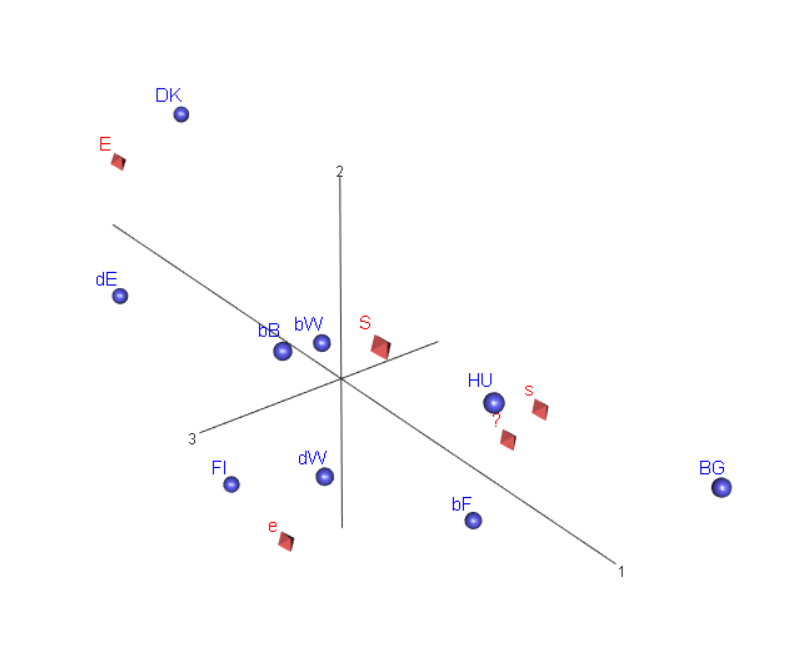

# Alkutoimia {-}

**PDF-tulostus oikuttelee Saksan ja Belgian aluejako-datan tai profiilitaulukon
luonnissa - toistaiseksi vain html-tuloste (24.10.2020)**

27.10.20 Vertailin testi-bookdownin ja capaperin asetuksia.
Poistin YAML-headerista viimeisen rivin "toc-depth: 2". Onko eri latex-engine?
Poistin ongelmia aiheuttavan taulukon (Saksan ja Belgian aluejako).
Eivät auttaneet pdf-tulostuksen ongelmaan.

Dokumettiin kuuluvat Rmd-tiedostot luetellaan eksplisiittisesti
_bookdown.yml-tiedostossa.

RefWorksistä eksportattu bib-tiedosto kannattaa avata ensin (Atomilla),
ja korjailla skandit jos niissä on vikaa.

Koodi näkyy Galkun tulosteessa (https://hirjus.github.io/Galku), jossa on myös
pitkiä listauksia muunnosten tarkistuksista ja kuvia eri versioina.

Koodi kopiodaan Galkusta, kommentoidaan pois tarkistuksia ja muita välitulostuksia.
Koodin ydinasiat koitetaan pitää samana kuin Galkussa, isommat muuutoksen ensin siellä
ja sitten tähän projektiin.

Raportti yhtenä html-tiedostona (https://hirjus.github.io/capaper/JH_capaper.html).

**

```{r jhpaketit, include=FALSE}
# 18.10.2020
library(rgl)
library(ca)
library(haven)
library(dplyr)
library(knitr)
library(tidyverse)
library(lubridate)
library(rmarkdown)
library(ggplot2)
library(furniture)
library(scales) # G_1_2 - kuva
library(reshape2)  # G_1_2 - kuva
library(printr) #19.5.18 taulukoiden ja matriisien tulostukseen
library(bookdown)
library(tinytex)
library(assertthat)

```

Gitbook-tulosteessa ei saa koodia "piilotettua", asetus "code_folding: hide" vaatii
teeman (theme). _output.yml - tiedostoon lisätty html_book - formaatti, siinä
voi tarvittaessa käyttää piilotusta.

 Versiointi: 0.0n aloittelua, 0.n jäsentely koko paperille, 1.n.n valmiimpaa tekstiä.

```{r include=FALSE}

# automatically create a bib database for R packages
knitr::write_bib(c(
  .packages(), 'bookdown', 'knitr', 'rmarkdown'
), 'packages.bib')

```

<!--chapter:end:index.Rmd-->

# Johdanto

**edit** Kirjoitetaan disposition pohjalta, keräillään kaikki yleiset
ca-luonnehdinnat yhteen paikkaan eli johdantoon.

**Mahdollisia lisäyksiä**


1. Tavoitteet, sisältö, rajaukset (jota voi myöhemmin täydentää)

2. Muutamat puutteet/rajaukset, onko kerrottava tässä?

- data: ei huomioida sitä, että otoskoot vaihtelevat aika paljon eli
"maapainot" eri suuruisia

- ei huomioida muitakaan otantaan liittyviä asioita (tämä ainakin
mainittava data-osuudessa)

- kuvaileva menetelmä, mutta mikä on tutkimusongelma? Sellainen pitäisi olla.

**zxy* Mitä on korrespondenssianalyysi? Muutamalla kappaleella. Yksi kappale
historiasta.


## Tutkielman tavoite)

**k** Tässä kerrotaan, miksi tämä työ on kirjoitettu. Esitellään menetelmä
käyttämällä oikeaa dataa. Täsmällisempi esitys sirotellaan esimerkkiaineiston
analyysin tulosten esittelyn lomaan. Pitäisikö tässä tuoda esille ns. "ranskalaisen
koulukunnan" matemaattisen perusteiden korostus, ja data-analyysin filosofia?
Ehkä ei, koska sen pohdinta ei ole pääasia. Se tietysti mainitaan, ja asiaa pohditaan.


**ks** Esitellään korrespondenssianalyysin käsitteet ja graafisen analyysin
periaatteet.

**zxy** -mitä ca on?
- dimensioiden vähentäminen ja visualisointi
- mihin dataan se soveltuu
- määrittele graafinen, deskriptiivinen, eksploratiivinen data-analyysi
- yksinkertainen ca, useamman muuttujan ca


**ks** Tämän voi tehdä yksinkertaisen korrespondenssianalyysin avulla. Yksinkertainen
kahden luokittelumuuttujan korrespondenssianalyysi antaa graafisen analyysin
"...perussäännöt tulkinnalle. Kaikki muut korrespondenssianalyysin muodot ovat
saman algoritmin soveltamista toisen tyyppiisiin datamatriiseihin, ja tulkintaa
sovelletaan vastaavasti (with the consequent adaptation of the interpretation)"
[@RefWorks:doc:5a857a44e4b0ed2d44664d84 , s. 437] .

**zxy** Miksi eksporatiivinen (määrittele!) ja deskriptiivinen (määrittele!)
menetelmä on esitettävä "in vivo", toiminnassa? Oppikirjoissa (viitteitä)
erityisesti MG on havainnolistanut CA:n matemaattista ja geometristä taustaa
synteettisillä aineistoilla. Turha kopioida tähän. Menetelmän ydin on
yksinkertaisen graafisen esityksen -- kartan -- avulla tulkita monimutkaisen
empiirisen aineiston muuttujien riippuvuuksia. Yhteyksiä ei tiivistetä
todennäköisyyspäättelyn kriteereillä tilastolliseen malliin, vaan deskripriivisen
analyysin hengessä esitellään koko aineisto. Mallin sijaan vähennetään ulottuvuuksia,
ja siinä menetetään informaatiota. Tavoitteena on säilyttää yleensä kaksiulotteisessa
kuvassa mahdollisimman suuri osa alkuperäisen datan vaihtelusta. Eksploratiivinen
data-analyysi on vuoropuhelua aineiston kanssa. Analyysiä tarkennetaan, rajataan
ja muokataan, kun aineisto paljastaa jotain kiinnostavaa tai yllättävää. Tästä
saa jonkinlaisen aasinsillan matriisiyhtälöiden puolustukseksi.
Saksan ja Belgian datan jakaminen on hyvä esimerkki, on "osattava tarttua"
menetelmän tulosmatriiseihin.


**k** esitystavan perustelu

- kenelle kirjoitettu? Menetelmästä kiinnostuneelle tilastotieteen ja data-analyysin
perusteet tuntevalle. R-ohjelmisto ei ole rajoitus, SPSS ja SAS sopivat
(SPSS - MG:llä kriittinen huomio "loose ends - paperissa" tai CAip-teorialiitteessä).

## Tärkeimmät lähteet ja ohjelmistot

**zxy** Tarvitaanko tämä, perustelu? Muutamat lähteet aivan keskeisiä, ja MG:n
kurssi pitää mainita.

### Lähteet

Michael Greenacre luennoi lyhyen kurssin korrespondenssianalyysistä Helsingin
yliopistossa keväällä 2017[@RefWorks:doc:5b6ef091e4b0984fd9b8c0ca]. Luennot ja
laskuharjoitukset perehdyttivät minut ensimmäistä kertaa tähän menetelmään, ja
kurssin materiaaleihin olen usein palannut. Niihin voi tutustua
[Moodle-palvelussa] (https://moodle.helsinki.fi) (käyttäjätunnus vaaditaan).
Greenacren kärsivällisesti kirjoitetut perusoppikirjat ovat tehneet menetelmää
laajasti tunnetuksi englantia lukeville.

Ranskalaisen lähestymistan perusoppikirja[@RefWorks:doc:5a857a43e4b0ed2d44664d75] (GDA-kirja?)
esittelee menetelmän matemaattiset perusteet.
Lyhyt historiallinen katsaus ja menetelmä soveltamisen perusajatusten esittely
valaisevat ranskaa taitamattomalle data-analyysin koulukunnan ideoita.
Kirjoittajat esittelevät perusteellisesti joitain empiirisiä tutkimuksia, ja
lyhyt mutta naseva matriisilaskennan kritiikki on hyvä panna merkille.

Korrespondenssianalyysi tuli osaksi suomalaista Survo-ohjelmistoa jo vuonna (**????**),
ja menetelmää on esitelty ainakin kahdessa oppikirjassa[@RefWorks:doc:5a857a44e4b0ed2d44664d95]
ja [@RefWorks:doc:5a857a44e4b0ed2d44664da4].


### Käytetyt ohjelmistot

**edit** Hyvin lyhyesti, lause tai pari. On oma liite tekneisestä ympäristöstä.

**zxy** R, ca-paketti. löytyy myös muita paketteja.
Rmarkdown[@RefWorks:doc:5b6b346fe4b0c619b11b8a3e], ja
bookdown ([@RefWorks:doc:5b6b36dde4b09b7ec442bf8b] ja toinen viite [@R-bookdown]).
Mikäs tuo jälkimmäinen on? PDF-lähdeluettelossa ei ole url-osoitteita.


**k** Helposti toistettavan tutkimukset periaatteet

1. Datastan perusmuunnokset ja muuttujatyypit tehdään kun data luetaan
R-ohjelmistoon.
2. Koodi selkeää ja dokumentoitua. Tärkeä lähde [@RefWorks:doc:5c3759c2e4b0085b307c82b5]
3. R, LaTeX, pandoc - versiot dokumentoidaan

Tarkemmin liittessä.

## Korrespondenssianalyysin historiaa

**k1** Tiivis esitys lähteineen. Historian voi aloittaa jo pari vuosikymmentä
vallineesta tilanteesta. CA on yksi deskriptiivinen (ei-tn-teoriaan perustuvaa
päättelyä) menetelmä muiden joukossa, eristyneisyys murtui hitaasti 80-luvun aikana.

**k2** Historialla on vain historiallista merkitystä. Kiinnostava juttu, mutta
aika laaja ja lavea.

**k3** Peruskäsitys monessa lähteessä (vihreä kirja, GDA-kirja jne.): synty ja
kukoistus Ranskassa, loistava eristys (splendid isolation), pikku hiljaa hyväksyntä.

Syiksi esitetään kaksoismuuria: abstrakti matemaattinen ("bourbakilainen") perusta
ja esitystapa ja kieli.

**k4** Mitä historiasta on hyvä tietää.
1. Matemaattinen perusta on "tosi", mutta onko menetelmän soveltaminen riippuvainen
siitä? Ei ole ollut.

2. Ristiriita data-analyyttisen/kuvailevan jne. lähestymistavan ja tilastollisen
mallintamisen välillä - on läsnä edelleen mutta turha korostaa. Myös tilastollisen
mallintamisen ja päättelyn sisällä on kiistoja, erilaisia näkemysiä ja kuiluja.

3. "Esoteerinen tieteenfilosofia"? Kiinnostava aihe, ehkä. Murgtag-sitaatti.


<!--chapter:end:01-johdanto.Rmd-->

# Data

**edit** Teksti vielä vanhoja muistiinpanoja.

## Datan luku ja perusmuokkaukset

### Maat ja muuttujat


```{r datasel-country1,  echo = FALSE, include = FALSE}
# include FALSE: ei koodia eikä tulostusta dokumenttiin - poistettava turhia
# välitulostuksia (18.10.2020)
# Aineiston rajaamisen kolme vaihetta (10.2018)
# 
# TIEDOSTOJEN NIMEÄMINEN
#
# R-datatiedostot .data - tarkenteella ovat osajoukkoja koko ISSP-datasta ISSP2012.data
# R-datatiedostot .dat - tarkenteella: mukana alkuperäisten muuttujien muunnoksia 
# (yleensä as_factor), alkuperäisissä muuttujissa mukana SPSS-tiedoston metadata.
#
# Luokittelumuuttujan tyyppi on datan lukemisen jälkeen yleensä merkkijono (char) 
# ja haven_labelled. 
#
# Muutetaan R-datassa ordinaali- tai  nominaaliasteikon muuttujat haven-paketin 
# as_factor - funktiolla faktoreiksi. R:n faktorityypin muuttujille voidaan tarvittaessa 
# määritellä järjestys, toistaiseksi niin ei tehdä (25.9.2018). 
#
# Muunnetun muuttujan rinnalla säilytetään SPSS-tiedostosta luettu muuttja, metatiedot säilyvät 
# alkuperäisessä.
#       
# R-datatiedostot joiden nimen loppuosa on muotoa *esim1.dat: käytetään analyyseissä
#
# 1. VALITAAN MAAT (25) -> ISSP2012jh1a.data. Muuttujat koodilohkossa datasel_vars1
#
# kolme maa-muuttujaa datassa. V3 erottelee joidenkin maiden alueita, V4 on koko 
# maan koodi ja C_ALPHAN on maan kaksimerkkinen tunnus.
#
# V3 - Country/ Sample ISO 3166 Code (see V4 for codes for whole nation states)
# V3 erot valituissa maissa
# 5601 BE-FLA-Belgium/ Flanders
# 5602 BE-WAL-Belgium/ Wallonia
# 5603 BE-BRU-Belgium/ Brussels
# 27601 DE-W-Germany-West
# 27602 DE-E-Germany-East
# 62001 PT-Portugal 2012: first fieldwork round (main sample)
# 62002 PT-Portugal 2012: second fieldwork round (complementary sample)
# Myös tämä on erikoinen, näyttää olevan vakio kun V4 = 826:
# 82601 GB-GBN-Great Britain
# Portugalissa ainestoa täydennettiin, koska siinä oli puutteita. Jako ei siis ole oleellinen,
# mutta muuut ovat. Tähdellä merkityt maat valitaan johdattelevaan esimerkkiin.
#
# Maat (25)
#
# 36 AU-Australia
# 40 AT-Austria
# 56 BE-Belgium*
# 100 BG-Bulgaria*
# 124 CA-Canada
# 191 HR-Croatia
# 203 CZ-Czech Republic
# 208 DK-Denmark*
# 246 FI-Finland*
# 250 FR-France
# 276 DE-Germany*
# 348 HU-Hungary*
# 352 IS-Iceland
# 372 IE-Ireland
# 428 LV-Latvia
# 440 LT-Lithuania
# 528 NL-Netherlands
# 578 NO-Norway
# 616 PL-Poland
# 620 PT-Portugal
# 643 RU-Russia
# 703 SK-Slovakia
# 705 SI-Slovenia
# 752 SE-Sweden
# 756 CH-Switzerland
# 826 GB-Great Britain and/or United Kingdom - jätetään pois jotta saadaan TOPBOT 
#                          -muuttuja mukaan (top-bottom self-placement) .(9.10.18)
# 840 US-United States - jätetään pois, jotta saadaan TOPBOT-muuttuja mukaan.(10.10.18)
#
# Belgian ja Saksan alueet:
#  V3
#  5601     BE-FLA-Belgium/ Flanders
#  5602     BE-WAL-Belgium/ Wallonia
#  5603     BE-BRU-Belgium/ Brussels
# 27601     DE-W-Germany-West
# 27602     DE-E-Germany-East
#
# Unkari (348) toistaiseksi mukana, mutta joissain kysymyksissä myös Unkarilla on 
# poikkeavia vastausvaihtoehtoja(HU_V18, HU_V19,HU_V20). Jos näitä muuttujia käytetään, 
# Unkari on parempi jättää pois. 
# 
#
# (25.4.2018) user_na  
# haven-paketin read_spss - funktiolla voi r-tiedostoon lukea myös SPSS:n sallimat kolme 
# (yleensä 7, 8, 9) tarkempaa koodia puuttuvalle tiedolle.
# "If TRUE variables with user defined missing will be read into labelled_spss objects. 
# If FALSE, the default, user-defined missings will be converted to NA"
# https://www.rdocumentation.org/packages/haven/versions/1.1.0/topics/read_spss
#
 
ISSP2012jh.data <- read_spss("data/ZA5900_v4-0-0.sav") #luetaan alkuperäinen data R- dataksi (df).

#str(ISSP2012jh.data)

incl_countries25 <- c(36, 40, 56,100, 124, 191, 203, 208, 246, 250, 276, 348, 352, 
                      372, 428, 440, 528, 578, 616, 620, 643, 703, 705, 752, 756)

#str(ISSP2012jh.data)
#str(ISSP2012jh.data) #61754 obs. of  420 variables - kaikki

ISSP2012jh1a.data <- filter(ISSP2012jh.data, V4 %in% incl_countries25)

#head(ISSP2012jh1a.data)
#str(ISSP2012jh1a.data) #34271 obs. of  420 variables, Espanja ja Iso-Britannia
#                       pois (9.10.2018)
# str(ISSP2012jh1a.data) # 32969 obs. of  420 variable, Espanja Iso-Britannia, 
#                        USA pois (10.10.2018)
#
# names() # muuttujen nimet
# Maakohtaiset muuttujat (kun on poikettu ISSP2012 - vastausvaihtoehdoista tms.) 
# on aineistossa eroteltu maatunnus-etuliitteellä (esimerkiksi ES_V7).
# Demografisissa ja muissa taustamuuttujissa suuri osa tiedoista on kerätty maa-
# kohtaisilla lomakkeilla. Vertailukelpoiset muuttujat on konstruoitu niistä.
# Muuttujia on 420, vain osa yhteisiä kaikille maille.

```

**maat luettu, sitten muuttujat**

```{r datasel-vars1, echo = FALSE,include = FALSE}
# include FALSE: ei koodia eikä tulostusta dokumenttiin - poistettava turhia
# välitulostuksia (18.10.2020)
# 2. VALITAAN MUUTTUJAT  -> ISSP2012jh1b.data. Maat valittu koodilohkossa datasel_country1
#
#
# Muuttujat on luokiteltu dokumentissa ZA5900_overview.pdf
# https://zacat.gesis.org/webview/index.jsp?object=http://zacat.gesis.org/obj/fStudy/ZA5900
# Study Description -> Other Study Description -> Related Materials
# 
#

# METADATA

metavars1 <- c("V1", "V2", "DOI")

#MAA - maakoodit ja maan kahden merkin tunnus

countryvars1 <- c("V3","V4","C_ALPHAN")

# SUBSTANSSIMUUTTUJAT - Attitudes towards family and gender roles (9)
#
# Yhdeksän kysymystä (lyhennetyt versiot, englanniksi), vastausvaihtoehdot Q1-Q2
#
# 1 = täysin samaa mieltä, 2 = samaa mieltä, 3 = ei samaa eikä eri mieltä, 
# 4 = eri mieltä, 5 = täysin eri mieltä
# 
# Q1a Working mother can have warm relation with child
# Q1b Pre-school child suffers through working mother
# Q1c Family life suffers through working mother
# Q1d Women’s preference: home and children
# Q1e Being housewife is satisfying
#
# Q2a Both should contribute to household income
# Q2b Men’s job is earn money, women’s job household
#
# Q3a Should women work: Child under school age 
# Q3b Should women work: Youngest kid at school
# 1= kokopäivätyö, 2 = osa-aikatyö, 3 = pysyä kotona, 8 = en osaa sanoa (can't choose), 9 = no answer
#
# Kysymysten Q3a ja Q3b eos-vastaus ei ole sama kuin "en samaa enkä eri  mieltä" (ns. neutraali 
# vaihtoehto), mutta kieltäytymisiä jne. (koodi 9) on aika vähän. Kolmessa 
# maassa ne on yhdistety: 
# (8 Can't choose, CA:can't choose+no answer, KR:don't know+refused, NL:don't know).
# Kun SPSS-tiedostosta ei ole tuotu puuttuvan tiedon tarkempaa luokittelua,
# erottelua ei voi tehdä.
#
# 
#

substvars1 <- c("V5","V6","V7","V8","V9","V10","V11","V12","V13") # 9 muuttujaa

# Nämä yhteiset muuttujat pois (maaspesifien muuttujien lisäksi) :
#
# "V14","V15","V16",  "V17","V18","HU_V18","V19","HU_V19","V20","HU_V20","V21",
# "V28","V29","V30","V31","V32","V33",# "V34", "V35", "V36", "V37", "V38", "V39",
# "V40", "V41", "V42", "V43", "V44", "V45", "V46", "V47", "V48", "V49", "V50", 
# "V51", "V52", "V53", "V54", "V55", "V56", "V57", "V58", "V59", "V60", "V61", 
# "V62", "V63", "V64", "V65", "V65a","V66", "V67"
#
#
# DEMOGRAFISET JA MUUT TAUSTAMUUTTUJAT (8)
#
# AGE, SEX
#
# DEGREE - Highest completed degree of education: Categories for international comparison. 
# Slightly re-arranged subset of ISCED-97
#
# 0 No formal education
# 1 Primary school (elementary school)
# 2 Lower secondary (secondary completed does not allow entry to university: obligatory school)
# 3 Upper secondary (programs that allow entry to university or programs that allow to entry 
#   other ISCED level 3 programs - designed to prepare students for direct entry into the labour market)
# 4 Post secondary, non-tertiary (other upper secondary programs toward labour market or technical formation)
# 5 Lower level tertiary, first stage (also technical schools at a tertiary level)
# 6 Upper level tertiary (Master, Dr.)
# 9 No answer, CH: don't know
# Yhdistelyt?
#
# MAINSTAT - main status: Which of the following best describes your current situation?
#
# 1 In paid work
# 2 Unemployed and looking for a job, HR: incl never had a job
# 3 In education
# 4 Apprentice or trainee
# 5 Permanently sick or disabled
# 6 Retired
# 7 Domestic work
# 8 In compulsory military service or community service
# 9 Other
# 99 No answer
# Armeijassa tai yhdyskuntapalvelussa muutamia, muutamissa maissa.Kategoriassa 9 
# on hieman väkeä. Yhdistetään 8 ja 9. Huom! Esim Puolassa ei yhtään eläkeläistä
# eikä kategoriaa 9, Saksassa ei ketään kategoriassa 9.
#
# TOPBOT - Top-Bottom self-placement (10 pt scale)
#
# "In our society, there are groups which tend to be towards the top and groups 
# which tend to be towards the bottom. Below is a scale that runs
# from the top to the bottom. Where would you put yourself on this scale?"
# Eri maissa hieman erilaisia kysymyksiä. 
#
# HHCHILDR - How many children in household: children between [school age] and
# 17 years of age
#
# 0 No children
# 1 One child
# 2 2 children
# 21 21 children
# 96 NAP (Code 0 in HOMPOP)
# 97 Refused
# 99 No answer
#
# Voisi koodata dummymuuttujaksi lapsia (1) - ei lapsia (0).
# Ranskan datassa on erittäin iso osa puuttuvia tietoja ( "99"", n. 20 %), myös 
# Austarlialla aika paljon. Sama tilanne myös muissa perheen kokoon liittyvissä 
# kysymyksissä.
#
# MARITAL - Legal partnership status 
#
# What is your current legal marital status?
# The aim of this variable is to measure the current 'legal' marital status '. 
# PARTLIV - muuttujassa on 'de facto' - tilanteen tieto parisuhteesta
#
# 1 Married
# 2 Civil partnership
# 3 Separated from spouse/ civil partner (still legally married/ still legally 
#   in a civil partnership)
# 4 Divorced from spouse/ legally separated from civil partner
# 5 Widowed/ civil partner died
# 6 Never married/ never in a civil partnership, single
# 7 Refused
# 8 Don't know
# 9 No answer
#
# URBRURAL - Place of living: urban - rural
#
# 1 A big city
# 2 The suburbs or outskirts of a big city
# 3 A town or a small city
# 4 A country village
# 5 A farm or home in the country
# 7 Other answer
# 9 No answer
# 1 ja 2 vaihtelevat aika paljon maittain, parempi laskea yhteen. Unkarista puuttuu 
# jostain syystä kokonaan vaihtoehto 5.  Vaihotehdon 7 on valinnut vain 4 vastaajaa Ranskasta.
# Yhdistetään 1 ja 2 = city, 3 = town, rural= 4, 5, 7
#

bgvars1 <- c( "SEX","AGE","DEGREE", "MAINSTAT", "TOPBOT", "HHCHILDR", "MARITAL", "URBRURAL")

#Valitaan muuttujat

jhvars1 <- c(metavars1,countryvars1, substvars1,bgvars1)

#jhvars1
ISSP2012jh1b.data <- select(ISSP2012jh1a.data, all_of(jhvars1)) 

# laaja aineisto - mukana havainnot joissa puuttuvia tietoja
# hauska detalji URBRURAL - muuttujan metatiedoissa viite jonkun työaseman hakemistoon
# str(ISSP2012jh1b.data) #32969 obs. of  23 variables 
# 
# SUBSTANSSIMUUTTUJAT
#
# $ V5      : 'haven_labelled' num  5 1 2 2 1 NA 2 4 2 2 ...
#  ..- attr(*, "label")= chr "Q1a Working mom: warm relationship with children as a not working mom"
#  ..- attr(*, "labels")= Named num  0 1 2 3 4 5 8 9
#
# ISSP2012jh1b.data$V5 näyttää tarkemmin rakenteen
#
# glimpse(ISSP2012jh1b.data)
# str(ISSP2012jh1b.data) # 32969 obs. of  23 variables

# Poistetaan havainnot, joissa ikä (AGE) tai sukupuolitieto puuttuu (5.7.2019)

ISSP2012jh1c.data <- filter(ISSP2012jh1b.data, (!is.na(SEX) & !is.na(AGE)))

str(ISSP2012jh1c.data) # 32823 obs. of  23 variables, 32969-32823 = 146
# TARKISTUS 8.6.20 dplyr 1.0.0-päivitys: havaintojen ja muuttujien määrä ok.

```

Substanssimuuttujat (9). Jos sukupuoli tai ikä puuttuu, havainto jätetään pois
(32969-32823 = 146), maa-muuttujassa ei puuttuvia tietoja ole. Lisäksi kuusi
taustamuuttujaa ( "SEX","AGE","DEGREE", "MAINSTAT", "TOPBOT", "HHCHILDR",
"MARITAL", "URBRURAL").


**Perusmuunnokset - viisi koodilohkoa**

Vaihe 1

```{r fct-vaihe1, echo = FALSE,include = FALSE}
# VAIHE 1 - muuttujat joissa ei ole puuttuvia tietoja

# vaihe 1.1 haven_labelled ja chr -> as_factor

ISSP2012jh1d.dat <- ISSP2012jh1c.data %>%
    mutate(maa = as_factor(C_ALPHAN), # ei puuttuvia, ei tyhjiä leveleitä
           maa3 = as_factor(V3),  # maakoodi, jossa aluejako joillan mailla
           sp1 = as_factor(SEX), # ei puuttuvia, tyhjä level "no answer" 999
         )


# C_ALPHAN - maa - maa3 tarkistuksia

# V3
# "Pulma" on järjestys. C_ALPHAN ("chr") on aakkosjärjestyksessä, kun luodaan
# maa = as_factor(C_ALPHAN) järjestys muuttuu (esiintymisjärjestys datassa?)
# maa3 muunnetaan maakoodista (haven_labelled' num), jonka

# str(ISSP2012jh1d.dat$maa) #Country Prefix ISO 3166 Code - alphanumeric
# attributes(ISSP2012jh1d.dat$maa) # ei tyhiä levels-arvoja, 25 levels
# ISSP2012jh1d.dat$maa %>% fct_unique()
# ISSP2012jh1d.dat$maa %>% fct_count() # summary kertoo samat tiedot (20.2.20)
# sum(is.na(ISSP2012jh1d.dat$maa)) # ei puuttuvia tietoja
# ISSP2012jh1d.dat$maa %>% summary() # mukana vain valitut 25 maata

# str(ISSP2012jh1d.dat$maa3)  #"Country/ Sample ISO 3166 Code
                            #(see V4 for codes for whole nation states)"
                            # 29 levels
# str(ISSP2012jh1d.dat$V3)

# attributes(ISSP2012jh1d.dat$maa3) # ei tyhiä levels-arvoja, 29 levels
# sum(is.na(ISSP2012jh1d.dat$maa3)) # nolla ei ole puuttuva tieto! (3.2.20)
# ISSP2012jh1d.dat$maa3 %>% fct_unique()
# ISSP2012jh1d.dat$maa3 %>% fct_count()
# Vain näissä on jaettu maan havainnot (3.2.20)
#
# [38] BE-FLA-Belgium/ Flanders
# [39] BE-WAL-Belgium/ Wallonia
# [40] BE-BRU-Belgium/ Brussels
# [41] DE-W-Germany-West
# [42] DE-E-Germany-East
# [43] PT-Portugal 2012: first fieldwork round (main sample)
# [44] PT-Portugal 2012: second fieldwork round (complementary sample)

# ISSP2012jh1d.dat$maa3 %>% fct_count() #miksi ei tulosta mitään? (3.2.2020)

# ISSP2012jh1d.dat$maa3 %>% summary()
# ISSP2012jh1d.dat$maa3 %>% fct_unique()
# maa3: 25 maata, havaintojen määrä. Poisjätetyissä havaintoja 0.
# glimpse(ISSP2012jh1d.dat$maa3)
# head(ISSP2012jh1d.dat$maa3)
# length(levels(ISSP2012jh1d.dat$maa3))

# C_ALPHAN alkuperäinen järjestys, maa aakkosjärjestyssä  (2.2.20)
#
# Huom1: Myös merkkijonomuuttujaa C_ALPHAN tarvitaan jatkossa.
#
# Huom2: kun dataa rajataan, on tarkistettava ja tarvittaessa poistettava
# "tyhjät" R-factor - muuttujan "maa" luokat (3.2.2020)


# vaihe 1.2 tyhjät luokat (levels) pois faktoreista

ISSP2012jh1d.dat <- ISSP2012jh1d.dat %>%
    mutate(sp = fct_drop(sp1),
           maa3 = fct_drop(maa3)
           )

#  maa3 - tarkistuksia

# str(ISSP2012jh1d.dat$maa3)  # 29 levels
# attributes(ISSP2012jh1d.dat$maa3)
#sum(is.na(ISSP2012jh1d.dat$maa3)) # nolla ei ole puuttuva tieto! (3.2.20)
# ISSP2012jh1d.dat$maa3 %>% summary()
# ISSP2012jh1d.dat$maa3 %>% fct_unique()
# ISSP2012jh1d.dat$maa3 %>% fct_count()
#
# str(ISSP2012jh1d.dat$C_ALPHAN)
# attributes(ISSP2012jh1d.dat$C_ALPHAN)

# TESTAUKSIA
# 
# ISSP2012jh1d.dat %>% tableX(C_ALPHAN, maa)
# ISSP2012jh1d.dat %>% tableX(C_ALPHAN, maa3)
# ISSP2012jh1d.dat %>% tableX(maa, maa3)
# ISSP2012jh1d.dat %>% tableX(V3, maa3)

# sp, sp1, SEX - tarkistuksia
# 
# ISSP2012jh1d.dat$sp %>% fct_count()
# ISSP2012jh1d.dat$sp %>% fct_count()
# ISSP2012jh1d.dat %>% tableX(SEX,sp1)
# ISSP2012jh1d.dat %>% tableX(SEX,sp)
# ISSP2012jh1d.dat %>% tableX(sp1,sp)

# vaihe 1.3 uudet "faktorilabelit"
ISSP2012jh1d.dat <- ISSP2012jh1d.dat %>%
    mutate(sp =
          fct_recode(sp,
            "m" = "Male",
            "f" = "Female")
            )

# Tarkistuksia

# ISSP2012jh1d.dat$sp %>% fct_unique()
# ISSP2012jh1d.dat$sp %>% fct_count()
# ISSP2012jh1d.dat$sp %>% summary()

# AGE -> ika
ISSP2012jh1d.dat$ika <- ISSP2012jh1d.dat$AGE

# Tarkistuksia
attributes(ISSP2012jh1d.dat$ika) # tyhjä level "No answer"
# str(ISSP2012jh1d.dat$ika)
ISSP2012jh1d.dat$ika %>% summary()

ISSP2012jh1d.dat %>%
tableC(AGE, ika,cor_type = "pearson", na.rm = FALSE, rounding = 5,
       output = "text", booktabs = TRUE, caption = NULL, align = NULL,
       float = "htb") %>% kable()

# Ikäjakauma - ei tarvita (18.10.2020)
#
# ISSP2012jh1d.dat$ika %>% hist(main = "ISSP 2012: vastaajan ikä")

```

Vaihe 2
Vaihe 2.1

```{r fct-vaihe21, echo = FALSE, include = FALSE}
# Substanssi- ja taustamuuttujat R-faktoreiksi
ISSP2012jh1d.dat <- ISSP2012jh1d.dat %>%
    mutate(Q1a1 = as_factor(V5), #labels
            Q1b1 = as_factor(V6),
            Q1c1 = as_factor(V7),
            Q1d1 = as_factor(V8),
            Q1e1 = as_factor(V9),
            Q2a1 = as_factor(V10),
            Q2b1 = as_factor(V11),
            Q3a1 = as_factor(V12), #labels = vastQ3_labels (W,w,H)
            Q3b1 = as_factor(V13), #labels = vastQ3_labels
            edu1 = as_factor(DEGREE),
            msta1 = as_factor(MAINSTAT),
            sosta1 = as_factor(TOPBOT),
            nchild1 = as_factor(HHCHILDR),
            lifsta1 = as_factor(MARITAL),
            urbru1 = as_factor(URBRURAL)
           )

# Muuttujat Q1a1...urbru1 ovat apumuuttujia, joissa on periaatteessa kaikki SPSS-
# tiedostosta siirtyvä metatieto. Poikkeus on SPSS:n kolme tarkentavaa koodia
# puuttuvalle tiedolle, ne saisi mukaan read_spss - parametrin avulla (user_na=TRUE)
#

# Tarkistusksia
# ISSP2012jh1d.dat %>% summary()

# ISSP2012jh1d.dat %>%
#    select(Q1a1, Q1b1, Q1c1,Q1d1,Q1e1, Q2a1, Q2b1, Q3a1,Q3b1) %>%
#    summary()
#
# ISSP2012jh1d.dat %>%
#    select(edu1,msta1, sosta1, nchild1, lifsta1, urbru1) %>%
#    summary()


# Substanssimuuttujat - ristiintaulukoinnit riittävät (6.2.20)

# ISSP2012jh1d.dat$Q1a1 %>% fct_count()
# ISSP2012jh1d.dat$Q1b1 %>% fct_count()
# ISSP2012jh1d.dat$Q1c1 %>% fct_count()
# ISSP2012jh1d.dat$Q1d1 %>% fct_count()
# ISSP2012jh1d.dat$Q1e1 %>% fct_count()
# ISSP2012jh1d.dat$Q2a1 %>% fct_count()
# ISSP2012jh1d.dat$Q2b1 %>% fct_count()
# ISSP2012jh1d.dat$Q3a1 %>% fct_count()
#ISSP2012jh1d.dat$Q3b1 %>% fct_count()

# Taustamuuttujat - ristiintaulukoinnit riittävät (6.2.20)

# ISSP2012jh1d.dat$edu1 %>% fct_count()
# ISSP2012jh1d.dat$msta1 %>% fct_count()
# ISSP2012jh1d.dat$sosta1 %>% fct_count()
# ISSP2012jh1d.dat$nchild1 %>% fct_count()
# ISSP2012jh1d.dat$lifsta1 %>% fct_count()
# ISSP2012jh1d.dat$urbru1 %>% fct_count()

```

Vaihe 2.2

```{r fct-vaihe22, echo = FALSE, include = FALSE}
# Poistetaan tyhjät luokat muuttujista

ISSP2012jh1d.dat <- ISSP2012jh1d.dat %>%
    mutate(Q1a = fct_drop(Q1a1),
           Q1b = fct_drop(Q1b1),
           Q1c = fct_drop(Q1c1),
           Q1d = fct_drop(Q1d1),
           Q1e = fct_drop(Q1e1),
           Q2a = fct_drop(Q2a1),
           Q2b = fct_drop(Q2b1),
           Q3a = fct_drop(Q3a1),
           Q3b = fct_drop(Q3b1),
           edu = fct_drop(edu1),
           msta = fct_drop(msta1),
           sosta = fct_drop(sosta1),
           nchild = fct_drop(nchild1),
           lifsta = fct_drop(lifsta1),
           urbru = fct_drop(urbru1)

    )
# Tarkistuksia 1

# ISSP2012jh1d.dat %>% summary()
# ISSP2012jh1d.dat %>%
#    select(Q1a, Q1b, Q1c, Q1d, Q1e,Q2a,Q2b,Q3a, Q3b) %>%
#    str()
#ISSP2012jh1d.dat %>%
#    select(Q1a1, Q1b1, Q1c1, Q1d1, Q1e1,Q2a1,Q2b1,Q3a1, Q3b1) %>%
#    str()
#ISSP2012jh1d.dat %>%
#    select(edu, msta, sosta, nchild,lifsta, urbru) %>%
#    str()
#ISSP2012jh1d.dat %>%
#    select(edu1, msta1, sosta1, nchild1,lifsta1, urbru1) %>%
#    str()

# Tarkistuksia 2 - ristiintaulukointeja
# Substanssimuuttujat

# ISSP2012jh1d.dat %>% tableX(Q1a,Q1a1)
# ISSP2012jh1d.dat %>% tableX(Q1b,Q1b1)
# ISSP2012jh1d.dat %>% tableX(Q1c,Q1c1)
# ISSP2012jh1d.dat %>% tableX(Q1d,Q1d1)
# ISSP2012jh1d.dat %>% tableX(Q1e,Q1e1)
# ISSP2012jh1d.dat %>% tableX(Q2a,Q2a1)
# ISSP2012jh1d.dat %>% tableX(Q2b,Q2b1)
# ISSP2012jh1d.dat %>% tableX(Q3a,Q3a1)
# ISSP2012jh1d.dat %>% tableX(Q3b,Q3b1)

# Taustamuuttujat

# ISSP2012jh1d.dat %>% tableX(edu,edu1)
# ISSP2012jh1d.dat %>% tableX(msta,msta1)
# ISSP2012jh1d.dat %>% tableX(sosta,sosta1)
# ISSP2012jh1d.dat %>% tableX(nchild,nchild1)
# ISSP2012jh1d.dat %>% tableX(lifsta,lifsta1)
# ISSP2012jh1d.dat %>% tableX(urbru,urbru1)

```

Vaihe 2.3

```{r fct-vaihe23, echo = FALSE, include = FALSE}
# Uusi muuttuja, jossa NA-arvot ovat mukana muuttujan uutena luokkana. Muuttujat
# nimetään Q1a -> Q1am.

ISSP2012jh1d.dat <- ISSP2012jh1d.dat %>%
    mutate(Q1am = fct_explicit_na(Q1a, na_level = "missing"),
           Q1bm = fct_explicit_na(Q1b, na_level = "missing"),
           Q1cm = fct_explicit_na(Q1c, na_level = "missing"),
           Q1dm = fct_explicit_na(Q1d, na_level = "missing"),
           Q1em = fct_explicit_na(Q1e, na_level = "missing"),
           Q2am = fct_explicit_na(Q2a, na_level = "missing"),
           Q2bm = fct_explicit_na(Q2b, na_level = "missing"),
           Q3am = fct_explicit_na(Q3a, na_level = "missing"),
           Q3bm = fct_explicit_na(Q3b, na_level = "missing"),
           edum = fct_explicit_na(edu, na_level = "missing"),
           mstam = fct_explicit_na(msta, na_level = "missing"),
           sostam = fct_explicit_na(sosta, na_level = "missing"),
           nchildm = fct_explicit_na(nchild, na_level = "missing"),
           lifstam = fct_explicit_na(lifsta, na_level = "missing"),
           urbrum = fct_explicit_na(urbru, na_level = "missing"),
           )
# Tarkistuksia 3

# ISSP2012jh1d.dat %>%
#    select(Q1am, Q1bm, Q1cm, Q1dm, Q1em, Q2am, Q2bm, Q3am, Q3bm) %>%
#    summary()
#
#ISSP2012jh1d.dat %>%
#    select(edum,mstam, sostam,nchildm,lifstam, urbrum) %>%
#    summary()
#
#ISSP2012jh1d.dat %>%
#    select(Q1am, Q1bm, Q1cm, Q1dm, Q1em, Q2am, Q2bm, Q3am, Q3bm) %>%
#    str()
#
#ISSP2012jh1d.dat %>%
#    select(edum,mstam, sostam,nchildm,lifstam, urbrum) %>%
#    str()

# Taustamuuttuja, puuttuva tieto mukana - ristiintaulkointeja

# ISSP2012jh1d.dat$edum %>% fct_count()
# ISSP2012jh1d.dat$mstam %>% fct_count()
# ISSP2012jh1d.dat$sostam %>% fct_count()
# ISSP2012jh1d.dat$nchildm %>% fct_count()
# ISSP2012jh1d.dat$lifstam %>% fct_count()
# ISSP2012jh1d.dat$urbrum %>% fct_count()

# Substanssimuuttujat, puuttuva tieto mukana  - ristiintaulkointeja

# ISSP2012jh1d.dat$Q1am %>% fct_count()
# ISSP2012jh1d.dat$Q1bm %>% fct_count()
# ISSP2012jh1d.dat$Q1cm %>% fct_count()
# ISSP2012jh1d.dat$Q1dm %>% fct_count()
# ISSP2012jh1d.dat$Q1em %>% fct_count()
# ISSP2012jh1d.dat$Q2am %>% fct_count()
# ISSP2012jh1d.dat$Q2bm %>% fct_count()
# ISSP2012jh1d.dat$Q3am %>% fct_count()
# ISSP2012jh1d.dat$Q3bm %>% fct_count()

```

Vaihe 2.4

```{r fct-vaihe24, echo = FALSE, include = FALSE}
# Vaihe 2.4.1

# Q1a - Q1e,Q2a, Q2b  Viisi vastausvaihtoehtoa - ei eksplisiittistä NA-tietoa("missing")
# Q3a - Q3b  kolme vastausvaihtoehtoa

ISSP2012jh1d.dat <- ISSP2012jh1d.dat %>%
    mutate(Q1a = fct_recode(Q1a,
                        "S" = "Strongly agree",
                        "s" = "Agree",
                        "?" = "Neither agree nor disagree",
                        "e" = "Disagree",
                        "E"= "Strongly disagree"),
            Q1b = fct_recode(Q1b,
                      "S" = "Strongly agree",
                      "s" = "Agree",
                      "?" = "Neither agree nor disagree",
                      "e" = "Disagree",
                      "E" = "Strongly disagree"),
           Q1c = fct_recode(Q1c,
                           "S" = "Strongly agree",
                           "s" = "Agree",
                           "?" = "Neither agree nor disagree",
                           "e" = "Disagree",
                           "E" = "Strongly disagree"),
           Q1d = fct_recode(Q1d,
                           "S" = "Strongly agree",
                           "s" = "Agree",
                           "?" = "Neither agree nor disagree",
                           "e" = "Disagree",
                           "E" = "Strongly disagree"),
           Q1e = fct_recode(Q1e,
                           "S" = "Strongly agree",
                           "s" = "Agree",
                           "?" = "Neither agree nor disagree",
                           "e" = "Disagree",
                           "E" = "Strongly disagree"),
          Q2a = fct_recode(Q2a,
                           "S" = "Strongly agree",
                           "s" = "Agree",
                           "?" = "Neither agree nor disagree",
                           "e" = "Disagree",
                           "E" = "Strongly disagree" ),
          Q2b = fct_recode(Q2b,
                           "S" = "Strongly agree",
                           "s" = "Agree",
                           "?" = "Neither agree nor disagree",
                           "e" = "Disagree",
                           "E" = "Strongly disagree"),
          Q3a = fct_recode(Q3a,
                          "W" = "Work full-time",
                          "w" = "Work part-time",
                          "H" = "Stay at home" ),
          Q3b = fct_recode(Q3b,
                           "W" = "Work full-time",
                           "w" = "Work part-time",
                           "H" = "Stay at home" )
                        )


# Tarkistuksia 1
# ISSP2012jh1d.dat %>%
#    select(Q1a, Q1b, Q1c, Q1d, Q1e, Q2a, Q2b, Q3a, Q3b) %>%
#    summary()


# Vaihe 2.4.2 - muuttujassa eksplisiittinen NA-tieto
ISSP2012jh1d.dat <- ISSP2012jh1d.dat %>%
    mutate(Q1am = fct_recode(Q1am,
                            "S" = "Strongly agree",
                            "s" = "Agree",
                            "?" = "Neither agree nor disagree",
                            "e" = "Disagree",
                            "E" = "Strongly disagree",
                            "P" = "missing"),
           Q1bm = fct_recode(Q1bm,
                           "S" = "Strongly agree",
                           "s" = "Agree",
                           "?" = "Neither agree nor disagree",
                           "e" = "Disagree",
                           "E" = "Strongly disagree",
                           "P" = "missing"),
           Q1cm = fct_recode(Q1cm,
                           "S" = "Strongly agree",
                           "s" = "Agree",
                           "?" = "Neither agree nor disagree",
                           "e" = "Disagree",
                           "E" = "Strongly disagree",
                           "P" = "missing"),
           Q1dm = fct_recode(Q1dm,
                           "S" = "Strongly agree",
                           "s" = "Agree",
                           "?" = "Neither agree nor disagree",
                           "e" = "Disagree",
                           "E" = "Strongly disagree",
                           "P" = "missing"),
           Q1em = fct_recode(Q1em,
                           "S" = "Strongly agree",
                           "s" = "Agree",
                           "?" = "Neither agree nor disagree",
                           "e" = "Disagree",
                           "E" = "Strongly disagree",
                           "P" = "missing"),
           Q2am = fct_recode(Q2am,
                            "S" = "Strongly agree",
                            "s" = "Agree",
                            "?" = "Neither agree nor disagree",
                            "e" = "Disagree",
                            "E" = "Strongly disagree",
                            "P" = "missing"),
           Q2bm = fct_recode(Q2bm,
                            "S" = "Strongly agree",
                            "s" = "Agree",
                            "?" = "Neither agree nor disagree",
                            "e" = "Disagree",
                            "E" = "Strongly disagree",
                            "P" = "missing"),
           Q3am = fct_recode(Q3am,
                            "W" = "Work full-time",
                            "w" = "Work part-time",
                            "H" = "Stay at home",
                            "P" = "missing"),
           Q3bm = fct_recode(Q3bm,
                            "W" = "Work full-time",
                            "w" = "Work part-time",
                            "H" = "Stay at home",
                            "P" = "missing")
               )

# Tarkistuksia 4

# ISSP2012jh1d.dat %>%
#    select(Q1am, Q1bm, Q1cm, Q1dm, Q1em, Q2am, Q2bm, Q3am, Q3bm) %>%
#    summary()

# Tarkistuksia 5

# Substanssimuuttuja

# ISSP2012jh1d.dat %>%
#    tableX(Q1a,Q1am)
#
# ISSP2012jh1d.dat %>%
#    tableX(Q1b,Q1bm)
#
# ISSP2012jh1d.dat %>%
#    tableX(Q1c,Q1cm)
#
# ISSP2012jh1d.dat %>%
#    tableX(Q1d,Q1dm)
#
# ISSP2012jh1d.dat %>%
#    tableX(Q1e,Q1em)
#
# ISSP2012jh1d.dat %>%
#    tableX(Q2a,Q2am)
#
# ISSP2012jh1d.dat %>%
#    tableX(Q2b,Q2bm)
#
# ISSP2012jh1d.dat %>%
#    tableX(Q3a,Q3am)
#
# ISSP2012jh1d.dat %>%
#    tableX(Q3b,Q3bm)
#
# ISSP2012jh1d.dat %>% 
#    tableX(Q3am,Q3a)
#
# ISSP2012jh1d.dat$Q3a %>% levels()
# ISSP2012jh1d.dat$Q3am %>% levels()

# Taustamuuttujat - ristiintaulukointeja

# ISSP2012jh1d.dat %>%
#    tableX(edu, edum)
# ISSP2012jh1d.dat %>%
#    tableX(msta, mstam)
# ISSP2012jh1d.dat %>%
#    tableX(sosta, sostam)
# ISSP2012jh1d.dat %>%
#    tableX(nchild,nchildm)
# ISSP2012jh1d.dat %>%
#    tableX(lifsta, lifstam)
# ISSP2012jh1d.dat %>%
#    tableX(urbru, urbrum)

```

Muunnosten testaus, varmistetaan että muuttujat ovat sitä mitä halutaan.

```{r fct-testaus1, warning=TRUE,echo=FALSE,include=FALSE}
# (16.9.2020) Testaus uusille muuttujille
# Koodilohkoissa on jo testattu taulukoimalla muuttujia. Tässä varmistetaan, että
# muuttujat pysyvät sellaisina millaisiksi ne on luotu.

# ika - onpas hankala testata !
# Min. 1st Qu.  Median    Mean 3rd Qu.    Max.
# 15.00   36.00   50.00   49.52   63.00  102.00
# ikatest <- ISSP2012jh1d.dat$ika %>% summary()
#   ikatest <- ikatest[2,]
#validate_that(are_equal(ikatest, c(15, 36, 50, 49.5, 63, 102)))
#str(ISSP2012jh1d.dat)
#ISSP2012jh1d.dat %>% 

# substanssimuuttujat 1
# Q1a, Q1b, Q1c, Q1d, Q1e, Q2a, Q2b, Q3a, Q3b (r. 423->)

validate_that(length(levels(ISSP2012jh1d.dat$Q1a)) == 5)
validate_that(are_equal(levels(ISSP2012jh1d.dat$Q1a),
               c("S", "s", "?", "e", "E")))
validate_that(length(levels(ISSP2012jh1d.dat$Q1b)) == 5)
validate_that(are_equal(levels(ISSP2012jh1d.dat$Q1b),
               c("S", "s", "?", "e", "E")))
validate_that(length(levels(ISSP2012jh1d.dat$Q1c)) == 5)
validate_that(are_equal(levels(ISSP2012jh1d.dat$Q1c),
               c("S", "s", "?", "e", "E")))
validate_that(length(levels(ISSP2012jh1d.dat$Q1d)) == 5)
validate_that(are_equal(levels(ISSP2012jh1d.dat$Q1d),
               c("S", "s", "?", "e", "E")))
validate_that(length(levels(ISSP2012jh1d.dat$Q1e)) == 5)
validate_that(are_equal(levels(ISSP2012jh1d.dat$Q1e),
               c("S", "s", "?", "e", "E")))
validate_that(length(levels(ISSP2012jh1d.dat$Q2a)) == 5)
validate_that(are_equal(levels(ISSP2012jh1d.dat$Q2a),
               c("S", "s", "?", "e", "E")))
validate_that(length(levels(ISSP2012jh1d.dat$Q2b)) == 5)
validate_that(are_equal(levels(ISSP2012jh1d.dat$Q2b),
               c("S", "s", "?", "e", "E")))

# substanssimuuttujat 2

validate_that(length(levels(ISSP2012jh1d.dat$Q3a)) == 3)
validate_that(are_equal(levels(ISSP2012jh1d.dat$Q3a),
               c("W", "w", "H")))
validate_that(length(levels(ISSP2012jh1d.dat$Q3b)) == 3)
validate_that(are_equal(levels(ISSP2012jh1d.dat$Q3b),
               c("W", "w", "H")))


# substanssimuuttujat, puuttuva tieto muuttujan arvona
# Q1am, Q1bm, Q1cm, Q1dm, Q1em, Q2am, Q2bm, Q3am, Q3bm

validate_that(length(levels(ISSP2012jh1d.dat$Q1am)) == 6)
validate_that(are_equal(levels(ISSP2012jh1d.dat$Q1am),
               c("S", "s", "?", "e", "E", "P")))
validate_that(length(levels(ISSP2012jh1d.dat$Q1bm)) == 6)
validate_that(are_equal(levels(ISSP2012jh1d.dat$Q1bm),
               c("S", "s", "?", "e", "E", "P")))
validate_that(length(levels(ISSP2012jh1d.dat$Q1cm)) == 6)
validate_that(are_equal(levels(ISSP2012jh1d.dat$Q1cm),
               c("S", "s", "?", "e", "E", "P")))
validate_that(length(levels(ISSP2012jh1d.dat$Q1dm)) == 6)
validate_that(are_equal(levels(ISSP2012jh1d.dat$Q1dm),
               c("S", "s", "?", "e", "E", "P")))
validate_that(length(levels(ISSP2012jh1d.dat$Q1em)) == 6)
validate_that(are_equal(levels(ISSP2012jh1d.dat$Q1em),
               c("S", "s", "?", "e", "E", "P")))
validate_that(length(levels(ISSP2012jh1d.dat$Q2am)) == 6)
validate_that(are_equal(levels(ISSP2012jh1d.dat$Q2am),
               c("S", "s", "?", "e", "E", "P")))
validate_that(length(levels(ISSP2012jh1d.dat$Q2bm)) == 6)
validate_that(are_equal(levels(ISSP2012jh1d.dat$Q2bm),
               c("S", "s", "?", "e", "E", "P")))

validate_that(length(levels(ISSP2012jh1d.dat$Q3am)) == 4)
validate_that(are_equal(levels(ISSP2012jh1d.dat$Q3am),
               c("W", "w", "H", "P")))
validate_that(length(levels(ISSP2012jh1d.dat$Q3bm)) == 4)
validate_that(are_equal(levels(ISSP2012jh1d.dat$Q3bm),
               c("W", "w", "H", "P")))

# taustamuuttujat puuttuvilla tiedoilla ja ilman
# testataan vain tasojen määrä, ei labeleita jotka ovat 
# alkuperäisestä datasta.

# edu, edum Huom! Koulutustasoluokitus alkuperäisessä
# datassa 0-6 (ei muodollista koulusta - korkeampi kolmas aste (maisteri, tohtori)
# R-faktorissa 1-7

validate_that(length(levels(ISSP2012jh1d.dat$edu)) == 7)
validate_that(length(levels(ISSP2012jh1d.dat$edum)) == 8)

# msta, mstam
validate_that(length(levels(ISSP2012jh1d.dat$msta)) == 9)
validate_that(length(levels(ISSP2012jh1d.dat$mstam)) == 10)

# sosta, sostam
validate_that(length(levels(ISSP2012jh1d.dat$sosta)) == 10)
validate_that(length(levels(ISSP2012jh1d.dat$sostam)) == 11)

# nchild, ncildm
validate_that(length(levels(ISSP2012jh1d.dat$nchild)) == 11)
validate_that(length(levels(ISSP2012jh1d.dat$nchildm)) == 12)

# lifsta, lifstam
validate_that(length(levels(ISSP2012jh1d.dat$lifsta)) == 6)
validate_that(length(levels(ISSP2012jh1d.dat$lifstam)) == 7)

# urbru, urbrum
validate_that(length(levels(ISSP2012jh1d.dat$urbru)) == 5)
validate_that(length(levels(ISSP2012jh1d.dat$urbrum)) == 6)


```

**zxy** Voisi miettiä paremman otsikon. Galku-paperin alusta on lisäilty
viitteitä Refworksiin, mutta hieman  hanklaa. www.gesis.org - sivusto on aika
sekava. Virallinen (heidän määrittelemä) sitaatti löytyy, ja linkkejä. Tässä
voisi ehkä käyttää alaviitettä, jossa tarjoaisi linkit? Tai ihan oma lyhyt kappale?
Alla virallinen viite, ja tässä kaksi muuta ([RefWorks:doc:5b6c7f6ce4b0e4e15164ab1a]
ja [RefWorks:doc:5b6c7debe4b0e4e15164ab00]). Löytyy myös
seurantaraportti([RefWorks:doc:5b155e0ce4b044dfd738458f]).
**viitteet pois- ehkä tekstiin linkkeinä?**


**k** ISSP (International social survey) on tehnyt laajoja kansainvälisiä kyselytutkimuksia eri teemoista. Yksi teemoista on perhe ja muuttuvat (sosiaalisesti määräytyvät) sukupuoliroolit [@RefWorks:doc:5b6c7b0de4b0fd36f5bb4c2a].

**zxy** Miksi data on kiinnostava sisällöllisesti? Viite Kantola (HS). Lisäksi laadukas, usealta vuodelta, tarkasti dokumentoitu.

**ks**

**zxy** Miksi data sovelutuu korrespondenssianalyysin esittelyyn? Iso ja monimutkainen (kansainvälinen, datan laaut? kts. Blasius-viite alempana), sisällölliset muuttuja nominaaliasteikolla (kysymyspatterit, Likert), laadukas hyvin dokumentoitu aineisto.

**zxy** Onko itse asia kiinnostava? (Kantolan kolumni, HS).

**ks** Kokoava kappale, ja sen perään tarkentavat

  
  **ks1**
  
  **ks2**
  
  **ks-n**
  
**zxy** Aineiston ongelmat ja puutteet (tavanomaisten surveyaineistojen ongelmien
lisäksi, erityisesti vastauskadon). Kato erikseen, oikeastaan hyvä juttu koska
CA soveltuu sen analyysiin.

**zxy** Aineisto kuvattava **sisällön** (mitä asiaa, ilmiötä, tällä datalla
halutaan valaista), **para- ja metadatan** näkökulmasta (tai ainakin kerrottava
mitä on saatavilla). Kolmanneksi aineiston "tilastotieteellinen olemus":
otanta-asetelmat, kansalliset versioinnit, harmonisoinnit (esim. puoluekenttä
vertailukelpoiseksi).


1. Kysymyksissä maakohtaisia eroja. Osa perusteltuja, on haluttu tarkentaa tai
muuten hifistellä. Osa kummallisa, erityisesti neutraalin vaihtoehdon puuttuminen
(Espanja). Nämä maat jätetään pois.

2. Datassa painot "maatasolle", otanta sun muu kuvattu tarkasti dokumentaatiossa.
Jos tutkimusongelma on maiden erojen analyysi, mitään vertailupainoja ei ole
käytössä. Otoskoko on paino. MG oikaisee ja ja oikaisee myös sukupuolien osuudet.

  

## Aineiston kuvailu (tietosisältö)

**ks** "Perhe, työ ja sukupuoliroolit" tutkimuksen teemat, tarkoitus. **Paras**
lähde Yhteiskuntatieteellisen tietoarkiston palvelu
(https://services.fsd.uta.fi/catalogue/FSD2820?tab=summary&study_language=fi).


## Aineiston rajaaminen maat ja muuttujat

**k** maat, samankaltaisia, data saatavilla kiinnostavista muuttujista

**k** muuttujat. Laajasti käyetty, valittu sopiva kysymyspatteri asenteista naisten
työssäkäyntiin ja joitain taustamuuttujia. Korrespondenssianalyysi on hyvä menetelmä
aineiston analyysiin: monimutkainen ja laaaja, paljon luokitteluasteikon muuttujia,
"akvaariositaatti" tähän.

**kysymykset**

**k** Taulukon \@ref(tab:vartable1) kysymysten lyhyet versiot ovat datassa mukana.
Sarakkeessa "muuttuja" on alkuperäisen aineiston muuttujanimi,
kysymyksen tunnus on valittuun dataan luotu muuttujanimi. Auttaa vertailemaan tätä
tutkielmaa moniin ISSP-datalla tehtyihin analyyseihin.


```{r vartable1, echo=FALSE, include=TRUE}
# Muuttuja taulukkona - karkea tapa
# HUOM! Taulkot ovat hankalia, kun tulostus halutaan pdf- ja html- formaattiin
# Kysymyste pitkät versiot on siksi esitetty suomenkielisen lomakkeen kuvana.

tabVarnames <- c(substvars1,bgvars1) # muuttujanimet muuttujille

# Kysymysten lyhyet versiot englanniksi
tabVarDesc <- c("Q1a Working mother can have warm relation with child ",
                "Q1b Pre-school child suffers through working mother",
                "Q1c Family life suffers through working mother",
                "Q1d Women’s preference: home and children",
                "Q1e Being housewife is satisfying",
                "Q2a Both should contribute to household income",
                "Q2b Men’s job is earn money, women’s job household",
                "Q3a Should women work: Child under school age",
                "Q3b Should women work: Youngest kid at school",
                "Respondents age ",
                "Respondents gender",
                "Highest completed degree of education: Categories for international comparison",
                "Main status: work, unemployed, in education...",
                "Top-Bottom self-placement (10 pt scale)",
                "How many children in household: children between [school age] and 17 years of age",
                "Legal partnership status: married, civil partership...",
                "Place of living: urban - rural"
              )
#tabVarDesc

# Taulukko

# luodaan df - varoitus: data_frame() is deprecated, use tibble” (4.2.20),
# vaihdetaan tibbleen (21.2.20)

# jhVarTable1.df <- data_frame(tabVarnames,tabVarDesc) OLD
jhVarTable1.tbl <- tibble(tabVarnames,tabVarDesc)
cols_jhVarTable1 <- c("muuttuja","kysymyksen tunnus, lyhennetty kysymys")
colnames(jhVarTable1.tbl) <- cols_jhVarTable1
#str(jhVarTable1.tbl)
# Lyhyet kysymykset englanniksi

knitr::kable(jhVarTable1.tbl, booktab = TRUE,
               caption = "ISSP2012:Työelämä ja perhearvot - kysymykset")

```

**k** Kyselylomakkeilla kysymykset olivat hieman pidempiä, kuvassa \@ref(fig:suom-kys) osa suomenkielistä lomaketta.

```{r suom-kys, out.width='50%', fig.align='center',fig.cap='Suomenkielinen lomake'}
knitr::include_graphics('img/substvar_fi_Q1Q2.png')
```


**taustamuuttujat**

**k** maa, sukupuoli, haastateltavan ikä, koulutustaso, "virallinen" juridinen
parisuhdestatus, pääasiallinen toimi (töissä, eläkkeellä jne), lasten lukumäärä
perheessä ja asuinpaikka (maaseutu,suurkaupunki jne.), oma arvio sosiaalisesta
asemasta (1-10). Kysymyksiä, tiedot tosin kerätty eri tavoin eri maissa.

Vastaajan ikä

**K** Aineistossa mukana puuttuvat vastaukset, puuttuvia ei ole kolmessa muuttujassa
(maa, ikä ja sukupuoli). Muutamilla havainnoilla puuttui tieto iästä tai sukupuolesta,
ja ne rajattiin pois.

Kuvataan tarkemmin, kun käytetään luvussa 7.


**Miten aineistoa on käytetty?**. 

**Korrespondenssianalyysin esimerkkiaineistona**


Michael Greenacre on käyttänyt aineistoa eri vuosilta luentomateriaaleissa (Helsinki 2017 MCA, viite Moodleen?) ja kahdessa oppikirjassa ([@RefWorks:doc:5a857a43e4b0ed2d44664d7c], [@RefWorks:doc:5a857a43e4b0ed2d44664d78]).ISSP - aineisto vuodelta 1989 on käytetty myös neljän "singuaariarvohajoitelmaan perustuvan menetelmän" vertailuun[@RefWorks:doc:5b6f159ce4b0bc0f31734b76]. 

 "We consider the joint analysis of two matched matrices which have common
rows and columns, for example multivariate data observed at two time points or split
according to a dichotomous variable. Methods of interest include principal components
analysis for interval-scaled data, correspondence analysis for frequency data, log-ratio
analysis of compositional data and linear biplots in general, all of which depend on the
singular value decomposition. A simple result in matrix algebra shows that by setting up
two matched matrices in a particular block format, matrix sum and difference components
can be analysed using a single application of the singular value decomposition algorithm.
The methodology is applied to data from the International Social Survey Program
comparing male and female attitudes on working wives across eight countries. The resulting
biplots optimally display the overall cross-cultural differences as well as the male–female
differences. The case of more than two matched matrices is also discussed."


Blasius ja Thiessen ([@RefWorks:doc:5b15542ee4b0e2616bc42dca]) arvioivat aineiston laatua ja ja maiden vertailtavuutta vuoden 1994 aineistolla.

"This paper provides empirically-based criteria for selecting Items and countries to develop measures of an underlying construct of interest that are comparable in cross-national research. Using data from the 1994 International Social Survey Program and applying multiple correspondence analysis to a set of common items in each of the 24 participating countries, we show that both the quality of the data, as well as its underlying structure - and therefore meaning - vary considerably between countries. The approach we use for screening countries and items is especially useful in situations where the psychometric properties of the items have not been well established in previous research."

**tärkeä rajaus** Substanssitutkimusta ei tässä käsitellä.

"ISSP - saitilla" löytyy bibliografia, ja hakupalveluillakin voi haravoida.
**zxy** www.gesis.org - sivustolta löytyy myös [julkaisuluettelo](https://search.gesis.org/research_data/ZA5900), voiko linkin laittaa alaviitteeksi tai suoraan leipätekstiin?

Sukupuoliroolien (gender roles) ja niihin liittyvien asenteiden vertailevaa kansainvälistä (cross-cultural) tutkimusta on tehty paljon. Tutkimusongelman sisällöllisten ja teoreettisen kysymysten nykytilaa kuvaa Walterin[@RefWorks:doc:5bd08fb6e4b05c5447c9a9f9] tuore artikkeli. Omnibus surveys ?


<!--chapter:end:02-data.Rmd-->

# Yksinkertainen korrespondenssianalyysi

**k1** Yksi kysymys, kuusi maata, peruskäsitteet


**k2** Luvun tärkeimmät asiat; mitä on luvassa?

## Äiti töissä -kärsiikö lapsi?

**k1**"Alle kouluikäinen lapsi todennäköisesti kärsii, jos hänen äitinsä käy työssä".
Lyhennän muotoon äiti töissä. ISSP-tutkimuksissa kaksi kysymystä, joissa sana "äiti",
MG havainnut vastausten jakaumat poikkeaviksi (**#V ?**).

**zxy** Edellisessä luvussa on esitelyt aineisto, ja kerrottu rajaukset.
```{r esim1data1, echo = FALSE, include = FALSE}
# UUSI DATA 30.1.20
#
# LUETAAN DATA G1_1_data2.Rmd - tiedostossa, luodaan faktorimuuttujat
# G1_1_data_fct1.Rmd-tiedostossa -> ISSP2012jh1d.dat (df)
# 23 muuttujaa (9 substanssimuuttujaa, 8 taustamuuttujaa, 3 maa-muuttujaa, 3 metadatamuuttujaa)
# 25 maata.
# Poistettu 146 havaintoa, joilla SEX tai AGE puuttuu
# Johdattelevassa esimerkissä kuusi maata, kaksi taustamuuttujaa ja yksi kysymys
# (V6/Q1b)


# Kuusi maata

countries_esim1 <- c(56, 100, 208, 246, 276, 348) #BE,BG,DK,FI,DE,HU
ISSP2012esim3.dat <- filter(ISSP2012jh1d.dat, V4 %in% countries_esim1)
# str(ISSP2012esim3.dat) - pitkä listaus pois (24.2.20)

#neljä maamuuttujaa, kysymys Q1b, ikä ja sukupuoli

vars_esim1 <- c("C_ALPHAN", "V3", "maa","maa3", "Q1b", "sp", "ika")
ISSP2012esim2.dat <- select(ISSP2012esim3.dat, all_of(vars_esim1))

str(ISSP2012esim2.dat) # 8542 obs. of  7 variables, ja sama 8.6.2020
# C_ALPHAN: chr, maa: Factor w/ 25

# Poistetaan havainnot, joilla Q1b - muuttujassa puuttuva tieto 'NA'
# sum(is.na(ISSP2012esim2.dat$Q1b)) = 399

ISSP2012esim1.dat <- filter(ISSP2012esim2.dat, !is.na(Q1b))

#str(ISSP2012esim1.dat) # 8143 obs. of  6 variable

# Tarkistuksia (3.2.20)
#
#fct_count(ISSP2012esim1.dat$sp)
#fct_count(ISSP2012esim1.dat$Q1b)
#fct_count(ISSP2012esim1.dat$maa)
#fct_count(ISSP2012esim1.dat$maa3)
#
#summary(ISSP2012esim1.dat$sp)
#sp: 3799 + 4344 = 8143
#summary(ISSP2012esim1.dat$Q1b)
#  S      s      ?     e      E
# 810 + 1935 + 1367 + 2125 + 1906 = 8143
#
# EDELLINEN DATA - havaintojen määrät samat kuin uudella datalla (31.1.20)
#
# 8557 obs. ennen kuin sexagemissing poistettiin, nyt 8542, 8557-8542 = 15
#
# Poistetaan havainnot joissa puuttuva tieto muuttujassa V6 (Q1b) n = 399
# 8542-399 = 8143

# Tyhjät "faktorilabelit" on poistettava

 ISSP2012esim1.dat <- ISSP2012esim1.dat %>%
     mutate(maa = fct_drop(maa),
            maa3 = fct_drop(maa3)
            )

#summary(ISSP2012esim1.dat$maa)
#summary(ISSP2012esim1.dat$maa3)
#
# str(ISSP2012esim1.dat$maa)
# attributes(ISSP2012esim1.dat$maa)
#
# str(ISSP2012esim1.dat$maa3)
# attributes(ISSP2012esim1.dat$maa3)
#
#ISSP2012esim1.dat %>% tableX(maa, Q1b, type = "count")
#fct_count(ISSP2012esim1.dat$Q1b)
# fct_count(ISSP2012esim1.dat$sp)
# fct_unique(ISSP2012esim1.dat$maa)
# fct_count(ISSP2012esim1.dat$maa)
#ISSP2012esim1.dat %>% tableX(maa, C_ALPHAN, type = "count")
#
# maa3 - siistitään "faktorilabelit" kaksikirjaimisiksi
#
# ISO 3166 Code V3 - maiden jaot
#  5601     BE-FLA-Belgium/ Flanders
#  5602     BE-WAL-Belgium/ Wallonia
#  5603     BE-BRU-Belgium/ Brussels
# 27601     DE-W-Germany-West
# 27602     DE-E-Germany-East
# Tähän pitäisi päästä
# levels = c("100","208","246","348","5601","5602","5603","27601","27602"),
# labels = c("BG","DK","FI","HU","bF","bW","bB","dW","dE"))
# levels(ISSP2012esim1.dat$maa3)

ISSP2012esim1.dat <- ISSP2012esim1.dat %>%
        mutate(maa3 =
                fct_recode(maa3,
                 "BG" = "BG-Bulgaria",
                 "DK" = "DK-Denmark",
                 "FI" = "FI-Finland",
                 "HU" = "HU-Hungary",
                 "bF" = "BE-FLA-Belgium/ Flanders",
                 "bW" = "BE-WAL-Belgium/ Wallonia",
                 "bB" = "BE-BRU-Belgium/ Brussels",
                 "dW" = "DE-W-Germany-West",
                 "dE" = "DE-E-Germany-East")
               )
# tarkistuksia
#levels(ISSP2012esim1.dat$maa3)
# str(ISSP2012esim1.dat$maa3) # 9 levels
#summary(ISSP2012esim1.dat$maa3)
#
# TÄSSÄ TOISTOA! (4.2.20)
# Muutetaan muuttujien "maa" ja "maa3" arvojen (levels) järjestys samaksi kuin
# alkuperäisen muuttujan C_ALPHAN. Helpomi verrata aikaisempiin tuloksiin.

# "alkuperäinen" maa talteen
ISSP2012esim1.dat$maa2 <- ISSP2012esim1.dat$maa

ISSP2012esim1.dat <- ISSP2012esim1.dat %>%
        mutate(maa =
                fct_relevel(maa,
                            "BE",
                            "BG",
                            "DE",
                            "DK",
                            "FI",
                            "HU"))
ISSP2012esim1.dat <- ISSP2012esim1.dat %>%
        mutate(maa3 =
                fct_relevel(maa3,
                        "bF",
                        "bW",
                        "bB",
                        "BG",
                        "dW",
                        "dE",
                        "DK",
                        "FI",
                        "HU"))

# Tarkistus
#ISSP2012esim1.dat %>% tableX(maa2,maa, type = "count")
# "alkuperäinen" maa talteenISSP2012esim1.dat %>% tableX(maa,C_ALPHAN, type = "count")
# "alkuperäinen" maa talteenstr(ISSP2012esim1.dat)

```

Tarkistetaan uudet muuttujat (koodilohkon tulostus pois tarvittaessa).

```{r r esim1data2, echo = FALSE, include = FALSE, message=TRUE, warning=TRUE}
# Taulukoita (31.1.2020) ja tarkistuksia
#
# toinen maa-muuttuja, jossa Saksan ja Belgian jako
#  V3
#  5601     BE-FLA-Belgium/ Flanders
#  5602     BE-WAL-Belgium/ Wallonia
#  5603     BE-BRU-Belgium/ Brussels
# 27601     DE-W-Germany-West
# 27602     DE-E-Germany-East

# Tarkastuksia

# assert_that ehkä tarpeeton - expect_equivalet testaa levelien
# järjestyksen ja määrän (20.2.20)

validate_that(length(levels(ISSP2012esim1.dat$sp)) == 2)
validate_that(are_equal(levels(ISSP2012esim1.dat$sp),
                c("m", "f")))

validate_that(length(levels(ISSP2012esim1.dat$maa)) == 6)

validate_that(are_equal(levels(ISSP2012esim1.dat$maa),
                  c("BE", "BG", "DE", "DK", "FI", "HU")))

validate_that(length(levels(ISSP2012esim1.dat$maa3)) == 9)

validate_that(are_equal(levels(ISSP2012esim1.dat$maa3),
                 c("bF","bW","bB", "BG","dW","dE","DK", "FI", "HU")))

validate_that(length(levels(ISSP2012esim1.dat$Q1b)) == 5)
validate_that(are_equal(levels(ISSP2012esim1.dat$Q1b),
               c("S", "s", "?", "e", "E")))

# testthat - paketti - pois käytöstä 16.9.20
# expect_ ei anna ok-ilmoitusta, ainoastaan virheilmoituksen? (11.4.20)
# expect_equivalent(levels(ISSP2012esim1.dat$maa),
#                  c("BE", "BG", "DE", "DK", "FI", "HU"))
# expect_equivalent(levels(ISSP2012esim1.dat$maa3),
#                  c("bF","bW","bB", "BG","dW","dE","DK", "FI", "HU"))
# expect_equivalent(levels(ISSP2012esim1.dat$sp), c("m", "f"))
# expect_equivalent(levels(ISSP2012esim1.dat$Q1b),
#                  c("S", "s", "?", "e", "E"))
#
# ISSP2012esim1.dat %>% tableX(maa,ika,type = "row_perc")
#
# Riviprofiilit
#
# ISSP2012esim1.dat %>% tableX(maa,ika,type = "row_perc")
# ISSP2012esim1.dat %>% tableX(maa,sp ,type = "row_perc")
#
#
# Kysymyksen Q1b vastaukset
#
#ISSP2012esim1.dat %>% tableX(maa,Q1b,type = "row_perc")
#
#ISSP2012esim1.dat %>% tableX(maa3,Q1b,type = "row_perc")
#
# str(ISSP2012esim1.dat) # 8143 obs. of  7 variable,
# sama kuin vanhassa Galku-koodissa.
#
# str(ISSP2012esim1.dat) # 8143 obs. of  7 variable,
# sama kuin vanhassa Galku-koodissa.

```


## Kahden muuttujan frekvenssitaulukon analyysi

**k** Kolme taulukkoa: frekvenssitaulukko, riviprosentit ja sarakeprosentit


```{r simpeCA-frekTa1, echo = FALSE}
taulu2 <- ISSP2012esim1.dat %>% tableX(maa, Q1b, type = "cell_perc")
knitr::kable(taulu2,digits = 2, booktabs = TRUE,
             caption = "Kysymyksen Q1b vastaukset maittain, suhteelliset frekvenssit")
```


```{r simpeCA-rprosTa1, echo = FALSE}
taulu3 <- ISSP2012esim1.dat %>% tableX(maa,Q1b,type = "row_perc")

knitr::kable(taulu3,digits = 2, booktabs = TRUE,
             caption = "Kysymyksen Q1b vastaukset, riviprosentit")
```


```{r  simpeCA-cprosTa1, echo = FALSE}
taulu4 <- ISSP2012esim1.dat %>% tableX(maa,Q1b,type = "col_perc")

knitr::kable(taulu4,digits = 2, booktabs = TRUE,
             caption = "Kysymyksen Q1b vastaukset, sarakeprosentit")

```

**k** **Taulkoista**

Frekvenssitaulukossa havaintojen lukumäärät on jaettu kokonaislukumäärällä
(8143).

Frekvenssitaulukko \@ref(tab:simpeCA-frekTa1) kertoo vastausten jakauman maiden 
ja vastausvaihtoehtojen mukaan luokiteltuina.

Muuttujien luonne on usein erilainen. Tähän aineistoon sopii riviprosenttientaulukko,
vertaillaan vastausten jakaumia maiden välillä.Taulukon sarakkeet ovat muuttujia
ja rivit havaintoja. Sarakeprosentit antavat toisen näkökulmaan samaan dataan.

**k** Rivit on saatu alkuperäisestä aineistosta osajoukkojen summina. MG:n
terminologialla "samples".

```{r  EkaCA, echo = FALSE, include = FALSE}
# CA tässä, jotta saadaan rivi- ja sarakeprofiilikuvat
# Lasketaan samalla CA-ratkaisu riviprofiilitaulkolle (maille samat painot)

simpleCA1 <- ca(~maa + Q1b,ISSP2012esim1.dat)

# Maiden järjestys kääntää kuvan (1.2.20) - esimerkki on
# vähän kuriositeetti. Kartta voi tietysti "flipata" koordintaattien suhteen ainakin
# neljällä tavalla (? 180 astetta molempien akseleiden ympäri molempiin suuntiin?)
# (18.2.20). Tämän maa2-muuttujaa käyttävän kuvan voi jättää pois (8.4.20)

# simpleCA2 <- ca(~maa2 + Q1b,ISSP2012esim1.dat)

# Oikeastaan maiden vertailussa pitäisi niiden massat skaalata yhtä suuriksi, tässä
# pikainen kokeilu (20.2.20)
# Riviprosentit taulukoksi, nimet sarakkeille ja riveille (ei kovin robustia...)


johdesim1_rowproc.tab <- simpleCA1$N / rowSums(simpleCA1$N)
colnames(johdesim1_rowproc.tab) <- c("S" ,"s" ,"?","e", "E")
rownames(johdesim1_rowproc.tab) <- c("BE", "BG", "DE", "DK", "FI", "HU")

# Miten tibblenä? Ei toimi, ei maa-muuttujaa ollenkaan
# johdesim1_rowproc.tbl <- as_tibble(johdesim1_rowproc.tab)
# str(johdesim1_rowproc.tbl)

# TARKISTUKSIA (20.2.20)
# johdesim1_rowproc.tab
# rowSums(johdesim1_rowproc.tab)
# str(johdesim1_rowproc.tab)


simpleCA3 <- ca(johdesim1_rowproc.tab)


# Kartta piirretään koodilohkossa simpleCAmap1, r. 773 noin.

# Riviprosentit tarkistusta varten
#        S	s	?	e	E
#BE	9.49	22.40	21.76	27.42	18.93
#BG	12.81	42.89	22.26	20.63	1.41
#DE	9.63	21.88	11.55	31.39	25.55
#DK	5.04	17.15	10.95	16.71	50.14
#FI	4.23	16.94	13.42	38.11	27.30
#HU	21.97	28.89	22.57	19.06	7.52
#
# Ja datan saa leikepöydän kautta, jos on tarve pikatarkistuksiin
# read <- read.table("clipboard")

```

**Kuvat**

```{r g1-2kuva1, fig.cap = "Q1b:Sarakeprofiilit ja keskiarvoprofiili", echo = FALSE, include = TRUE}
#mutkikas kuvan piirto - sarakeprofiilit vertailussa
#ggplot vaatii df-rakenteen ja 'long data' - muotoon
##https://stackoverflow.com/questions/9563368/create-stacked-barplot
# -where-each-stack-is-scaled-to-sum-to
# Pitkä https-linkki kahdella rivillä
#
# käytetään ca - tuloksia
apu1 <- (simpleCA1$N)
colnames(apu1) <- c("S", "s", "?", "e", "E")
rownames(apu1) <- c("BE", "BG", "DE", "DK", "FI", "HU")
apu1_df <- as.data.frame(apu1)
#lasketan rivien reunajakauma
apu1_df$ka_sarake <- rowSums(apu1_df)
#muokataan 'long data' - muotoon
apu1b_df <- melt(cbind(apu1_df, ind = rownames(apu1_df)), id.vars = c('ind'))

p <- ggplot(apu1b_df, aes(x = variable, y = value, fill = ind)) +
         geom_bar(position = "fill", stat = "identity") +
         scale_y_continuous(name = " ",labels = percent_format())
p <- p + labs(fill = "maa")
p + scale_x_discrete(name = "Q1b - vastauskategoriat")
# apu1_df
# apu1b_df
```

```{r g1-2kuva2, fig.cap = "Q1b: riviprofiilit ja keskiarvorivi", echo = FALSE, include = TRUE}

# riviprofiilit ja keskiarvorivi -  18.9.2018
apu2_df <- as.data.frame(apu1)
apu2_df <- rbind(apu2_df, ka_rivi = colSums(apu2_df))

#apu2_df
#str(apu2_df)
## typeof(apu2_df) # what is it?
## class(apu2_df) # what is it? (sorry)
## storage.mode(apu2_df) # what is it? (very sorry)
## length(apu2_df) # how long is it? What about two dimensional
## objects?
# attributes(apu2_df)

# temp1 <- cbind(apu2_df, ind = rownames(apu2_df))
# temp1
##muokataan 'long data' - muotoon
apu2b_df <- melt(cbind(apu2_df, ind = rownames(apu2_df)), id.vars = c('ind'))
# str(apu2b_df)
# glimpse(apu2b_df)

#
#ggplot(apu2b_df, aes(x = value, y = ind, fill = variable)) +
#       geom_bar(position = "fill", stat ="identity") +
#       #coord_flip() +
#        scale_x_continuous(labels = percent_format())

#versio2 toimii (18.9.2018)

p <- ggplot(apu2b_df, aes(x = ind, y = value, fill = variable)) +
       geom_bar(position = "fill", stat = "identity") +
       coord_flip() +
        scale_y_continuous(name = " ",labels = percent_format())
p <- p + labs(fill = "Q1b")
p + scale_x_discrete(name = " ")


```


Mikä on rivien ja sarakkeiden suhde?

Tähän klassiseen kysymykseen korrespondenssianalyysi tarjoaa oman ratkaisunsa.
Siinä rivit ja sarakkeet esitetään samassa kuvassa, ja riippuutta tutkitaan tulkitsemalla tämä kuva tai "kartta".

Kahden luokittelumuuttujan riippuvuutta voidaan testata  $\chi^{2}$ - testillä.
Testisuure saadaan laskemalla yhten jokaisen solun havaittujen ja odotetettujen
(riippumattomuushypoteesi) frekvenssien erotukset muodossa

\begin{equation}
  \chi^{2} = \frac{(havaittu - odotettu)^2} {odotettu}
    (\#eq:khii21)
\end{equation}

Tämä voidaan esittää ca:han sopivammalla tavalla parilla muunnoksella, jolloin
saamme riveittäin vastaavat termit rivisummalla painotettuna:

\begin{equation}
  rivisumma \times \frac{(havaittu \: riviprofiili - odotettu \: riviprofiili)^2} {odotettu \: riviprofiili}
    (\#eq:khii22)
\end{equation}

Kun jaamme nämä tekijät havaintojen kokonaismäärällä $n$, rivisumma muuntuu
rivin massaksi, ja niiden summa muotoon $\frac{\chi^{2}}{n}$.

\begin{equation}
 \frac{\chi^{2}}{n} = \phi^{2}
  (\#eq:inert1)
 \end{equation}

Huomaa jakajassa n, ei n-1. Tässä ei tn-päättelyä!


Tunnusluku $\phi^{2}$ on korrespondenssianalyysissä kokonaisinertia (total
inertia). Se kuvaa, kuinka paljon varianssia taulukossa on ja on riippumaton
havaintojen lukumäärästä. Tilastotieteessä tunnusluvulla on useita vaihtoehtoisia
nimiä (esim. mean square contingency coefficient), ja sen neliöjuurta kutsutaan
$\phi$ - kertoimeksi.

Tässä siirrytään kahden luokittelumuuttujan taulukosta suhteellisten frekvenssien
taulukkoon. Kaavojen \@ref(eq:khii21) ja \@ref(eq:khii22) yhteyden pitäisi olla
selkeä.

Frekvenssitaulukossa (jossa kaikki taulukon luvut on jaettu havaintojen
lukumäärällä N riviprofiilien 1 ja 3  (euklidinen) etäisyys on

 \begin{equation}
 \sqrt{(p_{11} - p_{31})^2 + (p_{12} - p_{32})^2 + (p_{13} - _{33})^2+ (p_{14} - _{34})^2+ (p_{15} - _{35})^2}
 (\#eq:euclid1)
 \end{equation}


Rivien $\chi^{2}$ - etäisyys on painotettu euklidinen etäisyys, jossa painoina
ovat riviprofiilin odotetut arvot. Ne ovat riippumattomuushypoteesin mukaisesti
riviprofiilien keskiarvoprofiilin vastaavat alkioit $r_{i}$ .

\begin{equation}
 \sqrt{\frac{(p_{11} - p_{31})^2} { r_{1}} + \dots + \frac{(p_{15} - p_{35})^2} {r_{5}}}
 (\#eq:euclid2)
\end{equation}

Inertia voidaa esittää rivien ja keskiarvorivin (sentroidin) $\chi^{2}$ -etäisyyksien
neliöiden painotettuna summana, jossa painoina ovat rivien massat $m_{i}$ ja
summa lasketaan yli rivien ${i}$.

\begin{equation}
 \phi^{2} = \sum_{i} (massa \: m_{i}) \times (profiilin \: i \: \chi^{2} - etaisyys \: sentroidista)^{2}
 (\#eq:inert2)
\end{equation}

Tässä esitystavassa viite on CAiP, teorialiitteessä tarkemmin. Tarkoitus on esittää
yksinkertaisesti taulukon datan analyysin käsitteet ja CA:n peruskäsitteet profiili,
massa ja $\chi^{2}$ - etäisyys


## CA - esimerkki

```{r simpleCA1map1, echo=FALSE, fig.cap= "Q1b: lapsi kärsii jos äiti on töissä",fig.asp = 1, out.width = "90%",fig.align = "center"}

# simpleCA1 luotu aikaisemmin profiilikuvia varten koodilohkossa EkaCA
# HUOM! xlab ja ylab, prosenttiosuudet ensin katsottu ja sitten kirjoitettu
# tässä. Vertaa scree-plot - tietoon!


par(cex = 1)
plot(simpleCA1, map = "symmetric", mass = c(TRUE,TRUE),
     xlab = "Dimensio 1: moderni/liberaali - perinteinen/konservatiivinen (76%)",
     ylab = "Dimensio 2: maltillinen/epävarma - radikaali/jyrkkä/varma (15.1%)",
     main = "symmetrinen kartta 1",
     sub = "Maiden massat eri suuruisia (otoskoko), pisteiden koko suhteessa massaan")
```

**edit1** jatkossa plot - main on kuvan tyyppi (symmetrinen, kontribuutio jne),
koodilohkon fig.cap "ylimmän tason" otsikko.

**edit2** Akseleiden tekstit (Dimensio 1....jne) asetettu käsin, ikävä kyllä myös
selitetyn inertian osuus. Ainakin tästä ensimmäisestä kuvasta ne kannattaa jättää
pois, spoileri!

**edit3** par(cex = 1) ennen plot-komenota muuttaa valitettavasti "kaiken" kokoa.
Antaa olla, kun on graafista data-analyysiä. Selkeys tärkeämpää kuin ulkoasu.


**k** Kartan tulkinta

**k** Prosentit - kuinka paljon kokonaisinertiasta saadaan kuvattua ("selitettyä").

**k** Dimenisoiden tulkinta sarakepisteiden avulla: mitä on oikealla ja vasemmalla?
Kaukana on kaukana, mutta lähellä voi olla täydessä sarake- tai riviavaruudessa
kaukana. Siksi tulkinta kontrastien avulla - mikä piste on suhteellisesti kauimpana?

**k** Rivipisteiden tulkinta kartalla - järjestys vasemmalta oikealle ja alhaalta
ylös. Pisteiden etäisyydet toisistaan.

**k** Origo on aineiston keskipiste, "riippumattomuushypoteesi" (kts. teorialiite).

**k** Sarakepisteiden erot ja rivipisteiden erot ovat suhteellisia, approksimoivat 
khii2-etäisyyksiä.

**k** Rivi- ja sarakepisteiden etäisyyksillä ei suoraan mitään tulkintaa!

**k** Lista: mitä muuta, johon palataan seuraavassa luvussa?

- kuinka hyvin pisteet on esitetty tasossa?
- esim. x-akseli kuvaa ("nappaa") 76% kokonaisinertiasta. Pisteiden
inertiakontribuutiot


## Korrespondenssianalyysin peruskäsitteet

**ks** Mitä käsitteitä tässä esitellään? Viittaukset teorialiitteeseen, ja
tulkinnan hankaluudet (MG "loose ends" - paperi) käsitellään siellä.

**edit** Sulava kuvaus tulkinnasta, painotus kuvien tulkinnassa. CA:n numeeriset
tulokset vasta seuraavassa luvussa. Tässä "mitä kuvasta näkee", ei muuta (paitsi
varoitukset - mitä ei näe). Idea koko ajan taulukon sarakkeiden ja riveien yhteyksien
visualisointi.

**edit** Tärkeää selkeä kuvaus pääkoordinaattien ja standardikoordinaattien 
suhteesta. Tarkemmin teorialiitteessä, tässä heuristisesti jotta kuvia osaa tulkita.

### Asymmetrinen kartta ja ideaalipisteet

```{r G1-3asymm2,echo = FALSE, fig.cap= "Q1b: lapsi kärsii jos äiti on töissä",fig.asp = 1, out.width = "90%",fig.align = "center"}
# asymmetrinen kartta - rivit pc ja sarakkeet sc
# sarakkeet vektorikuvina

par(cex = 0.7)
plot(simpleCA1, map = "rowprincipal", 
     arrows = c(FALSE,TRUE), 
     main = "asymmetrinen kartta 1"
    )
```


**Barysentrinen periaate**

**edit** kuva ei ehkä tarpeen? Tehdään vähän pienempi (out.width = 70%, muuten 90%).
```{r G1-3asymm3,echo = FALSE,fig.cap= "Q1b: lapsi kärsii jos äiti on töissä",fig.asp = 1, out.width = "70%",fig.align = "center"}

# Piirretään Suomen riviprofiilista janat sarakepisteisiin - barysentinen keskiarvo
# Rivipisteet pääkoordinaatteina (principal coordinates)

simpleCA1.rpc <- simpleCA1$rowcoord %*% diag(simpleCA1$sv)

# X11()
par(cex = 1)
plot(simpleCA1, map = "rowprincipal", 
     arrows = c(FALSE,FALSE),
     # main = "barysentrinen periaate - asymmetrinen kartta 2",
     sub = "Suomen profiili sarakkeiden barysentrisenä keskiarvona")
     segments(simpleCA1.rpc[5,1],simpleCA1.rpc[5,2],simpleCA1$colcoord[, 1],
         simpleCA1$colcoord[, 2], col = "pink")

```

**edit** Perustelu kuvalle: barysentrinen periaate on kuvien tulkinnassa ydinasioita.

**Akseleiden tulkinta** tai tulkinnan varmistaminen akseli kerrallaan. Ortogonaaliset
projektion piirretty käsin, havainnollistetaan periaatetta.

```{r G1_3_asymmtulk2, echo = FALSE, out.width='90%', fig.align='center'}
knitr::include_graphics('img/simpleCAasymmTulk2.png')
```


## Kontribuutiot kartalla

Kaksi kuvaa, joissa pisteiden massat on kuvattu pisteiden koolla (ei juuri eroa
huomaa) ja rivi- ja sarekepisteiden kontribuutiot värisävyllä. Mitä tummempi sitä
suurempi kontribuutio. Absoluuttiset ja suhteelliset kontribuutiot.

**edit** Pitäisikö kuvissa olla aina toinen absolute, toinen relative? Selvitetään
teorialiittessä?

Toinen kuva riittää, tässä esitellään kartta jossa on eniten informaatiota.

**Absoluuttiset kontribuutiot** Oletuspistekoko ok, mutta html- ja pdf-tulostus
on erilainen!

```{r G1-3asymmContrib1,echo = FALSE,fig.cap= "Q1b: lapsi kärsii jos äiti on töissä",fig.asp = 1, out.width = "90%",fig.align = "center"}
#par(cex = 0.6)
plot(simpleCA1, map = "rowgreen",
     contrib = c("absolute", "absolute"),
     mass = c(TRUE,TRUE),
     arrows = c(FALSE, TRUE),
     main = "kontribuutiokartta 1",
     sub = "sarakevektorin ja rivipisteiden värin tummuus = absoluuttinen kontribuutio")

```


**Suhteelliset kontribuutiot**  Oletuspistekoko ok.

```{r G1-3asymmContrib2,echo = FALSE,fig.cap= "Q1b: lapsi kärsii jos äiti on töissä",fig.asp = 1, out.width = "90%",fig.align = "center"}

#par(cex = 0.7)
plot(simpleCA1, map = "rowgreen",
     contrib = c("relative", "relative"),
     mass = c(TRUE,TRUE),
     arrows = c(FALSE, TRUE),
     main = "kontribuutiokartta 2",
     sub = "sarakevektorin ja pisteen värin tummuus = suhteellinen kontribuutio")

```


## Massat

**edit3** Onko vakioitujen massojen kartta liian aikaisin? Tämä ei ole pääasia, vaan selvennys.
Miksi tässä? Perusteltava, miksi en vakioi massoja maille, sukupuolille jne. (a)
perusteltua kun tarkempi tutkimusongelma, esim. erottelut maiden ja sukupuolten
välillä. Varianssianalyysin tapaan varianssin hajoittaminen ryhmisen sisäiseen ja
ryhmien väliseen. Kts. teorialiitteestä esim. ABBA. (b) CA "perusmuodossa", massa
on yksi kolmesta tärkeimmästä käsitteestä. (c) on aika työlästä!

**edit4** Galkussa verrattu molempien painotusten khii2-etäisyyksiä, jos tarpeen
niin teoria-liitteeseen.


```{r simpleCA3map1, echo=FALSE, fig.cap= "Q1b: lapsi kärsii jos äiti on töissä",fig.asp = 1, out.width = "90%",fig.align = "center"}

# Sama kartta - maiden massat vakiotu - simpleCA3 luotu koodilohkossa EkaCA
# CA:n lähtötietona riviprofiilit

par(cex = 0.6)
plot(simpleCA3, map = "symmetric", mass = c(TRUE,TRUE),
main = "symmetrinen kartta 2 ",
sub = "Maidet massat vakioitu (riviprofiilidata)")

```

Ei kovin isoja eroja, tässä datassa.

<!--chapter:end:03-simpleCA.Rmd-->

# Yksinkertaisen korrespondenssianalyysin laajennuksia 1 - täydentävät pisteet

**edit** Edellisssä luvussa selitetty barysentrinen keskiarvopiste;
 teorialiitteessä hieman laveammin.

 **edit** CA:n joustava käyttö vaatii matriisioperaatioita, ja muuta datan rakenteen
 muokkausta (rivien lisääminen input-dataan jne.).
 

## Täydentävät pisteet (supplementary points)

Tekstistä oma dokkari, eri käyttötapaukset lyhyesti. Edellisen luvun asymmetrisen
kartan avulla perustellaan, miten pisteitä voidaaan lisätä.

## Saksan ja Belgian alueet

**Data ja taulukko aluejaosta**

```{r BeDealueTable1, echo=T, eval=T}
# riviprofiilitaulukko aiheuttaa virheen PDF-tulostuksessa, JH_capaper.Rmd
# tiedoston voi kuitenkin renderöidä knit-napilla RStudiossa pdf-tiedostoksi.

# Kts. edellinen koodilohko - testailua pdf-ongelman ratkaisemiseksi
# tallennetaan data tiedostoon, koodilohko BeDeAluedat1 passiviseksi
# suppoint1_tab1 <- read_rds("suppoint1tab1.rds")
# suppoint1_tab1 # tarkistus ok

BeDealueTable <- ISSP2012esim1.dat %>% tableX(maa3, Q1b, type = "row_perc")

knitr::kable(BeDealueTable , digits = 2, booktabs = TRUE,
            caption = "Q1b vastaukset, Saksan ja Belgian alueet")

# Q1b vastaukset, Saksan ja Belgian alueet
# S	s	?	e	E	Total
# bF	5.04	23.81	25.89	30.83	14.43	100.00
# bW	10.82	21.02	18.57	24.08	25.51	100.00
# bB	17.03	20.94	16.63	23.87	21.53	100.00
# BG	12.81	42.89	22.26	20.63	1.41	100.00
# dW	11.40	26.82	11.83	32.13	17.82	100.00
# dE	5.85	11.33	10.97	29.80	42.05	100.00
# DK	5.04	17.15	10.95	16.71	50.14	100.00
# FI	4.23	16.94	13.42	38.11	27.30	100.00
# HU	21.97	28.89	22.57	19.06	7.52	100.00
# All	9.95	23.76	16.79	26.10	23.41	100.00

```


```{r BeDeAluedat1, eval=T, include=F}
# (26.10.20) TÄSSÄ EHKÄ VIRHE - PDF-renderöinti antaa virheilmoituksen?
# Ei todennäköistä, sillä toimii html-tulostuksessa. Kokeiltiin tämän lohkon
# poistamista, ei auttanut ratkaisevasti.

# Belgian ja Saksan aluejako maa3-muuttujassa
# str(ISSP2012esim1.dat$maa3)
# attributes(ISSP2012esim1.dat$maa3)

suppoint1_df1 <- select(ISSP2012esim1.dat, maa3,Q1b)

# Taulukoksi jotta saadaan lisättyä Saksan ja Belgian maa-profiilit täydentäviksi
# pisteiksi.

suppoint1_tab1 <- table(suppoint1_df1$maa3, suppoint1_df1$Q1b)

# Maaprofiilit
suppoint2_df <- filter(ISSP2012esim1.dat, (maa == "BE" | maa == "DE"))
suppoint2_df <- select(suppoint2_df, maa, Q1b)

#glimpse(suppoint2_df)
suppoint2_tab1 <- table(suppoint2_df$maa, suppoint2_df$Q1b)
suppoint2_tab1 # tarkistus 1
# Huom! tämä komento vain kerran - tai koko Rmd-tiedosto uudestaan (17.10.20)
suppoint2_tab1 <- suppoint2_tab1[-c(2,4:6) ,]
#suppoint2_tab1 # tarkistus 2

# lisätään rivit maa3-muuttujan taulukkoon
suppoint1_tab1 <- rbind(suppoint1_tab1, suppoint2_tab1)
suppoint1_tab1 # tarkistus 3
# Testailua pdf-ongelman ratkaisemiseksi - tallennetaa taulukko tiedostoksi
# Ei ratkaisevasti auttanut (26.10.2020)
# write_rds(suppoint1_tab1,"suppoint1tab1.rds")
```

Taulukko, Saksan ja Belgian alueet ja maaprofiilit.


**edit** Riviprofiilitaulukko, kuvataan alueiden eroja. CA-analyysi kuitenkin koko
aineiston frekfvenssitaululla, jossa rivien massat eivät ole samat.
```{r BeDealueetCA2, echo=FALSE}
suppointCA2 <- ca(suppoint1_tab1[,1:5], suprow = 10:11)

```


### Symmetrinen kartta

```{r suppointCA2map1, echo=FALSE, fig.cap= "Q1b: Saksan ja  Belgian aluejako ",fig.asp = 1, out.width = "90%",fig.align = "center"}
# par(cex = 0.6)
plot(suppointCA2, main = "Symmetrinen kartta 1 ",
     # mass = c(TRUE, TRUE),
     # contrib = c(TRUE, TRUE),
     sub = "Täydentävät pisteet DE ja BE" )
```

**k** Maaåpisteet alueiden barysentrinen keskiarvo. Tulkinta.


```{r suppointCA2map2, echo=FALSE, fig.cap= "Q1b: Saksan ja  Belgian aluejako ",fig.asp = 1, out.width = "90%",fig.align = "center"}

plot(suppointCA2, main = "kontribuutiokartta ",
        map = "rowgreen",
        arrows = c(FALSE, TRUE),
        mass = c(TRUE, FALSE),
        contrib = c("absolute","absolute"),
        sub = "Täydentävät pisteet DE ja BE" )

```


**k** Kontribuutiokartta, kontribuutio värisävyinä ja massat pisteiden kokona.
Yleiskuvaan riittävä, ei kovin selkeä yksityiskohdissa. Motivaatio seuraavalle
jaksolle.Skaalataan asymmetrisen kuvan sarakevektoreita (jotka standardikoordinaateissa)
hieman lähemmäs origoa.

**k** Kaukana on kaukana, mutta lähellä voi olla myös kaukana.

## CA:n numeeriset tulokset

**edit** Teorialiitteessä selitetään tarkemmin numeeristen tulosten tausta, tässä
apuneuvo (a) kuvan tulkinnan varmistamiseen ja (b) approksimaation laadun
tarkistamiseen.

```{r suppointCA2numres1,echo=TRUE}

suppointCA2
```

**k** Lyhyt selostus - nämä aika selkeitä

```{r suppointCA2numres2,echo=TRUE}

summary(suppointCA2)

```

**k** Tulosteen käsitteiden esittely - tavoite kuvan laadun varmistus, akselien
tulkinnan tarkistus. Tarkemmin teorialiitteessä. Tästä pitäisi nähdä, miksi seuraavat
kartat ovat sellaisia kuin ovat.
 

## Esimerkki 3d- kartasta - Saksan ja Belgian dimensiot

 **k** Ei kovin hyviä kuvia, mutta periaate on tärkeä. Kartta on approksimaatio,
 pitää päättää milloin se on tarpeeksi hyvä. Tai mille pisteille hyvä, mille huonompi.
 
**edit 26.10.2020** summary-funktio ei toimi, kun dimensioita CA-ratkaisussa kolme.
Numeeriset tulokset voisi laskea "käsityönä". Kehno kvalitetti 2d-ratkaisussa saa
kuvissa selityksen.
 
```{r BeDealueetCA3d, echo=TRUE}
suppointCA3 <- ca(~maa3 + Q1b,ISSP2012esim1.dat, nd = 3)

# summary(suppointCA3)
# Error in rsc %*% diag(sv) : non-conformable arguments
```
 
 **Kolme karttaa**
```{r suppointCA3map1, echo=FALSE, fig.cap= "Q1b: Saksan ja  Belgian aluejako ",fig.asp = 1, out.width = "90%",fig.align = "center"}
plot(suppointCA3, dim = c(1,2),
                main = "Kolmen dimension ratkaisu",
                sub = "symmetrinen kartta - 1. ja 2. dimensio")


```
 
```{r suppointCA3map2, echo=FALSE, fig.cap= "Q1b: Saksan ja  Belgian aluejako ",fig.asp = 1, out.width = "90%",fig.align = "center"}
plot(suppointCA3, dim = c(1,3),
                main = "Kolmen dimension ratkaisu",
                sub = "symmetrinen kartta - 1. ja 3. dimensio")


```


```{r suppointCA3map3, echo=FALSE, fig.cap= "Q1b: Saksan ja  Belgian aluejako ",fig.asp = 1, out.width = "90%",fig.align = "center"}
plot(suppointCA3, dim = c(2,3),
                main = "Kolmen dimension ratkaisu",
                sub = "symmetrinen kartta - 2. ja 3. dimensio")

```

**k** Tulkinta.

**k** kokeilu 3d-grafiikalla - toinen riittää

```{r 3dklippi1, echo=FALSE}

knitr::include_graphics('img/3dSymMap_2.PNG')
```

<!--chapter:end:04-simpleCAlaaj1.Rmd-->

# Yksinkertaisen korrespondenssianalyysin laajennuksia 2 - yhteisvaikutusmuuttujat

**edit** Yksinkertaisin tapa ottaa muita muuttujia mukaan analyysiin.

**k** Kaksi yhteisvaikutusmuuttujaan (MG "interactive coding"), sukupuoli ja
 ikäluokka/kohortti ja tämän muuttujan yhdistäminen maa-muuttujaan.

**k** Poikkileikkausaineistossa vastaajaan ikä kuvaa sekä ikää että mitä erilaisimipia
sukupolvivaikutuksia. Ei voi oikein erottaa toisistaan. Vastaajat ovat elämänsä eri
vaiheissa kohdanneet lukuisia rajuja muutoksia toisen maailmansodan jälkeen. Nähtiin
jo edellisessä jaksossa!

Poikkileikkausaineistossa vastaajan ikä kertoo ikäluokan (kohortin), vastaajat ovat
kokeen esim. kaksi mullistusten vuotta elämänsä eri vaiheissa. Kaksin nuorinta ikäluokka
on ollut 1990 alle 14-vuotiaita ja vanhin ikäluokka yli 44-vuotiaita. Finannsikriisin
vuonna 2008 toiseksi nuorin ikäluokka on ollut 22-31 vuotiaita, ja kaksi vanhinta
yli 51-vuotiaita.


## Ikä ja sukupuoli

**edit** Lyhyesti tämä, aineisto aggregoitu ikä- ja sukupuoliryhmiin.
**edit** Voi myös lisätä täydentävinä pisteinä "peruskarttaan", ei tehdä.

Ikäluokat ovat (1=15-25, 2 =26-35, 3=36-45, 4=46-55, 5=56-65, 6= 66 tai vanhempi).
Vuorovaikutusmuuttuja ga koodataan f1,..., f6 ja m1,...,m6. Muuttujien nimet
kannattaa pitää mahdollisimman lyhyinä.
```{r CAlaaj2-4agecat, echo=FALSE}
# Iän ja sukupuolen vuorovaikutusmuuttujia
#
# Uusi R-data: ISSP2012esim1b.dat2esim1b)
#
# Ikäluokat age_cat
# AGE 1=15-25, 2 =26-35, 3=36-45, 4=46-55, 5=56-65, 6= 66 and older
#
# summary(ISSP2012esim1.dat$AGE)
# hist(ISSP2012esim1.dat$ika)

ISSP2012esim1b.dat <- mutate(ISSP2012esim1.dat,
                      age_cat = ifelse(ika %in% 15:25, "1",
                        ifelse(ika %in% 26:35, "2",
                        ifelse(ika %in% 36:45, "3",
                        ifelse(ika %in% 46:55, "4",
                        ifelse(ika %in% 56:65, "5", "6"))))))


ISSP2012esim1b.dat <- ISSP2012esim1b.dat %>%  
        mutate(age_cat = as_factor(age_cat)) # järjestys omituinen!(4.2.20)

# Tarkistuksia
# str(ISSP2012esim2.dat$age_cat)
# levels(ISSP2012esim2.dat$age_cat)
# ISSP2012esim2.dat$age_cat %>% summary()

# Järjestetään ikäluokat uudelleen

ISSP2012esim1b.dat <- ISSP2012esim1b.dat %>%
        mutate(age_cat =
                fct_relevel(age_cat,
                            "1",
                            "2",
                            "3",
                            "4",
                            "5",
                            "6")
               )

# Tarkistuksia

# Iso taulukko, voi tarkistaa että muunnos ok.
# test6 %>% tableX(AGE, age_cat, type = "count")
# taulu42 <- ISSP2012esim2.dat %>% tableX(maa,age_cat,type = "count")
# kable(taulu42,digits = 2, caption = "Ikäluokka age_cat")
#

# Taulukoita (4.2.20)

#ISSP2012esim1b.dat %>%
#    tableX(maa,age_cat,type = "count") %>%
#    kable(digits = 2, caption = "Ikäluokka age_cat")
#
#ISSP2012esim1b.dat %>%
#    tableX(maa,age_cat,type = "row_perc") %>%
#    kable(digits = 2, caption = "age_cat: suhteelliset frekvenssit")

```

Ikäjäkauma painottuu kaikissa maissa jonkinverran vanhempiin ikäluokkiin.
Nuorempien ikäluokkien osuus on (alle 26-vuotiaat ja alle 26-35 - vuotiaat)
varsinkin Bulgariassa (BG) ja Unkarissa (HU) pieni.

```{r CAlaaj2-ga, echo=FALSE}
# ga - ikäluokka ja sukupuoli

ISSP2012esim1b.dat <- mutate(ISSP2012esim1b.dat,
                        ga = case_when((age_cat == "1")&(sp == "m") ~ "m1",
                                       (age_cat == "2")&(sp == "m") ~ "m2",
                                       (age_cat == "3")&(sp == "m") ~ "m3",
                                       (age_cat == "4")&(sp == "m") ~ "m4",
                                       (age_cat == "5")&(sp == "m") ~ "m5",
                                       (age_cat == "6")&(sp == "m") ~ "m6",
                                       (age_cat == "1")&(sp == "f") ~ "f1",
                                       (age_cat == "2")&(sp == "f") ~ "f2",
                                       (age_cat == "3")&(sp == "f") ~ "f3",
                                       (age_cat == "4")&(sp == "f") ~ "f4",
                                       (age_cat == "4")&(sp == "f") ~ "f4",
                                       (age_cat == "5")&(sp == "f") ~ "f5",
                                       (age_cat == "6")&(sp == "f") ~ "f6",
                                       TRUE ~ "missing"
                                  ))

#ISSP2012esim1.dat %>% tableX(ga,ga2) # tarkistus
# muuttujien tarkistuksia 19.9.2018
# str(ISSP2012esim1b.dat$ga) # chr-muuttuja, mutta toimii (4.2.20)

#Tulostetaan taulukkoina ga - muuttuja

#ISSP2012esim1b.dat %>% tableX(maa,ga,type = "count") %>%
#kable(digits = 2, caption = "Ikäluokka ja sukupuoli ga")

#ISSP2012esim1b.dat %>% tableX(maa,ga,type = "row_perc") %>%
#kable(digits = 2, caption = "ga: suhteelliset frekvenssit")


```

### Ikä ja sukupuoli

**k** Ikä- ja sukupuoliryhmät yli kaikkien maiden; profiilit keskiarvoja. Ei kovin
pätevää analyysiä, yleiskuva muuttujasta.

```{r gaCA1, echo=FALSE}
gaTestCA1 <- ca(~ga + Q1b,ISSP2012esim1b.dat)

```

```{r gaCA1map,echo=FALSE  ,fig.cap = "Q1b: ikäluokka ja sukupuoli",fig.asp = 1, out.width = "90%",fig.align = "center"}

# Maapisteiden pääkoordinaatit janojen piirtämiseen

gaTestCA1.rpc <- gaTestCA1$rowcoord %*% diag(gaTestCA1$sv)

# par(cex = 0.6)
plot(gaTestCA1, main = "symmetrinen kartta, m = mies, f = nainen",
     sub = "1=15-25, 2 =26-35, 3=36-45, 4=46-55, 5=56-65, 6= 66 tai vanhempi ")
# naiset
lines(gaTestCA1.rpc[1:6,1],gaTestCA1.rpc[1:6,2])
#miehet
lines(gaTestCA1.rpc[7:12,1],gaTestCA1.rpc[7:12,2], col = "red")

summary(gaTestCA1)

```
**k** Kommentteja Galkusta:
Aika yksiuloitteinen (87 prosenttia ensimmäisellä dimensiolla!). Data on
"as it is", ei ole vakioitu ga-luokkien kokoja (massat max(f4 101), min (m1 57)).

Miten pitäisi tulkita "oikealle kaatunut U - muoto" miehillä ja naisilla?
Järjestys ei toimi, S s-sarakkeen vasemmalla puolella. Miehet konservatiivisempia,
mutta maltillisempia? Nuorin ikäluokka on poikkeava. Epävarmoja tai maltillisesti
e, sitten loikka vasemmalle ja sieltä konservatiiviseen suuntaa oikealle. Naisilla
poikkeama f3 - f4. VAnhimmat ikäluokat tiukemmin konservatiivisa (f6, m6). Jos
vertaa sukupuolten eroja samassa ikäluokassa, on aika samanlainen (miehet
konservatiivisia, naiset liberaaleja). Naisista vain vanhin ikäluokka oikealla,
miehistä nuorin ja kolme vanhinta.

Tulkinnassa muistettava, että ikäluokat yli maiden. Voi verrata sekä
edellisiin maa-vertailuihin että maan, ikäluokan ja sukupuolen yhteisvaikutusmuuttujan
tuloksiin. MG tutkailee eri kysymyksellä tätä samaa asiaa, ja havaitsee että
(a) maiden erot suuria ja sukupuolten pieniä (b) naiset liberaalimpia kuin miehet.
** Viite?**

Numeeriset tulokset: nuorimpien miesten (qlt 659) ja erityisesti
keski-ikäisten miestén m3 (qlt 457) pisteet huonosti esitetty kartalla. Tulkitaan
myös cor ja ctr, riveille ja sarakkeille.


## Ikä, sukupuoli ja maa

```{r maaga1}
ISSP2012esim1b.dat <- mutate(ISSP2012esim1b.dat,
                             maaga = paste(maa, ga, sep = ""))

# tarkistus, muunnos ok
# ISSP2012esim1b.dat %>% tableX(maa, maaga)
# head(ISSP2012esim2.dat)
# str(ISSP2012esim2.dat)

```


**edit** Yksi vaikeaselkoinen kartta täynnä pisteitä, tihrustellaan.
```{r maagaCAeka, echo=FALSE}
maagaCA1 <- ca(~maaga + Q1b,ISSP2012esim1b.dat)
```

```{r maagaCA1map1,echo=FALSE, fig.cap = "Q1b: ikäluokka ja sukupuoli maittain",fig.asp = 1, out.width = "90%",fig.align = "center"}
par(cex = 0.5)
plot(maagaCA1, main = "symmetrinen kartta 1",
                sub = "cex=0.5")

```

```{r maagaCA1num}
# Vilkaistaan numeerisia tuloksia, kopioidaan tekstiin jos on tarpeellista
summary(maagaCA1)

```


**k** Stabiilius - teorialiitteessä laajemmin mutta tässä lyhyt vilkaisu.
Taulukko alkaa harveta, edellä kerrottiin että aineisto painottuu kaikissa maissa
vanhempiin ikäluokkiin. 

**yksinkertainen tarkistus?** Löytyykö riviproviileja joilla pieni massa ja suuri
kontribuutio? Ei löydy (Galkussa tuloksia), mutta jo kuvan tukkoisuus vaatii luokkien yhdistelyä. Aika työlästä!

<!--chapter:end:05-simpleCAlaaj2.Rmd-->

# Korrespondenssianalyysin laajennuksia 3 - osajoukon CA

**k** Osajoukon korrespondenssianalyysin tarve: kuvat menevät tukkoon. Kun muuttujia
on paljon, kartat kertovat vain hyvin yleisiä ja tunnettuja asioita (MG).

**k** Teoreettinen idea: inertian dekomoponointi (taas). Lasketaan ensin 
ca-ratkaisu ja rajataan aineisto. Yksinkertainen toteuttaa. Massat ja reunajakaumat
säilyvä, ja siksi aineiston ("pilven") kokonaisinertia voidaan jakaa osiin
osajoukkojen inertiaksi. Uusia yhteyksiä näkyviin, tarkempi kuva datasta.

**k** Subset-CA:n vaihtoehdot 
1. Kuvan suurentaminen (png, pdf vektorigrafiikka) näytöllä - hyvä ensiaskel

2. Kuva-alueen rajaaminen R-koodissa toimii hyvin, jos pitää tarkentaa kuvaa origon
lähelle.

Ongelma: kaikki havainnot ja muuttujien kategoriat määräävät edelleen koordinaatiston.


Lähteet MG ja Prado (2006)[@RefWorks:doc:5a857a44e4b0ed2d44664d87], 
"vihreä kirja" [@RefWorks:doc:5ab76b43e4b003f4468d1f07],
CAiP [@RefWorks:doc:5a857a43e4b0ed2d44664d78].

**k** Simple CA subset

**k1** Täydentävät pisteet voi ottaa mukaan jos ne eivät ole rajatusta "pilvestä".
Esim. rivien osajoukon analyysiin voi ottaa sarakepisteitä täydeäntvinä pisteinä
normaalisti. Osajoukon profiilit muuttuvat, niiden summa ei enään ole yksi,
barysentristä ominaisuutta ei voi suoraan käyttää täydentävien rivipisteiden
koordinaattien laskemiseen.

**edit** tarina jatkuu MCA-jaksossa, jossa subset aivan oleellinen asia.

```{r maagaSubDKDEFI, echo=F}
# Osajoukon CA: Tanska, Saksa ja Suomi
maagaCA2sub2 <- ca(~maaga + Q1b,ISSP2012esim1b.dat,subsetrow = 25:60)

```

```{r maagaCA2sub2map1, echo=F, fig.cap= "Ikä, sukupuoli ja maa:Tanska-Saksa-Suomi", fig.asp = 1, out.width = "90%",fig.align = "center"}
par(cex = 0.8)
plot(maagaCA2sub2, main = "Q1b: Lapsi kärsii jos äiti käy töissä",
     sub = "symmetrinen kartta - Tanska, Saksa ja Suomi (subset ca), cex = 0.7")

```

```{r maagaCA2sub2map2,echo=F, fig.cap= "Ikä, sukupuoli ja maa:Tanska-Saksa-Suomi", fig.asp = 1, out.width = "90%",fig.align = "center"}
# ca-tulosobjekti maagaCA2sub2, DK DE FI

maagaLinesDKDEFI <- cacoord(maagaCA2sub2, type = "symmetric")
maagaLinesDKDEFI <- maagaLinesDKDEFI$rows[ , 1:2]
# maagaLinesDKDEFI # tarkistus
par(cex = 0.6)
plot(maagaCA2sub2,
     sub = "symmetrinen kartta - Tanska, Saksa ja Suomi (subset ca)")
lines(maagaLinesDKDEFI[1:6,1],maagaLinesDKDEFI[1:6,2], col="blue") #DEf
lines(maagaLinesDKDEFI[7:12,1],maagaLinesDKDEFI[7:12,2], col="red")  #DEm
lines(maagaLinesDKDEFI[13:18,1],maagaLinesDKDEFI[13:18,2], col="blue") #DKf
lines(maagaLinesDKDEFI[19:24,1],maagaLinesDKDEFI[19:24,2], col="red")  #DKm
lines(maagaLinesDKDEFI[25:30,1],maagaLinesDKDEFI[25:30,2], col="blue") #FIf
lines(maagaLinesDKDEFI[31:36,1],maagaLinesDKDEFI[31:36,2], col="red")  #FIm

```

```{r maagaCA2sub2map3,echo=F, fig.cap= "Ikä, sukupuoli ja maa:Tanska-Saksa-Suomi", fig.asp = 1, out.width = "90%",fig.align = "center"}
par(cex = 0.6)
plot(maagaCA2sub2, map = "rowgreen",
     mass = c(TRUE, TRUE),
     contrib =c("relative", "absolute"),
     arrows = c(FALSE, TRUE),
     main = "Kontribuutiokartta: sarakkeiden(abs.) ja rivien(rel.) värisävy",
     sub = "massat pisteiden kokoina, cex=0.06"
      )
```


```{r maagaCA2sub2num1, echo=F}
# Tarkastetaan numeeriset tulokset
summary(maagaCA2sub2)

```

**Tulkintaa**

Kolmen maan osajoukon ratkaisussa 2. dimensiolla (maltillinen liberaali?) on
inertiasta 17 prosenttia, edellä ollut paljon yksiulotteisempia ratkaisuja. Huono kvaliteetti
on DEf1 (467) ja DEf6 (48!), DEm4 (285). Tanskan havainnoista vanhimmat miehet
(DKm6,291) ovat kaikkein huonoimmin esitettyjä ratkaisussa, ja hieman nuoremmatkin
(DKm5, 682). Suomen aineistossa vain nuoret miehet (FIm1, 624) on esitetty kartalla
huonosti. Kaksi dimensiot selittävät osajoukon kokonaishajonnasta 92%, mutta muutaman
ryhmän hajonta on muissa dimensioissa. Saksan naisten iäkkäin ikäluokka (DEf6)
ja keski-ikäisen miehet (DEm4) vain näyttävät olevan lähekkäin origon tuntumassa,
samoin muutama muu huonosti tasoon sijoitettu piste.

Huonosti kuvatuista pisteistä ei kuva ei siis kerro oikeastaan mitään muuta.

Sarakkeet on esitetty kohtalaisen hyvin, ja symmetrisessä kartassa tärkeimmälle
dimensioille projisodut sarakepisteet ovat odotetussa järjestyksessä.

Kontribuutiokartasta nähdään, että tärkein kontrasti on tiukan erimielisyyden (E)
ja kaikkien muiden vastausvaihtoehtojen välillä. Epävarmojen tai maltillisten (e)
kontrasti hallitsee toista dimensiota, erityisesti S- ja s- kategorioiden kanssa.
Samalla kuvasta näkee (ja numeerisist tuloksista voi vahvistaa), että S-piste on
on lähempänä (kulma on pienempi) pystyakselia. Kontribuutio on suurempi (147 vs.
71 x-akselille). Toisaalta x-akseli selittää selvästi suurimman osan kaikkien muiden
sarakepisteiden inertiasta, ja y-akseli taas lähes täysin e-pisteen inertian.

```{r maagaBEBGHU, echo=T}
# Belgia, Bulgaria ja Unkari analysoidaan tiiviisti
# Belgia on vähän välitapaus Bulgarian ja Unkarin ja kolmen ensimmäisen maan
# kanssa. Kokeiluja voi tehdä neljällä maaryhmällä, kuvan lukukelpoisuus
# ratkaisee.

#BGHUsubset <- c(13:24,61:72)
#BEDEDKFIsubset <- c(1:12, 25:36, 37:48, 49:60)
#DEDKFIsubset <- c(25:36, 37:48, 49:60)

BEBGHUsubset <- c(1:12,13:24,61:72)
maagaCA2sub3 <- ca(~maaga + Q1b,ISSP2012esim1b.dat,subsetrow = BEBGHUsubset)

```


```{r  maagaCA2sub3map1,echo=F, fig.cap= "Ikä, sukupuoli ja maa: Belgia-Bulgaria - Unkari", fig.asp = 1, out.width = "90%",fig.align = "center"}

par(cex = 0.6)
plot(maagaCA2sub3, map = "rowgreen",
     mass = c(TRUE, TRUE),
     contrib =c("relative", "absolute"),
     arrows = c(FALSE, TRUE),
     main = "Kontribuutiokartta: sarakkeiden(abs.) ja rivien(rel.) värisävy",
     sub = "massat pisteiden kokoina, cex=0.06"
      )


```

```{r maagaCA2sub3num1}
# Vilkaistaa numeerisia tuloksia, kopioidaan tekstiin jos on tarpeen
# maagaCA2sub3
 summary(maagaCA2sub3)

# kahden osaratkaisun kokonaisinertia

# 0.143551 + 0.119602 = 0.263153
# koko datalla 0.263154

```


Kahden osajoukon inertioiden summa on sama kuin koko aineiston, Selitysasteet
kuitenkin nousevat, mutta vielä oleellisempaa on kahden aika erilaisen ryhmän havaitseminen. Belgian jotkun pisteet: huono kvaliteetti (BEf1, BEf5,BEm1, BEm2). Bulgaria ja Unkari hyvin esitetty. Belgia on pulmallinen tapaus, omissa dimensioissaan.

<!--chapter:end:06-simpleCAlaaj3.Rmd-->

# Monimuuttuja-korrespondenssianalyysi (MCA)

**k** MG:n jäsentely CA:n  tutkimusasetelmista (within - between), kokoaan myös 
edeltävät analyysit "saman katon alle".

**k1** kahden muuttujuajoukon väliset yhteydet

**k2** yhden muuttujajoukon muuttujien väliset yhteydet

**k3** wrt samples ja wrt variables

**k4** Yksinkertaisesta monimutkaisempaan
0. Täydentävät pisteet tulkinnan apuna, yleistyökaluna ("jack of all trades but
master of none") esitelty ensimmäisenä. Tärkeä lisä kaikissa analyyseissä.

1. yhteisvaikutusmuuttujat **K4-1**
-max kolmen muuttujan yhtesivaikutusmuuttuja - taulukko harsoontuu


2. Yksi "selitettävä" muuttuja, useampi "selittävä" **K4-2"**
- pinotut taulukot (käytännössä matriisit, helpompi pinota R:ssä, Burtin taulun käyttö)

3. Taulukoiden yhdistäminen yleisemmin  **K4-3**

- monta "selittäjää" ja "selitettävää": taulukoita päällekkäin ja rinnakkain, lohkomatriisi
- ABBA: voidaan esim. jakaa taulukko (viite) osatauluiksi
- tästä hieman tarkemmin teorialiitteessä;symmetriset taulut (esim. vastaukset
eri vuosina, isän ja pojan ammatti), matched matrices

4. MCA **K4-4**

**K-n**

**tulkinnan tärkeimmät periaatteet**

- kaikki erot suhteellisia eroja
- ca-ratkaisu approksimaatio; voi olla hyvä, mutta myös huono
-CA on hajonnan (intertian) dekomponoinnin menetelmä. 
- Toiset (esim. MG,"ranskalaiset") painottavat graafista menetelmää ja kuvien oikeaa tulkintaa),
voi ymmärtää myös moniulotteisenä skaalauksena (MDS: etsi skaalaus, joka maksimoi
korrelaation) tai moniulotteisena varianssianalyysinä (ANOVA)
- tulkinnan tarkennus molemmissa alaluvuissa

**edit* Tässä jaksossa korostuu data-analyyin eksplotatiivinen luonne, datan kaivelu
ja näkökulmien muuntelu. Missä dimensiossa yhteydet ja riippuvuudet piileksivät?
Kartta on tässä mielessä kartta(vaikka hieman outo), osoittaa yhdessä numeeristen
tulosten kanssa suuntaa.


## Pinotut ja yhdistetyt taulukot (stacked and concatenated tables)

```{r concatDat1, echo=F}
# Data
ISSP2012Concat1jh.dat <- select(ISSP2012esim1b.dat, Q1b, maa,sp, age_cat)

# mjca-funktiota ->  Burt-matriisi
Concat1jh.Burt <- mjca(ISSP2012Concat1jh.dat, ps="")$Burt

# Burt-matriisi symmetrinen
#dim(Concat1jh.Burt)
# 19 x 19
#rownames(Concat1jh.Burt)
#[1] "Q1bS"     "Q1bs"     "Q1b?"     "Q1be"     "Q1bE"     "maaBE"    "maaBG"    "maaDE"    "maaDK"
#[10] "maaFI"    "maaHU"    "spm"      "spf"      "age_cat1" "age_cat2" "age_cat3" "age_cat4" "age_cat5"
#[19] "age_cat6"

# maat - vastaukset
ISSP2012Concat2jh.dat <- Concat1jh.Burt[6:11, 1:5]
# ISSP2012Concat2jh.dat
# sukupuoli ja vastaukset
ISSP2012Concat2jh.dat <- rbind(ISSP2012Concat2jh.dat, Concat1jh.Burt[12:13 ,1:5])
# ISSP2012Concat2jh.dat
# ikäluokka ja vastaukset
ISSP2012Concat2jh.dat <- rbind(ISSP2012Concat2jh.dat, Concat1jh.Burt[14:19 ,1:5])
# ISSP2012Concat2jh.dat

Concat1jh.CA1 <- ca(ISSP2012Concat2jh.dat)

```
Kun yhdistty taulu rakennetaan matriiseista, karttojen muuttujanimiä joudutaan
siistimään. Kuvat voivat myös herkästi kääntyä akselien ympäri, ne kannataa
kääntää vertailun helpottamiseksi samanlaisiksi kuin muut.

```{r concatSiisti1, echo=F}

# Käännetään kuva x-akselin ympäri
Concat1jh.CA1$rowcoord[, 2] <- -Concat1jh.CA1$rowcoord[, 2]
Concat1jh.CA1$colcoord[, 2] <- -Concat1jh.CA1$colcoord[, 2]

# Siistitään muuttujien nimet
Concat1jh.CA1$colnames <- c("S", "s", "?", "e", "E")
Concat1jh.CA1$rownames <- c("BE", "BG", "DE", "DK", "FI", "HU", "m", "f",
                            "a1", "a2", "a3", "a4", "a5", "a6")

```
```{r concat1map1,echo=F, fig.cap= "Q1b: Lapsi kärsii jos äiti käy työssä", fig.asp = 1, out.width = "90%",fig.align = "center"}

par(cex = 0.6) # pisteiden kasautumien haittaa
plot(Concat1jh.CA1,
     main = "Pinottu taulukko - symmetrinen kuva1",
     sub = "a1-a6 ikäluokat, m = miehet, f = naiset, Q1b (cex=0.6)"
     )

```

**Kartan tulkinta; miten eroaa yhteisvaikutusmuuttujan analyysistä?**

Perustulkinta akseleille ei muutu, eikä maapisteiden sijoittuminenkaan.

Mikä on maapisteiden ja kahden selittävän (eksogeenisen) muuttujan pisteiden yhteys sarakepisteisiin?

Koko aineiston kartassa ikäluokkapisteet ja sukupuolipisteet ovat pakkautuneet maapisteitä tiiviimmin origon ympärille. Ikäluokkapisteiden (koko aineiston keskiarvot) selvä kontrasti on vanhimman (a6)ja toiseksi nuorimman välillä 1. dimenision suuntaan.

Ikäluokkapisteet ovat koko aineiston keskiarvopisteitä, niiden sijantia voi tulkita pistejoukko kerrallaan kuten maapisteidenkin. Mitään yhteisvaikutuksia ei analysoida eksplisiittisesti. Karttaa voi verrata sukupuoli-ikäluokka yhteisvaikutusmuuttujan analyysin aiemmin. Naispiste on tiukassa nipussa ikäluokkien a3 ja a4 kanssa aivan origon vasemmalla puolella. Miesten keskiarvopiste on hieman origosta oikealle, yhdessä ikäluokan a5 kanssa.

Taustamuuttujat: numeeristen tulosten tarkastelua

Lisäpisteet on hyvin esitetty, niiden etäisyyksiä voi luotettavasti arvioida kuvasta. Poikkeus on nuorin ikäluokka (a1, qlt = 501). Inertian osuudet (inr) ovat yhtä vaatimattomia kuin Belgian (28) ja Saksan (29), (m =20, f = 17, a2 = 40, a6 = 83), samoin kontribuutiot akseleiden inertiaan. 1. dimension kontribuutio (ctr) on suuri (>800) kaikilla paitsi nuorimmalla ikäryhmällä (a1) jolla 2. dimension selittää lähes puolet sen inertiasta (470).


Vilkaistaan taas numeerisa tuloksia, varmistetaan tulkinta. Tämän voi poistaa
lopullisesta versiosta.

```{r concatCA1num}
summary(Concat1jh.CA1)
```

**edit** Galkussa myös subsetCA-kartta, josta Unkari ja Bulgaria on jätetty pois.
Ei mitään oleellista lisätietoa, joten ei esitetä tässä. Ensimmäisen dimension
osuus interitasta laskee ja toisen kasvaa. Kartan selkeys ei parane.

```{r concat1map2,echo=F, fig.cap= "Q1b: Lapsi kärsii jos äiti käy työssä", fig.asp = 1, out.width = "90%",fig.align = "center"}
par(cex = 0.6)
plot(Concat1jh.CA1, map = "rowgreen",
     mass = c(TRUE, TRUE),
     contrib =c("relative", "absolute"),
     arrows = c(FALSE, TRUE),
     main = "Pinottu taulukko, kontribuuutiokartta (suhteellinen, absoluuttinen)",
     sub = "a1-a6 ikäluokat, m = miehet, f = naiset, massat pisteiden koko"
     )

```

Sarekkeista E-sarake (täysin eri mieltä) määrittää akseleita vahvasti, kontrastina
kaksi konservatiivista vastausta (S ja s) ja myös neutraali vaihtoehto (e).
Numeerista tuloksista nähdään, että ikäluokat vaikuttavat juuri ensimmäiseen tärkeimpään dimensioon.

Belgian ja Saksan pisteet on esitetty kartassa huonosti, samoin nuorin ikäluokka.
Muiden pisteiden sijaintia voidaan arvioida myös sarakkeiden ja rivipisteiden
välillä. Ikäluokkien kontrasti on selvä toiseksi nuorimman (a2) ja vanhimman (a6)
välillä.

**edit** Ikäluokkapisteet asymmetrisessä kontribuutiokartassa sarakkeiden keskiarvona,
samoin maapisteet. Esimerkiksi vanhimmassa ikäluokassa on suhteellisesti paljon
vastauksia samaa mieltä olevia ja neutraaleja ja vähän erimielisiä.


Hyvin yksinkertainen esimerkki.

**edit** Mutta tässä esimerkkiaineisto, jossa ei puuttuvia tietoja. Ne olisivatkin
aika pulmallisia, varianssin dekomponointi ei onnistu jos reunajakaumat ovat
alitauluissa erilaisia.

## Matched matrices

**k** lyhyesti matriisien yhdistelystä hyvin yleisenä analyysin menetelmänä.
Voidaan tarkastella luonteeltaan erilaisten muuttujaryhmien tai muuttujien
yhteyksiä kuten edellisessä esimerkissä. 

**Huom! (16.10.20** Jos ja kun ei tehdä analyysiä, ei tarvitse omaa jaksoa.
Kannattaa mainita, ehkävain teoriajaksossa? Idea: matriisien yhdistämisellä
saadaan ote monenlaiseen tutkimusongelmaan. Benzecri: data-analyysissä on vain
löydettävä oikea matriisi joka diagonalisoidaan.


Ref:CAip ss. 177, HY2017_MCA, Greenacre JAS 2013 (sovellus ISSP 1989,4 kysymystä
'pitäisikö äidin olla kotona', 8 maata), tässä artikkelissa "SVD-based methods",
joista yksi CA (muut biplots, PCA, compositional data/log ratios).

Edellisen menetelmän variantti, jossa ryhmien väliset ja sisäiset erot saadaan
esiin. Inertian jakaminen.

Samanlaisten rivien ja sarakkeiden kaksi samankokoista taulua, esimerkiksi
sukupuolivaikutusten arviointi. Alkuperäinen taulukko jaetaan kahdeksi tauluksi
sukupuolen mukaan. Matriisien yhdistäminen (concatenation) riveittäin tai
sarakkeittain ei näytä optimaalisesti mm - matriisien eroja.

Ryhmien välisen ja ryhmien sisäinen inertian erottaminen, **ABBA**
on yksi ratkaisu (ABBA matrix, teknisesti block circular matrix).

Luokittelu voi olla myös kahden indikaattorimuuttujan avulla jako neljään
taulukkoon (esim. miehet vs. naiset länsieuroopassa verratuna samaan asetelmaan
itä-Euroopassa). Samaa ideaa laajennetaan.

Esimerkkinä "Attitudes to women working in 2012".


## MCA - monimuuttujakorrespondenssianalyysi

**k** Terminologiasta: monta muuttujaa on jo ollut käytössä. MCA on monimuuttujamenetelmä
samassa mielessä kuin faktorianalyysi. Analysoidaan usean statukseltaan samanlaisen
muuttujan välisiä suhteita, ja myös niiden yhteyksiä tutkimusongelman kannalta
"eksogeenisiin" taustamuuttujiin tai "selittäjiin". Surveytutkimuksen kyselylomakkeen
kysymyspatterit luotaavat tietoa joistain taustalla olevista asenteista.

**edit** yksi kappale, jossa tutkimusasetelmaa verrataan tilastollisten mallien
asetelmaan? Jako "selittäjiin" ja selitettävään, moniyhtälömallit?
Faktorianalyysi tässä selkein vertailukohde

**k** Matemaattisesti kaikki muuttuu paljon mutkikkaammaksi, ja yksinkertaisen
perustapauksen selkeät tulkinnat eivät toimi. Tärkeä asia: CA:n skaalausominaisuudet ja
visuaalinen tulkinta pätevät edelleen.

**edit** Teorialiitteessä tästä enemmän, ranskalaiset hieman eri mieltä

**k** Data
```{r 07mcaIsodat1, echo=F, include=F}
# str(ISSP2012jh1d.dat) - luotu skripteissä G1_1_data2.Rmd ja G1_1_data_fct1.Rmd
# Tarkistukset näkyvät Galkussa - tässä ei tulosteta
#Valitaan muuttujat joissa puuttuva tieto on koodattu muuttujan arvoksi

MCAvars1 <-  c("Q1am","Q1bm", "Q1cm", "Q1dm","Q1em","Q2am","Q2bm","edum",
                 "sostam", "urbrum", "maa", "ika", "sp" )

MCAdata1jh.dat <- ISSP2012jh1d.dat %>% select(all_of(MCAvars1))
dim(MCAdata1jh.dat)
names(MCAdata1jh.dat)

# luodaan ikaluokka-muuttuja ja ikäluokka-sukupuoli - muuttuja
#age_cat
#ikä 1=15-25, 2 =26-35, 3=36-45, 4=46-55, 5=56-65, 6= 66 and older
MCAdata1jh.dat <- mutate(MCAdata1jh.dat, age_cat = ifelse(ika %in% 15:25, "1",
                                ifelse(ika %in% 26:35, "2",
                                ifelse(ika %in% 36:45, "3",
                                ifelse(ika %in% 46:55, "4",
                                ifelse(ika %in% 56:65, "5", "6"))))))

# str(MCAdata1jh.dat$age_cat)

MCAdata1jh.dat <- MCAdata1jh.dat %>%
        mutate(age_cat = as_factor(age_cat))
#tarkastuksia - outo järjestys
#levels(MCAdata1jh.dat$age_cat)
# str(MCAdata1jh.dat$age_cat)
MCAdata1jh.dat<- MCAdata1jh.dat %>%
        mutate(age_cat = fct_relevel(age_cat,
                                   "1",
                                   "2",
                                   "3",
                                   "4",
                                   "5",
                                   "6"))

# Tarkistuksia(16.10.20)

MCAdata1jh.dat %>%
        tableX(maa,age_cat,type = "count") #%>%
        #kable(digits = 2, caption = "Ikäluokka age_cat")

MCAdata1jh.dat %>%
        tableX(maa,age_cat,type = "row_perc") #%>%
        #kable(digits = 2, caption = "age_cat: suhteelliset frekvenssit")


# Ikäluokka-sukupuoli - muuttuja
MCAdata1jh.dat <- mutate(MCAdata1jh.dat,
                             ga = case_when((age_cat == "1")&(sp == "m") ~ "m1",
                                (age_cat == "2")&(sp == "m") ~ "m2",
                                (age_cat == "3")&(sp == "m") ~ "m3",
                                (age_cat == "4")&(sp == "m") ~ "m4",
                                (age_cat == "5")&(sp == "m") ~ "m5",
                                (age_cat == "6")&(sp == "m") ~ "m6",
                                (age_cat == "1")&(sp == "f") ~ "f1",
                                (age_cat == "2")&(sp == "f") ~ "f2",
                                (age_cat == "3")&(sp == "f") ~ "f3",
                                (age_cat == "4")&(sp == "f") ~ "f4",
                                (age_cat == "4")&(sp == "f") ~ "f4",
                                (age_cat == "5")&(sp == "f") ~ "f5",
                                (age_cat == "6")&(sp == "f") ~ "f6",
                                TRUE ~ "missing"
                                ))


#Sosiaalinen status: oma arvio "Top-Bottom self-placement"
str(ISSP2012jh1d.dat$sosta)
str(ISSP2012jh1d.dat$urbru)
str(ISSP2012jh1d.dat$edu)
#Koulutustaso
str(ISSP2012jh1d.dat$edu)

#Asuipaikka
str(ISSP2012jh1d.dat$urbru)

# Muunnetaan faktorimuuttujia, mahdollisimman lyhyet tunnisteet kategorioille
MCAdata1jh.dat <- MCAdata1jh.dat %>%
mutate(E = fct_recode(edum,
        "1" = "No formal education",
        "2" = "Primary school (elementary school)",
        "3" = "Lower secondary (secondary completed does not allow entry to university: obligatory school)",
        "4" = "Upper secondary (programs that allows entry to university",
        "5" = "Post secondary, non-tertiary (other upper secondary programs toward labour market or technical formation)",
        "6" = "Lower level tertiary, first stage (also technical schools at a tertiary level)",
        "7" = "Upper level tertiary (Master, Dr.)",
        "P" = "missing"),
       S = fct_recode(sostam,
         "1" = "Lowest, Bottom, 01",
         "2" = "02",
         "3" = "03",
         "4" = "04",
         "5" = "05",
         "6" = "06",
         "7" = "07",
         "8" = "08",
         "9" = "09",
         "10"= "Highest, Top, 10",
         "P" = "missing"),
       U = fct_recode(urbrum,
        "1" = "A big city",
        "2" = "The suburbs or outskirts of a big city",
        "3" = "A town or a small city",
        "4" = "A country village",
        "5" = "A farm or home in the country",
        "P" = "missing")
        )

names(MCAdata1jh.dat)
dim(MCAdata1jh.dat)
MCAdata1jh.dat$E %>% levels()
MCAdata1jh.dat$S %>% levels()
MCAdata1jh.dat$U %>% levels()
MCAdata1jh.dat$age_cat %>% levels()
str(MCAdata1jh.dat$ga) # toimiikohan - chr-muuttuja? (16.10.20)

MCAdata1jh.dat <- MCAdata1jh.dat %>%
mutate(gaf = as_factor(ga))

str(MCAdata1jh.dat$gaf)
levels(MCAdata1jh.dat$gaf) # järjestyksellä ei liene väliä? (16.10.20)

# gaf ja ga: sama järjestys

MCAdata1jh.dat <- MCAdata1jh.dat %>%
       mutate(gaf = fct_relevel(gaf,
                                 "f1",
                                 "f2",
                                 "f3",
                                 "f4",
                                 "f5",
                                 "f6",
                                 "m1",
                                 "m2",
                                 "m3",
                                 "m4",
                                 "m5",
                                 "m6"))

# Lopuksi substanssimuuttutien nimet lyhyiksi

MCAdata1jh.dat <- MCAdata1jh.dat %>% mutate(a1 = Q1am,
                                            b1 = Q1bm,
                                            c1 = Q1cm,
                                            d1 = Q1dm,
                                            e1 = Q1em,
                                            a2 = Q2am,
                                            b2 = Q2bm)

#Tarkistus

# MCAdata1jh.dat %>% tableX (a1, Q1am)
# MCAdata1jh.dat %>% tableX (b1, Q1bm)
# MCAdata1jh.dat %>% tableX (c1, Q1cm)
# MCAdata1jh.dat %>% tableX (d1, Q1dm)
# MCAdata1jh.dat %>% tableX (e1, Q1em)
# MCAdata1jh.dat %>% tableX (a2, Q2am)
# MCAdata1jh.dat %>% tableX (b2, Q2bm)
# MCAdata1jh.dat %>% tableX(gaf, ga)

# Perustietoja

MCAdata1jh.dat %>% tableX (maa,a1, type = "row_perc")
MCAdata1jh.dat %>% tableX (maa,b1, type = "row_perc")
MCAdata1jh.dat %>% tableX (maa,c1, type = "row_perc")
MCAdata1jh.dat %>% tableX (maa,d1, type = "row_perc")
MCAdata1jh.dat %>% tableX (maa,e1, type = "row_perc")
MCAdata1jh.dat %>% tableX (maa,a2,type = "row_perc")
MCAdata1jh.dat %>% tableX (maa,b2,type = "row_perc")

MCAdata1jh.dat %>% tableX(gaf, ga,type = "row_perc")
MCAdata1jh.dat %>% tableX(maa, age_cat,type = "row_perc")
MCAdata1jh.dat %>% tableX(maa, gaf,type = "row_perc")
MCAdata1jh.dat %>% tableX(maa, S, type = "row_perc")
MCAdata1jh.dat %>% tableX(maa, U, type = "row_perc")
MCAdata1jh.dat %>% tableX(maa, E, type = "row_perc")


```

Taustamuuttujien taulukoissa on yllättävän isoja eroja, jotkut taulukoiden luokat
ovat nollia tai hyvin vähän havaintoja. Luokkia pitäisi ehkä yhdistellä,jo pelkästään
"kuvaroskan" takia. Ei tehdä.

**k** Puuttuvat havainnot, muutama numero vain mitä "listwise delete" saa aikaan.

```{r MCAmissing,  eval = FALSE, include = TRUE, echo = TRUE}
#Puuttuvien tietojen yleiskuva

# Puuttuvat tiedot aineistossa - viite datan dokumentointiin jossa taulukot.
# Vaihtelee maittain ja muuttujittain, paljon.

# Koko data (G1_1_data2.Rmd - skriptissä valitut muuttujat ja 25 maata)
#
#sum(!complete.cases(ISSP2012jh1d.dat)) = 9455
#dim(ISSP2012jh1d.dat) = 32823
#9455/32823 = 0.2880602

# Puuttuvat tiedot valitussa MCA-aineistossa

#missingMCAvars1 <-  c("Q1a","Q1b", "Q1c", "Q1d","Q1e","Q2a","Q2b","edu",
#                 "sosta", "urbru", "maa", "ika", "sp" )
#missingTestMCA1.dat <- ISSP2012jh1d.dat %>% select(all_of(missingMCAvars1))

#sum(!complete.cases(missingTestMCA1.dat)) = 6101
#dim(missingTestMCA1.dat) = 32823
#6101/32823 = 0.1858758 Puuttellisten havaintojen osuus.

```

Koko tähän tutkimukseen valitussa aineistossa (25 maata ja muuttujat, poistettu
havainnot joissa ikä tai sukupuoli puuttuu) 71% havainnoista on kaikki tiedot.

MCA-analyyseihin valitun 7 + 3 = 10 muuttujan aineiston havainnoista 81% on
vailla puuttuvia tietoja. Jos puuttuvat tiedot poistetaan (ns. "listwise delete",
poistetaan jos yksi tai useampi tieto puuttuu) viidesosa datasta jää pois.

**k** lyhyt kappale - puuttuvien tietojen käsittely on laaja aihe. Otantamenetelmissä ja survey-aineistojen (kyselytutkimusten) oppaissa käsitelty monipuolisesti.

**k** Miten liittyy tähän? CA on koko aineiston kuvailevaa analyysiä, ei päättelyä
otoksesta perusjoukon tasolle. Miten puuttuvia vastauksia voisi kuvailla? Toisaalta
edellisen jakson menetelmien soveltaminen on mahdotonta, jos jotain ei tehdä
(reunajakaumat oltava samoja).

MCA1 - seitsemän kysymystä (jokaisessa viisi vaihtoehtoa)

```{r MCA1, echo=F}
# Valitaan data
mcaDat11jh.dat <- MCAdata1jh.dat %>% select(a1,b1,c1, d1, e1,a2,b2)
dim(mcaDat11jh.dat)
#glimpse(mcaDat11jh.dat)

Qmuuttujat1.mca <- mjca(mcaDat11jh.dat, ps="")
# ps="" muuttujan ja sen kategorian eroitinmerkki


```


```{r MCA1map1,echo=F, fig.cap= "MCA: Seitsemän kysymystä - 25 maata, kartta 1", fig.asp = 1, out.width = "90%",fig.align = "center"}
par(cex = 0.6)
plot.mjca(Qmuuttujat1.mca, labels = c(1,2),
          main = "Kysymykset Q1a, Q1b, Q1c, Q1d, Q1e, Q2a, Q2b",
          sub = "vastaukset S-s-?-e-E-P "
          )
```
**k** Perustulkinta: Inertian selitysosuudet ovat paljon pienempiä, ja ratkaisu
on selvästi kaksiulotteinen. Puuttuvat vastaukset erottuvat omana ryhmänä, ja
varsinaiset vastaukset ovat pakkautuneet y-akselin oikealle puolelle. Niiden erot
näkyvät vain toisessa dimensiossa. Ensimmäinen dimensio kuvaa vastaamattomuutta (syystä tai toisesta) vs. kaikkia vastauksia.

Pystyakselin suuntaan kontrasti näyttäisi olevan konservatiiviset ylhäällä,
modernit ja liberaalimmat alhaalla. Pisteitä on vaikea erottaa toisistaan.

Karttaa voi parantaa lisäämällä siihen vastaajien (n= 32 823) pisteet (viite MG - ekologiakirja, jossa vanhempi ISSP-data).

```{r  MCA1map2,echo=F, fig.cap= "MCA: Seitsemän kysymystä - 25 maata, kartta 2", fig.asp = 1, out.width = "90%",fig.align = "center"}

par(cex=0.6)
plot.mjca(Qmuuttujat1.mca, what = c("all","all"),labels = c(0,2),
          col = c("lightblue", "red"),
           main = "Kysymykset Q1a, Q1b, Q1c, Q1d, Q1e, Q2a, Q2b",
          sub = "vastaukset S-s-?-e-E-P, havainnot (n = 32 823) "
          )


```

Jokainen havainto on sarakevektoreiden keskiarvopiste. Sarakevektoreita ei voi
tulkita yhtä selkeästi kuin yksinkertaisessa korrespondenssianalyysissä. Ne eivät
edusta kysymystä vaan kysymyksen yhtä vastauskategoriaa, pitkä jono nollia ja ykkösiä.
Rivipiste on vastauksiaan vastaavien sarakepisteiden keskiarvopiste. Jos vastaaja on valinnut vaihtoehdot (a1S, a2s,..., b2?) se on näiden pisteiden keskiarvopiste.
Oleellista MCA-kartan tulkinnassa on kuitenkin yleiskuvan muodostaminen, geometrinen 
tulkinta on hieman hankala. Skaalausominaisuudet MCA kuitenkin säilyttää (**Viite**, teorialiitteessä hieman tarkemmin).

Myös riviprofiilit ovat samanlaisia, jokaisella rivilla on kuudessa kategoriassa (vastaukset ja puuttuva tieto) nollia ja yksi ykkönen. Rivien välistä etäisyyttä määrittelevä ainoastaa "erimielisyydet", ja GDA-kirjan (**viite**) ohjeen mukaan
MCA-karttojen tulkinta pitäisi aloittaa yksilöiden pilven ääripäistä. 

Pistepilven muoto kertoo , kuinka pienenevä joukko vastaajia lähestyy kiilana
puuttivien tietojen pisteitä. Pieni joukko määrää koko kartan koordinaatiston.
(MG-vastaava kuva ekologiakirjassa **viite**)

**Osajoukon MCA**

**k** Osajoukon MCA ratkaisee ongelman tyylikkäästi.

```{r subsetMCA1, echo=F}
#subsetcat viittaa muuttujan luokkien indeksiin

eiPvastaukset <- (1:42)[-c(6,12,18,24,30,36,42)]
# eiPvastaukset
#  puuttuva tieto on kuudes kategoria kaikilla kysymyksillä
# 1  2  3  4  5  7  8  9 10 11 13 14 15 16 17 19 20 21 22 23 25 26 27 28 29 31
# 32 33 34 35 37 38 39 40 41

#mcaDat11jh.dat[1:5,]

Qmuuttujat2.mca <- mjca(mcaDat11jh.dat, ps="", subsetcat=eiPvastaukset)


```

```{r subsetMCA1map1,echo=F, fig.cap= "MCA: Seitsemän kysymystä - 25 maata, kartta 3", fig.asp = 1, out.width = "90%",fig.align = "center"}
#subsetcat viittaa muuttujan luokkien indeksiin

eiPvastaukset <- (1:42)[-c(6,12,18,24,30,36,42)]
# eiPvastaukset
#  puuttuva tieto on kuudes kategora kaikilla kysymyksillä
# 1  2  3  4  5  7  8  9 10 11 13 14 15 16 17 19 20 21 22 23 25 26 27 28 29 31
# 32 33 34 35 37 38 39 40 41

# mcaDat11jh.dat[1:5,]

Qmuuttujat2.mca <- mjca(mcaDat11jh.dat, ps="", subsetcat=eiPvastaukset)

plot.mjca(Qmuuttujat2.mca,
          main="Seitsemän kysymystä, viisi vastausvaihtoehtoa",
          sub = "subset: ei puuttuvien vastausten kategorioita(*P)")
```
**k** Tulkinta: kontrasti "ääripäiden" välillä, vahvat mielipiteet (S ja E) hallitsevat vasenta alakulmaa ja oikeaa laitaa x-akselin tuntumassa. Maltilliset
vastaukset ja neutraali vaihtoehto ovat ylhäällä vasemmalla. 

**k** Johtopäätös: seitsemän kysymystä erottelee hyvin vastaajat
liberaali - konservatiivi - aksellilla. Maltilliset ja neutraalit vastaukset sijaitsevat ääripäiden välissä. Karttaan voi hahmotella diagonaalin suuntaisen 
akselin vahvojen mielipiteiden ryppäiden välille. Muut vastaukset ovat 
ns. kaariefektin mukaisesti näiden välisellä U-muotoisella linjalla. Tämä kuuluisa Guttan efekti kertoo järjestysasteikon muuttujien korrelaatiosta, hyvä asia kun 
kysymyksillä luodataan asenteita naisten työssäkäyntiin. Kaariefekti on myös "geometrinen välttämättömyys", tarkemmin teorialiitteessä.

```{r subsetMCA1map2,echo=F, fig.cap= "MCA: Seitsemän kysymystä - 25 maata, kartta 4", fig.asp = 1, out.width = "90%",fig.align = "center"}
plot.mjca(Qmuuttujat2.mca,
          what = c("all","all"),labels = c(0,2),
          col = c("lightblue", "red"),
          main="Seitsemän kysymystä, viisi vastausvaihtoehtoa",
          sub = "subset: ei puuttuvien vastausten kategoriaa (*P)")


```
Kun kartalle lisätään havainnot, nähdään selvästi kuinka suuri hajonta on havaintojen
pilvessä verrattuna vastauskategorioiden pilveen.

**edit1** Jostain syystä en saa toimimaan mjca-funktiossa subsecat - parametrin kanssa
täydentäviä muuttujia supcol.

**edit2**
**MCA - numeeriset tulokset**
```{r MCAnumres}
summary(Qmuuttujat2.mca)
summary(Qmuuttujat2.mca)

```

Vilkaistaan 3d-ratkaisua - onko kolmella keskimmäisellä vaihtoehdolla "dimenison
of middleness"? 

**edit** tämä poistetaan lopullisesta versiosta.

```{r MCA3d}

Qmuuttujat2d3  <- mjca(mcaDat11jh.dat, ps="", nd = 3,subsetcat=eiPvastaukset)
summary(Qmuuttujat2d3)
```


<!--chapter:end:07-monimuuttujaCA.Rmd-->

# Liitteet {-}

## Korrespondenssianalyysin teoriaa

### Korrespondenssianalyysin perusyhtälöt ja kaavat

**viitetiedot puuttuvat kaavoista**

Tässä lähteenä Greenacren kirja (ca in practice) ja sen liite Theory of CA
. Muistiinpanoja löytyy, joissa viitataan myös Biplots in practice - kirjaan.
Kevään 2017 kurssin luentokalvoja on myös käytetty. Lisäillään vielä käsitteitä
LeRouxin ja Rouanetin kirjasta.

Datamatriisilla $\boldsymbol{N}$ on $I$ riviä ja $J$ sarakketta ($I x J$ ).
Alkiot ovat ei-negatiivisia (eli nollat sallittuja) ja samassa mitta-asteikossa.
Jos mitta-asteikko on intervalli- tai suhdeasteikko, mittayksiköiden on oltava
samoja (esim. euroja, metrejä). Taulukon alkioiden summa on
$\sum_{i} \sum_{j}n_{ij} = n$, missä $i = 1, \dots , I$ ja $j = 1, \dots , J$.
GDA-kirjassa on tarkennettu tätä vaatimusta ei-negatiivisuudesta.

Korrespondenssimatriisi  $\boldsymbol{P}$ saadaan jakamalla matriisin
$\boldsymbol{N}$  alkiot niiden summalla $n$ .

Merkitään matriisin  $\boldsymbol{P}$  rivisummien vektoria
$\boldsymbol{r}$ (= $(r_{1}, \dots, r_{I})$) ja sarakesummien vektoria
$\boldsymbol{c}$ (= $(c_{1}, \dots, c_{J})$).
Niitä vastaavat diagonaalimatriisit ovat $\boldsymbol{D_r}$ ja
$\boldsymbol{D_c}$.

Korrespondenssianalyysin ratkaistaan singluaariarvohajoitelman avulla. Hyvin
yleinen tulos, jostain syystä tilastotieteessä tullu tunnetuksi melko myöhään
(Mustonen 1985).

Singulaariarvohajoitelma (singular value decomposition) tuottaa ratkaisun kun
sitä sovelletaan standardoituun residuaalimatriisiin $\boldsymbol{S}$.

\begin{equation}
\boldsymbol{S} = \boldsymbol{D_r}^{-1/2}(\boldsymbol{P} - \boldsymbol{r}\boldsymbol{c}^T)\boldsymbol{D_c}^{-1/2} \label{A}
(\#eq:svd1)
\end{equation}

Residuaalimatriisi voidaan esittää myös ns. kontingenssi-suhdelukujen
(contingency ratio) avulla kahdella tavalla.

\begin{equation}
\boldsymbol{D_r}^{-1} \boldsymbol{P} \boldsymbol{D_c}^{-1} = \left( \frac{p_{ij}} {r_{i} c{j}} \right)
(\#eq:contrat1)
\end{equation}

\begin{equation}
\boldsymbol{S} = \boldsymbol{D_r}^{1/2} (\boldsymbol{D_r}^{-1} \boldsymbol{P} \boldsymbol{D_c}^{-1} - \boldsymbol{1}\boldsymbol{1}^{T} ) \boldsymbol{D_c}^{-1/2}  \;\;\; .
(\#eq:contrat2)
\end{equation}

Toinen esitystapa on hyödyllinen, kun tarkastellaan CA:n yhteyksiä muihin
läheisiin menetelmiin (log ratio analysis of compositional data, moniulotteinen
skaalaus (?), lineaarinen diskriminanttianalyysi, kanoninen korrelaatioanalyysi,
pääkomponettianalyysi, kaksoiskuvat, yleensä SVD-hajoitelmaan perustuvat
dimensioden vähentämisen menetelmät).

Samat kaavat alkiomuodossa.


\begin{equation}
s_{ij} = \frac{p_{ij}-r_{i}c_{j}} { \sqrt{r_{i}c_{j} } }
(\#eq:contrat11)
\end{equation}

ja toinen
\begin{equation}
s_{ij} = \sqrt{r_{i}} \left( \frac{p_{ij}}{r_{i}c_{j}} \right) \sqrt{c_{j}} \;\;\; .
(\#eq:contrat21)
\end{equation}

Mitäköhän tuosta pitäisi nähdä? Selitykset löytyvät em. teorialiitteestä.

Singulaariarvohajoitelma (singular value decomposition, SVD) matriisille $\boldsymbol{S}$ on

\begin{equation}
\boldsymbol{S} = \boldsymbol{U} \boldsymbol{D_{\alpha}} \boldsymbol{V}^{T}
(\#eq:svd2)
\end{equation}

missä $\boldsymbol{D_{\alpha}}$ on diagonaalimatriisi, jonka alkiot ovat
singulaariarvot suuruusjärjestyksessä $\alpha_{1}\geq \alpha_{1} \geq \cdots$.


Matriisit $\boldsymbol{U}$ ja $\boldsymbol{V}$ ovat ortogonaalisia
singulaarivektoreiden matriiseja. Singulaariarvohajoitelman merkitys dimensioiden
vähentämiselle perustuu Eckart - Young - teoreemaan. Teoreema kertoo
että saamme pienimmän neliösumman $m$ - ulotteisen approksimaation matriisille
$\boldsymbol{S}$ (CAinP, ss. 244) matriisien $\boldsymbol{U}$ ja $\boldsymbol{V}$
ensimmäisten sarakkeiden ja ensimmäisten singulaariarvojen avulla.

\begin{equation}
\boldsymbol{S}_{(m)} = \boldsymbol{U}_{(m)} \boldsymbol{D}_{\alpha(m)} \boldsymbol{V}_{(m)}^{T}
(\#eq:svd3)
\end{equation}

Korrrespondenssianalyysin ratkaisualgoritmissa tätä tulosta on muokattava niin,
että rivien ja sarakkeiden massat huomioidaan pienimmän neliösumman
approksimaatiossa painoina. 

Näin saadaan standardikoordinaatit ja principal-koordinaatit riveille ja
sarakkeille.

Rivien standardikoordinaatit

\begin{equation}
\boldsymbol{\Phi} = \boldsymbol{D_r}^{-\frac{1}{2}} \boldsymbol{U} \label{B}
(\#eq:rivistd1)
\end{equation}

Sarakkeiden standardikoordinaatit

\begin{equation}
 \boldsymbol{\Gamma} = \boldsymbol{D_c}^{-\frac{1}{2}} \boldsymbol{V} \label{C}
 (\#eq:sarakestd1)
\end{equation}

Rivien pääkoordinaatit

\begin{equation}
 \boldsymbol{F} =   \boldsymbol{D_r}^{-\frac{1}{2}} \boldsymbol{U}  \boldsymbol{D_{\alpha}} = \boldsymbol{\Phi} \boldsymbol{D_{\alpha}} \label{D}
(\#eq:riviprinc1)
\end{equation}

Sarakkeiden pääkoordinaatit
\begin{equation}
 \boldsymbol{G}  = \boldsymbol{D_c}^{-\frac{1}{2}} \boldsymbol{V} \boldsymbol{D_{\alpha}} = \boldsymbol{\Gamma}  \boldsymbol{D_{\alpha}} \label{E}
 (\#eq:sarakeprinc1)
\end{equation}

Pääakseleiden inertiat (principal inertias) $\lambda_{k}$

\begin{equation}
\lambda_{k} = \alpha_{k}^2, k = 1,\dots,K,
K = min \{ I-1, J-1 \}
\end{equation}

**edit 1** CA:ssa ratkaisun akseleiden inertiaa kutsutaan usein ominaisarvoksi,
mutta periaatteessa SVD-ratkaisulla saadaan singulaariarvot, ja niiden neliöt ovat
akseleiden inertioita. Ominaisarvojen ja sigulaariarvojen yhteys on läheinen ja
riippuu diagonalisoitavan matriisin ominaisuuksista.

**edit 1** ratkaisun dimenisio, maksimi-inertia.

Bilineaarinen korresepondenssimalli

Korrespondenssimatriisi $\boldsymbol{P}$ voidaan esittää matriisi- ja
alkiomuodossa ns. palautuskaavana (reconstitution formula).

\begin{equation}
\boldsymbol{P} = \boldsymbol{D}_{r} \left( \boldsymbol{1}\boldsymbol{1}^{T} + \boldsymbol{\Phi}\boldsymbol{D}_{\lambda}^{\frac {1}{2}}\boldsymbol{\Gamma}^{T}\right)\boldsymbol{D}_{c}
(\#eq:reconstform1)
\end{equation}

\begin{equation}
p_ {ij}= r_{i}c_{j} \left(1 + \sum_{k=1}^{K} \sqrt{\lambda_{k}} \phi_{ik} \gamma_{jk} \right)
(\#eq:reconstform2)
\end{equation}

Tässä viitataan s. 101 (13.4), 109 (14.9), ja 109-110 (14.10 ja 14.11).
Palautuskavoilla on monta esitystapaa bilineaarisessa mallissa.

Rivien ja sarakkeiden riippuvuus ja transitioyhtälöt. ss. 244, 108-109 skalaariversiot.

Pääkoordinaatit standardikoordinaattien funktiona
(ns. barysentrinen ominaisuus - barycentric relationships)

\begin{equation}
\boldsymbol{F} = \boldsymbol{D}_{r}^{-1} \boldsymbol{P}\boldsymbol{\Gamma}
(\#eq:barysentr1)
\end{equation}

\begin{equation}
\boldsymbol{G} = \boldsymbol{D}_{c}^{-1} \boldsymbol{P}^{T}\boldsymbol{\Phi}
(\#eq:barysentr2)
\end{equation}

Pääkoordinaatit pääkoordinaattien funktiointa:

\begin{equation}
\boldsymbol{F} = \boldsymbol{D}_{r}^{-1} \boldsymbol{P}\boldsymbol{G}\boldsymbol{D}_{\lambda}^{-\frac{1}{2}}
(\#eq:barysentr3)
\end{equation}

\begin{equation}
\boldsymbol{G} = \boldsymbol{D}_{c}^{-1} \boldsymbol{P}^{T}\boldsymbol{F}\boldsymbol{D}_{\lambda}^{-\frac{1}{2}}
(\#eq:barysentr4)
\end{equation}

Yhtälöt \@ref(eq:barysentr1) ja \@ref(eq:barysentr1) esittävät profiilipisteet ideaalipisteiden (vertex points)
painotettuina keskiarvoina, painoina profiilin elementit. Asymmetriset kartat
(rivien tai sarakkeiden suhteen) perustuvat näihin yhtälöihin. Yhtälöiden \@ref(eq:barysentr3)
ja \@ref(eq:barysentr4) kahdet pääkoordinaatit ovat perusta symmetrisille kartoille. Myös niitä
yhdistää barisentrinen painotetun keskiarvon riippuvuus, mutta mukana ovat skaalaustekijät
 $\frac{1}{\sqrt{\lambda_{i}}}$. Skaalaustekijä on jokaisessa dimensiossa sen inertia, suurimmasta pienimpään.

Kokeillaan vielä kaavaviitteitä: kaavojen \@ref(eq:khii21) ja \@ref(eq:khii22)
yhteyden pitäisi olla selkeä.


### Matriisit ja niiden havainnollistaminen


\begin{equation}
A = \begin{bmatrix}
    a_{11} & a_{12} & \dots & a_{1k}\\
    \vdots & \ddots & \\
    \\
    \vdots \\
    a_{n1} & \dots  & \dots & a_{nk}
    \end{bmatrix}
\end{equation}

Ehkäpä ABBA onnistuu paremmin tällä notaatiolla?

\begin{equation}
A = \begin{bmatrix}
    A_{11} & B_{12}  \\
    B_{21} & A_{22}
    \end{bmatrix}
\end{equation}

Pinottujen ja konkatenoitujen matriisien havainnollistaminen?

\begin{equation}
A = \begin{bmatrix}
    A_{maa, Q1a} & A_{maa, Q1b}  \\
    B_{gage, Q1a} & B_{gage, Q1b}
    \end{bmatrix}
\end{equation}


Yksinkertainen korrespondenssianalyysi on kahden luokittelumuuttujan määrittelmän
frekvenssitaulukon analyysiä. Taulukon rivit ovat havaintoyksiköiden (individuals,
havaintoyksikkö) aggregoituja summia, sarakkeet muuttujia.

Analyysissä osa riveistä tai sarakkeista voidaan jättää pois ratkaisun
laskennasta ns. passiviisiksi, ja esittää kartalla täydentävinä pisteinä
(supplementary points). Ne eivät vaikuta ratkaisuun, eli teknisesti niiden massa
on nolla, mutta pisteiden esityksen (projektion) tarkkuus voidaan arvioida.
Täydentävien profiilien on kuintenkin oltava yhteismitallisia taulukon datan
kanssa. Mikä tahansa ei käy (kts. CAinP, vast.luku).

Pinotut tai yhdistetyt matriisit (``stacked matrices'').
Yksinkertainen korrespondenssianalyysi on kahden luokittelumuuttujan määrittämän
taulukon analyysiä, mutta sitä voi soveltaa myös usean muuttujan analyysiin.
Menetelmän matemaattinen perusta ja ratkaisualgoritmi (SVD) toimivat, tulkinta
vain muuttuu.

Yksinkertaisin laajennus on lisätä alkuperäisen taulukon alle toinen taulukko.
Rivit ovat esimerkissä maittan summattuja vastauksia, ja niiden alle voidaan
lisätä joku toinen luokittelumuuttuja. Havaintojen määrä yhditetyssä ("pinotussa")
taulussa kaksinkertaistuu. Miksi tämä ei ei vaikuta tuloksiin vääristävästi??

Merkitään edellisten analyysien kuuden maan ja viiden vastausvaihtoehdon
taulukkoa matriisilla $\boldsymbol{ A}_{I  J}$, missä $I$ on rivien ja $J$
sarakkeiden lukumäärä. Taulukoidaan ikäluokan (1 - 6) ja sukupuolen ($f$ = nainen,
$m$ = mies) vuorovaikutusmuuttuja ($f1,\dots , f6$ ja $m1,\dots , m6$) samojen
vastausvaihtoehtojen kanssa. Jos tätä taulukkoa merkitään matriisilla
$\boldsymbol{ B}_{I^{`}  J}$, voimme muodostaa yhdistetyn matriisin

Rivien lukumäärä on molemmissa matriiseissa sama, koska luokkia sattuu olemaan
kuusi sekä maa- että ikä- ja sukupuoli - luokittelumuuttujissa. Kun matriisit
ovat dimensioiltaan ja myös muuttujien sisällön kannalta samankaltaiset, niitä
kutsutaan yhteensopiviksi (``matched matrix''). Tällöin yksinkertaista
korrespondenssianalyyisä voi soveltaa tutkimusongelmaan, jossa halutaan erotella
jonkun ryhmän sisäinen vaihtelu ryhmien välisiestä vaihtelusta.
(Greenacren ehdottama ABBA - analyysi).


ABBA on erityistapaus yleisemmästä moniulotteisen taulukon (multiway table) analyysistä,
jossa useita kahden muuttujan taulukoita ``pinotaan'' päällekkäin ja rinnakkain.
Voimme ottaa yhden kysymyksen vastausten lisäksi analyysiin mukaan useamman
kysymyksen vastaukset laajentamalla kahden päällekkäisen matriisin taulukkoa oikealle.


## Suomenkielinen lomake (esimerkki)

Tämä kuva on myös tekstissä, kätevä tapa esittää siististi kysymysten pitkät
versiot.

```{r L1suomlom1, out.width='60%', fig.align='center',fig.cap='Esimerkki suomenkielisestä lomakkeesta', echo=T, eval=F}
knitr::include_graphics('img/substvar_fi_Q1Q2.png')
```


## Tekninen ympäristö ja Bookdown-paketti

Muokataan tiiviimpi pätkä esimerkkireposta bookdown-testi1. Tämä kuva kertoo vain
julkaisutekniikan ympäristön.

```{r L3bdprocess1, out.width='60%', fig.align='center',fig.cap='Tulostiedoston prosessointi'}
knitr::include_graphics('img/BookdownProc.png')
```


## R - koodi


```{r ref.label=knitr::all_labels(), echo = T, eval=F}
#Testataan koodilohkojen listausta, näyttää toimivan mutta vaatii vielä säätämistä.
#Ohje löytyi [Yihui Xienin blogista](https://yihui.name/en/2018/09/code-appendix/)
#(luettu 26.10.2018).
```


<!--chapter:end:090-liitteet.Rmd-->

`r if (knitr::is_html_output()) '
# Lähteet {-}
'`

<!--chapter:end:099-references.Rmd-->

